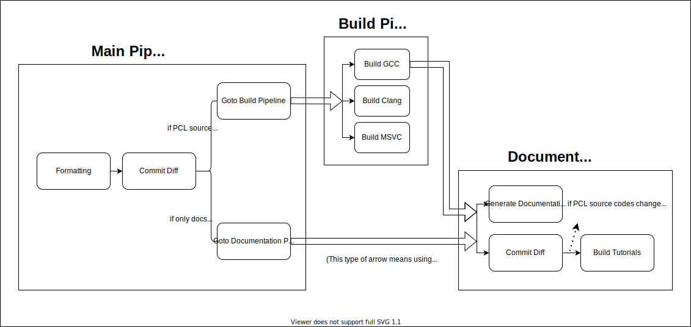

# The structure of PCL CI

## Summary



## Main pipeline

**Location:** `.ci/azure-pipelines/azure-pipelines.yaml`.

### Formatting

This stage will be done before both build & documentation pipeline.

It aims to check code formatting of certain modules with the script `pcl/.dev/format.sh`, and publish diff patch as an artifact in CI which could be applied by `git apply` to auto-format the clang style. For [further development](https://github.com/PointCloudLibrary/pcl/pull/4691#discussion_r608445398) of formatting stage, we'd like to introduce a bot to auto-comment the diff, using the suggestion feature of GitHub. If you are interested in the topic, feel free to open a PR for it.

### Commit Diff

Use `git diff` patterns to check code changes between HEAD & master (to determine which pipeline, build or documentation, should run next).

For exclude rules, it's a bit hard to separate the [path-filter(a part of Azure YAML schema)](https://docs.microsoft.com/en-us/azure/devops/pipelines/repos/azure-repos-git?view=azure-devops&tabs=yaml#paths) and the diff-exclude-rules to one place. So as a second-best solution to reduce the complexity, we pick up the diff-exclude-rules to the head of the script lines, and add comments to attract attention in YAML file.

<details>

<summary>Locations of path-filter and diff-exclude-rules</summary>

```yaml
# Exclude Rules:
# 1. path-filter in trigger and pr, 
#    this is NOT exclude rules for documentation,
#    set this rule only to avoid any CI run.
# 2. DOCS_LISTS in diff script, 
#    the lists contain all documentation-related files,
#    fill the list to help git-diff recognize docs changes.

trigger:
  paths:
    exclude:
    - README.md
    - CHANGES.md
    - CONTRIBUTING.md
    - .ci
    - .dev
    - .github
    # add more exclude rules, e.g. fileName, directoryName
    # which won't cause any CI to run.

pr:
  paths:
    exclude:
    - README.md
    - CHANGES.md
    - CONTRIBUTING.md
    - .ci
    - .dev
    - .github
    # add more exclude rules, e.g. fileName, directoryName
    # which won't cause any CI to run.
```

```yaml
...
- script: | 
     # Add all docs path to this array
     DOCS_LISTS=("doc" "*.md")
     ...
```

</details>

We only use **path-filter** in `trigger` and `pr` fields in main YAML, and the contents must keep the same in two fields. These exclude rules aim to avoid any CI run, which means that if we update any of those filtered files or directories, no CI will run.

We use **diff-exclude-rules** (implemented as `DOCS_LISTS`) only in commit diff script. This list (i.e. array in bash) contains the files or directories which are considered as documentations (e.g. doxygen tutorials, markdowns). And the list is been used in `git diff` command argument as an exclude filter to pick out those non-documentation changes, and set [the runtime shared variable across stages in Azure Pipelines](https://docs.microsoft.com/en-us/azure/devops/pipelines/process/variables?view=azure-devops&tabs=yaml%2Cbatch#share-variables-across-pipelines) to decide which pipeline (build or docs pipeline) should be triggered next.

## Build Pipeline

**Location:** `.ci/azure-pipelines/build-pipelines.yaml`, with templates in `.ci/azure-pipelines/build` directory.

In this pipeline, *Build GCC/Clang/MSVC* stages run in parallel.

### Build GCC

Build PCL source codes in Ubuntu 18.04(oldest LTS) and Ubuntu 20.10(latest version). Then run the unit test.

If this stage completes successfully, it will trigger the documentation pipeline.

### Build Clang

Build PCL source codes in macos Catalina 10.15, macos Mojave 10.14 and Ubuntu 20.04. Then run the unit test.

### Build MSVC

Build PCL source codes in Windows Server 2019 with Visual Studio 2019 (x86 and x64 respectively). Then run the unit test.

## Documentation Pipeline

**Location:** `.ci/azure-pipelines/docs-pipelines.yaml`, with templates `documentation.yaml` for documentation generation and `tutorials.yaml` for tutorials build.

In this pipeline, *Generate Documentation* and *Commit Diff* stages run in parallel.

### Generate Documentation

### Commit Diff

Use `git diff` patterns to check two kinds of code changes: 1) PCL source codes change. 2) tutorial codes change in doc/tutorials/content/sources.

If one of them meets, then tutorial stage will be built.

### Build Tutorials

In this stage, we build and install PCL before using that to build tutorials, for the purposes of testing the tutorial source codes to make sure they work with the latest PCL codes well. 

## Reference

[Detailed discussion about the structure and stages](https://github.com/PointCloudLibrary/pcl/pull/4691)

[Some ideas about the enhancement of CI structure](https://github.com/PointCloudLibrary/pcl/pull/4737)

[Azure Pipeline: Trigger one pipeline after another](https://docs.microsoft.com/en-us/azure/devops/pipelines/process/pipeline-triggers?tabs=yaml&view=azure-devops#branch-considerations)

[Azure Pipeline: YAML schema reference](https://docs.microsoft.com/en-us/azure/devops/pipelines/yaml-schema?view=azure-devops&tabs=example%2Cparameter-schema#stage)