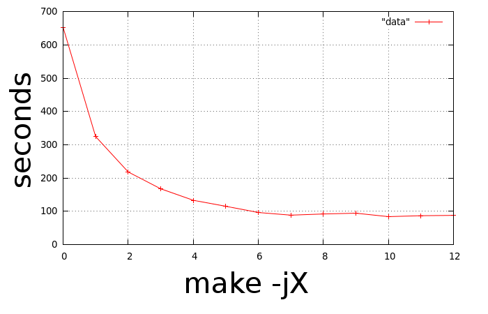

.. _distc:

Using DistCC to speed up compilation
------------------------------------

`distcc <http://distcc.org/>`_ is a program to distribute builds of C, C++,
Objective C or Objective C++ code across several machines on a network.
`distcc` should always generate the same results as a local build, is simple to
install and use, and is usually much faster than a local compile.

`distcc` does not require all machines to share a filesystem, have synchronized
clocks, or to have the same libraries or header files installed. They can even
have different processors or operating systems, if cross-compilers are
installed.

`distcc` is usually very easy to install -- just follow the installation
instructions on its web page. Here's an example for Ubuntu systems::

  sudo apt-get install distcc

In each distributed build environment, there are usually two different roles:

 * **server**

   Here, we call the *server*, the actual workstation/computer that is running
   a `distcc` daemon, and will perform the compilation. To run a `distcc`
   daemon on an Ubuntu system for example, you need to start the daemon,
   usually with something along the lines of::

     /etc/init.d/distcc start

   Once started, you should notice a few `distcc` processes idle-ing::
  
     $ ps axw | grep distcc
     ...
     30042 ?        SN     0:00 /usr/bin/distccd --pid-file=/var/run/distccd.pid --log-file=/var/log/distccd.log --daemon --allow 127.0.0.1 --allow 10.0.0.0/21 --listen 0.0.0.0 --nice 10 --zeroconf
     30043 ?        SN     0:00 /usr/bin/distccd --pid-file=/var/run/distccd.pid --log-file=/var/log/distccd.log --daemon --allow 127.0.0.1 --allow 10.0.0.0/21 --listen 0.0.0.0 --nice 10 --zeroconf
     30044 ?        SN     0:00 /usr/bin/distccd --pid-file=/var/run/distccd.pid --log-file=/var/log/distccd.log --daemon --allow 127.0.0.1 --allow 10.0.0.0/21 --listen 0.0.0.0 --nice 10 --zeroconf

   Let's assume for the sake of this example, that we have two machines,
   *wgsc11* and *wgsc12*, with `distcc` installed and running as a server
   daemon. These are the machines that we would like use to speed up the
   compilation of the PCL source tree.

 * **client**

   Here by client we refer to the workstation/computer that contains the source
   code to be compiled, in our case, where the PCL source code tree resides.

   The first thing that we need to do is tell `cmake` to use `distcc` instead
   of the default compiler. The easiest way to do this is to invoke `cmake`
   with pre-flags, like::

     [pcl] $ mkdir build && cd build
     [pcl/build] $ CC="distcc gcc" CXX="distcc g++" cmake ..

   Sometimes compiling on systems supporting different SSE extensions will lead
   to problems. Setting PCL_ENABLE_SSE to false will solve this, like::
   
   [pcl/build] $ CC="distcc gcc" CXX="distcc g++" cmake -DPCL_ENABLE_SSE:BOOL=FALSE ../pcl
   
   The output of ``CC="distcc gcc" CXX="distcc g++" cmake ..`` will generate
   something like this. Please note that this is just an example and that the
   messages might vary depending on your operating system and the way your
   library dependencies were compiled/installed:

   .. code-block:: bash

      -- The C compiler identification is GNU
      -- The CXX compiler identification is GNU
      -- Check for working C compiler: /usr/bin/distcc
      -- Check for working C compiler: /usr/bin/distcc -- works
      -- Detecting C compiler ABI info
      -- Detecting C compiler ABI info - done
      -- Check for working CXX compiler: /usr/bin/distcc
      -- Check for working CXX compiler: /usr/bin/distcc -- works
      -- Detecting CXX compiler ABI info
      -- Detecting CXX compiler ABI info - done
      -- Performing Test HAVE_SSE3_EXTENSIONS
      -- Performing Test HAVE_SSE3_EXTENSIONS - Success
      -- Performing Test HAVE_SSE2_EXTENSIONS
      -- Performing Test HAVE_SSE2_EXTENSIONS - Success
      -- Performing Test HAVE_SSE_EXTENSIONS
      -- Performing Test HAVE_SSE_EXTENSIONS - Success
      -- Found SSE3 extensions, using flags: -msse3 -mfpmath=sse
      -- Boost version: 1.42.0
      -- Found the following Boost libraries:
      --   system
      --   filesystem
      --   thread
      --   date_time
      --   iostreams
      -- checking for module 'eigen3'
      --   found eigen3, version 3.0.0
      -- Found Eigen: /usr/include/eigen3 
      -- Eigen found (include: /usr/include/eigen3)
      -- checking for module 'flann'
      --   found flann, version 1.6.8
      -- Found Flann: /usr/lib64/libflann_cpp_s.a 
      -- FLANN found (include: /usr/include, lib: optimized;/usr/lib64/libflann_cpp_s.a;debug;/usr/lib64/libflann_cpp.so)
      -- checking for module 'cminpack'
      --   found cminpack, version 1.0.90
      -- Found CMinpack: /usr/lib64/libcminpack.so 
      -- CMinPack found (include: /usr/include/cminpack-1, libs: optimized;/usr/lib64/libcminpack.so;debug;/usr/lib64/libcminpack.so)
      -- Try OpenMP C flag = [-fopenmp]
      -- Performing Test OpenMP_FLAG_DETECTED
      -- Performing Test OpenMP_FLAG_DETECTED - Success
      -- Try OpenMP CXX flag = [-fopenmp]
      -- Performing Test OpenMP_FLAG_DETECTED
      -- Performing Test OpenMP_FLAG_DETECTED - Success
      -- Found OpenMP: -fopenmp 
      -- Found OpenNI: /usr/lib/libOpenNI.so 
      -- OpenNI found (include: /usr/include/openni, lib: /usr/lib/libOpenNI.so)
      -- ROS_ROOT /opt/ros/diamondback/ros
      -- Found ROS; USE_ROS is OFF
      -- Found GTest: /usr/lib/libgtest.so 
      -- Tests will be built
      -- Found Qhull: /usr/lib/libqhull.so 
      -- QHULL found (include: /usr/include/qhull, lib: optimized;/usr/lib/libqhull.so;debug;/usr/lib/libqhull.so)
      -- VTK found (include: /usr/include/vtk-5.4;/usr/include;/usr/include;/usr/include;/usr/include;/usr/include;/usr/include;/usr/include;/usr/include;/usr/include;/usr/include;/usr/include;/usr/include;/usr/include;/usr/include;/usr/include;/usr/include;/usr/include;/usr/include;/usr/include;/usr/lib/openmpi/include;/usr/lib/openmpi/include/openmpi;/usr/include/tcl8.5;/usr/include/python2.6;/usr/include/tcl8.5;/usr/lib/jvm/default-java/include;/usr/lib/jvm/default-java/include;/usr/lib/jvm/default-java/include;/usr/include;/usr/include;/usr/include;/usr/include;/usr/include;/usr/include/libxml2;/usr/include;/usr/include/freetype2, lib: /usr/lib/vtk-5.4)
      -- Found Doxygen: /usr/bin/doxygen 
      -- Found CPack generators: DEB
      -- The following subsystems will be built:
      --   common
      --   octree
      --   io
      --   kdtree
      --   range_image
      --   features
      --   sample_consensus
      --   keypoints
      --   filters
      --   registration
      --   segmentation
      --   surface
      --   visualization
      --   global_tests
      -- The following subsystems will not be built:
      -- Configuring done
      -- Generating done
      -- Build files have been written to: /work/PCL/pcl/trunk/build

  The important lines are::

    -- Check for working C compiler: /usr/bin/distcc
    -- Check for working C compiler: /usr/bin/distcc -- works
    -- Detecting C compiler ABI info
    -- Detecting C compiler ABI info - done
    -- Check for working CXX compiler: /usr/bin/distcc
    -- Check for working CXX compiler: /usr/bin/distcc -- works

  The next step is to tell `distcc` which hosts it should use. Here we can
  decide whether we want to use the local workstation for compilation too, or
  just the machines running a `distcc` daemon (*wgsc11* and *wgsc12* in our
  example). The easiest way to pass this information to `distcc` is via
  environment variables. For example::

    export DISTCC_HOSTS='localhost wgsc11 wgsc12'

  will tell `distcc` to use the local machine, as well as both the `distcc`
  servers, while::

    export DISTCC_HOSTS='wgsc11 wgsc12'

  will only use the *wgsc11* and *wgsc12* machines.

  Finally, the last step is to increase the number of parallel compile units we should use. For example::

    [pcl/build] $ make -j32

  will start **32 processes** and distribute them equally on the two `distcc` machines.

The following plot shows an example of multiple ``make -jX`` invocations, for X
ranging from 1 to 13. As it can be seen, the overall compile time is
drastically reduced by using `distcc`, in this case with the CPU on the client
machine almost idleing while the *wgsc11* and *wgsc12* machines do most of the
work. The reason why the plot "saturates" is due to conditional dependencies in
the compilation process, where certain libraries or binaries require others to
be compiled first.

For more information on how to configure `distcc` please visit http://distcc.org.
