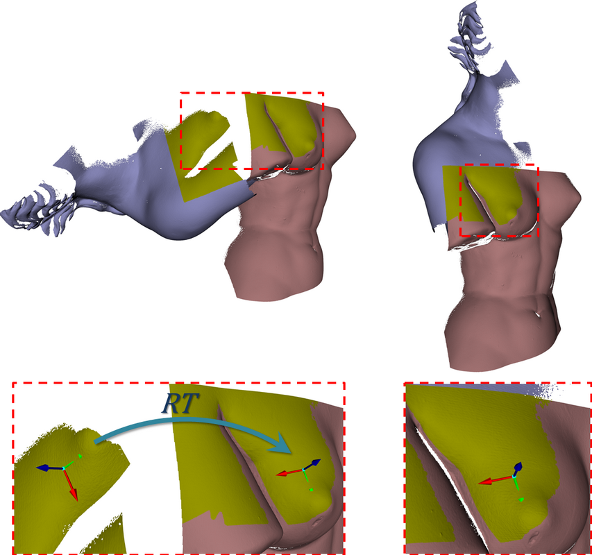

.. _ReLOC:

ReLOC: Pairwise registration by local orientation cues
----------------------------------

This tutorial shows how to apply ReLOC for estimating the rigid transformation that aligns two point clouds. The algorithm has been introduced in `[Petrelli and Di Stefano 2015] <http://onlinelibrary.wiley.com/doi/10.1111/cgf.12732/pdf>`_. 

Theoretical primer
--------

Usually, the problem of *Pairwise registration* is faced by extracting a set of feature points from the two point clouds and the local neighbourhood of each point is projected 
onto a suitable high-dimensional feature space so as to obtain a description invariant (or covariant) to pose and as robust as possible to the nuisances induced by acquisition. Then, correspondences 
between local features are established based on similarities of descriptions, so that, eventually, the rigid motion that best aligns corresponding feature points is easily computed 
by a robust estimator, such as e.g. RANSAC. The most widespread approach to attain pose invariance deploys a *Local Reference Frame* (LRF) centered on the feature point and attached to the surface 
regardless of its orientation. Thereby, description can encode local shape traits with respect to a canonical reference associated with the feature point. Although effective and fast algorithms pertaining 
their computation have been devised in the field of registration, LRFs have so far only been considered instrumental to feature description.

   
Conversely, ReLOC grounds on the observations that LRFs can indeed provide basic shape cues and that two corresponding points equipped with their LRFs allows the rigid motion that aligns two views to be computed. More precisely, the algorithm relies on the `FLARE <http://docs.pointclouds.org/trunk/classpcl_1_1_f_l_a_r_e_local_reference_frame_estimation.html>`_ method proposed in `[Petrelli and Di Stefano 2012] <http://ieeexplore.ieee.org/document/6375021/?arnumber=6375021&tag=1>`_ to compute highly repeatable LRFs at feature points and show how such computation provides the core of a coarse registration pipeline which does not require a costly feature description stage.

Therefore, the algorithm prunes false correspondences by enforcing geometric consistency constraints according to the `Hough Voting <http://docs.pointclouds.org/trunk/classpcl_1_1recognition_1_1_hough_space3_d.html>`_ method proposed in `[Tombari and Di Stefano 2010] <https://www.computer.org/csdl/proceedings/psivt/2010/4285/00/4285a349.pdf>`_, which, again, relies on the availability of repeatable LRFs attached to features.

Although ReLOC can be feed with any kind of 3D feature points, the algorithm relies on the `FlatKeyPoint <http://docs.pointclouds.org/trunk/classpcl_1_1_flat_keypoint.html>`_ detector specifically conceived to provide features suited to the method. In particular, it grounds on the assumption that underling saliency cue should capture the `orientability` of features, i.e. the ability to compute the LRF repeatably despite feature localization being possibly inaccurate. Accordingly, ReLOC deploys a detector which conveniently exploits the observed relationship between `orientability` and `flatness` to quickly extract features particularly suitable for the pipeline and uniformly distributed throughout the point clouds, the latter being a beneficial property for registration.   

How to use ReLOC
--------

The code
--------

.. literalinclude:: sources/ReLOC/ReLOC.cpp
   :language: cpp
   :linenos:

The explanation
---------------

Now, let's breakdown the code piece by piece.

.. literalinclude:: sources/ReLOC/ReLOC.cpp
   :language: cpp
   :lines: 1-12

These are the header files that contain the definitions for all of the classes which we will use.

.. literalinclude:: sources/ReLOC/ReLOC.cpp
   :language: cpp
   :lines: 16-32

As a first step, `bun0.ply` is loaded as the target point cloud, whereas `bun4.ply` is loaded as the source cloud (i.e. the point cloud aligned against the target by the estimated rigid motion).

.. literalinclude:: sources/ReLOC/ReLOC.cpp
   :language: cpp
   :lines: 34-50

As ReLOC requires the computation of point normals, suitable rigid motions are applied to both the target and source point clouds so as to obtain better disambiguations of normals signs.

.. literalinclude:: sources/ReLOC/ReLOC.cpp
   :language: cpp
   :lines: 53-54

As the paper suggests the algorithm parameters in units of `mesh resolution` (i.e. the average distance between adjacent points of the clouds), it is recommended to estimate the mesh resolution in order to obtain better results. 

.. literalinclude:: sources/ReLOC/ReLOC.cpp
   :language: cpp
   :lines: 57-73

These lines compute the point normals for both the target and source clouds.

.. literalinclude:: sources/ReLOC/ReLOC.cpp
   :language: cpp
   :lines: 77-82

This creates an instance of an ReLOCInitialAlignment and set source and target clouds, as well as their respective normals. 

.. literalinclude:: sources/ReLOC/ReLOC.cpp
   :language: cpp
   :lines: 84-89

These lines show how to set the parameters of the `FlatKeyPoint <http://docs.pointclouds.org/trunk/classpcl_1_1_flat_keypoint.html>`_ detector. 

.. literalinclude:: sources/ReLOC/ReLOC.cpp
   :language: cpp
   :lines: 90-93

As `bun0.ply` and `bun4.ply` are low-resolution clouds composed by a small amount of points, a more trivial random detection is more suited. These lines switch to an extraction of 300 random points from both the source and target clouds. 

.. literalinclude:: sources/ReLOC/ReLOC.cpp
   :language: cpp
   :lines: 95-98

Set the parameters for the computation of the local reference frames. In the case of high-density points clouds, the computation of the local reference frames can be speeded up by performing a subsampling of the support points through the `setFlareXsupportSamplingPerc` method. 

.. literalinclude:: sources/ReLOC/ReLOC.cpp
   :language: cpp
   :lines: 100-102

These lines set the parameters of the `Hough voting` and `RANSAC` methods.

.. literalinclude:: sources/ReLOC/ReLOC.cpp
   :language: cpp
   :lines: 104-107

Finally, the rigid motion is estimated and applied to the source cloud.
   
