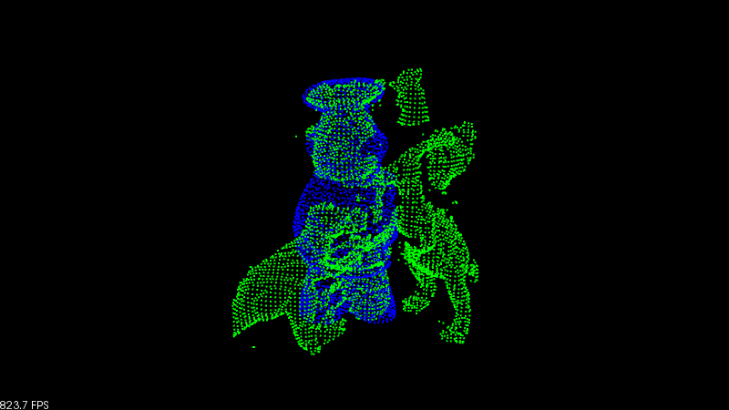
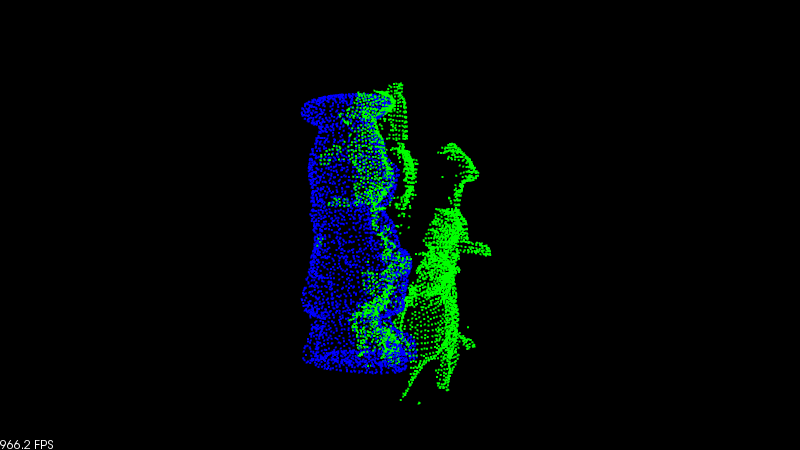

.. _alignment_prerejective:

Robust pose estimation of rigid objects
---------------------------------------

In this tutorial, we show how to find the alignment pose of a rigid object in a scene with clutter and occlusions.

The code
--------

First, download the test models: :download:`object <./sources/alignment_prerejective/chef.pcd>` and :download:`scene <./sources/alignment_prerejective/rs1.pcd>`.

Next, copy and paste the following code into your editor and save it as ``alignment_prerejective.cpp`` (or download the source file :download:`here <./sources/alignment_prerejective/alignment_prerejective.cpp>`).

.. literalinclude:: sources/alignment_prerejective/alignment_prerejective.cpp
   :language: cpp
   :linenos:

The explanation
---------------

We start by defining convenience types in order not to clutter the code.

.. literalinclude:: sources/alignment_prerejective/alignment_prerejective.cpp
   :language: cpp
   :lines: 16-22

Then we instantiate the necessary data containers, check the input arguments and load the object and scene point clouds. Although we have defined the basic point type to contain normals, we only have those in advance for the object (which is often the case). We will estimate the normal information for the scene below.

.. literalinclude:: sources/alignment_prerejective/alignment_prerejective.cpp
   :language: cpp
   :lines: 28-49

To speed up processing, we use PCL's :pcl:`VoxelGrid <pcl::VoxelGrid>` class to downsample both the object and the scene point clouds to a resolution of 5 mm.

.. literalinclude:: sources/alignment_prerejective/alignment_prerejective.cpp
   :language: cpp
   :lines: 51-59

The missing surface normals for the scene are now estimated using PCL's :pcl:`NormalEstimationOMP <pcl::NormalEstimationOMP>`. The surface normals are required for computing the features below used for matching.

.. literalinclude:: sources/alignment_prerejective/alignment_prerejective.cpp
   :language: cpp
   :lines: 61-66

For each point in the downsampled point clouds, we now use PCL's :pcl:`FPFHEstimationOMP <pcl::FPFHEstimationOMP>` class to compute *Fast Point Feature Histogram* (FPFH) descriptors used for matching during the alignment process.

.. literalinclude:: sources/alignment_prerejective/alignment_prerejective.cpp
   :language: cpp
   :lines: 68-77
   
We are now ready to setup the alignment process. We use the class :pcl:`SampleConsensusPrerejective <pcl::SampleConsensusPrerejective>`, which implements an efficient RANSAC pose estimation loop. This is achieved by early elimination of bad pose hypothesis using the class :pcl:`CorrespondenceRejectorPoly <pcl::registration::CorrespondenceRejectorPoly>`.

.. literalinclude:: sources/alignment_prerejective/alignment_prerejective.cpp
   :language: cpp
   :lines: 79-91

.. note:: Apart from the usual input point clouds and features, this class takes some additional runtime parameters which have great influence on the performance of the alignment algorithm. The first two have the same meaning as in the alignment class :pcl:`SampleConsensusInitialAlignment <pcl::SampleConsensusInitialAlignment>`:

  - Number of samples - *setNumberOfSamples ()*: The number of point correspondences to sample between the object and the scene. At minimum, 3 points are required to calculate a pose.
  - Correspondence randomness - *setCorrespondenceRandomness ()*: Instead of matching each object FPFH descriptor to its nearest matching feature in the scene, we can choose between the *N* best matches at random. This increases the iterations necessary, but also makes the algorithm robust towards outlier matches.
  - Polygonal similarity threshold - *setSimilarityThreshold ()*: The alignment class uses the :pcl:`CorrespondenceRejectorPoly <pcl::registration::CorrespondenceRejectorPoly>` class for early elimination of bad poses based on pose-invariant geometric consistencies of the inter-distances between sampled points on the object and the scene. The closer this value is set to 1, the more greedy and thereby fast the algorithm becomes. However, this also increases the risk of eliminating good poses when noise is present.
  - Inlier threshold - *setMaxCorrespondenceDistance ()*: This is the Euclidean distance threshold used for determining whether a transformed object point is correctly aligned to the nearest scene point or not. In this example, we have used a heuristic value of 1.5 times the point cloud resolution.
  - Inlier fraction - *setInlierFraction ()*: In many practical scenarios, large parts of the observed object in the scene are not visible, either due to clutter, occlusions or both. In such cases, we need to allow for pose hypotheses that do not align all object points to the scene. The absolute number of correctly aligned points is determined using the inlier threshold, and if the ratio of this number to the total number of points in the object is higher than the specified inlier fraction, we accept a pose hypothesis as valid.

Finally, we are ready to execute the alignment process.

.. literalinclude:: sources/alignment_prerejective/alignment_prerejective.cpp
   :language: cpp
   :lines: 92-95

The aligned object is stored in the point cloud *object_aligned*. If a pose with enough inliers was found (more than 25 % of the total number of object points), the algorithm is said to converge, and we can print and visualize the results.

.. literalinclude:: sources/alignment_prerejective/alignment_prerejective.cpp
   :language: cpp
   :lines: 99-114

Compiling and running the program
---------------------------------

Create a ``CMakeLists.txt`` file with the following content (or download it :download:`here <./sources/alignment_prerejective/CMakeLists.txt>`):

.. literalinclude:: sources/alignment_prerejective/CMakeLists.txt
   :language: cmake
   :linenos:

After you have made the executable, you can run it like so::

  $ ./alignment_prerejective chef.pcd rs1.pcd

After a few seconds, you will see a visualization and a terminal output similar to::

  Alignment took 352ms.

      |  0.040 -0.929 -0.369 | 
  R = | -0.999 -0.035 -0.020 | 
      |  0.006  0.369 -0.929 | 

  t = < -0.287, 0.045, 0.126 >

  Inliers: 987/3432

The visualization window should look something like the below figures. The scene is shown with green color, and the aligned object model is shown with blue color. Note the high number of non-visible object points.

   
   *Frontal view*

|

   
   *Side view*
