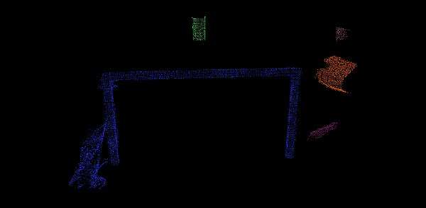

.. _cluster_extraction:

Euclidean Cluster Extraction
----------------------------

In this tutorial we will learn how to **extract Euclidean clusters** with the
``pcl::EuclideanClusterExtraction`` class. In order to not complicate the
tutorial, certain elements of it such as the plane segmentation algorithm,
will not be explained here. Please check the :ref:`planar_segmentation`
tutorial for more information.

Theoretical Primer
------------------

A clustering method needs to divide an unorganized point cloud model :math:`P`
into smaller parts so that the overall processing time for :math:`P` is
significantly reduced. A simple data clustering approach in an Euclidean sense
can be implemented by making use of a 3D grid subdivision of the space using
fixed-width boxes, or more generally, an octree data structure. This particular
representation is very fast to build and is useful for situations where either
a volumetric representation of the occupied space is needed, or the data in
each resultant 3D box (or octree leaf) can be approximated with a different
structure. In a more general sense however, we can make use of nearest
neighbors and implement a clustering technique that is essentially similar to a
flood fill algorithm.

Let's assume we are given a point cloud with a table and objects on top of it.
We want to find and segment the individual object point clusters lying on the
plane. Assuming that we use a Kd-tree structure for finding the nearest
neighbors, the algorithmic steps for that would be (from [RusuDissertation]_):

 1. *create a Kd-tree representation for the input point cloud dataset* :math:`P`;

 2. *set up an empty list of clusters* :math:`C`, *and a queue of the points that need to be checked* :math:`Q`;

 3. *then for every point* :math:`\boldsymbol{p}_i \in P`, *perform the following steps:*

     * *add* :math:`\boldsymbol{p}_i` *to the current queue* :math:`Q`;

     * *for every point* :math:`\boldsymbol{p}_i \in Q` *do:*

        * *search for the set* :math:`P^k_i` *of point neighbors of* :math:`\boldsymbol{p}_i` *in a sphere with radius* :math:`r < d_{th}`;

        * *for every neighbor* :math:`\boldsymbol{p}^k_i \in P^k_i`, *check if the point has already been processed, and if not add it to* :math:`Q`;

    * *when the list of all points in* :math:`Q` *has been processed, add*
      :math:`Q` *to the list of clusters* :math:`C`, *and reset* :math:`Q` *to an
      empty list*

 4. *the algorithm terminates when all points* :math:`\boldsymbol{p}_i \in P` *have been processed and are now part of the list of point clusters* :math:`C`

The Code
--------

First, download the dataset `table_scene_lms400.pcd
<https://raw.github.com/PointCloudLibrary/data/master/tutorials/table_scene_lms400.pcd>`_ and save it somewhere to disk.

Then, create a file, let's say, ``cluster_extraction.cpp`` in your favorite
editor, and place the following inside it:

.. literalinclude:: sources/cluster_extraction/cluster_extraction.cpp
   :language: cpp
   :linenos:
   
The Explanation
---------------

Now, let's break down the code piece by piece, skipping the obvious.

.. code-block:: cpp

	// Read in the cloud data
	pcl::PCDReader reader;
	pcl::PointCloud<pcl::PointXYZ>::Ptr cloud (new pcl::PointCloud<pcl::PointXYZ>), cloud_f (new pcl::PointCloud<pcl::PointXYZ>);
	reader.read ("table_scene_lms400.pcd", *cloud);
	std::cout << "PointCloud before filtering has: " << cloud->size () << " data points." << std::endl;

		  .
		  .
		  .

	while (cloud_filtered->size () > 0.3 * nr_points)
	{

		  .
		  .
		  .

		// Remove the plane inliers, extract the rest
	  extract.setNegative (true);
	  extract.filter (*cloud_f);
    cloud_filtered = cloud_f;
	}

The code above is already described in other tutorials, so you can read the
explanation there (in particular :ref:`planar_segmentation` and
:ref:`extract_indices`).

.. literalinclude:: sources/cluster_extraction/cluster_extraction.cpp
   :language: cpp
   :lines: 71-73

There we are creating a KdTree object for the search method of our extraction
algorithm.

.. literalinclude:: sources/cluster_extraction/cluster_extraction.cpp
   :language: cpp
   :lines: 75

Here we are creating a vector of `PointIndices`, which contain the actual index information in a `vector<int>`. The indices of each detected
cluster are saved here - please take note of the fact that `cluster_indices` is a
vector containing one instance of PointIndices for each detected cluster. So 
`cluster_indices[0]` contains all indices of the first cluster in our point cloud.

.. literalinclude:: sources/cluster_extraction/cluster_extraction.cpp
   :language: cpp
   :lines: 76-82

Here we are creating a EuclideanClusterExtraction object with point type
PointXYZ since our point cloud is of type PointXYZ. We are also setting the
parameters and variables for the extraction.  Be careful setting the right
value for **setClusterTolerance()**. If you take a very small value, it can
happen that an actual *object* can be seen as multiple clusters. On the other
hand, if you set the value too high, it could happen, that multiple *objects*
are seen as one cluster. So our recommendation is to just test and try out
which value suits your dataset.

We impose that the clusters found must have at least **setMinClusterSize()**
points and maximum **setMaxClusterSize()** points.

Now we extracted the clusters out of our point cloud and saved the indices in
**cluster_indices**. To separate each cluster out of the `vector<PointIndices>` 
we have to iterate through *cluster_indices*, create a new `PointCloud` for 
each entry and write all points of the current cluster in the `PointCloud`.

.. literalinclude:: sources/cluster_extraction/cluster_extraction.cpp
   :language: cpp
   :lines: 84-93

Compiling and running the program
---------------------------------

Add the following lines to your CMakeLists.txt

.. literalinclude:: sources/cluster_extraction/CMakeLists.txt
   :language: cmake
   :linenos:

After you have made the executable, you can run it. Simply do::

	$ ./cluster_extraction

You will see something similar to::

  PointCloud before filtering has: 460400 data points. 	
  PointCloud after filtering has: 41049 data points.
  [SACSegmentation::initSACModel] Using a model of type: SACMODEL_PLANE
  [SACSegmentation::initSAC] Using a method of type: SAC_RANSAC with a model threshold of 0.020000
  [SACSegmentation::initSAC] Setting the maximum number of iterations to 100 
  PointCloud representing the planar component: 20522 data points.
  [SACSegmentation::initSACModel] Using a model of type: SACMODEL_PLANE
  [SACSegmentation::initSAC] Using a method of type: SAC_RANSAC with a model threshold of 0.020000
  [SACSegmentation::initSAC] Setting the maximum number of iterations to 100
  PointCloud representing the planar component: 12429 data points.
  PointCloud representing the Cluster: 4883 data points.
  PointCloud representing the Cluster: 1386 data points.
  PointCloud representing the Cluster: 320 data points.
  PointCloud representing the Cluster: 290 data points.
  PointCloud representing the Cluster: 120 data points.

You can also look at your outputs cloud_cluster_0.pcd, cloud_cluster_1.pcd,
cloud_cluster_2.pcd, cloud_cluster_3.pcd and cloud_cluster_4.pcd::

	$ ./pcl_viewer cloud_cluster_0.pcd cloud_cluster_1.pcd cloud_cluster_2.pcd cloud_cluster_3.pcd cloud_cluster_4.pcd

You are now able to see the different clusters in one viewer. You should see
something similar to this:

