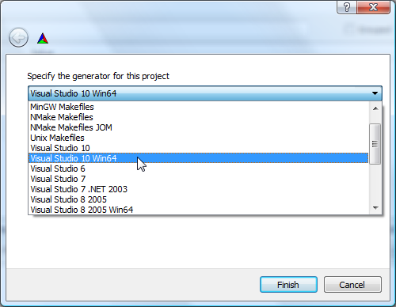
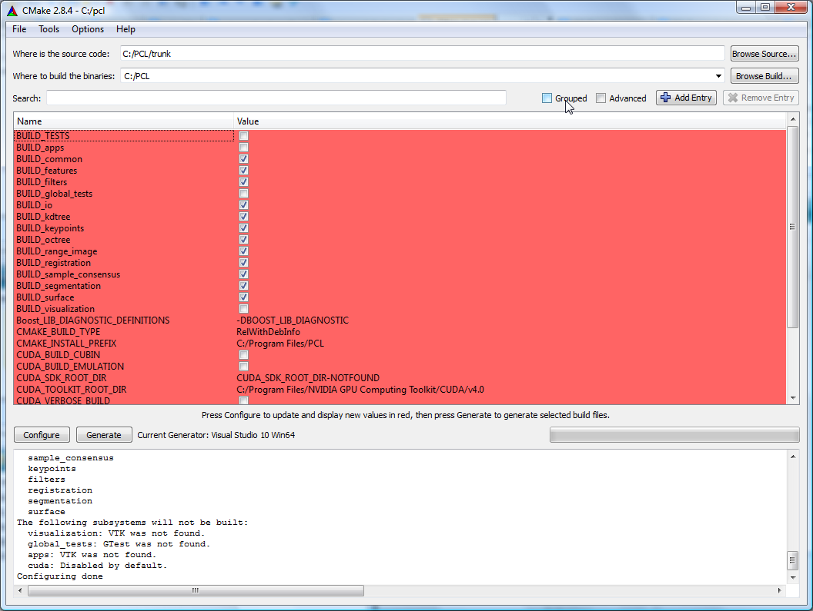
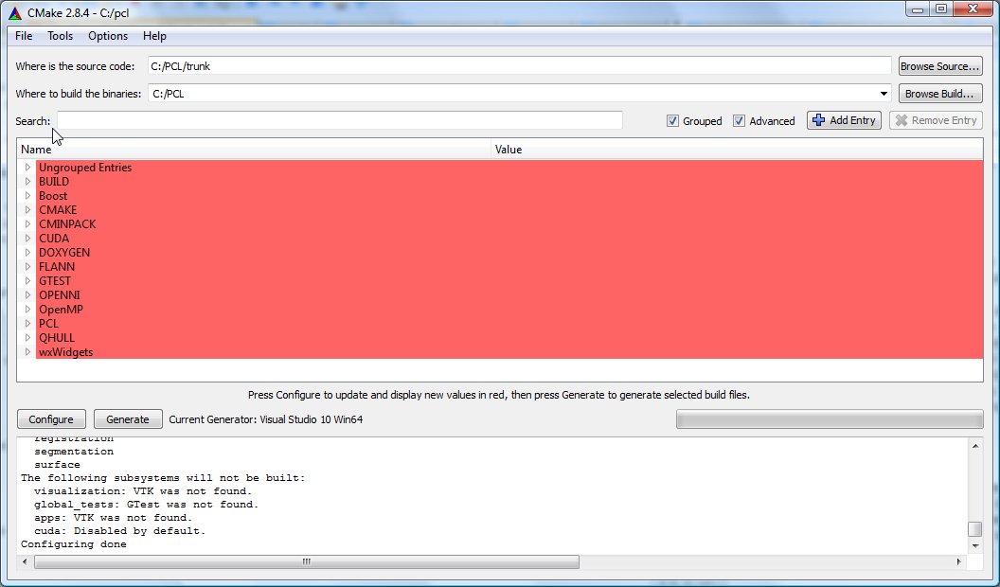
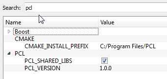
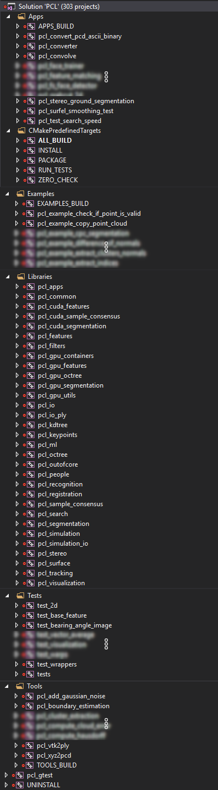
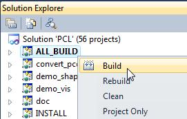

.. _compiling_pcl_windows:

Compiling PCL from source on Windows
------------------------------------

This tutorial explains how to build the Point Cloud Library **from source** on
Microsoft Windows platforms. In this tutorial, we assume that you have built and installed
all the required dependencies, or that you have installed them using the dependencies
installers provided on the `downloads page <http://www.pointclouds.org/downloads/windows.html>`_. 

.. note::

   If you installed PCL using one of the **all-in-one** provided installers, then this tutorial is not for you.
   The **all-in-one** installer already contains prebuilt PCL binaries which are ready to be used without any compilation step.
   
.. note::

   If there is no installers for your compiler, it is recommended that you build the dependencies
   out of source. The :ref:`compiling_pcl_dependencies_windows` tutorial should guide you through the download 
   and the compilation of all the required dependencies.

Requirements
-------------

we assume that you have built and installed all the required dependencies, or that you have installed 
them using the dependencies installers provided on the `downloads page <http://www.pointclouds.org/downloads/windows.html>`_.
Installing them to the default locations will make configuring PCL easier.

- **Boost** 

used for shared pointers, and threading. **mandatory**

- **Eigen** 

used as the matrix backend for SSE optimized math. **mandatory**

- **FLANN** 

used in `kdtree` for fast approximate nearest neighbors search. **mandatory**

- **Visualization ToolKit (VTK)** 

used in `visualization` for 3D point cloud rendering and visualization. **mandatory**

- **Qt** 

used for applications with a graphical user interface (GUI) **optional**

- **QHULL** 

used for convex/concave hull decompositions in `surface`. **optional**

- **OpenNI** and patched **Sensor Module** 

used to grab point clouds from OpenNI compliant devices. **optional**

- **GTest** version >= 1.6.0 (http://code.google.com/p/googletest/)

is needed only to build PCL tests. We do not provide GTest installers. **optional**

.. note::
  
   Though not a dependency per se, don't forget that you also need the CMake
   build system (http://www.cmake.org/), at least version **2.8.7**. A Git client
   for Windows is also required to download the PCL source code.

Downloading PCL source code
---------------------------

To build the current official release, download the source archive from 
http://pointclouds.org/downloads/ and extract it somewhere on your disk, say C:\\PCL\\PCL-1.5.1-Source. 
In this case, you can go directly to Configuring PCL section, and pay attention to adjust the 
paths accordingly.

Or, you might want to build an experimental version
of PCL to test some new features not yet available in the official releases. 
For this, you will need git ( http://git-scm.com/download ).

The invocation to download the source code is thus, using a command line:

  cd wherever/you/want/to/put/the/repo/
  git clone https://github.com/PointCloudLibrary/pcl.git

You could also use Github for Windows (https://windows.github.com/), but that is potentially more
troublesome than setting up git on windows.

Configuring PCL
---------------

On Windows, we recommend to build **shared** PCL libraries with **static** dependencies. In this tutorial, we will use 
static dependencies when possible to build shared PCL. You can easily switch to using shared dependencies. Then, you need 
to make sure you put the dependencies' dlls either in your `PATH` or in the same folder as PCL dlls and executables.
You can also build static PCL libraries if you want.

Run the CMake-gui application and fill in the fields::

  Where is the source code   : C:/PCL/pcl
  Where to build the binaries: C:/PCL

Now hit the "Configure" button. You will be asked for a `generator`. A generator is simply a compiler. 

.. note::
	
	In this tutorial, we will be using Microsoft Visual C++ 2010 compiler. If you want to build 32bit PCL, then pick the
	"**Visual Studio 10**" generator. If you want to build 64bit PCL, then pick the "**Visual Studio 10 Win64**".

	Make sure you have installed the right third party dependencies. You cannot mix 32bit and 64bit code, and it is 
	highly recommanded to not mix codes compiled with different compilers.
	

	
In the remaining of this tutorial, we will be using "**Visual Studio 10 Win64**" generator. Once you picked your generator,
hit finish to close the dialog window. CMake will start configuring PCL and looking for its dependencies. For example, we 
can get this output :

The upper part of CMake window contains a list of CMake variables and its respective values. The lower part contains some logging
output that can help figure out what is happening. We can see, for example, that VTK was not found, thus, the visualization module 
will not get built.

Before solving the VTK issue, let's organize the CMake variables in groups by checking the `Grouped` checkbox in the top right of 
CMake window. Let's check also the `Advanced` checkbox to show some advanced CMake variables. Now, if we want to look for a specific
variable value, we can either browse the CMake variables to look for it, or we can use the `Search:` field to type the variable name.

	
Let's check whether CMake did actually find the needed third party dependencies or not :

- **Boost** : 

	CMake was not able to find boost automatically. No problem, we will help it find it :) . If CMake has found your
	boost installation, then skip to the next bullet item.

	.. image:: images/windows/cmake_boost.png
		:alt: Boost
		:align: center	
	
	Let's tell CMake where boost headers are by specifiying the headers path in **Boost_INCLUDE_DIR** variable. For example, my boost 
	headers are in C:\\Program Files\\PCL-Boost\\include (C:\\Program Files\\Boost\\include for newer installers). 
	Then, let's hit `configure` again ! Hopefully, CMake is now able to find all the other items (the libraries).

	.. image:: images/windows/cmake_boost_found.png
		:alt: Boost
		:align: center	

	.. note::
		
		This behaviour is not common for all libraries. Generally, if CMake is not able to find a specific library or package, we have to
		manually set the values of all the CMake related variables. Hopefully, the CMake script responsible of finding boost
		is able to find libraries using the headers path.

- **Eigen** : 

	Eigen is a header-only library, thus, we need only **EIGEN_INCLUDE_DIR** to be set. Hopefully, CMake did fing Eigen.

	.. image:: images/windows/cmake_eigen_include_dir.png
		:alt: Eigen include dir
		:align: center	

- **FLANN** :

	CMake was able to find my FLANN installation. By default on windows, PCL will pick the static FLANN libraries
	with `_s` suffix. Thus, the **FLANN_IS_STATIC** checkbox is checked by default.
	
	.. image:: images/windows/cmake_flann.png
		:alt: FLANN
		:align: center	

	.. note::
		
		If you rather want to use the **shared** FLANN libraries (those without the `_s` suffix), you need to manually edit the 
		**FLANN_LIBRARY** and **FLANN_LIBRARY_DEBUG** variables to remove the `_s` suffix and do not forget to uncheck 
		**FLANN_IS_STATIC**. Make sure the FLANN dlls are either in your PATH or in the same folder as your executables.

	.. note::
		
		In recent PCL, the **FLANN_IS_STATIC** checkbox no longer exists.
		
- **Qt** :

	It is highly recommended to install Qt to the default path suggested by the installer. You need then to define an 
	environment variable named **QTDIR** to point to Qt installation path (e.g. `C:\\Qt\\4.8.0`). Also, you need to
	append the bin folder to the **PATH** environment variable. Once you modify the environment variables, you need to
	restart CMake and click "Configure" again. If Qt is not found, you need at least to fill **QT_QMAKE_EXECUTABLE**
	CMake entry with the path of `qmake.exe` (e.g. C:\\Qt\\4.8.0\\bin\\qmake.exe), then click "Configure".
	
- **VTK** :

	CMake did not find my VTK installation. There is only one VTK related CMake variable called **VTK_DIR**. We have to set it
	to the path of the folder containing **VTKConfig.cmake**, which is in my case : C:\\Program Files\\VTK 5.6\\lib\\vtk-5.6 
	(C:\\Program Files\\VTK 5.8.0\\lib\\vtk-5.8 for VTK 5.8).
	After you set **VTK_DIR**, hit `configure` again.
	
	.. image:: images/windows/cmake_vtk_configure.png
		:alt: VTK
		:align: center	
		
	After clicking `configure`, in the logging window, we can see that VTK is found, but the `visualization` module is still
	disabled `manually`. We have then to enable it by checking the **BUILD_visualization** checkbox. You can also do the same thing
	with the `apps` module. Then, hit `configure` again.
	
	.. image:: images/windows/cmake_vtk_found_enable_visualization.png
		:alt: VTK found, enable visualization
		:align: center	

- **QHull** :

	CMake was able to find my QHull installation. By default on windows, PCL will pick the static QHull libraries
	with `static` suffix.
	
	.. image:: images/windows/cmake_qhull.png
		:alt: QHull
		:align: center	

- **OpenNI** :

	CMake was able to find my OpenNI installation. 
	
	.. image:: images/windows/cmake_openni.png
		:alt: OpenNI
		:align: center	
	
	.. note::
		
		CMake do not look for the installed OpenNI Sensor module. It is needed at runtime.
		
- **GTest** :

	If you want to build PCL tests, you need to download GTest and build it yourself. In this tutorial, we will not build tests.
	
Once CMake has found all the needed dependencies, let's see the PCL specific CMake variables :

	
- **PCL_SHARED_LIBS** is checked by default. Uncheck it if you want static PCL libs (not recommanded).

- **CMAKE_INSTALL_PREFIX** is where PCL will be installed after building it (more information on this later).
	
If you have the Pro version of Microsoft Visual Studio, you can check **USE_PROJECT_FOLDERS** checkbox to organize PCL
projects in folders within the PCL solution. If you have an express edition, it is recommended to keep it unchecked, as in
express editions, project folders are disabled.

Once PCL configuration is ok, hit the `Generate` button. CMake will then generate Visual Studio project files (vcproj files) 
and the main solution file (PCL.sln) in C:\\PCL directory.

Building PCL
--------------
  
Open that generated solution file (PCL.sln) to finally build the PCL libraries. This is how your solution will look like
whether you enabled **USE_PROJECT_FOLDERS** (left) or not (right).

   
Building the "ALL_BUILD" project will build everything. 

.. note::
	Make sure to build the "ALL_BUILD" project in both **debug** and **release** mode.
	
Installing PCL
--------------

To install the built libraries and executbles, you need to build the "INSTALL" project in the solution explorer. 
This utility project will copy PCL headers, libraries and executable to the directory defined by the **CMAKE_INSTALL_PREFIX** 
CMake variable.

.. image:: images/windows/msvc_build_install.jpg
   :alt: Build INSTALL project
   :align: center  

.. note::
	Make sure to build the "INSTALL" project in both **debug** and **release** mode.

.. note::

	It is highly recommanded to add the bin folder in PCL installation tree (e.g. C:\\Program Files\\PCL\\bin)
	to your **PATH** environment variable.

Advanced topics
---------------

- **Building PCL Tests** :

	If you want to build PCL tests, you need to download `GTest` 1.6 (http://code.google.com/p/googletest/) and build it yourself. 
	Make sure, when you configure GTest via CMake to check the **gtest_force_shared_crt** checkbox. You need, as usual, to build
	`GTest` in both **release** and **debug**.
	
	Back to PCL's CMake settings, you have to fill the **GTEST_*** CMake entries (include directory, gtest libraries (debug and release)
	and gtestmain libraries (debug and release)). Then, you have to check **BUILD_TEST** and **BUILD_global_tests** CMake checkboxes,
	and hit `Configure` and `Generate`.
	
- **Building the documentation** :
 
	You can build the doxygen documentation of PCL in order to have a local up-to-date api documentation. For this, you need
	Doxygen (http://www.doxygen.org). You will need also the Graph Visualization Software (GraphViz, http://www.graphviz.org/)
	to get the doxygen graphics, specifically the `dot` executable.
	
	Once you installed these two packages, hit `Configure`. Three CMake variables should be set (if CMake cannot find them, 
	you can fill them manually) :
	
	* *DOXYGEN_EXECUTABLE* : path to `doxygen.exe` (e.g. C:/Program Files (x86)/doxygen/bin/doxygen.exe)
	* *DOXYGEN_DOT_EXECUTABLE* : path to `dot.exe` from GraphViz (e.g. C:/Program Files (x86)/Graphviz2.26.3/bin/dot.exe)
	* *DOXYGEN_DOT_PATH* : path of the folder containing `dot.exe` from GraphViz (e.g. C:/Program Files (x86)/Graphviz2.26.3/bin)
	
	Then, you need to enable the `documentation` project in Visual Studio by checking the **BUILD_DOCUMENTATION** checkbox in CMake.
	
	You can also build one single CHM file that will gather all the generated html files into one file. You need the `Microsoft
	HTML HELP Workshop <http://www.microsoft.com/en-us/download/details.aspx?id=21138>`_.
	After you install the `Microsoft HTML HELP Workshop`, hit `Configure`. If CMake is not able to find **HTML_HEL_COMPILER**, then fill
	it manually with the path to `hhc.exe` (e.g. C:/Program Files (x86)/HTML Help Workshop/hhc.exe), then click `Configure` and `Generate`.
	
	Now, in PCL Visual Studio solution, you will have a new project called `doc`. To generate the documentation files, right click on it, 
	and choose `Build`. Then, you can build the `INSTALL` project so that the generated documentation files get copied to 
	**CMAKE_INSTALL_PREFIX**/PCL/share/doc/pcl/html folder (e.g. C:\\Program Files\\PCL\\share\\doc\\pcl\\html).
	
Using PCL
---------

We finally managed to compile the Point Cloud Library (PCL) as binaries for
Windows. You can start using them in your project by following the
:ref:`using_pcl_pcl_config` tutorial. 
