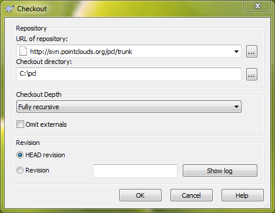
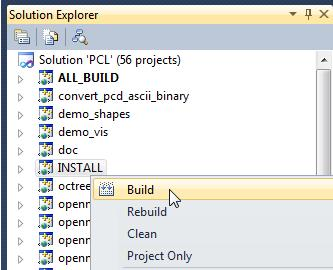

.. _compiling_pcl_windows:

Compiling PCL and its dependencies from source in Windows
---------------------------------------------------------

This tutorial explains how to build the Point Cloud Library **from source** on
Microsoft Windows platforms, and tries to guide you through the download and
the compilation *of all the required dependencies*. The illustrated compilation
process produces a static library. 

.. image:: images/windows_logo.png
   :alt: Microsoft Windows logo
   :align: right

Requirements
-------------

In order to compile every component of the PCL library we need to download and
compile a series of 3rd party library dependencies:

	- **Boost** version >= 1.46.1 (http://www.boost.org/)

    used for shared pointers, and threading. **mandatory**

	- **Eigen** version >= 3.0.0 (http://eigen.tuxfamily.org/)

    used as the matrix backend for SSE optimized math. **mandatory**

	- **FLANN** version >= 1.6.8 (http://www.cs.ubc.ca/~mariusm/index.php/FLANN/FLANN)

    used in `kdtree` for fast approximate nearest neighbors search. **mandatory**

	- **Visualization ToolKit (VTK)** version >= 5.6.1 (http://www.vtk.org/)

    used in `visualization` for 3D point cloud rendering and visualization. **mandatory**
	
	- **googletest** version >= 1.6.0 (http://code.google.com/p/googletest/)

    used to build test units. **optional**

	- **QHULL** version >= 2011.1 (http://www.qhull.org/)

    used for convex/concave hull decompositions in `surface`. **optional**

	- **OpenNI** version >= 1.1.0.25 (http://www.openni.org/)

    used to grab point clouds from OpenNI compliant devices. **optional**

	- **Qt** version >= 4.6 (http://qt.nokia.com/)

    used for developing applications with a graphical user interface (GUI) **optional**

.. note::
  
   Though not a dependency per se, don't forget that you also need the CMake
   build system (http://www.cmake.org/), at least version **2.8.3**. A Subversion client for Windows, i.e. TortoiseSVN 
   (http://tortoisesvn.tigris.org/), is also required to download the PCL source code.

Downloading PCL source code
---------------------------
Subversion is a version control system similar to CVS which allows developers to simultaneously work on PCL. 
The download operation of the most recent source from the main development line, known as trunk, is called `checkout`.

To checkout PCL source code, navigate to the C:/ folder using Windows file manager. Then right click and choose
`SVN Checkout...` from the contextual menu. Set "URL of repository" to http://svn.pointclouds.org/pcl/trunk and
"Checkout directory" to C:/PCL.

   
Click "OK" and the download should start. At the end of this process, you will have PCL source code in C:\PCL.
   
Building dependencies
---------------------
Let's unpack all our libraries in C:/PCL_dependencies so that it would like
like::

	C:/PCL_dependencies
	C:/PCL_dependencies/boost_1_46_1
	C:/PCL_dependencies/eigen
	C:/PCL_dependencies/flann-1.6.11-src
	C:/PCL_dependencies/gtest-1.6.0
	C:/PCL_dependencies/qhull
	C:/PCL_dependencies/VTK

- **Boost** : 
	
    Let's start with `Boost`, which does not use CMake. To build Boost, open the
    command prompt and navigate to the Boost folder::

	    prompt> cd c:\PCL_dependencies\boost_1_46_1
	    prompt> bootstrap
	
    Depending on the compilation toolchain you intend to use to build PCL, you need
    to change the following `--toolset` argument to msvc-8.0, msvc-9.0 (Visual
    Studio 2008) or msvc-10.0 (Visual Studio 2010). A comprehensive list of supported
    compilers can be found on the Boost manual (http://www.boost.org/doc/libs/1_46_0/more/getting_started/windows.html#identify-your-toolset).
    To make Boost build system produce 64 bit libraries instead of 32 bit ones, change
    the `address-model` option to 64. 

	    prompt> bjam --toolset=msvc-9.0 link=static address-model=32 --with-thread --with-system --with-filesystem --with-date_time --with-iostreams --build-type=complete stage

    The previous command line will build 32 bit static libraries using Visual Studio 2008
    Hit enter and grab some coffee because this will take some time. 

- **Flann** : 
	
    Let's move on to `FLANN`. Then open CMake-gui and fill in the fields::

        Where is my source code: C:/PCL_dependencies/flann-1.6.11-src
        Where to build binaries: C:/PCL_dependencies/flann-1.6.11-src/bin32

    .. note::
  
        If you are building 64 bit libraries, I suggest you to choose as binaries output folder bin64 
        instead of bin32. This way, in case you need to build the 32 bit version too, they can both
        coexist under C:/PCL_dependencies/flann-1.6.11-src

    Hit the "Configure" button and CMake will tell that the binaries folder doesn't exist yet 
    (e.g., *C:/PCL_dependencies/flann-1.6.11-src/bin32*) and it will ask for a confirmation.
  
    Proceed and be sure to choose the correct "Generator" on the next window. So,
    if you've built Boost using the Visual Studio 2008 toolset you would choose the
    same generator here.  

    .. image:: images/cmake_cminpack_3.png
       :alt: CMake generator selection
       :align: center  

    .. note::
  
      Don't forget that all the dependencies must be compiled using the same
      compiler options and architecture specifications, i.e. you can't mix 32 bit
      libraries with 64 bit libraries.

    Now, on my machine I had to manually set the `BUILD_PYTHON_BINDINGS`
    and `BUILD_MATLAB_BINDINGS` to OFF otherwise it would not continue to the next
    step as it is complaining about unable to find Python and Matlab. Click on
    "Advanced mode" and find them, or alternatively, add those entries by clicking
    on the "Add Entry" button in the top right of the CMake-gui window.  Add one
    entry named "BUILD_PYTHON_BINDINGS", set its type to "Bool" and its value to
    unchecked. Do the same with the "BUILD_MATLAB_BINDINGS" entry. 

    Now hit the "Configure" button and it should work. Go for the "Generate" This will generate
    the required project files/makefiles to build the library. Now you can simply
    go to `C:/PCL_dependencies/flann-1.6.11-src/bin32` and proceed with the compilation using
    your toolchain. In case you use Visual Studio, you will find the Visual Studio
    Solution file in that folder: be sure to build the whole solution by choosing the
    Build Solution command of the Build menu, both in debug and release configurations. 

    .. note::
  
      If you don't have a Python interpreter installed CMake would probably not allow you
      to generate the project files. To solve this problem you can install the Python interpreter
      (http://www.python.org/download/windows/) or comment the `add_subdirectory( test )` line 
      from C:/PCL_dependencies/flann-1.6.11-src/CMakeLists.txt .

- **GTest** : 
	  
    In case you want PCL tests, you need to compile the `googletest` library (GTest). 
    Setup the CMake fields as usual::

      Where is my source code: C:/PCL_dependencies/gtest-1.6.0
      Where to build binaries: C:/PCL_dependencies/gtest-1.6.0/bin32

    Hit "Configure" and set the following options::

     BUILD_SHARED_LIBS                OFF
     gtest_force_shared_crt           ON
 
    Generate and build the resulting project.

- **QHull** : 

    Setup the CMake fields with the `qhull` paths::

      Where is my source code: C:/PCL_dependencies/qhull
      Where to build binaries: C:/PCL_dependencies/qhull/bin32
  
    Then hit "Configure" twice and "Generate". Compile the generated project files.

- **VTK** : 

    .. note::

      If you want to build PCL GUI tools, you need to build VTK with Qt support, so obviously, you need to build/install Qt before VTK.

    To build Qt from sources, download the source archive from Qt website. Unpack it some where on your disk (C:\\Qt\\4.8.0 e.g. for Qt 4.8.0).
    Then open a `Visual Studio Command Prompt` :

    Click **Start**, point to **All Programs**, point to **Microsoft Visual Studio 20XX**, point to **Visual Studio Tools**, 
    and then click **Visual Studio Command Prompt** if you are building in 32bit, or **Visual Studio x64 Win64 Command Prompt** 
    if you are building in 64bit.  

    In the command prompt, **cd** to Qt directory::

	  prompt> cd c:\Qt\4.8.0
	
    We configure a minimal build of Qt using the Open Source licence. If you need a custom build, adjust the options as needed::

      prompt> configure -opensource -confirm-license -fast -debug-and-release -nomake examples -nomake demos -no-qt3support -no-xmlpatterns -no-multimedia -no-phonon -no-accessibility -no-openvg -no-webkit -no-script -no-scripttools -no-dbus -no-declarative
	
    Now, let's build Qt::

      prompt> nmake
	
    Now, we can clear all the intermediate files to free some disk space::

      prompt> nmake clean

    We're done with Qt! But before building VTK, we need to set an environment variable::

      QtDir = C:\Qt\4.8.0
  
    and then, append `%QtDir%\\bin` to your PATH environment variable.

    Now, configure VTK using CMake (make sure to restart CMake after setting the environment variables). 
    First, setup the CMake fields with the `VTK` paths, e.g.::

      Where is my source code: C:/PCL_dependencies/VTK
      Where to build binaries: C:/PCL_dependencies/VTK/bin32
  
    Then hit "Configure". Check this checkbox and click "Configure"::

      VTK_USE_QT
    
    Make sure CMake did find Qt by looking at `QT_QMAKE_EXECUTABLE` CMake entry. If not, set it to the path of `qmake.exe`, 
	e.g. `C:\\Qt\\4.8.0\\bin\\qmake.exe`, then click "Configure".

	If Qt is found, then check this checkbox and click "Configure"::

      VTK_USE_QVTK_QTOPENGL

    Then, click "Generate", open the generated solution file, and build it in debug and release.

    That's it, we're done with the dependencies!

Environment variables
---------------------

To make it easier for CMake to find the compiled 3rd party libraries you can define the following
environment variables:

* **BOOST_ROOT**: `C:/PCL_dependencies/boost_1_46_1`  
* **QHULL_ROOT**: `C:/PCL_dependencies/qhull`  
* **FLANN_ROOT**: `C:/PCL_dependencies/flann-1.6.11-src`  
* **EIGEN_ROOT**: `C:/PCL_dependencies/eigen`  

.. note::
  
   Please make sure that CMake-Gui is not running when setting environment variables otherwise
   it may not be able to detect them.
   
Building PCL
------------

Let's assume that the PCL source code is in C:/PCL. Run the CMake-gui
application and fill in the fields::

  Where is my source code: C:/PCL
  Where to build binaries: C:/PCL/bin32

Now hit the "Configure" button. As for the dependencies, choose the correct
Generator and continue.

Because CMake is unable to find all the 3rd party libraries you installed by
itself, it will prompt you to input their paths manually. 

Because this tutorial is exemplifying the process of compiling PCL as a
**static** library, the first thing you have to do is to uncheck the
**PCL->PCL_SHARED_LIBS** checkbox. Also uncheck **BUILD->BUILD_TESTS** and
**BUILD->BUILD_global_tests** unless you plan to run the unit tests as a
developer.

Now examine the CMake-gui log window. You should see some red colored error
stating that CMake could not find library XXX. The GUI will also highlight in
red the items which need to be modified. In my case the first time it couldn't
find the EIGEN library, so it said::

	Could NOT find Eigen (missing: EIGEN_INCLUDE_DIR)

Simply modify the **EIGEN_INCLUDE_DIR** key to point to the correct Eigen include
directory (C:/PCL_dependencies/eigen in our case). 

Now hit the "Configure" button again. Like before, look for the error in the
log area and sort it out by modifying the related key above the "Configure"
button. Repeat the process until you've done with the errors.

A little trick: when it comes to BOOST errors, just set the
**Boost_INCLUDE_DIR** element to the appropriate paths. The CMake build system
will figure out the other related paths automatically.

Once all the reported errors are sorted out the "Generate" button becomes
available. Hit it and a project will be generated in C:/PCL/bin32.

During the CMake configuration for the PCL project, the following options were set::

  Boost_INCLUDE_DIR             "C:/PCL_dependencies/boost_1_46_1"
  EIGEN_INCLUDE_DIR             "C:/PCL_dependencies/eigen" 
  FLANN_INCLUDE_DIR             "C:/PCL_dependencies/flann-1.6.11-src/src/cpp" 
  FLANN_LIBRARY                 "C:/PCL_dependencies/flann-1.6.11-src/lib/Release/flann_cpp_s.lib" 
  FLANN_LIBRARY_DEBUG           "C:/PCL_dependencies/flann-1.6.11-src/lib/Debug/flann_cpp_s.lib" 
  GTEST_INCLUDE_DIR             "C:/PCL_dependencies/gtest-1.6.0/include" 
  GTEST_LIBRARY                 "C:/PCL_dependencies/gtest-1.6.0/bin32/Release/gtest.lib" 
  GTEST_LIBRARY_DEBUG           "C:/PCL_dependencies/gtest-1.6.0/bin32/Debug/gtest.lib" 
  GTEST_MAIN_LIBRARY            "C:/PCL_dependencies/gtest-1.6.0/bin32/Release/gtest_main.lib" 
  GTEST_MAIN_LIBRARY_DEBUG      "C:/PCL_dependencies/gtest-1.6.0/bin32/Debug/gtest_main.lib" 
  OPENNI_INCLUDE_DIR            "C:/Program Files (x86)/OpenNI/Include"
  OPENNI_LIBRARY                "C:/Program Files (x86)/OpenNI/Lib/openNI.lib"
  PCL_SHARED_LIBS               (OFF if you want PCL to be a static library, ON if you want PCL to be a shared library/DLL)
  BUILD_TESTS                   (ON if you are interested in building software testing units)
  BUILD_global_tests            (ON if you are interested in building software testing units)
  BUILD_visualization           (ON if you want to build the optional visualization component) 
  QHULL_LIBRARY                 "C:/PCL_dependencies/qhull/bin32/src/Release/qhull.lib" 
  QHULL_INCLUDE_DIR             "C:/PCL_dependencies/qhull/src" 
  QHULL_LIBRARY_DEBUG           "C:/PCL_dependencies/qhull/bin32/src/Debug/qhull.lib" 
  VTK_DIR                       "C:/PCL_dependencies/vtk-5.6.1-mod/bin32"  

.. note::
  
  In order to correctly link against the FLANN library, you have to use the flann_cpp_s library file. The use
  of other files will result in undefined symbols and various linking time errors.
  
Open that folder and use the generated project (PCL.sln for instance) to finally build the PCL libraries
using the toolchain of your choice. Building the "ALL_BUILD" project will build everything. 
Make sure to build the "ALL_BUILD" project in both debug and release mode.

.. image:: images/msvc_build_build_all.jpg
   :alt: Build ALL_BUILD project
   :align: center  

Installing PCL
--------------

To install the built libraries and executbles, you need to build the "INSTALL" project in the solution explorer.
This utility project will copy PCL headers, libraries and executable to the directory defined by the CMAKE_INSTALL_PREFIX 
cmake variable. Make sure to build the "INSTALL" project in both debug and release mode.
 

Using PCL
---------

We finally managed to compile the Point Cloud Library (PCL) as binaries for
Windows. You can start using them in your project by following the
:ref:`using_pcl_pcl_config` tutorial. 

.. note::
    Please remember that if you are using the static version of the Point Cloud
    Library in your project you will have to manually link the static version of the
    required dependencies.
