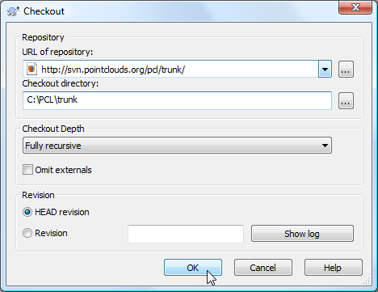

.. _compiling_pcl_windows_3rdparty_installers:

Compiling PCL from source in Windows using the 3rd party installers
-------------------------------------------------------------------

This tutorial explains how to build the Point Cloud Library **from source** on
Microsoft Windows platforms. In this tutorial, we will be using the dependencies
installers provided on the `downloads page <http://www.pointclouds.org/downloads/windows.html>`_. 

.. note::
	
	If there is no installers for your compiler, it is recommanded that you build the dependencies
	out of source. The :ref:`compiling_pcl_windows` tutorial should guide you through the download 
	and the compilation of all the required dependencies.

.. image:: images/windows_logo.png
   :alt: Microsoft Windows logo
   :align: right

Requirements
-------------

You need to download and install the prebuilt dependencies from the `downloads page <http://www.pointclouds.org/downloads/windows.html>`_. 
Installing them to the default locations will make configuring PCL easier.

- **Boost** version 1.46.1

used for shared pointers, and threading. **mandatory**

- **Eigen** version 3.0.0

used as the matrix backend for SSE optimized math. **mandatory**

- **CMINPACK** version 1.1.3

used in the `sample_consensus` and `registration` modules for non-linear (Levenberg-Marquardt) optimizations. **mandatory**

- **FLANN** version 1.6.9

used in `kdtree` for fast approximate nearest neighbors search. **mandatory**

- **Visualization ToolKit (VTK)** version 5.6.1

used in `visualization` for 3D point cloud rendering and visualization. **mandatory**
	
- **QHULL** version 2011.1

used for convex/concave hull decompositions in `surface`. **optional**

- **OpenNI** version 1.1.0.41 and patched **Sensor Module** version 5.0.1.32

used to grab point clouds from OpenNI compliant devices. **optional**

- **GTest** version >= 1.6.0 (http://code.google.com/p/googletest/)

is needed only to build PCL tests. We do not provide GTest installers. **optional**

- **wxWidgets** version >= 2.8.1 (http://www.wxwidgets.org/)

used for `pcl::RangeImage` visualizations. . We do not provide wxWidgets installers. **optional**
	
.. note::
  
   Though not a dependency per se, don't forget that you also need the CMake
   build system (http://www.cmake.org/), at least version **2.8.3**. We recommend
   version **2.8.4**. A Subversion client for Windows, i.e. TortoiseSVN 
   (http://tortoisesvn.tigris.org/), is also required to download the PCL source code.

Downloading PCL source code
---------------------------
Subversion is a version control system similar to CVS which allows developers to simultaneously work on PCL. 
The download operation of the most recent source from the main development line, known as trunk, is called `checkout`.

.. note::
	
	In this tutorial, we will build the svn trunk of PCL. If you want, you can build a PCL branch instead. 
	You can grab PCL branches using Tortoise SVN from :
	
	- pcl-1.x branch from http://svn.pointclouds.org/pcl/branches/pcl-1.x
	
	- pcl-1.0.x branch from http://svn.pointclouds.org/pcl/branches/pcl-1.0.x

First create a folder that will holds PCL source code and binaries. In the remaining of this tutorial we will be using C:\\PCL.
To checkout PCL source code, navigate to the C:\\PCL folder using Windows file manager. Then right click and choose
`SVN Checkout...` from the contextual menu. Set "URL of repository" to http://svn.pointclouds.org/pcl/trunk and
"Checkout directory" to C:\\PCL\\trunk.

   
Click "OK" and the download should start. At the end of this process, you will have PCL source code in C:\\PCL\\trunk.
   
Configuring PCL
---------------

On Windows, we recommend to build **shared** PCL libraries with **static** dependencies. In this tutorial, we will use 
static dependencies when possible to build shared PCL. You can easily switch to using shared dependencies. Then, you need 
to make sure you put the dependencies' dlls either in your PATH or in the same folder as PCL dlls and executables.
You can also build static PCL libraries if you want.

Run the CMake-gui application and fill in the fields::

  Where is the source code   : C:/PCL/trunk
  Where to build the binaries: C:/PCL

Now hit the "Configure" button. You will be asked for a `generator`. A generator is simply a compiler. 

.. note::
	
	In this tutorial, we will be using Microsoft Visual C++ 2010 compiler. If you want to build 32bit PCL, then pick the
	"**Visual Studio 10**" generator. If you want to build 64bit PCL, then pick the "**Visual Studio 10 Win64**".

	Make sure you have installed the right third party dependencies. You can not mix 32bit and 64bit code, and it is 
	highly recommanded to not mix codes compiled with different compilers.
	
.. image:: images/windows/cmake_generator.png
    :alt: Choosing a generator
    :align: center
	
In the remaining of this tutorial, we will be using "**Visual Studio 10 Win64**" generator. Once you picked your generator,
hit finish to close the dialog window. CMake will start configuring PCL and looking for its dependencies. For example, we 
can get this output :

.. image:: images/windows/cmake_configure_noerror.png
    :alt: CMake configure result
    :align: center

The upper part of CMake window contains a list of CMake variables and its respective values. The lower part contains some logging
output that can help figure out what is happening. We can see, for example, that VTK was not found, thus, the visualization module 
will not get built.

Before solving the VTK issue, let's organize the CMake variables in groups by checking the `Grouped` checkbox in the top right of 
CMake window. Let's check also the `Advanced` checkbox to show some advanced CMake variables. Now, if we want to look for a specific
variable value, we can either browse the CMake variables to look for it, or we can use the `Search:` field to type the variable name.

.. image:: images/windows/cmake_grouped_advanced.png
    :alt: CMake groupped and advanced variables
    :align: center
	
Let's check whether CMake did actually find the needed third party dependencies or not :

- **Boost** : 

	CMake was not able to find boost automatically. No problem, we will help it find it :) . If CMake has found your
	boost installation, then skip to the next bullet item.

	.. image:: images/windows/cmake_boost.png
		:alt: Boost
		:align: center	
	
	Let's tell CMake where boost headers are by specifiying the headers path in **Boost_INCLUDE_DIR** variable. For example, my boost 
	headers are in C:\\Program Files\\PCL-Boost\\include . Then, let's hit `configure` again ! Hopefully, CMake is now able to find 
	all the other items (the libraries).

	.. image:: images/windows/cmake_boost_found.png
		:alt: Boost
		:align: center	

	.. note::
		
		This behaviour is not common for all libraries. Generally, if CMake is not able to find a specific library or package, we have to
		manually set the values of all the CMake related variables. Hopefully, the CMake script responsible of finding boost
		is able to find libraries using the headers path.

- **Eigen** : 

	Eigen is a header-only library, thus, we need only **EIGEN_INCLUDE_DIR** to be set. Hopefully, CMake did fing Eigen.

	.. image:: images/windows/cmake_eigen_include_dir.png
		:alt: Eigen include dir
		:align: center	

- **CMINPACK** :

	CMake was able to find my CMinpack installation. By default on windows, PCL will pick the static CMinpack libraries
	with `_s` suffix. Thus, the **CMINPACK_IS_STATIC** checkbox is checked by default.
	
	.. image:: images/windows/cmake_cminpack.png
		:alt: CMinpack
		:align: center	

	.. note::
		
		If you rather want to use the **shared** CMinpack libraries (those without the `_s` suffix), you need to manually edit the 
		**CMINPACK_LIBRARY** and **CMINPACK_LIBRARY_DEBUG** variables to remove the `_s` suffix and do not forget to uncheck 
		**CMINPACK_IS_STATIC**. Make sure the CMinpack dlls are either in your PATH or in the same folder as your executables.
		
- **FLANN** :

	CMake was able to find my FLANN installation. By default on windows, PCL will pick the static FLANN libraries
	with `_s` suffix. Thus, the **FLANN_IS_STATIC** checkbox is checked by default.
	
	.. image:: images/windows/cmake_flann.png
		:alt: FLANN
		:align: center	

	.. note::
		
		If you rather want to use the **shared** FLANN libraries (those without the `_s` suffix), you need to manually edit the 
		**FLANN_LIBRARY** and **FLANN_LIBRARY_DEBUG** variables to remove the `_s` suffix and do not forget to uncheck 
		**FLANN_IS_STATIC**. Make sure the FLANN dlls are either in your PATH or in the same folder as your executables.

- **VTK** :

	CMake did not find my VTK installation. There is only one VTK related CMake variable called **VTK_DIR**. We have to set it
	to the path of the folder containing **VTKConfig.cmake**, which is in my case : C:\\Program Files\\VTK 5.6\\lib\\vtk-5.6 .
	After you set **VTK_DIR**, hit `configure` again.
	
	.. image:: images/windows/cmake_vtk_configure.png
		:alt: VTK
		:align: center	
		
	After clicking `configure`, in the logging window, we can see that VTK is found, but the `visualization` module is still
	disabled `manually`. We have then to enable it by checking the **BUILD_visualization** checkbox. You can also do the same thing
	with the `apps` module. Then, hit `configure` again.
	
	.. image:: images/windows/cmake_vtk_found_enable_visualization.png
		:alt: VTK found, enable visualization
		:align: center	

- **QHull** :

	CMake was able to find my QHull installation. By default on windows, PCL will pick the static QHull libraries
	with `static` suffix.
	
	.. image:: images/windows/cmake_qhull.png
		:alt: QHull
		:align: center	

- **OpenNI** :

	CMake was able to find my OpenNI installation. 
	
	.. image:: images/windows/cmake_openni.png
		:alt: OpenNI
		:align: center	
	
	.. note::
		
		CMake do not look for the installed OpenNI Sensor module. It is needed at runtime.
		
- **GTest** :

	If you want to build PCL tests, you need to download GTest and build it yourself. In this tutorial, we will not build tests.
	
- **WxWidgets** :

	In this tutorial, we will not use wxWidgets which is optional anyway.
	
Once CMake has found all the needed dependencies, let's see the PCL specific CMake variables :

.. image:: images/windows/cmake_pcl.png
	:alt: PCL
	:align: center
	
- **PCL_SHARED_LIBS** is checked by default. Uncheck it if you want static PCL libs (not recommanded).

- **CMAKE_INSTALL_DIR** is where PCL will be installed after building it (more information on this later).
	
If you have the Pro version of Microsoft Visual Studio, you can check **USE_PROJECT_FOLDERS** checkbox to organize PCL
projects in folders within the PCL solution. If you have an express edition, it is recommended to keep it unchecked, as in
express editions, the use of project folders are disabled.

Once PCL configuration is ok, hit the `Generate` button. CMake will then generate Visual Studio project files (vcproj files) 
and the main solution file (PCL.sln) in C:\\PCL directory.

Building PCL
--------------
  
Open that generated solution file (PCL.sln) to finally build the PCL libraries. This is how your solution will look like
whether you enabled **USE_PROJECT_FOLDERS** (left) or not (right).

.. image:: images/windows/pcl_solution_with_projects_folder.png
   :alt: PCL solution with project folders
   :align: center  
   
Building the "ALL_BUILD" project will build everything. 

.. image:: images/windows/msvc_build_build_all.jpg
   :alt: Build ALL_BUILD project
   :align: center  

.. note::
	Make sure to build the "ALL_BUILD" project in both **debug** and **release** mode.
	
Installing PCL
--------------

To install the built libraries and executbles, you need to build the "INSTALL" project in the solution explorer. 
This utility project will copy PCL headers, libraries and executable to the directory defined by the **CMAKE_INSTALL_PREFIX** 
CMake variable.

.. image:: images/windows/msvc_build_install.jpg
   :alt: Build INSTALL project
   :align: center  

.. note::
	Make sure to build the "INSTALL" project in both **debug** and **release** mode.
	
Using PCL
---------

We finally managed to compile the Point Cloud Library (PCL) as binaries for
Windows. You can start using them in your project by following the
:ref:`using_pcl` tutorial. 
