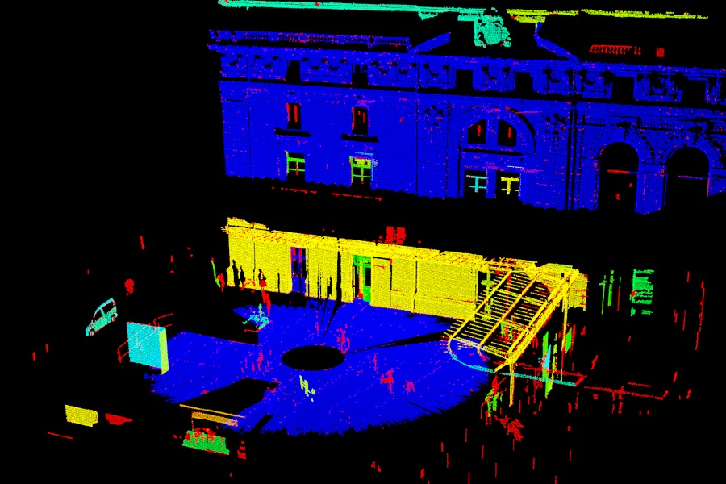

.. _conditional_euclidean_clustering:

Conditional Euclidean Clustering
--------------------------------

This tutorial describes how to use the ``pcl::ConditionalEuclideanClustering`` class:
A segmentation algorithm that clusters points based on Euclidean distance and a user-customizable condition that needs to hold.

This class uses the same greedy-like / region-growing / flood-filling approach that is used in :ref:`cluster_extraction`, :ref:`region_growing_segmentation` and :ref:`region_growing_rgb_segmentation`.
The advantage of using this class over the other classes is that the constraints for clustering (pure Euclidean, smoothness, RGB) are now customizable by the user.
Some disadvantages include: no initial seeding system, no over- and under-segmentation control, and the fact that calling a conditional function from inside the main computational loop is less time efficient.

Theoretical Primer
------------------

The :ref:`cluster_extraction` and :ref:`region_growing_segmentation` tutorials already explain the region growing algorithm very accurately.
The only addition to those explanations is that the condition that needs to hold for a neighbor to be merged into the current cluster, can now be fully customized.

As a cluster grows, it will evaluate the user-defined condition between points already inside the cluster and nearby candidate points.
The candidate points (nearest neighbor points) are found using a Euclidean radius search around each point in the cluster.
For each point within a resulting cluster, the condition needed to hold with at least one of its neighbors and NOT with all of its neighbors.

The Conditional Euclidean Clustering class can also automatically filter clusters based on a size constraint.
The clusters classified as too small or too large can still be retrieved afterwards.

The Code
--------

First, download the dataset `Statues_4.pcd <https://sourceforge.net/projects/pointclouds/files/PCD datasets/Trimble/Outdoor1/Statues_4.pcd.zip>`_ and extract the PCD file from the archive.
This is a very large data set of an outdoor environment where we aim to cluster the separate objects and also want to separate the building from the ground plane even though it is attached in a Euclidean sense.

Now create a file, let's say, ``conditional_euclidean_clustering.cpp`` in your favorite editor, and place the following inside it:

.. literalinclude:: sources/conditional_euclidean_clustering/conditional_euclidean_clustering.cpp
   :language: cpp
   :linenos:
   
The Explanation
---------------

Since the Conditional Euclidean Clustering class is for more advanced users, I will skip explanation of the more obvious parts of the code:

 - ``pcl::io::loadPCDFile`` and ``pcl::io::savePCDFile`` are used for loading and saving the point cloud data.
 - ``pcl::console::TicToc`` is used for easy output of timing results.
 - :ref:`voxelgrid` is being used (lines 66-73) to downsample the cloud and give a more equalized point density.
 - :ref:`normal_estimation` is being used (lines 75-83)  to estimate normals which will be appended to the point information;
   The Conditional Euclidean Clustering class will be templated with ``pcl::PointXYZINormal``, containing x, y, z, intensity, normal and curvature information to use in the condition function.

Lines 85-95 set up the Conditional Euclidean Clustering class for use:

.. literalinclude:: sources/conditional_euclidean_clustering/conditional_euclidean_clustering.cpp
   :language: cpp
   :lines: 85-95

A more elaborate description of the different lines of code:

 - The class is initialized with TRUE.
   This will allow extraction of clusters that are too small or too large.
   It saves some computation time and memory if the class is initialized without this.
 - The input data for the class can be specified using methods derived from the ``PCLBase`` class, i.e.: ``setInputCloud`` and ``setIndices``.
 - As a cluster grows, it will evaluate a user-defined condition between points already inside the cluster and nearby candidate points.
   More on the condition function can be read further below.
 - The cluster tolerance is the radius for the k-NN searching, used to find the candidate points.
 - Clusters that make up less than 0.1% of the cloud's total points are considered too small.
 - Clusters that make up more than 20% of the cloud's total points are considered too large.
 - The resulting clusters are stored in the ``pcl::IndicesClusters`` format, which is an array of indices-arrays, indexing points of the input point cloud.
 - Too small clusters or too large clusters are not passed to the main output but can instead be retrieved in separate ``pcl::IndicesClusters`` data containers, but only if the class was initialized with TRUE.

Lines 12-49 show some examples of condition functions:

.. literalinclude:: sources/conditional_euclidean_clustering/conditional_euclidean_clustering.cpp
   :language: cpp
   :lines: 12-49

The format of the condition function is fixed:

 - The first two input arguments need to be of the same type as the templated type used in the Conditional Euclidean Clustering class.
   These arguments will pass the point information for the current seed point (first argument) and the current candidate point (second argument).
 - The third input argument needs to be a float.
   This argument will pass the squared distance between the seed and candidate point.
   Although this information is also computable using the first two arguments, it is already provided by the underlying nearest neighbor search and can be used to easily make a distance dependent condition function.
 - The output argument needs to be a boolean.
   Returning TRUE will merge the candidate point into the cluster of the seed point.
   Returning FALSE will not merge the candidate point through this particular point-pair, however, it is still possible that the two points will end up in the same cluster through a different point-pair relationship.

These example condition functions are just to give an indication of how to use them.
For instance, the second condition function will grow clusters as long as they are similar in surface normal direction OR similar in intensity value.
This should hopefully cluster buildings of similar texture as one cluster, but not merge them into the same cluster as adjacent objects.
This is going to work out if the intensity is different enough from nearby objects AND the nearby objects are not sharing a nearby surface with the same normal.
The third condition function is similar to the second but has different constraints depending on the distance between the points.

Lines 97-109 contain a piece of code that is a quick and dirty fix to visualize the result:

.. literalinclude:: sources/conditional_euclidean_clustering/conditional_euclidean_clustering.cpp
   :language: cpp
   :lines: 97-109

When the output point cloud is opened with PCL's standard PCD viewer, pressing '5' will switch to the intensity channel visualization.
The too-small clusters will be colored red, the too-large clusters will be colored blue, and the actual clusters/objects of interest will be colored randomly in between yellow and cyan hues.

Compiling and running the program
---------------------------------

Add the following lines to your CMakeLists.txt

.. literalinclude:: sources/conditional_euclidean_clustering/CMakeLists.txt
   :language: cmake
   :linenos:

After you have made the executable, you can run it. Simply do:

 $ ./conditional_euclidean_clustering

The resulting output point cloud can be opened like so:

 $ ./pcl_viewer output.pcd

You should see something similar to this:

This result is sub-optimal but it gives an idea of what can be achieved with this class.
The mathematics and heuristics behind the customizable condition are now the responsibility of the user.

