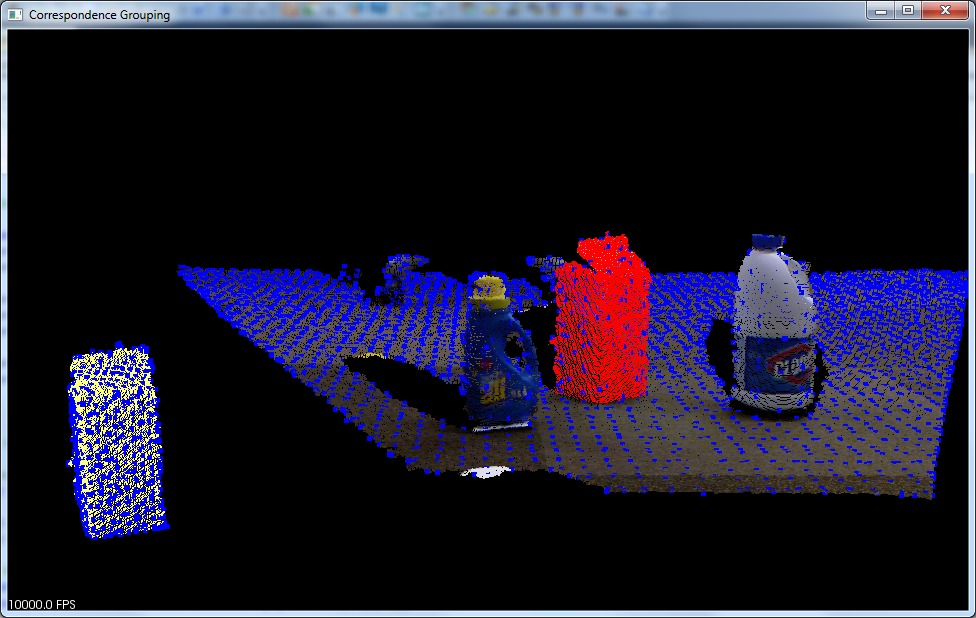
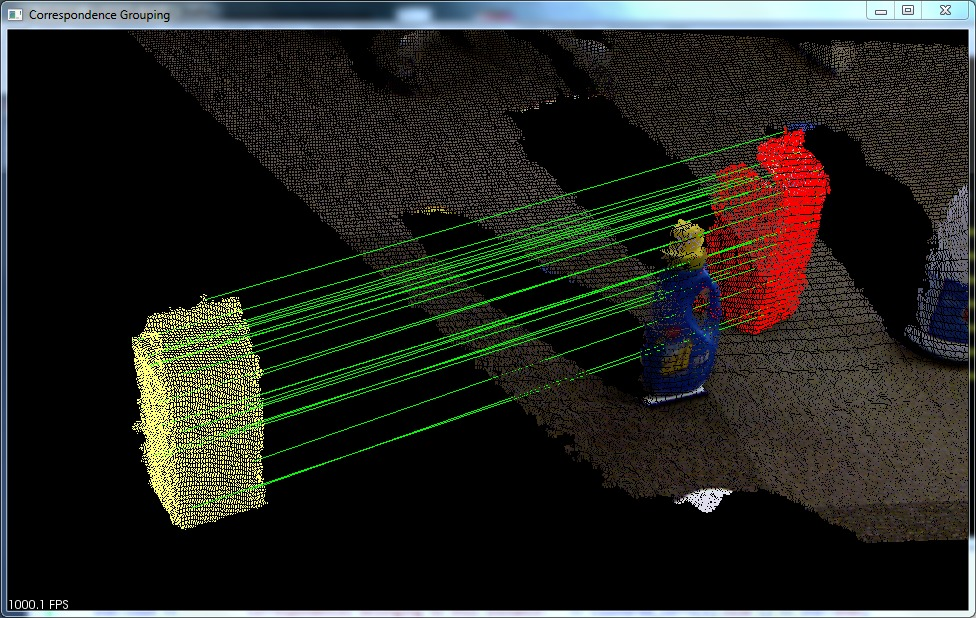
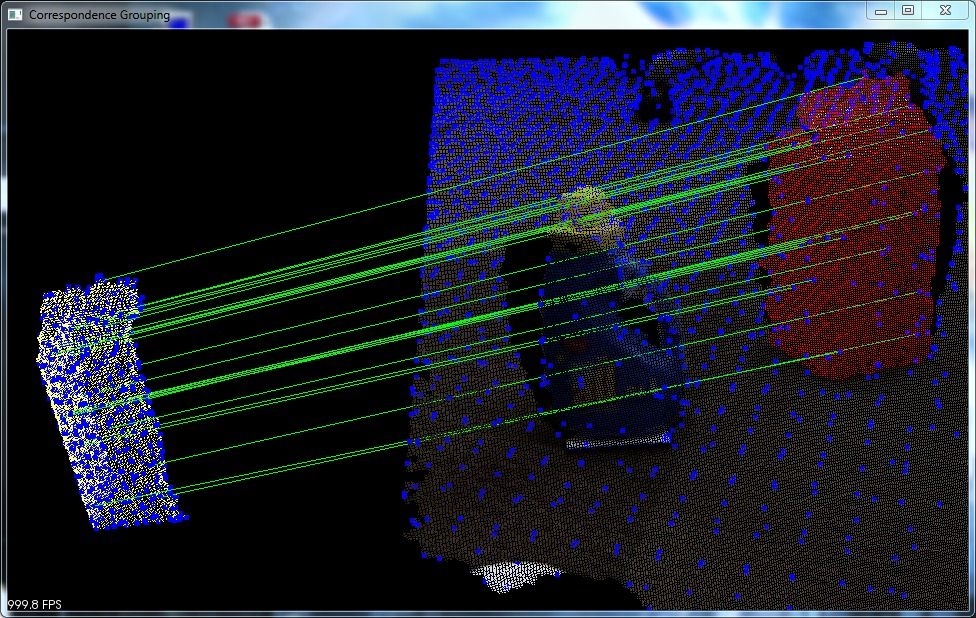

.. _correspondence_grouping:

3D Object Recognition based on Correspondence Grouping
------------------------------------------------------

This tutorial aims at explaining how to perform 3D Object Recognition based on the pcl_recognition module.
Specifically, it explains how to use Correspondence Grouping algorithms in order to cluster the set of point-to-point correspondences obtained after the 3D descriptor matching stage into model instances that are present in the current scene.
For each cluster, representing a possible model instance in the scene, the Correspondence Grouping algorithms also output the transformation matrix identifying the 6DOF pose estimation of that model in the current scene. 

The code
--------

Before you begin, you should download the PCD dataset used in this tutorial from GitHub (`milk.pcd <https://github.com/PointCloudLibrary/pcl/blob/master/test/milk.pcd?raw=true>`_ and
`milk_cartoon_all_small_clorox.pcd <https://github.com/PointCloudLibrary/pcl/blob/master/test/milk_cartoon_all_small_clorox.pcd?raw=true>`_) and put the files in a folder of your convenience.

Also, copy and paste the following code into your editor and save it as ``correspondence_grouping.cpp`` (or download the source file :download:`here <./sources/correspondence_grouping/correspondence_grouping.cpp>`).

.. literalinclude:: sources/correspondence_grouping/correspondence_grouping.cpp
   :language: cpp
   :linenos:

Walkthrough
-----------

Now let's take a look at the various parts of the code to see how it works.

Helper Functions
****************

Let's start with a couple of useful functions: the first one prints 
on the console a short explanation of the several command line switches
that the program can accept.

.. literalinclude:: sources/correspondence_grouping/correspondence_grouping.cpp
   :language: cpp
   :lines: 36-59
   
The second function does the actual parsing of the command line 
arguments in order to set the correct parameters for the execution.

.. literalinclude:: sources/correspondence_grouping/correspondence_grouping.cpp
   :language: cpp
   :lines: 61-123
   
It's important to say that the only command line parameters *required* when executing this tutorial are the filenames of the 
model and the scene, in this exact order. All other parameters are set 
to a default value that will make the tutorial work correctly 
with the supplied dataset, although with different models and scene some parameter values might need to be adjusted. You can play around with them to see how they influence the final result.

You can choose between two correspondence clustering algorithms with the command line switch ``--algorithm (Hough|GC)``

   - **Hough (default)**
      This is a clustering algorithm based on a 3D Hough voting scheme described in:
	  
	  *F. Tombari and L. Di Stefano:* "Object recognition in 3D scenes with occlusions and clutter by Hough voting", 4th Pacific-Rim Symposium on Image and Video Technology, 2010.
	
   - **GC**
      This is a geometric consistency clustering algorithm enforcing simple geometric constraints between pairs of correspondences. It builds on the proposal presented in:
  
	  *H. Chen and B. Bhanu:* "3D free-form object recognition in range images using local surface patches", Pattern Recognition Letters, vol. 28, no. 10, pp. 1252-1262, 2007.
	 
Some other interesting switches are ``-k``, ``-c`` and ``-r``: 

	- ``-k`` shows the keypoints used to compute the correspondences as a blue overlay into the PCL visualizer.
	- ``-c`` draws a line connecting each pair of model-scene correspondences that *survived* the clustering process.
	- ``-r`` estimates the spatial resolution for the model point cloud and afterwards considers the radii used as parameters as if they were given in units of cloud resolution; thus achieving some sort of resolution invariance that might be useful when using this tutorial with the same command line and different point clouds.

The next function performs the spatial resolution computation for a given point cloud averaging the distance between each cloud point and its nearest neighbor. 

.. literalinclude:: sources/correspondence_grouping/correspondence_grouping.cpp
   :language: cpp
   :lines: 125-155	

Clustering Pipeline
*******************

The main function, which performs the actual clustering, is quite straightforward. We will take a look at each part of code as they appear in the proposed example.

First, the program parses the command line arguments and
loads the model and scene clouds from disk (using the filenames 
supplied by the user).

.. literalinclude:: sources/correspondence_grouping/correspondence_grouping.cpp
   :language: cpp
   :lines: 160,174-185
   
As a second step, only if resolution invariance flag has been enabled in the command line, the program adjusts the radii that will be used in the next sections by multiplying them for the estimated model cloud resolution.

.. literalinclude:: sources/correspondence_grouping/correspondence_grouping.cpp
   :language: cpp
   :lines: 190-208
   
Next, it computes the normals for each point of both the model and the scene cloud with the  :pcl:`NormalEstimationOMP <pcl::NormalEstimationOMP>` estimator, using the 10 nearest neighbors of each point (this parameter seems to be fairly ok for many datasets, not just for the one provided).

.. literalinclude:: sources/correspondence_grouping/correspondence_grouping.cpp
   :language: cpp
   :lines: 213-219
   
Then it downsamples each cloud in order to find a small number 
of keypoints, which will then be associated to a 3D descriptor in order to perform keypoint matching and determine point-to-point correspondences. The radii used for the 
:pcl:`UniformSampling <pcl::UniformSampling>` are either the ones set with the command line switches or the defaults.

.. literalinclude:: sources/correspondence_grouping/correspondence_grouping.cpp
   :language: cpp
   :lines: 224-237
   
The next stage consists in associating a 3D descriptor to each model and scene keypoint. In our tutorial, we compute SHOT descriptors using :pcl:`SHOTEstimationOMP <pcl::SHOTEstimationOMP>`.

.. literalinclude:: sources/correspondence_grouping/correspondence_grouping.cpp
   :language: cpp
   :lines: 243-254
   
Now we need to determine point-to-point correspondences between 
model descriptors and scene descriptors. To do this, the program uses a :pcl:`KdTreeFLANN <pcl::KdTreeFLANN>` whose input cloud has been set to the cloud containing the model descriptors.
For each descriptor associated to a scene keypoint, it efficiently finds the most 
similar model descriptor based on the Euclidean distance, and it adds this pair to a :pcl:`Correspondences <pcl::Correspondences>` vector (only if the two descriptors are similar enough, i.e. their squared distance is less than a threshold, set to 0.25).

.. literalinclude:: sources/correspondence_grouping/correspondence_grouping.cpp
   :language: cpp
   :lines: 259-280

The last stage of the pipeline is the actual clustering of the 
previously found correspondences.

The default algorithm is :pcl:`Hough3DGrouping <pcl::Hough3DGrouping>`, that is based on an Hough Voting process.
Please note that this algorithm needs to associate a Local Reference Frame (LRF) for each keypoint belonging to the clouds which are passed as arguments!
In this example, we explicitly compute the set of LRFs using the :pcl:`BOARDLocalReferenceFrameEstimation <pcl::BOARDLocalReferenceFrameEstimation>` estimator before calling the clustering algorithm. 

.. literalinclude:: sources/correspondence_grouping/correspondence_grouping.cpp
   :language: cpp
   :lines: 289-326
   
.. note::
   It's not necessary to explicitly compute the LRFs before calling the clustering algorithm. If the clouds which are fetched to the clustering algorithm do not have a set of LRFs associated, Hough3DGrouping automatically computes them before performing clustering. In particular, this happens when calling the ``recognize`` (or ``cluster``) method without setting the LRFs: in this case you need to specify the radius of the LRF as an additional parameter for the clustering algorithm (with the ``setLocalRfSearchRadius`` method).
   
Alternatively to Hough3DGrouping, and by means of the appropriate command line switch described before, you might choose to employ the :pcl:`GeometricConsistencyGrouping <pcl::GeometricConsistencyGrouping>` algorithm. In this case the LRF computation is not needed so we are simply creating an instance of the algorithm class, passing the right parameters and invoking the ``recognize`` method.

.. literalinclude:: sources/correspondence_grouping/correspondence_grouping.cpp
   :language: cpp
   :lines: 327-339

.. note::   
	The ``recognize`` method returns a vector of ``Eigen::Matrix4f`` representing a transformation (rotation + translation) for each instance of the model found in the scene (obtained via Absolute Orientation) and a **vector** of :pcl:`Correspondences <pcl::Correspondences>` (a vector of vectors of :pcl:`Correspondence <pcl::Correspondences>`) representing the output of the clustering i.e. each element of this vector is in turn a set of correspondences, representing the correspondences associated to a specific model instance in the scene.
	
	If you **only** need the clustered correspondences because you are planning to use them in a different way, you can use the ``cluster`` method.
	
Output and Visualization
************************

We are almost at the end of this tutorial. The last few words are related to the part of the program that displays the results on the console and over a PCL Visualizer window.

As a first thing we are showing, for each instance of the model found into the scene, the transformation  matrix and the number of correspondences extracted by the clustering method.

.. literalinclude:: sources/correspondence_grouping/correspondence_grouping.cpp
   :language: cpp
   :lines: 344-360

The program then shows in a :pcl:`PCLVisualizer <pcl::visualization::PCLVisualizer>` window the scene cloud with a red overlay where an instance of the model has been found.
If the command line switches ``-k`` and ``-c`` have been used, the program also shows a "stand-alone" rendering of the model cloud. If keypoint visualization is enabled, keypoints are displayed as blue dots and if correspondence visualization has been enabled they are shown as a green line for each correspondence which *survived* the clustering process.

.. literalinclude:: sources/correspondence_grouping/correspondence_grouping.cpp
   :language: cpp
   :lines: 365-421

Compiling and running the program
---------------------------------

Create a `CMakeLists.txt` file and add the following lines into it:

.. literalinclude:: sources/correspondence_grouping/CMakeLists.txt
   :language: cmake
   :linenos:

After you have created the executable, you can then launch it following this example::

  $ ./correspondence_grouping milk.pcd milk_cartoon_all_small_clorox.pcd
  
Or, alternatively, if you prefer specifying the radii in units of cloud resolution::

  $ ./correspondence_grouping milk.pcd milk_cartoon_all_small_clorox.pcd milk.pcd milk_cartoon_all_small_clorox.pcd -r --model_ss 7.5 --scene_ss 20 --rf_rad 10 --descr_rad 15 --cg_size 10
  
Remember to replace ``milk.pcd`` and ``milk_cartoon_all_small_clorox.pcd`` with model and scene filenames, in this exact order. If you want you can add other command line options as described at the beginning of this tutorial.

.. note:: 
	If you are using different point clouds and you don't know how to set the various parameters for this tutorial you can use the ``-r`` flag and try setting the LRF and descriptor radii to 5, 10, 15 or 20 times the actual cloud resolution. After that you probably will have to tweak the values by hand to achieve the best results.

After a few seconds, you will see an output similar to::

  Model total points: 13704; Selected Keypoints: 732
  Scene total points: 307200; Selected Keypoints: 3747
  
  Correspondences found: 1768
  Model instances found: 1

    Instance 1:
      Correspondences belonging to this instance: 24

          |  0.969 -0.120  0.217 |
      R = |  0.117  0.993  0.026 |
          | -0.218 -0.000  0.976 |

      t = < -0.159, 0.212, -0.042 >
	  
The output window should look like this (depending on the command line options used):

.. image:: images/correspondence_grouping/correspondence_grouping.jpg
  :height: 400

