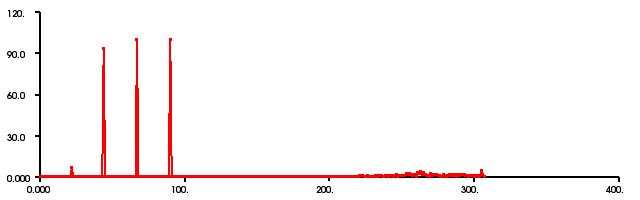

.. _cvfh_signature:

Signature Estimation with Clustered Viewpoint Feature Histogram
---------------------------------------------------------------

In this tutorial you will see a simple implementation of estimating CVFH signatures from a given clustered point cloud. In order to use that tutorial for your own project, you first have to segment out planars and extract clusters (see :ref:`extract_indices` and :ref:`cluster_extraction`) from your original point cloud.

The Code
--------

First, go to "PCL_ROOT/test" and copy bun0.pcd to your project folder.

Then, create a file, let's say, ``cvfh_signature.cpp`` in your favorite editor, and place the following inside it:

.. code-block: cpp
	:linenos:

	#include <pcl/point_types.h>
	#include <pcl/io/pcd_io.h>
	#include <pcl/kdtree/kdtree_flann.h>
	#include <pcl/features/normal_3d.h>
	#include <pcl/features/cvfh.h>

	int main (int argc, char** argv)
	{
  	// Reading a sample pointcloud //
  	pcl::PointCloud<pcl::PointXYZ>::Ptr cloud (new pcl::PointCloud<pcl::PointXYZ>);
  	pcl::PCDReader reader;
  	reader.read("bun0.pcd",*cloud);

  	// Computing the normals of the pointcloud for the CVFH estimation //
  	pcl::NormalEstimation<pcl::PointXYZ, pcl::PointNormal> n;
  	pcl::PointCloud<pcl::PointNormal>::Ptr normals (new pcl::PointCloud<pcl::PointNormal>);
  	pcl::KdTree<pcl::PointXYZ>::Ptr tree (new pcl::KdTreeFLANN<pcl::PointXYZ>);
  	tree->setInputCloud(cloud);
  	n.setInputCloud (cloud);
  	n.setSearchMethod (tree);
  	n.setKSearch (20);
  	n.compute (*normals);
 
  	// Creating the CVFH object and the output of the following estimation //
  	pcl::CVFHEstimation<pcl::PointXYZ,pcl::PointNormal,pcl::VFHSignature308>::VFHEstimator cvfh;
  	pcl::Feature<pcl::Normal,pcl::VFHSignature308>::PointCloudOut signature;
  	

  	// Setting the parameters and variables for the estimation //
  	cvfh.setKSearch(100);
  	cvfh.setUseGivenNormal(true);
  	tree->setInputCloud(cloud);
  	cvfh.setInputCloud(cloud);
  	cvfh.setInputNormals(normals);
  	cvfh.setSearchMethod(tree);
    cvfh.compute(signature);

  	// Write Signature of PointCloud into a .pcd file //
  	pcl::PCDWriter writer;
  	writer.write("cvfh_histogram.pcd",signature,false);

  	// Finish
  	return (0);
	}

The Explanation
---------------

Now, let's break down the code piece by piece, skipping the obvious.

.. code-block:: cpp

    // Reading a sample pointcloud //
  	pcl::PointCloud<pcl::PointXYZ>::Ptr cloud (new pcl::PointCloud<pcl::PointXYZ>);
  	pcl::PCDReader reader;
  	reader.read("bun0.pcd",*cloud);

  	// Computing the normals of the pointcloud for the CVFH estimation //
  	pcl::NormalEstimation<pcl::PointXYZ, pcl::PointNormal> n;
  	pcl::PointCloud<pcl::PointNormal>::Ptr normals (new pcl::PointCloud<pcl::PointNormal>);
  	pcl::KdTree<pcl::PointXYZ>::Ptr tree (new pcl::KdTreeFLANN<pcl::PointXYZ>);
  	tree->setInputCloud(cloud);
  	n.setInputCloud (cloud);
  	n.setSearchMethod (tree);
  	n.setKSearch (20);
  	n.compute (*normals);

The code above are already explained in other tutorials. So if you have questions regarding to these, just have a look into the other 
tutorials. 

.. code-block:: cpp

    // Creating the CVFH object and the output of the following estimation //
  	pcl::CVFHEstimation<pcl::PointXYZ,pcl::PointNormal,pcl::VFHSignature308>::VFHEstimator cvfh;
  	pcl::Feature<pcl::Normal,pcl::VFHSignature308>::PointCloudOut signature;
    // Setting the parameters and variables for the estimation //
  	cvfh.setKSearch(100);
  	cvfh.setUseGivenNormal(true);
  	tree->setInputCloud(cloud);
  	cvfh.setInputCloud(cloud);
  	cvfh.setInputNormals(normals);
  	cvfh.setSearchMethod(tree);
 	cvfh.compute(signature);

This is the part we are most interested in. First we are creating the CVFH
object. It has three parameters: PointInT, PointNT and PointOutT.  In our case,
PointInT is PointXYZ since our original PointCloud only exists of XYZ datas.
Of course you could use other point types, but then you have to change the
point type in the <>, as well.  The same is valid for PointNT and PointOutT.
PointNT is the point type of the normals, we calculated before.  In our case
they are of type PointNormal. PointOutT is the point type for the output of the
CVFH estimation.  So it is obvious that we take VFHSignature308 point type,
since CVFH computes a signature of the given pointcloud.  After that, we have
to define a feature pointcloud output object, where the output of the signature
estimation is saved.  At least we are setting the paramters and variables for
the estimation and computing the signature.

Compiling and running the program
---------------------------------

Add the following lines to your CMakeLists.txt

.. code-block:: cmake

   add_executable (cvfh_signature cvfh_signature.cpp)
   target_link_libraries (cvfh_signature ${PCL_IO_LIBRARY} ${PCL_KDTREE_LIBRARY} ${PCL_FEATURES_LIBRARY})

After you have made the executable, you can run it. Simply do::

	$ ./cvfh_signature

You will see something similar to::

	Signature was written into cvfh_histogram.pcd!

You can also look at the histogram with the pcd_viewer. Copy the .pcd file to the folder, where you can find pcd_viewer.exe. Then simply do:

	$ ./pcd_viewer cvfh_histogram.pcd

The histogram of bun0.pcd should look like this:

