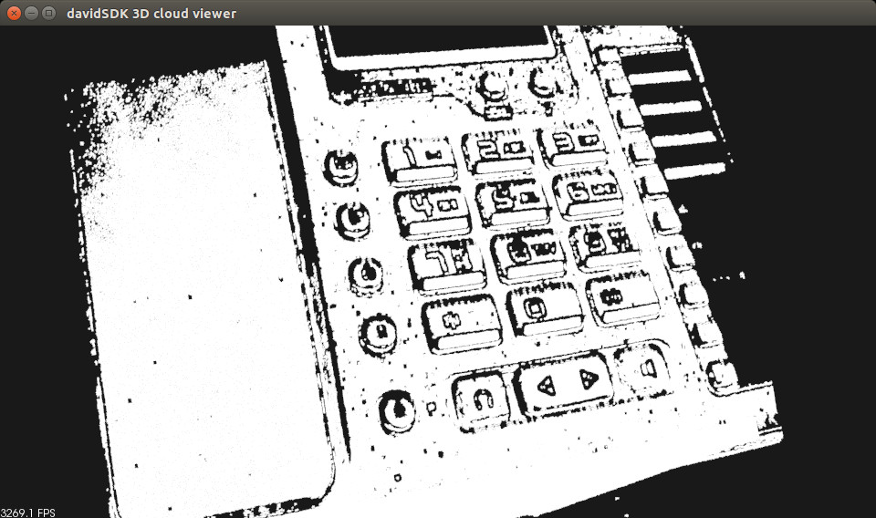

.. _david_sdk:

=====================================================
Grabbing point clouds / meshes from davidSDK scanners
=====================================================

In this tutorial we will learn how to use the `davidSDK <http://www.david-3d.com/en/products/david-sdk>`_ through PCL. This tutorial will show you how to configure PCL and how to use the examples to fetch point clouds/meshes/images from a davidSDK compliant device (such as the `SLS-2 <http://www.david-3d.com/en/products/sls-2>`_).

.. contents::

Install davidSDK
================

You need a davidSDK to run the SDK on the server side, the official davidSDK does not come with a Makefile or a CMake project. An un-official fork provides a CMake project that enables to easily use the SDK under Linux (with minor tweaks)

  * `Official davidSDK download page <http://www.david-3d.com/en/support/downloads>`_
  * `Victor Lamoine davidSDK fork <https://gitlab.com/InstitutMaupertuis/davidSDK>`_

Please test `the example project <https://gitlab.com/InstitutMaupertuis/davidSDK/blob/master/README.md#example-project-using-the-davidsdk>`_ before going further.

.. note:: If you use the trial version of the server, the only format available is OBJ (used by default)

Configuring PCL
===============

You need at least PCL 1.8.0 to be able to use the davidSDK. You need to make sure ``WITH_DAVIDSDK`` is set to ``true`` in the CMake configuration (it should be set to true by default if you have used the un-official davidSDK fork).

The default following values can be tweaked into CMake if you don't have a standard installation, for example:

.. code-block::

  DAVIDSDK_ABI_DIR     /opt/davidsdk

You can deactivate building the davidSDK support by setting ``BUILD_DAVIDSDK`` to false. Compile and install PCL.

Platform specific directives
============================

It should be easy to use the davidSDK PCL support if you are using PCL on the davidSDK server; the meshes are locally exported on the storage drive and then loaded into PCL as point clouds/meshes. If you are using a Linux distribution you will need to configure more things for the davidSDK PCL implementation to work, create a temporary directory for the davidSDK meshes storage:

.. code-block:: bash

 mkdir -p /var/tmp/davidsdk
 sudo chmod 755 /var/tmp/davidsdk

Edit samba configuration (samba must be installed first):

.. code-block:: bash

  echo -e "[davidsdk]\n\
   path = /var/tmp/davidsdk\n\
   public = yes\n\
   writeable = yes\n\
   browseable = yes\n\
   guest ok = yes\n\
   create mask = 0775" |\
  sudo tee -a /etc/samba/smb.conf

Restard samba server:

.. code-block:: bash

  sudo service smbd restart

Use the :pcl:`setLocalAndRemotePaths <pcl::DavidSDKGrabber::setLocalAndRemotePaths>` function to set the local and remote paths, if you use the same path as above; this doesn't have to be called if the server is running of the same machine as the client.

.. code-block:: cpp

  davidsdk_ptr->setLocalAndRemotePaths ("/var/tmp/davidsdk/", "\\\\name_of_machine\\davidsdk\\");

.. note::

  If you get a Error_Fail = -107 error, it is most probably a write access missing in the temporary directory.

File formats
============

Three file formats are available to export the meshes / clouds.

* STL: No texture support, binary format
* OBJ: Texture support, no binary format available
* PLY: Texture support, binary format is available but davidSDK uses ASCII format

Use the :pcl:`setFileFormatToOBJ <pcl::DavidSDKGrabber::setFileFormatToOBJ>`,
:pcl:`setFileFormatToPLY <pcl::DavidSDKGrabber::setFileFormatToPLY>`,
:pcl:`setFileFormatToSTL <pcl::DavidSDKGrabber::setFileFormatToSTL>` to choose between the different formats.

The default format used is OBJ. (it is compatible with davidSDK server trial version)

Calibration
===========

In order to use the davidSDK scanner the camera and the projector must be calibrated. This can be done by calling the :pcl:`calibrate <pcl::DavidSDKGrabber::calibrate>` function of the DavidSDKGrabber object, if the calibration fails, please check `the wiki <http://wiki.david-3d.com/david-wiki>`_.

The davidSDK will only allow you to scan if the scanner is calibrated, the davidSDK provides functions to load and save configuration files for the calibration. Also note that the davidSDK server will automatically reload the last calibration data when restarted.

Using the example
==================

The `pcl_davidsdk_viewer <https://github.com/PointCloudLibrary/pcl/blob/master/visualization/tools/davidsdk_viewer.cpp>`_ example shows how to display a point cloud grabbed from a davidSDK device using the :pcl:`DavidSDKGrabber <pcl::DavidSDKGrabber>` class.

When using the DavidSDKGrabber you must connect to the server first; if the server is running locally you don't need to specify an IP address. If you are using davidSDK over a network just call :pcl:`connect <pcl::DavidSDKGrabber::connect>` with the address IP as a string, please also check that the connection didn't failed:

.. code-block:: cpp

  davidsdk_ptr->connect ("192.168.1.50");
  if (!davidsdk_ptr->isConnected ())
  {
    PCL_ERROR ("Cannot connect to davidSDK server.\n");
    return (-1);
  }

.. warning::

  Fetching clouds/meshes from the davidSDK is very slow because the point clouds/meshes are sent through the JSON interface.
  Do not expect better performance than 0.07 FPS (using STL format gives best performance).

Another example is available in `PCL sources <https://github.com/PointCloudLibrary/pcl/blob/master/doc/tutorials/content/sources/davidsdk/>`_, it uses OpenCV to display davidSDK images and the PCLVisualizer to display the point cloud at the same time.

