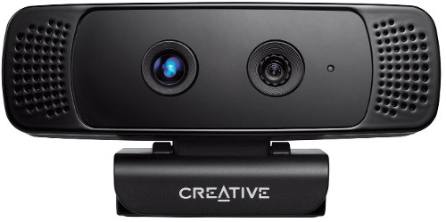

.. _depth_sense_grabber:

Grabbing point clouds from DepthSense cameras
---------------------------------------------

In PCL 1.8.0 a new grabber for `DepthSense <http://www.softkinetic.com/Products/DepthSenseCameras>`_
cameras was added. It is based on DepthSense SDK and, as such, should work with
any camera supported by the SDK (e.g. `Creative Senz3D <http://us.creative.com/p/web-cameras/creative-senz3d>`_,
`DepthSense DS325 <http://www.softkinetic.com/Store/ProductID/6>`_).

.. note:: This grabber obsoletes `PXCGrabber`, which was a Windows-only solution
  based on discontinued `Intel Perceptual Computing SDK <https://web.archive.org/web/20141228120859/https://software.intel.com/en-us/perceptual-computing-sdk>`_.

In this tutorial we will learn how to setup and use DepthSense cameras within
PCL on both Linux and Windows platforms.

.. contents::

DepthSense SDK installation
---------------------------

Download and install the SDK from `SoftKinetic website <http://www.softkinetic.com/support/download.aspx>`_.
Note that to obtain Linux drivers you need to register (free of charge).

Linux
^^^^^

The Linux version of camera driver was built against an outdated version of
`libudev`, so it will not work unless you have version 0.13 of this library
installed (for example Ubuntu 14.04 comes with a newer version). There are
several easy ways to solve this problem, see `this <https://web.archive.org/web/20150326145256/http://choorucode.com/2014/05/06/depthsense-error-some-dll-files-are-missing/>`_
or `this <https://ph4m.wordpress.com/2014/02/11/getting-softkinetics-depthsense-sdk-to-work-on-arch-linux/>`_
blog post.

Furthermore, the Linux version of SDK is shipped with its own `libusb-1.0.so`
library. You may have this library already installed on your system (e.g.
because it is required by some other grabbers). In this case there will be
conflicts, which will manifest in a flood of CMake warnings during configuration
stage. To avoid this simply delete the corresponding files from the SDK
installation path::

  $ sudo rm /opt/softkinetic/DepthSenseSDK/lib/libusb-1.0*

You can verify your installation by plugging in the camera and running the
viewer app distributed with the SDK::

  $ /opt/softkinetic/DepthSenseSDK/bin/DepthSenseViewer --standalone

Windows
^^^^^^^

After the installation is completed you need to add the SDK path to the `PATH`
environment variable. The installation path itself is stored in
`DEPTHSENSESDK64` (on a 64-bit system) environment variable, thus you need to
append `;%DEPTHSENSESDK64%\\bin` to your path. Do not forget to re-login for the
changes to take effect.

Verify installation by running `DepthSenseViewer.exe` in command prompt.

PCL configuration
-----------------

You need at least PCL 1.8.0 to be able to use the DepthSense SDK. The
``WITH_DSSDK`` option should be enabled in the CMake configuration.

DepthSense Viewer
-----------------

The grabber is accompanied by an example tool `pcl_depth_sense_viewer <https://github.com/PointCloudLibrary/pcl/blob/master/visualization/tools/depth_sense_viewer.cpp>`_
which can be used to view and save point clouds coming from a DepthSense device.
Internally it uses the `DepthSenseGrabber <http://docs.pointclouds.org/trunk/classpcl_1_1_depth_sense_grabber.html>`_
class that implements the standard PCL grabber interface.

You can run the tool with `--help` option to view the usage guide.

The video below demontrates the features of the DepthSense viewer tool. Please
note that the bilateral filtering (which can be observed in the end of the
video) is currently disabled is the tool.

.. raw:: html

  
<iframe title="DepthSense viewer" width="560" height="315" src="https://www.youtube.com/embed/W3_VYiiEPjQ" frameborder="0" allowfullscreen></iframe>

