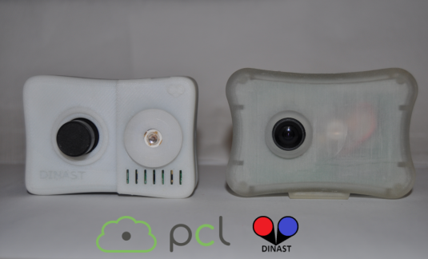
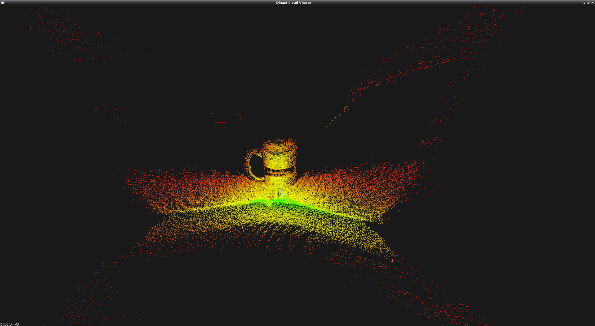

.. _dinast_grabber:

The PCL Dinast Grabber Framework
--------------------------------

At PCL 1.7 we offer a new driver for Dinast Cameras making use of the generic grabber interface that is present since PCL 1.0. This tutorial shows, in a nutshell, how to set up the pcl grabber to obtain data from the cameras. 

So far it has been currently tested with the `IPA-1110, Cyclopes II <http://dinast.com/ipa-1110-cyclopes-ii/>`_ and the `IPA-1002 ng T-Less NG <http://dinast.com/ipa-1002-ng-t-less-ng-next-generation/>`_ but it is meant to work properly on the rest of the Dinast devices, since manufacturer specifications has been taken into account.

Small example
-------------

As the Dinast Grabber implements the generic grabber interface you will see high usage similarities with other pcl grabbers. In *applications* you can find a small example that contains the code required to set up a pcl::PointCloud<XYZI> callback to a Dinast camera device.

Here you can see a screenshot of the PCL Cloud Viewer showing the data from a cup laying on a table obtained through the Dinast Grabber interface:

And this is a video of the PCL Cloud Viewer showing the point cloud data corresponding to a face:

.. raw:: html

  
<iframe title="PCL Dinast Grabber example" width="480" height="390" src="https://www.youtube.com/embed/6hj57RfEMBI?rel=0" frameborder="0" allowfullscreen></iframe>

  
Dinast Grabber currently offer this data type, as is the one currently available from Dinast devices:

* `void (const pcl::PointCloud<pcl::PointXYZI>::ConstPtr&)`
  
The code
--------

The code from *apps/src/dinast_grabber_example.cpp* will be used for this tutorial:

.. code-block:: cpp
  :linenos:

  #include <pcl/common/time.h>
  #include <pcl/point_types.h>
  #include <pcl/io/dinast_grabber.h>
  #include <pcl/visualization/cloud_viewer.h>

  template <typename PointType>
  class DinastProcessor
  {
    public:
      
      typedef pcl::PointCloud<PointType> Cloud;
      typedef typename Cloud::ConstPtr CloudConstPtr;
      
      DinastProcessor(pcl::Grabber& grabber) : interface(grabber), viewer("Dinast Cloud Viewer") {}

      void 
      cloud_cb_ (CloudConstPtr cloud_cb)
      {
        static unsigned count = 0;
        static double last = pcl::getTime ();
        if (++count == 30)
        {
          double now = pcl::getTime ();
          std::cout << "Average framerate: " << double(count)/double(now - last) << " Hz" <<  std::endl;
          count = 0;
          last = now;
        }
        if (!viewer.wasStopped())
          viewer.showCloud(cloud_cb);
      }
      
      int 
      run ()
      {
              
        std::function<void (const CloudConstPtr&)> f =
          [this] (const CloudConstPtr& cloud) { cloud_cb_ (cloud); };
        
        boost::signals2::connection c = interface.registerCallback (f);

        interface.start ();
        
        while (!viewer.wasStopped())
        {
          boost::this_thread::sleep (boost::posix_time::seconds (1));
        }
        
        interface.stop ();
        
        return(0);
      }
      
      pcl::Grabber& interface;
      pcl::visualization::CloudViewer viewer;  
      
  };

  int
  main () 
  {
    pcl::DinastGrabber grabber;
    DinastProcessor<pcl::PointXYZI> v (grabber);
    v.run ();
    return (0);
  }

The explanation
---------------

At first, when the constructor of DinastProcessor gets called, the Grabber and CloudViewer Classes are also initialized:

.. code-block:: cpp

  DinastProcessor(pcl::Grabber& grabber) : interface(grabber), viewer("Dinast Cloud Viewer") {}

At the run function what we first have is actually the callback and its registration:

.. code-block:: cpp    

  std::function<void (const CloudConstPtr&)> f =
    [this] (const CloudConstPtr& cloud) { cloud_cb_ (cloud); };
        
  boost::signals2::connection c = interface.registerCallback (f);

We create a lambda object with the callback *cloud_cb_*, we pass an implicit copy of the DinastProcessor pointer (through *this*).
The lambda then gets casted to a std::function object which is templated on the callback function type, in this case *void (const CloudConstPtr&)*. The resulting function object is then registered with the DinastGrabber interface.

The *registerCallback* call returns a *boost::signals2::connection* object, which we do not use in the this example. However, if you want to interrupt or cancel one or more of the registered data streams, you can call disconnect the callback without stopping the whole grabber:

.. code-block:: cpp

  boost::signals2::connection = interface (registerCallback (f));

  // ...

  if (c.connected ())
    c.disconnect ();

After the callback is set up we start the interface.
Then we loop until the viewer is stopped. Finally interface is stopped although this is not actually needed since the destructor takes care of that.

On the callback function *cloud_cb_* we just do some framerate calculations and we show the obtained point cloud through the CloudViewer.

Testing the code
----------------

We will test the grabber with the previous example. Write down the whole code to a file called *dinast_grabber.cpp* at your preferred location. Then add this as a *CMakeLists.txt* file:
  
.. code-block:: cmake
  :linenos:

  cmake_minimum_required(VERSION 2.8 FATAL_ERROR)

  project(dinast_grabber)

  find_package(PCL 1.7 REQUIRED)

  include_directories(${PCL_INCLUDE_DIRS})
  link_directories(${PCL_LIBRARY_DIRS})
  add_definitions(${PCL_DEFINITIONS})

  add_executable (dinast_grabber dinast_grabber.cpp)
  target_link_libraries (dinast_grabber ${PCL_LIBRARIES})

Then just proceed as a usual cmake compilation::

  $ cd /PATH/TO/DINAST_EXAMPLE
  $ mkdir build
  $ cd build
  $ cmake
  $ make
  
If everything went as expected you should now have a binary to test your Dinast device. 
Go ahead, run it and you should be able to see the point cloud data from the camera::

  $ ./dinast_grabber
  
Troubleshooting
---------------

**Q:** When I run the application I get an error similar to this one::

  $ ./dinast_grabber 
  libusb: 0.000000 error [op_open] libusb couldn't open USB device /dev/bus/usb/002/010: Permission denied.
  libusb: 0.009155 error [op_open] libusb requires write access to USB device nodes.

Where the last numbers of the */dev/bus/usb/...* might vary.

**A:** This means you do not have permission to access the device. You can do a quick fix on the permissions of that specific device::

  $ sudo chmod 666 /dev/bus/usb/002/010

Or you can make this changes permanent for all future Dinast devices writing a rule for udev. 
In debian-like systems it is usually done writing this::

  # make dinast device mount with writing permissions (default is read only for unknown devices)
  SUBSYSTEM=="usb", ATTR{idProduct}=="1402", ATTR{idVendor}=="18d1", MODE:="0666", OWNER:="root", GROUP:="video"

to a file like */etc/udev/rules.d/60-dinast-usb.rules*.

If you still have problems you can always use the users mailing list: *pcl-users@pointclouds.org* to find some extra help.

Conclusions
-----------

With this new grabber a new kind of short-range sensors are available through the PCL Grabber interface. 
It is now a breeze to connect and obtain data from Dinast devices as you do with the rest of devices supported at PCL.

If you have any development suggestions on these or new devices you can contact us through *pcl-developers@pointclouds.org*.
