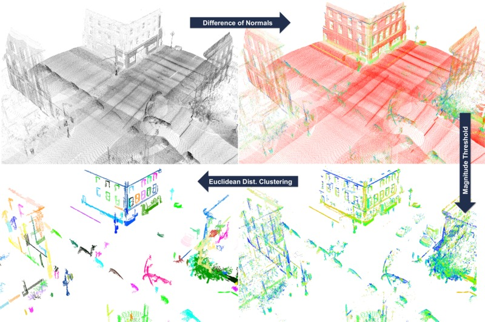
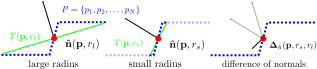
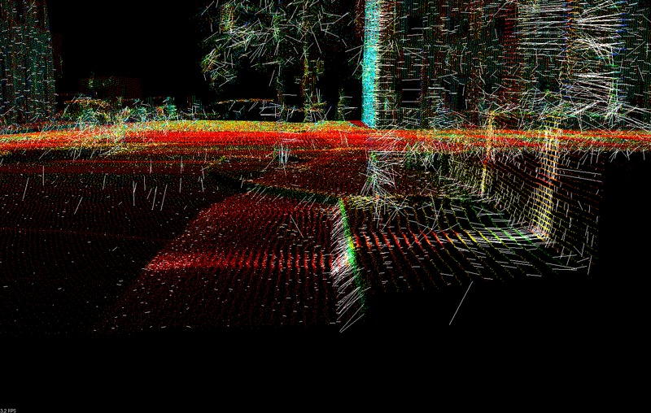
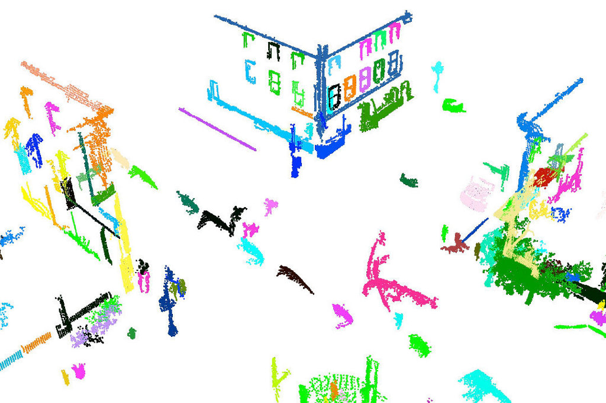

.. _don_segmentation:

========================================
Difference of Normals Based Segmentation
========================================

In this tutorial we will learn how to use Difference of Normals features, implemented in the ``pcl::DifferenceOfNormalsEstimation`` class, for scale-based segmentation of unorganized point clouds.

This algorithm performs a scale based segmentation of the given input point cloud, finding points that belong within the scale parameters given.

   Overview of the pipeline in DoN segmentation.

.. contents::

Theoretical Primer
==================

The Difference of Normals (DoN) provides a computationally efficient, multi-scale approach to processing large unorganized 3D point clouds. The idea is very simple in concept, and yet surprisingly effective in the segmentation of scenes with a wide variation of scale. For each point :math:`$p$` in a pointcloud :math:`$P$`, two unit point normals :math:`$\hat{\mathbf{n}}(\mathbf{p}, r_l), \hat{\mathbf{n}}(\mathbf{p}, r_s)$` are estimated with different radii, :math:`$r_l > r_s$` . The normalized (vector) difference of these point normals defines the operator.

Formally the Difference of Normals operator is defined,

		.. centered::
		   :math:`\mathbf{\Delta}\mathbf{\hat{n}}(p, r_s, r_l) = \frac{\mathbf{\hat{n}}(p, r_s) - \mathbf{\hat{n}}(p, r_l)}{2}`

where :math:`$r_s, r_l \in \mathbb{R}$`, :math:`$r_s<r_l$`, and :math:`$\mathbf{\hat{n}}(p, r)$` is the surface normal estimate at point :math:`$p$`, given the support radius :math:`$r$`. Notice, the response of the operator is a normalized vector field, and is thus orientable (the resulting direction is a key feature), however the operator's norm often provides an easier quantity to work with, and is always in the range :math:`(0,1)`.

   Illustration of the effect of support radius on estimated surface normals for a point cloud.

The primary motivation behind DoN is the observation that surface normals estimated at any given radius reflect the underlying geometry of the surface at the scale of the support radius. Although there are many different methods of estimating the surface normals, normals are always estimated with a support radius (or via a fixed number of neighbours). This support radius determines the scale in the surface structure which the normal represents. 

The above diagram illustrates this effect in 1D. Normals, :math:`$\mathbf{\hat{n}}$`, and tangents, :math:`$T$`, estimated with a small support radius :math:`$r_s$` are affected by small-scale surface structure (and similarly by noise). On the other hand, normals and tangent planes estimated with a large support radius $r_l$ are less affected by small-scale structure, and represent the geometry of larger scale surface structures. In fact a similair set of features is seen in the DoN feature vectors for real-world street curbs in a LiDAR image shown below.

   Closeup of the DoN feature vectors calculated for a LiDAR pointcloud of a street curb.

For more comprehensive information, please refer to the article [DON2012]_.

Using Difference of Normals for Segmentation
============================================

For segmentation we simply perform the following:

 #. Estimate the normals for every point using a large support radius of :math:`r_l`
 #. Estimate the normals for every point using the small support radius of :math:`r_s`
 #. For every point the normalized difference of normals for every point, as defined above.
 #. Filter the resulting vector field to isolate points belonging to the scale/region of interest.

The Data Set
============
For this tutorial we suggest the use of publically available (creative commons licensed) urban LiDAR data from the [KITTI]_ project. This data is collected from a Velodyne LiDAR scanner mounted on a car, for the purpose of evaluating self-driving cars. To convert the data set to PCL compatible point clouds please see [KITTIPCL]_. Examples and an example data set will be posted here in future as part of the tutorial. 

.. For this tutorial we will use publically available (creative commons licensed) urban LiDAR data from the [KITTI]_ project. This data is collected from a Velodyne LiDAR scanner mounted on a car, for the purpose of evaluating self-driving cars. To convert the data set to PCL compatible point clouds please see [KITTIPCL]_. An example scan is presented here from the KITTI data set in PCL form, is available for use with this example, `<https://raw.github.com/PointCloudLibrary/data/master/tutorials/don_segmentation_tutorial.pcd>`_.

The Code
========

Next what you need to do is to create a file ``don_segmentation.cpp`` in any editor you prefer and copy the following code inside of it:

.. literalinclude:: sources/don_segmentation/don_segmentation.cpp
   :language: cpp
   :linenos:

Compiling and running the program
---------------------------------

Add the following lines to your CMakeLists.txt file:

.. literalinclude:: sources/don_segmentation/CMakeLists.txt
   :language: cmake
   :linenos:

Create a build directory, and build the executable::

  $ mkdir build
  $ cd build
  $ cmake ..
  $ make

After you have made the executable, you can run it. Simply run::

  $ ./don_segmentation <inputfile> <smallscale> <largescale> <threshold> <segradius>

The Explanation
===============

Large/Small Radius Normal Estimation
------------------------------------

.. literalinclude:: sources/don_segmentation/don_segmentation.cpp
   :language: cpp
   :lines: 59-71

We will skip the code for loading files and parsing command line arguments, and go straight to the first major PCL calls. For our later calls to calculate normals, we need to create a search tree. For organized data (i.e. a depth image), a much faster search tree is the OrganizedNeighbor search tree. For unorganized data, i.e. LiDAR scans, a KDTree is a good option.

.. literalinclude:: sources/don_segmentation/don_segmentation.cpp
   :language: cpp
   :lines: 79-89

This is perhaps the most important section of code, estimating the normals. This is also the bottleneck computationally, and so we will use the ``pcl::NormalEstimationOMP`` class which makes use of OpenMP to use many threads to calculate the normal using the multiple cores found in most modern processors.  We could also use the standard single-threaded class ``pcl::NormalEstimation``, or even the GPU accelerated class ``pcl::gpu::NormalEstimation``. Whatever class we use, it is important to set an arbitrary viewpoint to be used across all the normal calculations - this ensures that normals estimated at different scales share a consistent orientation.

.. note::
   For information and examples on estimating normals, normal ambiguity, and the different normal estimation methods in PCL, please read the :ref:`normal_estimation` tutorial.

.. literalinclude:: sources/don_segmentation/don_segmentation.cpp
   :language: cpp
   :lines: 90-102

Next we calculate the normals using our normal estimation class for both the large and small radius. It is important to use the ``NormalEstimation.setRadiusSearch()`` method v.s. the ``NormalEstimation.setMaximumNeighbours()`` method or equivilant. If the normal estimate is restricted to a set number of neighbours, it may not be based on the complete surface of the given radius, and thus is not suitable for the Difference of Normals features.

.. note::
   For large supporting radii in dense point clouds, calculating the normal would be a very computationally intensive task potentially utilizing thousands of points in the calculation, when hundreds are more than enough for an accurate estimate. A simple method to speed up the calculation is to uniformly subsample the pointcloud when doing a large radius search, see the full example code in the PCL distribution at ``examples/features/example_difference_of_normals.cpp`` for more details.

Difference of Normals Feature Calculation
-----------------------------------------

.. literalinclude:: sources/don_segmentation/don_segmentation.cpp
   :language: cpp
   :lines: 104-106

We can now perform the actual Difference of Normals feature calculation using our normal estimates. The Difference of Normals result is a vector field, so we initialize the point cloud to store the results in as a ``pcl::PointNormal`` point cloud, and copy the points from our input pointcloud over to it, so we have what may be regarded as an uninitialized vector field for our point cloud. 

.. literalinclude:: sources/don_segmentation/don_segmentation.cpp
   :language: cpp
   :lines: 109-122

We instantiate a new ``pcl::DifferenceOfNormalsEstimation`` class to take care of calculating the Difference of Normals vector field. 

The ``pcl::DifferenceOfNormalsEstimation`` class has 3 template parameters, the first corresponds to the input point cloud type, in this case ``pcl::PointXYZRGB``, the second corresponds to the type of the normals estimated for the point cloud, in this case ``pcl::PointNormal``, and the third corresponds to the vector field output type, in this case also ``pcl::PointNormal``. Next we set the input point cloud and give both of the normals estimated for the point cloud, and check that the requirements for computing the features are satisfied using the ``pcl::DifferenceOfNormalsEstimation::initCompute()`` method. Finally we compute the features by calling the ``pcl::DifferenceOfNormalsEstimation::computeFeature()`` method.

.. note::
   The ``pcl::DifferenceOfNormalsEstimation`` class expects the given point cloud and normal point clouds indices to match, i.e. the first point in the input point cloud's normals should also be the first point in the two normal point clouds.

Difference of Normals Based Filtering
-------------------------------------

While we now have a Difference of Normals vector field, we still have the complete point set. To begin the segmentation process, we must actually discriminate points based on their Difference of Normals vector result. There are a number of common quantities you may want to try filtering by:

+---------------------------------------------------------------------+-----------------------+------------------------+----------------------------------------------------------+
| Quantity                                                            | PointNormal Field     | Description            | Usage Scenario                                           |
+=====================================================================+=======================+========================+==========================================================+
| :math:`\mathbf{\Delta}\mathbf{\hat{n}}(p, r_s, r_l)`                |  float normal[3]      | DoN vector             | Filtering points by relative DoN angle.                  |
+---------------------------------------------------------------------+-----------------------+------------------------+----------------------------------------------------------+
| :math:`|\mathbf{\Delta}\mathbf{\hat{n}}(p, r_s, r_l)| \in (0,1)`    |  float curvature      | DoN :math:`l_2` norm   | Filtering points by scale membership, large magnitude    |
|                                                                     |                       |                        | indicates point has a strong response at then given      |
|                                                                     |                       |                        | scale parameters                                         |
+---------------------------------------------------------------------+-----------------------+------------------------+----------------------------------------------------------+
| :math:`\mathbf{\Delta}\mathbf{\hat{n}}(p, r_s, r_l)_x \in (-1,1)`,  |  float normal[0]      | DoN vector x component | Filtering points by orientable scale, i.e. building      |
+---------------------------------------------------------------------+-----------------------+------------------------+ facades with large                                       |  
| :math:`\mathbf{\Delta}\mathbf{\hat{n}}(p, r_s, r_l)_y \in (-1,1)`,  |  float normal[1]      | DoN vector y component | large :math:`|{\mathbf{\Delta}\mathbf{\hat{n}}}_x|`      |
+---------------------------------------------------------------------+-----------------------+------------------------+ and/or :math:`|{\mathbf{\Delta}\mathbf{\hat{n}}}_y|` and |
| :math:`\mathbf{\Delta}\mathbf{\hat{n}}(p, r_s, r_l)_z \in (-1,1)`,  |  float normal[2]      | DoN vector z component | small :math:`|{\mathbf{\Delta}\mathbf{\hat{n}}}_z|`      |
+---------------------------------------------------------------------+-----------------------+------------------------+----------------------------------------------------------+

In this example we will do a simple magnitude threshold, looking for objects of a scale regardless of their orientation in the scene. To do so, we must create a conditional filter:

.. literalinclude:: sources/don_segmentation/don_segmentation.cpp
   :language: cpp
   :lines: 131-145

After we apply the filter we are left with a reduced pointcloud consisting of the points with a strong response with the given scale parameters.

.. note::
   For more information on point cloud filtering and building filtering conditions, please read the :ref:`conditional_removal` tutorial.

Clustering the Results
----------------------

.. literalinclude:: sources/don_segmentation/don_segmentation.cpp
   :language: cpp
   :lines: 155-169

Finally, we are usually left with a number of objects or regions with good isolation, allowing us to use a simple clustering algorithm to segment the results. In this example we used Euclidean Clustering with a threshold equal to the small radius parameter.

.. note::
   For more information on point cloud clustering, please read the :ref:`cluster_extraction` tutorial.

After the segmentation the cloud viewer window will be opened and you will see something similar to those images:

References/Further Information
---------------------------------

.. [DON2012] "Difference of Normals as a Multi-Scale Operator in Unorganized Point Clouds" <http://arxiv.org/abs/1209.1759>.
.. note::
   @ARTICLE{2012arXiv1209.1759I,
   author = {{Ioannou}, Y. and {Taati}, B. and {Harrap}, R. and {Greenspan}, M.},
   title = "{Difference of Normals as a Multi-Scale Operator in Unorganized Point Clouds}",
   journal = {ArXiv e-prints},
   archivePrefix = "arXiv",
   eprint = {1209.1759},
   primaryClass = "cs.CV",
   keywords = {Computer Science - Computer Vision and Pattern Recognition},
   year = 2012,
   month = sep,
   } 

.. [KITTI] "The KITTI Vision Benchmark Suite" <http://www.cvlibs.net/datasets/kitti/>.

.. [KITTIPCL] "KITTI PCL Toolkit" <https://github.com/yanii/kitti-pcl>
