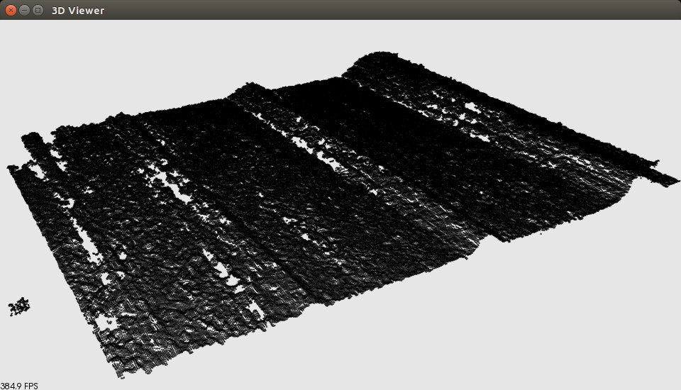

.. _ensenso_cameras:

==========================================
Grabbing point clouds from Ensenso cameras
==========================================

In this tutorial we will learn how to use the `IDS-Imaging <http://en.ids-imaging.com/>`_ Ensenso cameras within PCL. This tutorial will show you how to configure PCL
and how to use the examples to fetch point clouds from the `Ensenso <http://www.ensenso.de/>`_.

.. contents::

Install Ensenso drivers
=======================

The Ensenso drivers are free (as in beer) and available for download, for each of them follow the instructions provided:

  * `uEye <http://en.ids-imaging.com/download-ueye.html>`_
  * `Ensenso SDK <http://www.ensenso.de/download>`_

Plug-in the camera and test if the Ensenso is working, launch ``nxView`` in your terminal to check if you can actually use the camera.

Configuring PCL
===============

You need at least PCL 1.8.0 to be able to use the Ensenso cameras. You need to make sure ``WITH_ENSENSO`` is set to ``true`` in the CMake 
configuration (it should be set to true by default if you have followed the instructions before).

The default following values can be tweaked into cmake if you don't have a standard installation, for example:

.. code-block::

  ENSENSO_ABI_DIR     /opt/ensenso_test/development/c

You can deactivate building the Ensenso support by setting ``WITH_ENSENSO`` to false.
Compile and install PCL.

Using the example
=================

The `pcl_ensenso_viewer <https://github.com/PointCloudLibrary/pcl/blob/master/visualization/tools/ensenso_viewer.cpp>`_ example shows how to
display a point cloud grabbed from an Ensenso device using the `EnsensoGrabber <http://docs.pointclouds.org/trunk/classpcl_1_1_ensenso_grabber.html>`_ class.

Note that this program opens the TCP port of the nxLib tree, this allows you to open the nxLib tree with the nxTreeEdit program (port 24000).
The capture parameters (exposure, gain etc..) are set to default values.
If you have performed and stored an extrinsic calibration it will be temporary reset.

If you are using an Ensenso X device you have to calibrate the device before trying to run the PCL driver. If you don't you will get an error like this:

.. code-block:: cpp

  Initialising nxLib
  Opening Ensenso stereo camera id = 0
  openDevice: NxLib error ExecutionFailed (17) occurred while accessing item /Execute.

  {
          "ErrorSymbol": "InvalidCalibrationData",
          "ErrorText": "Stereo camera calibration data is corrupted or not supported yet by the current software version.",
          "Execute": {
                  "Command": "Open",
                  "Parameters": {
                          "AllowFirmwareUpload": null,
                          "Cameras": "171197",
                          "FirmwareUpload": {
                                  "Camera": null,
                                  "Projector": null
                          },
                          "LoadCalibration": null,
                          "Projector": null,
                          "Threads": null
                  }
          },
          "Time": 8902,
          "TimeExecute": 8901,
          "TimeFinalize": 0.03477,
          "TimePrepare": 0.01185
  }

.. code-block:: cpp

  ensenso_ptr->enumDevices ();
  ensenso_ptr->openTcpPort ();
  ensenso_ptr->openDevice ();
  ensenso_ptr->configureCapture ();
  ensenso_ptr->setExtrinsicCalibration ();

The code is very similar to the ``pcl_openni_viewer``.
All the Ensenso devices connected are listed and then the point cloud are fetched as fast as possible.

Here is an example of the terminal output ::
   
   $ pcl_ensenso_viewer 
   Initialising nxLib
   Number of connected cameras: 1
   Serial No    Model   Status
   140242   N10-1210-18   Available

   Opening Ensenso stereo camera id = 0
   FPS: 3.32594
   FPS: 3.367
   FPS: 3.79441
   FPS: 4.01204
   FPS: 4.07747
   FPS: 4.20309
   Closing Ensenso stereo camera

Another example is available in `PCL sources <https://github.com/PointCloudLibrary/pcl/blob/master/doc/tutorials/content/sources/ensenso_cameras/>`_, it uses OpenCV to display Ensenso
images and the PCLVisualizer to display the point cloud at the same time.

Extrinsic calibration
=====================

If you want to perform extrinsic calibration of the sensor, please first make sure your EnsensoSDK version is greater than 1.3.
A fully automated extrinsic calibration ROS package is available to help you calibrate the sensor mounted on a robot arm, 
the package can be found in the `Institut Maupertuis repository <https://gitlab.com/InstitutMaupertuis/ensenso_extrinsic_calibration>`_.

The following video shows the automatic calibration procedure on a Fanuc R1000iA 80f industrial robot:

.. raw:: html

  <iframe width="800" height="500" src="https://www.youtube.com/embed/2g6gdx8fKX8" frameborder="0" allowfullscreen></iframe>

