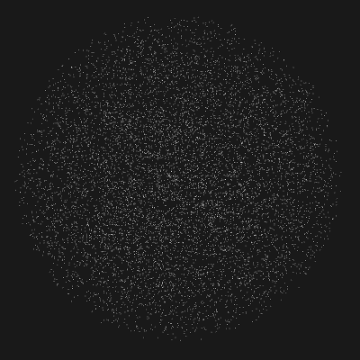
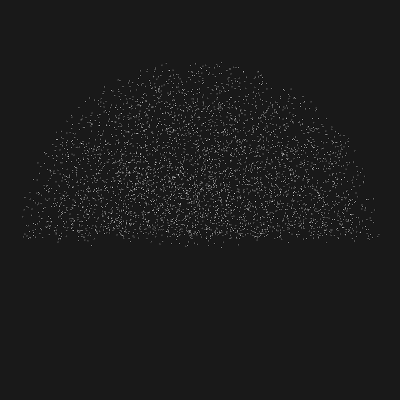

.. _executor:

Using Executors
--------------------------------------------------

Executors allows control over the where and how a piece of program executes
i.e. provides a standard way for a programmer to control exectuion.
This allows for fine control over the execution over different portions of a program
in a standard and universal manner.
In this tutorial we will learn how to manually create and pass executors to to a FunctorFilter.

.. note::
   Not all functions support executors. Check the Code API for more info on which
   functions are supported.

The code
--------

First, create a file, let's say, ``executor.cpp``, and place the following inside it:

.. literalinclude:: sources/executor/executor.cpp
   :language: cpp
   :linenos:

The explanation
---------------

Now, let's break down the code piece by piece.

In the following lines, we create a Point Cloud structure, then fill the
input cloud using `CloudGenerator`. The generator uses 128 as seed value to uniformly fill
the input cloud with a point cloud having width & height as 200. Each point is generated
with x,y & z co-ordinates in range [-20, 20].

.. literalinclude:: sources/executor/executor.cpp
   :language: cpp
   :lines: 8-12

Then, we create two executors. The first one `simple_executor` is of type `inline_executor`
which runs code sequentially on the CPU. The second one `parallel_executor` is of type
`omp_executor` which uses OMP to parallelize the execution. We set the max_threads that OMP
can utilize to 4. If unspecified explicitly by default all the threads available in the system
will be used.

.. literalinclude:: sources/executor/executor.cpp
   :language: cpp
   :lines: 14-17

We then create two FunctorFilter instances. The first filter `radius_filter` is used to filter out
any points which are at a distance greater than the specified `radius_filter` from the origin.
The second filter `positive_y_filter` filters out all points having negative y co-ordinates.

.. literalinclude:: sources/executor/executor.cpp
   :language: cpp
   :lines: 19-42

Finally, we call `filter` and with the respective executors. For `radius_filter` we pass the
`parallel_executor` which will create 4 OMP contexts and and spilt the filtering of points between them.
For `positive_y_filter` we pass the `simple_executor` which will simply filter the points in the existing
thread.

.. literalinclude:: sources/executor/executor.cpp
   :language: cpp
   :lines: 44-46

We can then  the final filtered cloud using `CloudViewer`.

.. literalinclude:: sources/executor/executor.cpp
   :language: cpp
   :lines: 48-53

Compiling and running the program
---------------------------------

Add the following lines to your CMakeLists.txt file:

.. literalinclude:: sources/executor/CMakeLists.txt
   :language: cmake
   :linenos:

After you have made the executable, you can run it. Simply do:

  $ ./executor

Below are the three visualizations of the point cloud at each phase.
The leftmost point cloud in the shape of a cube is the input cloud.
The center image shows a point cloud in the shape of a sphere. It is the
output after applying `radius_filter`.
The rightmost image shows a point cloud in the shape of a hemisphere. It is the
output after applying `positive_y_filter` to the point cloud output from `radius_filter`.

