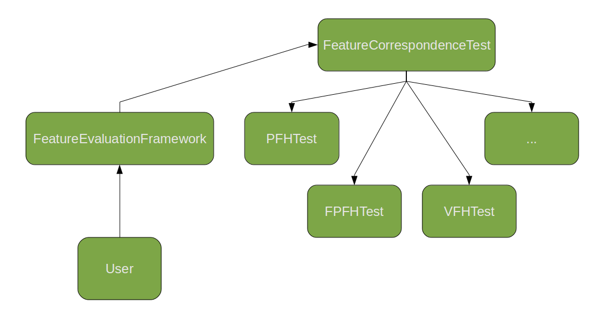

.. _feature_evaluation_framework:

Benchmarking Feature Descriptor Algorithms
------------------------------------------

In this tutorial, we will go over how to use the FeatureEvaluationFramework class to benchmark various feature descriptor algorithms.
The benchmarking framework allows the testing of different kinds of feature descriptor algorithms, over a choice of independent variables, 
ranging from input clouds, algorithm parameters, downsampling leaf size, and search threshold.  

To ensure extensibility of the framework, the functionality is divided into multiple classes as follows:

Using The FeatureCorrespondenceTest Class
-----------------------------------------

The FeatureCorrespondenceTest class performs a single "feature correspondence test" as follows:

   - The FeatureCorrespondenceTest class takes two input clouds (source and target). 
   - It will compute feature descriptors in each cloud using the specified algorithm and parameters. 
   - Each feature in the source cloud will be matched to its corresponding feature in the target cloud based on a nearest neighbor search in the n-D feature space. 
   - For each point, the system will compare the 3D position of the estimated corresponding target point to the previously established ground truth position. 
   - If the two points are close together (as determined by a user specified threshold), then the correspondence is marked as a success. Otherwise, it is marked a failure. 
   - The total number of successes and failures will be calculated and stored for further analysis.

The functions which perform common tasks are provided in the FeatureCorrespondenceTest class. Functions specific to the Feature Descriptor algorithm
(i.e. the actual computation of features) must be defined in a separate child class derived from FeatureCorrespondenceTest. For example, FPFHTest
is a child of FeatureCorrespondenceTest, and it implements functions for calculation of FPFH features on the input clouds (computeFeatures()) 
and for calculating correspondences between the clouds, in the n-D feature space (computeCorrespondences()).

As a result, we get a consistent interface to the FeatureCorrespondenceTest class which can be manipulated through the FeatureEvaluationFramework,
while at the same time providing means to add new feature algorithms to the testing framework whenever required.

Using The FeatureEvaluationFramework Class
------------------------------------------

The FeatureEvaluationFramework class encapsulates the actual benchmarking functionality. It has one template parameter, which should match the point_type 
of the point clouds to be given as input to the framework.

To initialize the FeatureEvaluationFramework object, the following set of functions should be called:

   - setFeatureTest : Choose the Feature Descriptor algorithm to be tested
   - setInputClouds : Load source and target clouds from .pcd files
   - setGroundTruth : Load the ground truth transformation as 4x4 matrix, from a file
   - setThreshold : Either a single threshold value, or a threshold range, specified by lower bound, upper bound, and delta
   - setParameters : Specific to the Feature Descriptor algorithm, to be given as a "key1=value1, key2=value2, ..." string
   - setDownsampling : Choose whether to filter input clouds through VoxelGrid filter
   - setLeafSize : Set Voxelgrid leaf size for downsampling input clouds
   - setLogfile : Set logfile to store output of the test in CSV format
   - setVerbose : Choose whether to show step by step progress of the benchmarking on the console

After this, we are ready to perform the test. There are two possibilities:

   - Single Test : Perform a single feature extraction and store the output statistics by calling runSingleTest().
   - Multiple Tests : Perform multiple tests with varying a single independent variable, and store the set of outputs in CSV format (in the logfile).
      The supported function calls are:
       
         - runMultipleFeatures() - Perform test with multiple feature descriptor algorithms
         - runMultipleClouds() - Run same feature evaluation on a (large) set of input clouds
         - runMultipleParameters() - Perform the feature evaluation with varying parameter values
         - runMultipleLeafSizes() - Vary the Voxelgrid leaf size for downsampling the input cloud before performing each evaluation
          
      The values for the independent variable are taken as input from a text file, which should be provided as an argument to this function.
      For example, runMultipleLeafSizes(std::string filename) will read values for the Voxelgrid leaf size from each line of "filename", and perform 
      a feature extraction for each leaf size, storing the set of results in the output logfile.

Supported Datasets And Groundtruth Format
-----------------------------------------

The input clouds (source and target) are read from .pcd files. The point type of the clouds should match the template parameter used in FeatureEvaluationFramework,
i.e. to use PointXYZRGB clouds, create an object of type FeatureEvaluationFramework<PointXYZRGB> to perform the evaluation.

The ground truth is a (Vector3f, Quaternionf) pair corresponding to the rigid transformation mapping the source and target clouds. 
Currently, the ground truth matrix is read from a file containing 7 values on one line, 
where first three values are taken as a Vector3f and next four are taken as a Quaternionf.

The `conference room dataset <http://people.willowgarage.com/mdixon/benchmarks/conference_room.tar.bz2>`_ contains 350 point clouds (cloud_###.pcd) and corresponding 7-D pose of the camera (pose_###.txt).
We will be using clouds from this dataset to perform the benchmarking, however the framework can easily incorporate other datasets in the future. 

Sample Evaluation: FPFHTest
---------------------------

Question: What radius of the FPFH feature is most effective on the conference room data set?

The following program runs the FPFHEstimation algorithm on given input cloud, and ground truth, for a given set of search radius values.

.. literalinclude:: sources/feature_evaluation/fpfh_radius.cpp
   :language: cpp
   :linenos:

Compiling And Executing The Code
--------------------------------

Add the following lines to your CMakeLists.txt file:

.. literalinclude:: sources/feature_evaluation/CMakeLists.txt
   :language: cmake
   :linenos:

To execute, first create a text file containing the set of parameters (here, search radius) values on which you want to run the test. Call it "radius-values.txt"::

   searchradius=0.05
   searchradius=0.07
   searchradius=0.1
   searchradius=0.15

Also, you need an input point cloud (say cloud_000.pcd from the conference room dataset) and a file containing the ground truth (say pose_000.txt).
Assuming they are present in the same directory as the executable, execute the following command (otherwise provide relative path to those files)::

   $ ./fpfh_radius cloud_000.pcd pose_000.txt radius-values.txt

As each feature extraction test progresses, you should see output similar to this on the console::

   Set input clouds
   Set ground truths
   Set threshold
   Perform downsampling
   Set parameters
   ----------Test Details:----------
   Feature Name:  FPFHTest
   Input Dataset: cloud_000.pcd
   Parameters:    searchradius=0.05
   Leaf size:     0.01 0.01 0.01 
   ---------------------------------
   
   Computing features
   FPFHTest: computing normals
   FPFHTest: computing source features
   FPFHTest: computing target features
   Time taken: 4.66
   Computing correspondences
   Computing results
   ----------Test Results:----------
   Source Size:   22420
   Target Size:   24800
   Time Taken For Feature Computations:
     Source:      1.93
     Target:      2.35
     Total:       4.66
   Threshold -> Successes
     0.1 -> 86
     0.2 -> 14276
     0.3 -> 16234
     0.4 -> 17692
     0.5 -> 18615
     0.6 -> 19189
     0.7 -> 19701
     0.8 -> 20116
     0.9 -> 21115
   ---------------------------------

Making Sense Of The Results
---------------------------

Opening the output logfile "fpfh-radius-variation.txt" you should see something like this::

   searchradius=0.05,1.95,2.39,4.72
   0.1,85
   0.2,14326
   0.3,16280
   0.4,17753
   0.5,18674
   0.6,19248
   0.7,19754
   0.8,20160
   0.9,21155
   
   searchradius=0.07,3.45,4.25,8.26
   0.1,76
   0.2,16883
   0.3,18256
   0.4,19338
   0.5,20033
   0.6,20474
   0.7,20829
   0.8,21148
   0.9,21661
   
   searchradius=0.1,6.42,8.03,15.36
   0.1,85
   0.2,18572
   0.3,19439
   0.4,20222
   0.5,20695
   0.6,20899
   0.7,21181
   0.8,21442
   0.9,21809
   
   searchradius=0.15,12.78,17.08,31.57
   0.1,69
   0.2,20264
   0.3,21077
   0.4,21563
   0.5,21741
   0.6,21786
   0.7,21836
   0.8,21912
   0.9,22228

Lets analyse what does this file mean.

Each block of data corresponds to a particular test run. The first line specifies the algorithm parameters, time taken for source feature computation, time taken for target feature computation, and total time taken for feature computation

Next we have a set of values, each of which is a (threshold, successes) pair. For each threshold value, the number of successes denote the number of points in the source cloud whose corresponding point in the target cloud lie at a distance less than that threshold from the ground truth position of that point, in 3D space.
The correspondences are calculated by doing nearest neighbour search between the source and target feature points in n-D feature space.

We would expect more successful correspondences, at lower threshold values, to be a measure of the quality of the feature extraction algorithm.
Here, at a particular threshold value of 0.2, as we increase the search radius, the successes are increasing monotonically, and so is the time taken for the feature computation.

Adding New Features To The Framework
------------------------------------

Adding new feature algorithms to the testing framework is very straightforward: one needs to derive a new child from the FeatureCorrespondenceTest base
class, and implement the following member functions:

   - setParameters (ParameterList params)
      Here ParameterList is a map<string, string> which contains (key,value) pairs of the different parameters passed to the algorithm. 
      This function should parse the provided ParameterList and store the relevant parameter values, to be used in feature computation.
   - computeFeatures (double& time_source, double& time_target)
      This function should perform the actual computation of source and target features, and the implementation details will vary according to the 
      algorithm in question. The arguments time_source, and time_target should be filled with the time taken for source and target feature computation
      respectively.
   - computeFeatures ()
      Same as above, except runtime statistics are not to be measured.
   - computeCorrespondences ()
      For each source point, compute its nearest neighbour from the target cloud, in the n-D feature space, and store the correspondences in 
      MapSourceToTargetIndices.
      
Please look at the FPFHTest implementation for reference (in /trunk/features/include/pcl/features/feature_evaluation)

