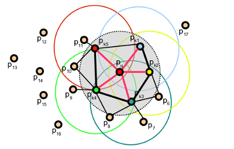
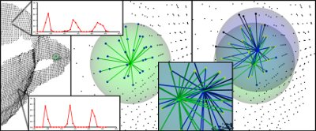

.. _fpfh_estimation:

Fast Point Feature Histograms (FPFH) descriptors
------------------------------------------------

The theoretical computational complexity of the Point Feature Histogram (see
:ref:`pfh_estimation`) for a given point cloud :math:`P` with :math:`n` points
is :math:`O(nk^2)`, where :math:`k` is the number of neighbors for each point
:math:`p` in :math:`P`. For real-time or near real-time applications, the
computation of Point Feature Histograms in dense point neighborhoods can
represent one of the major bottlenecks.

This tutorial describes a simplification of the PFH formulation, called Fast
Point Feature Histograms (FPFH) (see [RusuDissertation]_ for more information),
that reduces the computational complexity of the algorithm to :math:`O(nk)`,
while still retaining most of the discriminative power of the PFH.

Theoretical primer
------------------

To simplify the histogram feature computation, we proceed as follows:

  * in a first step, for each query point :math:`p_q` a set of tuples
    :math:`\alpha, \phi, \theta` between itself and its neighbors are computed
    as described in :ref:`pfh_Estimation` - this will be called the Simplified
    Point Feature Histogram (SPFH);

  * in a second step, for each point its k neighbors are re-determined, and the
    neighboring SPFH values are used to weight the final histogram of pq
    (called FPFH) as follows:

.. math::

   FPFH(\boldsymbol{p}_q) = SPFH(\boldsymbol{p}_q) + {1 \over k} \sum_{i=1}^k {{1 \over \omega_k} \cdot SPFH(\boldsymbol{p}_k)}

where the weight :math:`\omega_k` represents a distance between the query point
:math:`p_q` and a neighbor point :math:`p_k` in some given metric space, thus
scoring the (:math:`p_q, p_k`) pair, but could just as well be selected as a
different measure if necessary.  To understand the importance of this weighting
scheme, the figure below presents the influence region diagram for a
k-neighborhood set centered at :math:`p_q`.

Thus, for a given query point :math:`p_q`, the algorithm first estimates its
SPFH values by creating pairs between itself and its neighbors (illustrated
using red lines). This is repeated for all the points in the dataset, followed
by a re-weighting of the SPFH values of pq using the SPFH values of its
:math:`p_k` neighbors, thus creating the FPFH for :math:`p_q`. The extra FPFH
connections, resultant due to the additional weighting scheme, are shown with
black lines. As the diagram shows, some of the value pairs will be counted
twice (marked with thicker lines in the figure).

Differences between PFH and FPFH
--------------------------------

The main differences between the PFH and FPFH formulations are summarized below:

  1. the FPFH does not fully interconnect all neighbors of :math:`p_q` as it
     can be seen from the figure, and is thus missing some value pairs which
     might contribute to capture the geometry around the query point;

  2. the PFH models a precisely determined surface around the query point,
     while the FPFH includes additional point pairs outside the **r** radius
     sphere (though at most **2r** away);

  3. because of the re-weighting scheme, the FPFH combines SPFH values and
     recaptures some of the point neighboring value pairs;

  4. the overall complexity of FPFH is greatly reduced, thus making possible to
     use it in real-time applications;

  5. the resultant histogram is simplified by decorrelating the values, that is
     simply creating *d* separate feature histograms, one for each feature
     dimension, and concatenate them together (see figure below).

Estimating FPFH features
------------------------

Fast Point Feature Histograms are implemented in PCL as part of the
`pcl_features <http://docs.pointclouds.org/trunk/a02944.html>`_
library. 

The default FPFH implementation uses 11 binning subdivisions (e.g., each of the
four feature values will use this many bins from its value interval), and a
decorrelated scheme (see above: the feature histograms are computed separately
and concantenated) which results in a 33-byte array of float values. These are
stored in a **pcl::FPFHSignature33** point type.

The following code snippet will estimate a set of FPFH features for all the
points in the input dataset.

.. code-block:: cpp
   :linenos:

   #include <pcl/point_types.h>
   #include <pcl/features/fpfh.h>

   {
     pcl::PointCloud<pcl::PointXYZ>::Ptr cloud (new pcl::PointCloud<pcl::PointXYZ>);
     pcl::PointCloud<pcl::Normal>::Ptr normals (new pcl::PointCloud<pcl::Normal> ());
     
     ... read, pass in or create a point cloud with normals ...
     ... (note: you can create a single PointCloud<PointNormal> if you want) ...

     // Create the FPFH estimation class, and pass the input dataset+normals to it
     pcl::FPFHEstimation<pcl::PointXYZ, pcl::Normal, pcl::FPFHSignature33> fpfh;
     fpfh.setInputCloud (cloud);
     fpfh.setInputNormals (normals);
     // alternatively, if cloud is of tpe PointNormal, do fpfh.setInputNormals (cloud);

     // Create an empty kdtree representation, and pass it to the FPFH estimation object. 
     // Its content will be filled inside the object, based on the given input dataset (as no other search surface is given).
     pcl::search::KdTree<PointXYZ>::Ptr tree (new pcl::search::KdTree<PointXYZ>);

     fpfh.setSearchMethod (tree);

     // Output datasets
     pcl::PointCloud<pcl::FPFHSignature33>::Ptr fpfhs (new pcl::PointCloud<pcl::FPFHSignature33> ());

     // Use all neighbors in a sphere of radius 5cm
     // IMPORTANT: the radius used here has to be larger than the radius used to estimate the surface normals!!!
     fpfh.setRadiusSearch (0.05);

     // Compute the features
     fpfh.compute (*fpfhs);

     // fpfhs->points.size () should have the same size as the input cloud->points.size ()*
   }

The actual **compute** call from the **FPFHEstimation** class does nothing internally but::

 for each point p in cloud P

   1. pass 1:
      
      1. get the nearest neighbors of :math:`p`

      2. for each pair of :math:`p, p_k` (where :math:`p_k` is a neighbor of :math:`p`, compute the three angular values

      3. bin all the results in an output SPFH histogram

   2. pass 2:
      
      1. get the nearest neighbors of :math:`p`

      3. use each SPFH of :math:`p` with a weighting scheme to assemble the FPFH of :math:`p`:

.. note::
  
  For efficiency reasons, the **compute** method in **FPFHEstimation** does not check if the normals contains NaN or infinite values.
  Passing such values to **compute()** will result in undefined output.
  It is advisable to check the normals, at least during the design of the processing chain or when setting the parameters.
  This can be done by inserting the following code before the call to **compute()**:

  .. code-block:: cpp

     for (int i = 0; i < normals->points.size(); i++)
     {
       if (!pcl::isFinite<pcl::Normal>(normals->points[i]))
       {
         PCL_WARN("normals[%d] is not finite\n", i);
       }
     }

  In production code, preprocessing steps and parameters should be set so that normals are finite or raise an error.

Speeding FPFH with OpenMP
-------------------------

For the speed-savvy users, PCL provides an additional implementation of FPFH
estimation which uses multi-core/multi-threaded paradigms using OpenMP to speed
the computation. The name of the class is **pcl::FPFHEstimationOMP**, and its
API is 100% compatible to the single-threaded **pcl::FPFHEstimation**, which
makes it suitable as a drop-in replacement. On a system with 8 cores, you
should get anything between 6-8 times faster computation times.

