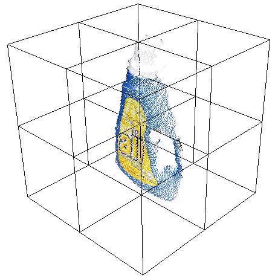
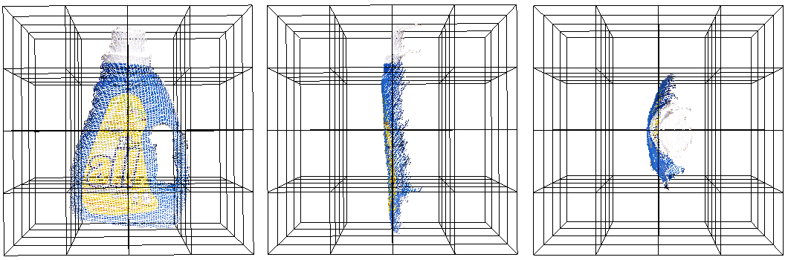

.. _gasd_estimation:

Globally Aligned Spatial Distribution (GASD) descriptors
--------------------------------------------------------

This document describes the Globally Aligned Spatial Distribution ([GASD]_) global descriptor to be used for efficient object recognition and pose estimation.

GASD is based on the estimation of a reference frame for the whole point cloud that represents an object instance, which is used for aligning it with the canonical coordinate system. After that, a descriptor is computed for the aligned point cloud based on how its 3D points are spatially distributed. Such descriptor may also be extended with color distribution throughout the aligned point cloud. The global alignment transforms of matched point clouds are used for computing object pose. For more information please see [GASD]_.

Theoretical primer
------------------

The Globally Aligned Spatial Distribution (or GASD) global description method takes as input a 3D point cloud that represents a partial view of a given object. The first step consists in estimating a reference frame for the point cloud, which allows the computation of a transform that aligns it to the canonical coordinate system, making the descriptor pose invariant. After alignment, a shape descriptor is computed for the point cloud based on the spatial distribution of the 3D points. Color distribution along the point cloud can also be taken into account for obtaining a shape and color descriptor with a higher discriminative power. Object recognition is then performed by matching query and train descriptors of partial views. The pose of each recognized object is also computed from the alignment transforms of matched query and train partial views.

The reference frame is estimated using a Principal Component Analysis (PCA) approach. Given a set of 3D points :math:`\boldsymbol{P_i}` that represents a partial view of an object, with :math:`i\in\{1, ..., n\}`, the first step consists in computing their centroid :math:`\boldsymbol{\overline{P}}`, which is the origin of the reference frame. Then a covariance matrix :math:`\boldsymbol{C}` is computed from :math:`\boldsymbol{P_i}` and :math:`\boldsymbol{\overline{P}}` as follows:

.. math::

 \boldsymbol{C}=\frac{1}{n}\sum_{i=1}^{n}(\boldsymbol{P_i}-\boldsymbol{\overline{P}})(\boldsymbol{P_i}-\boldsymbol{\overline{P}})^T.

After that, the eigenvalues :math:`\lambda_j` and corresponding eigenvectors :math:`\boldsymbol{v_j}` of :math:`\boldsymbol{C}` are obtained, with :math:`j\in\{1, 2, 3\}`, such that :math:`\boldsymbol{C}\boldsymbol{v_j}=\lambda_j\boldsymbol{v_j}`. Considering that the eigenvalues are arranged in ascending order, the eigenvector :math:`\boldsymbol{v_1}` associated with the minimal eigenvalue is used as the :math:`z` axis of the reference frame. If the angle between :math:`\boldsymbol{v_1}` and the viewing direction is in the :math:`[-90^{\circ}, 90^{\circ}]` range, then :math:`\boldsymbol{v_1}` is negated. This ensures that the :math:`z` axis always points towards the viewer. The :math:`x` axis of the reference frame is the eigenvector :math:`\boldsymbol{v_3}` associated with the maximal eigenvalue. The :math:`y` axis is given by :math:`\boldsymbol{v_2}=\boldsymbol{v_1}\times\boldsymbol{v_3}`.

From the reference frame, it is possible to compute a transform :math:`[\boldsymbol{R} | \boldsymbol{t}]` that aligns it with the canonical coordinate system. All the points :math:`\boldsymbol{P_i}` of the partial view are then transformed with :math:`[\boldsymbol{R} | \boldsymbol{t}]`, which is defined as follows:

.. math::

 \begin{bmatrix}
 \boldsymbol{R} & \boldsymbol{t} \\
 \boldsymbol{0} & 1
 \end{bmatrix}=
 \begin{bmatrix}
 \boldsymbol{v_3}^T & -\boldsymbol{v_3}^T\boldsymbol{\overline{P}} \\
 \boldsymbol{v_2}^T & -\boldsymbol{v_2}^T\boldsymbol{\overline{P}} \\
 \boldsymbol{v_1}^T & -\boldsymbol{v_1}^T\boldsymbol{\overline{P}} \\
 \boldsymbol{0} & 1
 \end{bmatrix}.

Once the point cloud is aligned using the reference frame, a pose invariant global shape descriptor can be computed from it. The point cloud axis-aligned bounding cube centered on the origin is divided into an :math:`m_s \times m_s \times m_s` regular grid. For each grid cell, a histogram with :math:`l_s` bins is computed. If :math:`l_s=1`, then each histogram bin will store the number of points that belong to its correspondent cell in the 3D regular grid. If :math:`l_s>1`, then for each cell it will be computed a histogram of normalized distances between each sample and the cloud centroid.

The contribution of each sample to the histogram is normalized with respect to the total number of points in the cloud. Optionally, interpolation may be used to distribute the value of each sample into adjacent cells, in an attempt to avoid boundary effects that may cause abrupt changes to the histogram when a sample shifts from being within one cell to another. The descriptor is then obtained by concatenating the computed histograms.

Color information can also be incorporated to the descriptor in order to increase its discriminative power. The color component of the descriptor is computed with an :math:`m_c \times m_c \times m_c` grid similar to the one used for the shape component, but a color histogram is generated for each cell based on the colors of the points that belong to it. Point cloud color is represented in the HSV space and the hue values are accumulated in histograms with :math:`l_c` bins. Similarly to shape component computation, normalization with respect to number of points is performed. Additionally, interpolation of histograms samples may also be performed. The shape and color components are concatenated, resulting in the final descriptor.

Query and train descriptors are matched using a nearest neighbor search approach. After that, for each matched object instance, a coarse pose is computed using the alignment transforms obtained from the reference frames of the respective query and train partial views. Given the transforms :math:`[\mathbf{R_{q}} | \mathbf{t_{q}}]` and :math:`[\mathbf{R_{t}} | \mathbf{t_{t}}]` that align the query and train partial views, respectively, the object coarse pose :math:`[\mathbf{R_{c}} | \mathbf{t_{c}}]` is obtained by

.. math::

 \begin{bmatrix}
 \mathbf{R_{c}} & \mathbf{t_{c}} \\
 \mathbf{0} & 1
 \end{bmatrix}=
 {\begin{bmatrix}
 \mathbf{R_{q}} & \mathbf{t_{q}} \\
 \mathbf{0} & 1
 \end{bmatrix}}^{-1}
 \begin{bmatrix}
 \mathbf{R_{t}} & \mathbf{t_{t}} \\
 \mathbf{0} & 1
 \end{bmatrix}.

The coarse pose :math:`[\mathbf{R_{c}} | \mathbf{t_{c}}]` can then be refined using the Iterative Closest Point (ICP) algorithm.

Estimating GASD features
------------------------

The Globally Aligned Spatial Distribution is implemented in PCL as part of the
`pcl_features <http://docs.pointclouds.org/trunk/group__features.html>`_
library.

The default values for color GASD parameters are: :math:`m_s=6` (half size of 3), :math:`l_s=1`, :math:`m_c=4` (half size of 2) and :math:`l_c=12` and no histogram interpolation (INTERP_NONE). This results in an array of 984 float values. These are stored in a **pcl::GASDSignature984** point type. The default values for shape only GASD parameters are: :math:`m_s=8` (half size of 4), :math:`l_s=1` and trilinear histogram interpolation (INTERP_TRILINEAR). This results in an array of 512 float values, which may be stored in a **pcl::GASDSignature512** point type. It is also possible to use quadrilinear histogram interpolation (INTERP_QUADRILINEAR).

The following code snippet will estimate a GASD shape + color descriptor for an input colored point cloud.

.. code-block:: cpp
   :linenos:

   #include <pcl/point_types.h>
   #include <pcl/features/gasd.h>

   {
     pcl::PointCloud<pcl::PointXYZRGBA>::Ptr cloud (new pcl::PointCloud<pcl::PointXYZRGBA>);

     ... read, pass in or create a point cloud ...

     // Create the GASD estimation class, and pass the input dataset to it
     pcl::GASDColorEstimation<pcl::PointXYZRGBA, pcl::GASDSignature984> gasd;
     gasd.setInputCloud (cloud);

     // Output datasets
     pcl::PointCloud<pcl::GASDSignature984> descriptor;

     // Compute the descriptor
     gasd.compute (descriptor);

     // Get the alignment transform
     Eigen::Matrix4f trans = gasd.getTransform (trans);

     // Unpack histogram bins
     for (std::size_t i = 0; i < std::size_t( descriptor[0].descriptorSize ()); ++i)
     {
       descriptor[0].histogram[i];
     }
   }

The following code snippet will estimate a GASD shape only descriptor for an input point cloud.

.. code-block:: cpp
   :linenos:

   #include <pcl/point_types.h>
   #include <pcl/features/gasd.h>

   {
     pcl::PointCloud<pcl::PointXYZ>::Ptr cloud (new pcl::PointCloud<pcl::PointXYZ>);

     ... read, pass in or create a point cloud ...

     // Create the GASD estimation class, and pass the input dataset to it
     pcl::GASDEstimation<pcl::PointXYZ, pcl::GASDSignature512> gasd;
     gasd.setInputCloud (cloud);

     // Output datasets
     pcl::PointCloud<pcl::GASDSignature512> descriptor;

     // Compute the descriptor
     gasd.compute (descriptor);

     // Get the alignment transform
     Eigen::Matrix4f trans = gasd.getTransform (trans);

     // Unpack histogram bins
     for (std::size_t i = 0; i < std::size_t( descriptor[0].descriptorSize ()); ++i)
     {
       descriptor[0].histogram[i];
     }
   }

.. [GASD] http://www.cin.ufpe.br/~jpsml/uploads/8/2/6/7/82675770/pid4349755.pdf
.. note::
    @InProceedings{Lima16SIBGRAPI,
    author = {Joao Paulo Lima and Veronica Teichrieb},
    title = {An Efficient Global Point Cloud Descriptor for Object Recognition and Pose Estimation},
    booktitle = {Proceedings of the 29th SIBGRAPI - Conference on Graphics, Patterns and Images},
    year = {2016},
    address = {Sao Jose dos Campos, Brazil},
    month = {October}
    }

