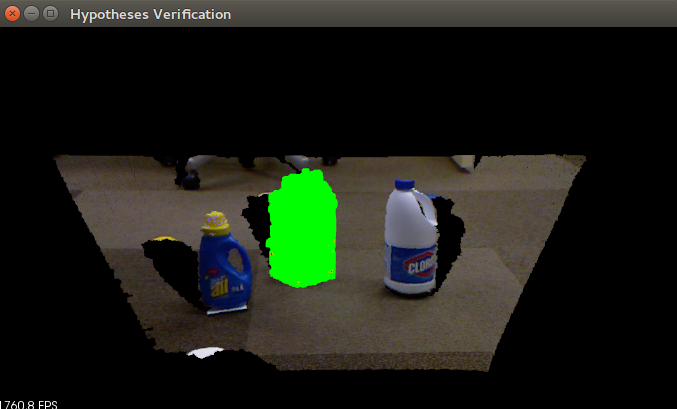
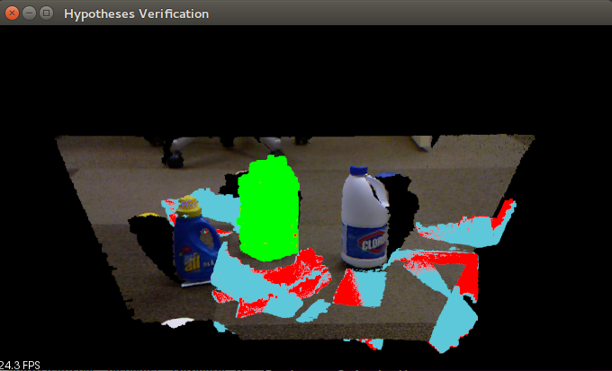

.. _global_hypothesis_verification:

Tutorial: Hypothesis Verification for 3D Object Recognition
-----------------------------------------------------------

This tutorial aims at explaining how to do 3D object recognition in clutter by verifying model hypotheses
in cluttered and heavily occluded 3D scenes. After descriptor matching, the tutorial runs one of the 
Correspondence Grouping algorithms available in PCL in order to cluster the set of point-to-point 
correspondences, determining instances of object hypotheses in the scene. On these hypotheses, 
the Global Hypothesis Verification algorithm is applied in order to
decrease the amount of false positives.

Suggested readings and prerequisites 
------------------------------------

This tutorial is the follow-up of a previous tutorial on object recognition: :ref:`correspondence_grouping` 
To understand this tutorial, we suggest first to read and understand that tutorial.

More details on the Global Hypothesis Verification method can be found here: 
A. Aldoma, F. Tombari, L. Di Stefano, M. Vincze, `A global hypothesis verification method for 3D object recognition`, ECCV 2012

For more information on 3D Object Recognition in Clutter and on the standard feature-based recognition pipeline, we suggest this tutorial paper: 
A. Aldoma, Z.C. Marton, F. Tombari, W. Wohlkinger, C. Potthast, B. Zeisl, R.B. Rusu, S. Gedikli, M. Vincze, "Point Cloud Library: Three-Dimensional Object Recognition and 6 DOF Pose Estimation", IEEE Robotics and Automation Magazine, 2012

The Code
--------

Before starting, you should download from the GitHub folder: `Correspondence Grouping <https://github.com/PointCloudLibrary/data/tree/master/tutorials/correspondence_grouping>`_ the example PCD clouds 
used in this tutorial (milk.pcd and milk_cartoon_all_small_clorox.pcd), and place the files in the source older.

Then copy and paste the following code into your editor and save it as ``global_hypothesis_verification.cpp``.

.. literalinclude:: sources/global_hypothesis_verification/global_hypothesis_verification.cpp
   :language: c++
   :linenos:

Walkthrough
-----------

Take a look at the various parts of the code to see how it works.

Input Parameters
****************

.. literalinclude:: sources/global_hypothesis_verification/global_hypothesis_verification.cpp
   :language: c++
   :lines: 107-112

.. literalinclude:: sources/global_hypothesis_verification/global_hypothesis_verification.cpp
   :language: c++
   :lines: 142-149

``showHelp`` function prints out the input parameters accepted by the program. ``parseCommandLine`` binds the user input with program parameters.

The only two mandatory parameters are ``model_filename`` and ``scene_filename`` (all other parameters are initialized with a default value). 
Other usefuls commands are:

* ``--algorithm (Hough|GC)`` used to switch clustering algorithm. See :ref:`correspondence_grouping`. 
* ``-k`` shows the keypoints used to compute the correspondences

Hypotheses Verification parameters are:

* ``--hv_clutter_reg val:        Clutter Regularizer (default 5.0)``
* ``--hv_inlier_th val:          Inlier threshold (default 0.005)``
* ``--hv_occlusion_th val:       Occlusion threshold (default 0.01)``
* ``--hv_rad_clutter val:        Clutter radius (default 0.03)``
* ``--hv_regularizer val:        Regularizer value (default 3.0)``
* ``--hv_rad_normals val:        Normals radius (default 0.05)``
* ``--hv_detect_clutter val:     TRUE if clutter detect enabled (default true)``

More details on the Global Hypothesis Verification parameters can be found here: 
A. Aldoma, F. Tombari, L. Di Stefano, M. Vincze, `A global hypothesis verification method for 3D object recognition`, ECCV 2012.

Helpers
*******

.. literalinclude:: sources/global_hypothesis_verification/global_hypothesis_verification.cpp
   :language: c++
   :lines: 60-83

This simple struct is used to create `Color` presets for the clouds being visualized. 

Clustering
**********

The code below implements a full Clustering Pipeline: the input of the pipeline is a pair of point clouds (the ``model`` and the ``scene``), and the output is

::

    std::vector<Eigen::Matrix4f, Eigen::aligned_allocator<Eigen::Matrix4f> > rototranslations;

``rototraslations`` represents a list of `coarsely` transformed models ("object hypotheses") in the scene.

Take a look at the full pipeline:

.. literalinclude:: sources/global_hypothesis_verification/global_hypothesis_verification.cpp
   :language: c++
   :lines: 245-374
   :emphasize-lines: 6,9

For a full explanation of the above code see `3D Object Recognition based on Correspondence Grouping <http://pointclouds.org/documentation/tutorials/correspondence_grouping.php>`_.

Model-in-Scene Projection
*************************

To improve the `coarse` transformation associated to each object hypothesis, we apply some ICP iterations. 
We create a ``instances`` list to store the "coarse" transformations :

.. literalinclude:: sources/global_hypothesis_verification/global_hypothesis_verification.cpp
   :language: c++
   :lines: 387-397

then, we run ICP on the ``instances`` wrt. the ``scene`` to obtain the ``registered_instances``: 

.. literalinclude:: sources/global_hypothesis_verification/global_hypothesis_verification.cpp
   :language: c++
   :lines: 399-429

Hypotheses Verification
***********************

.. literalinclude:: sources/global_hypothesis_verification/global_hypothesis_verification.cpp
   :language: c++
   :lines: 431-465

``GlobalHypothesesVerification`` takes as input a list of ``registered_instances`` and a ``scene`` so we can ``verify()`` them
to get a ``hypotheses_mask``: this is a `bool` array where ``hypotheses_mask[i]`` is ``TRUE`` if ``registered_instances[i]`` is a
verified hypothesis, ``FALSE`` if it has been classified as a False Positive (hence, must be rejected). 

Visualization
*************

The first part of the Visualization code section is pretty simple, with ``-k`` options the program displays `goog keypoints` in model and in scene
with a ``styleViolet`` color.

Later we iterate on ``instances``, and each ``instances[i]`` will be displayed in `Viewer` with a ``styleRed`` color. 
Each ``registered_instances[i]`` will be displayed with two optional colors: ``styleGreen`` if the current instance is verified (``hypotheses_mask[i]`` is ``TRUE``),  ``styleCyan`` otherwise.

.. literalinclude:: sources/global_hypothesis_verification/global_hypothesis_verification.cpp
   :language: c++
   :lines: 467-524

Compiling and running the program
---------------------------------

Create a ``CMakeLists.txt`` file and add the following lines into it:

.. literalinclude:: sources/global_hypothesis_verification/CMakeLists.txt
   :language: cmake
   :linenos:

After you have created the executable, you can then launch it following this example:

>>> ./global_hypothesis_verification milk.pcd milk_cartoon_all_small_clorox.pcd

.. figure:: images/global_hypothesis_verification/original.png
   :alt: Original Scene Image
   
Original Scene Image

   
   Valid Hypothesis (Green) with simple parameters

You can simulate more false positives by using a larger bin size parameter for the Hough Voting Correspondence Grouping algorithm:

>>> ./global_hypothesis_verification milk.pcd milk_cartoon_all_small_clorox.pcd --cg_size 0.035

   
   Valid Hypothesis (Green) among 9 false positives

