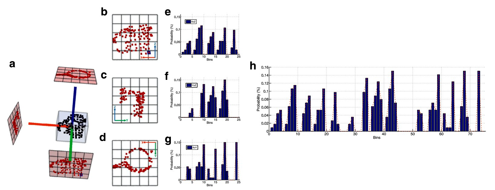

:ref:`features_tutorial`

.. _good_estimation:

GOOD: A Global Orthographic Object Descriptor for 3D Object Recognition and Manipulation
-------------------------------------------------------------------------------------------

The Global Orthographic Object Descriptor (**GOOD**) has been designed to be robust, descriptive and efficient to compute and use. GOOD descriptor has two outstanding characteristics:
  
  (1) Providing a good trade-off among:

      * **descriptiveness**,
      * **robustness**,
      * **computation time**,
      * **memory usage**.

  (2) Allowing concurrent object recognition and pose estimation for manipulation.

The performance of the proposed object descriptor is compared with the main state-of-the-art descriptors. Experimental results show that the overall classification performance obtained with GOOD is comparable to the best performances obtained with the state-of-the-art descriptors. Concerning memory and computation time, GOOD clearly outperforms the other descriptors (For more details please have a look at `our_paper
<http://www.sciencedirect.com/science/article/pii/S0167865516301684>`_ ). Therefore, GOOD is especially suited for real-time applications. The current implementation of GOOD descriptor supports several functionalities for **3D Object Recognition** and **Object Manipulation**.

To show all the functionalities and properties of the GOOD descriptor, a demonstration in real time was performed.
A video of this demonstration is available at: https://youtu.be/iEq9TAaY9u8

.. raw:: html

   <iframe title="GOOD descriptor" width="480" height="390" src="https://youtu.be/iEq9TAaY9u8" frameborder="0" allowfullscreen></iframe>

Theoretical Primer
--------------------------
Object representation is one of the most challenging tasks in robotics because it must provide reliable information in real-time to enable the robot to physically interact with the objects in its environment. To ensure robustness, a global object descriptor must be computed based on a unique and repeatable object reference frame. Moreover, the descriptor should contain enough information enabling to recognize the same or similar objects seen from different perspectives. 

This work presents a new object descriptor named Global Orthographic Object Descriptor (**GOOD**) designed to be robust, descriptive and efficient to compute and use. It consists of the following steps:

 * We propose a novel sign disambiguation method, for computing a unique reference frame from the eigenvectors obtained through Principal Component Analysis of the point cloud of the target object view captured by a 3D sensor. 

 * Three principal orthographic projections and their distribution matrices are computed by exploiting the object reference frame. 

 * The descriptor is finally obtained by concatenating the distribution matrices in a sequence determined by entropy and variance features of the projections. 

The following figure illustrates an example of the producing a GOOD shape description for a mug object:

**An illustrative example of the producing a GOOD shape description for a mug object (number of bin = 5):** (**a**) The mug object and its bounding box, reference frame, and three projected views; the object's points are then projected onto three planes; therefore, XoZ (**b**), YoZ (**c**) and XoY projections (**d**) are created. Each plane is partitioned
into bins and the number of points falling into each bin is counted. Accordingly, three distribution matrices are obtained for the projections; afterward, each distribution matrix is converted to a distribution vector, (i.e. (**e**), (**f**) and (**g**)) and two statistic features including entropy and variance are then calculated for each distribution vector;
(**h**) the distribution vectors are consequently concatenated together using the statistics features, to form a single description for the given object. The ordering of the three distribution vectors is first by decreasing values of entropy. Afterward, the second and third vectors are sorted again by increasing values of variance.

Estimating GOOD features
--------------------------
The GOOD descriptor is implemented in PCL as part of the `pcl_features
<http://docs.pointclouds.org/trunk/group__features.html>`_ library. 
This tutorial exemplifies how to use the GOOD description. First of all, you will need a point cloud in PCD or PLY format. For your convenience, we have provided a sample point cloud in both PCD format in the following path "**../pcl/test/milk.pcd**"

The code
--------

It should be noted that the corresponding code is provided as an example in the PCL repository (i.e. ../pcl/examples/features/example_good_descriptor.cpp) and will be compiled if examples are enabled during compilation.

.. code-block:: cpp
   :linenos:
      #include <pcl/features/good.h>
      #include <pcl/io/auto_io.h>

      typedef pcl::PointXYZRGBA PointT;  
      typedef pcl::PointCloud<PointT>::Ptr PointCloudInPtr;

      int main (int argc, char* argv[])
      {  
        if (argc != 2) 
        {
          std::cerr << "\n Syntax is: example_good_descriptor <path/file_name.pcd>" << std::endl;
          return 0;
        }

        std::string object_path = argv[1];  
        pcl::PointCloud<PointT>::Ptr object (new pcl::PointCloud<PointT>);
        if (pcl::io::load (object_path, *object) == -1)  
        {
          std::cerr << "\n Failed to parse the file provided. Syntax is: example_good_descriptor <path/file_name.pcd>  or example_good_descriptor <path/file_name.ply>" << std::endl;
          return -1;
        }

        /*____________________________
        |                             |
        |  Setup the GOOD descriptor  |
        |_____________________________| */   

        const int NUMBER_OF_BINS = 15;     
        typedef pcl::GOODEstimation<PointT, NUMBER_OF_BINS>::Descriptor Descriptor;
        pcl::PointCloud<Descriptor> object_description;   
        pcl::GOODEstimation<PointT, NUMBER_OF_BINS> test_GOOD_descriptor;   
        test_GOOD_descriptor.setThreshold (0.0015);  

        ///NOTE: GOOD descriptor can be setup in a line: pcl::GOODEstimation<PointT, NUMBER_OF_BINS> test_GOOD_descriptor (0.0015); 
        test_GOOD_descriptor.setInputCloud (object); // pass original point cloud
        test_GOOD_descriptor.compute (object_description); // Actually compute the GOOD discriptor for the given object

        ///Printing GOOD_descriptor for the given point cloud, 
        ///NOTE: the descriptor is only the first point.
        std::cout << "\n GOOD = " << object_description.points[0] << std::endl; 

        /*__________________________________________________
        |                                                   |
        |  Usefull Functionalities for Object Manipulation  |
        |___________________________________________________| */   
        
        ///NOTE: The following functionalities of the GOOD descriptor are useful for manipulation tasks:
        
        /// Get objec point cloud in local reference frame
        PointCloudInPtr transformed_object = test_GOOD_descriptor.getTransformedObject ();

        /// Get three orthographic projects and transformation matrix 
        std::vector<PointCloudInPtr> vector_of_projected_views = test_GOOD_descriptor.getOrthographicProjections ();  
        Eigen::Matrix4f transformation = test_GOOD_descriptor.getTransformationMatrix ();
        std::cout << "\n transofrmation matrix = \n" << transformation << std::endl;  
        
        /// Get object bounding box information 
        pcl::PointXYZ center_of_bounding_box = test_GOOD_descriptor.getCenterOfObjectBoundingBox (); 
        Eigen::Vector3f bounding_box_dimensions = test_GOOD_descriptor.getObjectBoundingBoxDimensions ();
        std::cout<<"\n center_of_bounding_box = " << center_of_bounding_box << std::endl;
        std::cout<<"\n bounding_box_dimensions = " << bounding_box_dimensions << std::endl;
        
        /// Get the order of projection views programatically
        const char *plane_name = test_GOOD_descriptor.getNameOfNthProjectedPlane (0); // input param can be {0, 1, 2}
        std::cout << "\n the first projection view is " << plane_name << std::endl;

        return 0;
      }

The explanation
---------------
Now let's study out what is the purpose of this code.

The following lines are simply checking and loading the cloud from the .pcd or .ply file.

.. code-block:: cpp
   :linenos:     
     if (argc != 2) 
     {
       std::cerr << "\n Syntax is: example_good_descriptor <path/file_name.pcd>" << std::endl;
       return 0;
     }

     std::string object_path = argv[1];  
     pcl::PointCloud<PointT>::Ptr object (new pcl::PointCloud<PointT>);
     if (pcl::io::load (object_path, *object) == -1)  
     {
       std::cerr << "\n Failed to parse the file provided. Syntax is: example_good_descriptor <path/file_name.pcd>  or example_good_descriptor <path/file_name.ply>" << std::endl;
       return -1;
     }
     if (argc != 2) 
     {
       std::cerr << "\n Syntax is: example_good_descriptor <path/file_name.pcd>" << std::endl;
       return 0;
     }
     
     std::string object_path = argv[1];  
     pcl::PointCloud<PointT>::Ptr object (new pcl::PointCloud<PointT>);
     if (pcl::io::load (object_path, *object) == -1)  
     {
       std::cerr << "\n Failed to parse the file provided. Syntax is: example_good_descriptor <path/file_name.pcd>  or example_good_descriptor <path/file_name.ply>" << std::endl;
       return -1;
     }

The following code will set up the GOOD descriptor; GOOD descriptor has two important parameters including:
 
 * **NUMBER_OF_BINS:** each projection plane is divided into NUMBER_OF_BINS * NUMBER_OF_BINS square bins. Therefore the size of GOOD descriptor will be 3 * NUMBER_OF_BINS * NUMBER_OF_BINS.
 * **Threshold:** this parameter is used in constructing local reference frame, especially in the sign disambiguation procedure. 

.. code-block:: cpp
   :linenos:
      const int NUMBER_OF_BINS = 15;     
      typedef pcl::GOODEstimation<PointT, NUMBER_OF_BINS>::Descriptor Descriptor;
      pcl::PointCloud<Descriptor> object_description;   
      pcl::GOODEstimation<PointT, NUMBER_OF_BINS> test_GOOD_descriptor;   
      test_GOOD_descriptor.setThreshold (0.0015);  

Alternatively, the GOOD descriptor can be set up in a line: 

.. code-block:: cpp
   :linenos:
      pcl::GOODEstimation<PointT, NUMBER_OF_BINS> test_GOOD_descriptor (0.0015); 

Finally, we pass the input point cloud and compute the GOOD descriptor for the given point cloud.

.. code-block:: cpp
   :linenos:	  
      test_GOOD_descriptor.setInputCloud(object); 
      test_GOOD_descriptor.compute(object_description); 
   
GOOD also provides a set of functionalities that are useful for manipulation tasks. They are including:
 
 * Get objec point cloud in local reference frame
 * Get three orthographic projects and transformation matrix
 * Get the order of the three projected planes

To get more information about how to use the GOOD descriptor for manipulation purposes, please have a look at `our_paper <https://www.springerprofessional.de/en/object-learning-and-grasping-capabilities-for-robotic-home-assis/15180960>`_ 

.. code-block:: cpp
   :linenos:
      /// Get objec point cloud in local reference frame
      PointCloudInPtr transformed_object = test_GOOD_descriptor.getTransformedObject ();

      /// Get three orthographic projects and transformation matrix 
      std::vector<PointCloudInPtr> vector_of_projected_views = test_GOOD_descriptor.getOrthographicProjections ();  
      Eigen::Matrix4f transformation = test_GOOD_descriptor.getTransformationMatrix ();
      std::cout << "\n transofrmation matrix = \n" << transformation << std::endl;  
        
      /// Get object bounding box information 
      pcl::PointXYZ center_of_bounding_box = test_GOOD_descriptor.getCenterOfObjectBoundingBox (); 
      Eigen::Vector3f bounding_box_dimensions = test_GOOD_descriptor.getObjectBoundingBoxDimensions ();
      std::cout<<"\n center_of_bounding_box = " << center_of_bounding_box << std::endl;
      std::cout<<"\n bounding_box_dimensions = " << bounding_box_dimensions << std::endl;
        
      /// Get the order of projection views programatically
      const char *plane_name = test_GOOD_descriptor.getNameOfNthProjectedPlane (0);
      std::cout << "\n the first plane is " << plane_name << std::endl;
  
Output and Visualization
---------------------------------
We are almost at the end of this tutorial.
The syntax for running the sample code is :

.. code-block:: bash
     ./pcl/build/bin/pcl_example_good_descriptor ../test/milk.pcd

CITING
-------

The GOOD descriptor has been presented in the following papers. Please adequately refer to the papers any time this code is being used. If you do publish a paper where GOOD descriptor helped your research, we encourage you to cite the following papers in your publications.

.. code-block:: bash

      @article{GOODPRL,
            title = "GOOD: A global orthographic object descriptor for 3D object recognition and manipulation",
            journal = "Pattern Recognition Letters",
            volume = "83",
            pages = "312 - 320",
            year = "2016",
            note = "Efficient Shape Representation, Matching, Ranking, and its Applications",
            issn = "0167-8655",
            doi = "http://dx.doi.org/10.1016/j.patrec.2016.07.006",
            url = "http://www.sciencedirect.com/science/article/pii/S0167865516301684",
            author = "S. Hamidreza Kasaei and Ana Maria Tomé and Luís Seabra Lopes and Miguel Oliveira",}

      @INPROCEEDINGS{GOODIROS, 
            author={S. H. Kasaei and L. Seabra Lopes and A. M. Tomé and M. Oliveira}, 
            booktitle={2016 IEEE/RSJ International Conference on Intelligent Robots and Systems (IROS)}, 
            title={An orthographic descriptor for 3D object learning and recognition}, 
            year={2016}, 
            pages={4158-4163}, 
            doi={10.1109/IROS.2016.7759612}, 
            url="http://ieeexplore.ieee.org/document/7759612/"
            month={Oct},}
            
      @inproceedings{GOODObjectManipulation,
            title={Object learning and grasping capabilities for robotic home assistants},
            author={Kasaei, S Hamidreza and Shafii, Nima and Lopes, Lu{\'\i}s Seabra and Tom{\'e}, Ana Maria},
            booktitle={Robot World Cup},
            pages={279--293},
            year={2016},
            organization={Springer}}
