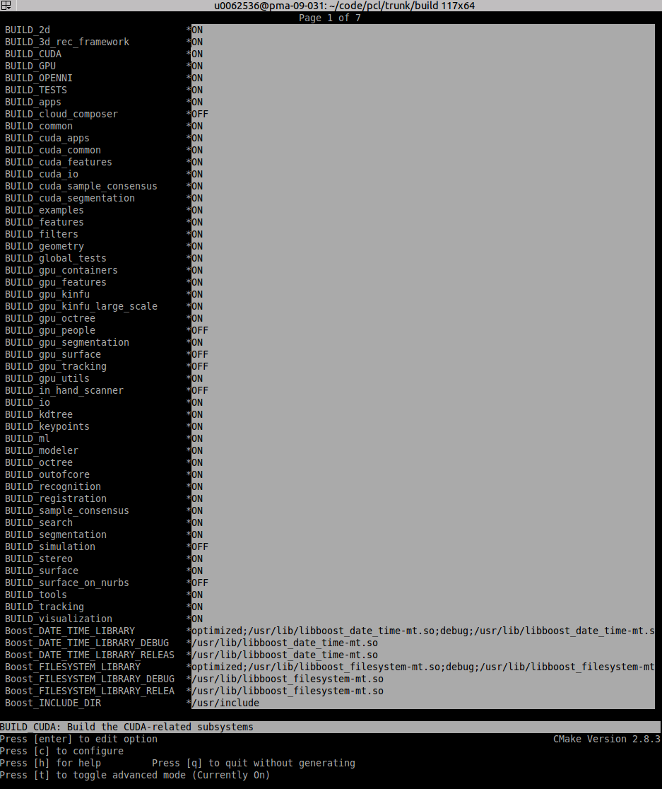

.. _gpu_install:

Configuring your PC to use your Nvidia GPU with PCL
---------------------------------------------------

In this tutorial you will learn how to configure your system to make it compatible to run the GPU methods provided by PCL.
This tutorial is for Ubuntu, other Linux distrubutions can follow a similar process to set it up.  

Windows is currently  **not** officially supported for the GPU methods.

Checking CUDA Version
---------------------

In order to run the code you will need a system with an Nvidia GPU, having CUDA Toolkit v9.2+ installed. 
We will not be covering CUDA toolkit installation in this tutorial as there already exists many great tutorials for the same.

You can check your CUDA toolkit version using the following command::

 $ nvcc --version | grep "release" | awk '{print $6}' | cut -c2-
 
 
Checking C++ Version
--------------------

The GPU methods in PCL require a min version of GCC 7 or Clang 6 onwards (min version unknown). 
This will not be a problem if you are running Ubuntu 18.04 or later. However on Ubuntu 16.04, you will need to install GCC 7 or Clang 6 (lower versions not tested) manually because the versions available by default are: GCC 5 and Clang 3.8

You can check your GCC and Clang version using the following commands::

 $ gcc -dumpversion
 
 $ clang --version
 
 
Installing GCC
--------------- 

To install GCC 7 run the following commands::
 
$ sudo add-apt-repository ppa:ubuntu-toolchain-r/test
$ sudo apt update && apt install g++-7 -y
 
Set it as the default version::
 
$ sudo update-alternatives --install /usr/bin/gcc gcc /usr/bin/gcc-7 60 --slave /usr/bin/g++ g++ /usr/bin/g++-7
$ sudo update-alternatives --config gcc

Installing Eigen
----------------

You will also need Eigen v3.3.7+, since the previous versions are incompatible with the latest CUDA versions. 
If you are on Ubuntu 20 or newer, then there is no issue since Eigen 3.3.7 is shipped by default. 
On older versions Eigen v3.3.7 will need to be installed manually::

$ wget -qO- https://gitlab.com/libeigen/eigen/-/archive/3.3.7/eigen-3.3.7.tar.gz | tar xz 
$ sudo apt install -y libblas-dev 
$ cd eigen-3.3.7 && mkdir build && cd build 
$ cmake ..
$ sudo make install 
$ cd ../.. && rm -rf eigen-3.3.7/ && rm -f eigen-3.3.7.tar.gz

Building PCL
--------------- 

Now you can get the latest git master (or another one) of PCL and configure your
installation to use the CUDA functions.

Go to your PCL root folder and do::

 $ mkdir build; cd build
 $ ccmake ..

Press c to configure ccmake, press t to toggle to the advanced mode as a number of options
only appear in advanced mode. The latest CUDA algorithms are being kept in the GPU project, for
this the BUILD_GPU option needs to be on and the BUILD_gpu_<X> indicate the different
GPU subprojects.

Press c again to configure for you options, press g to generate the makefiles and to exit. Now
the makefiles have been generated successfully and can be executed by doing::

 $ make

If you want to install your PCL installation for everybody to use::

 $ make install

Now your installation is finished!
