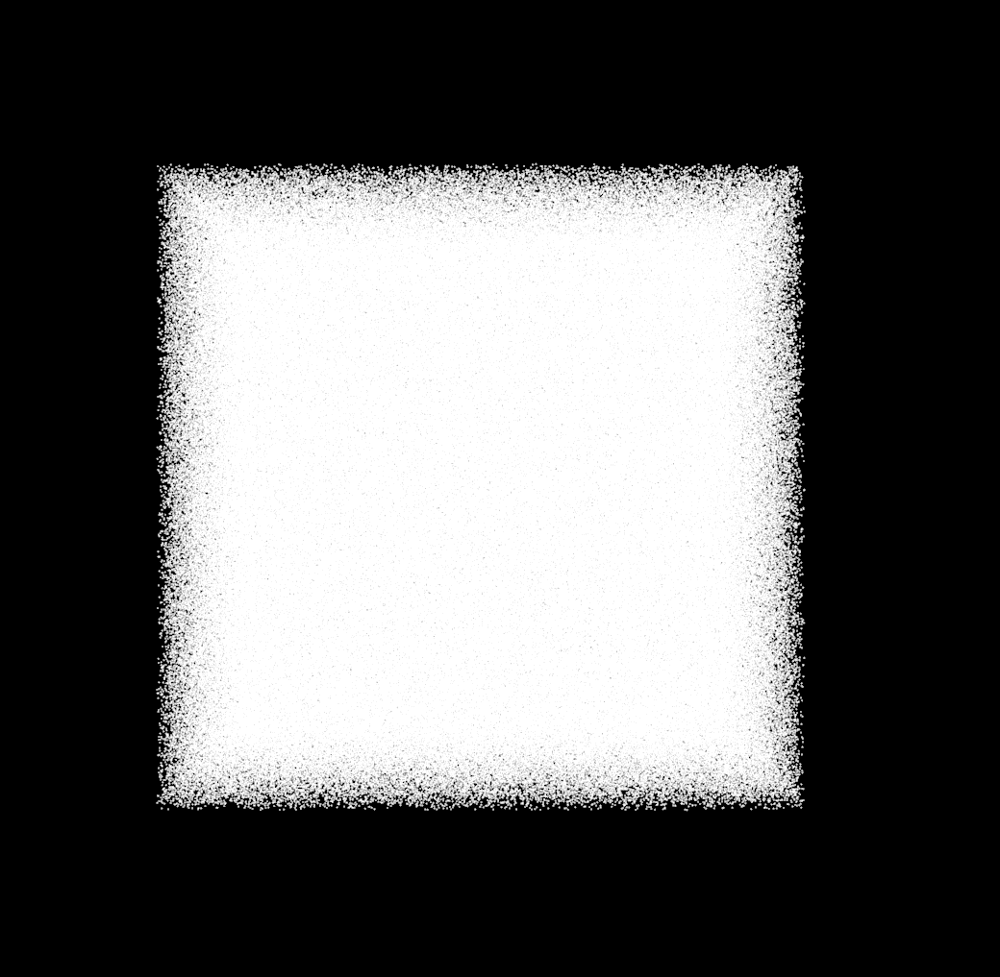
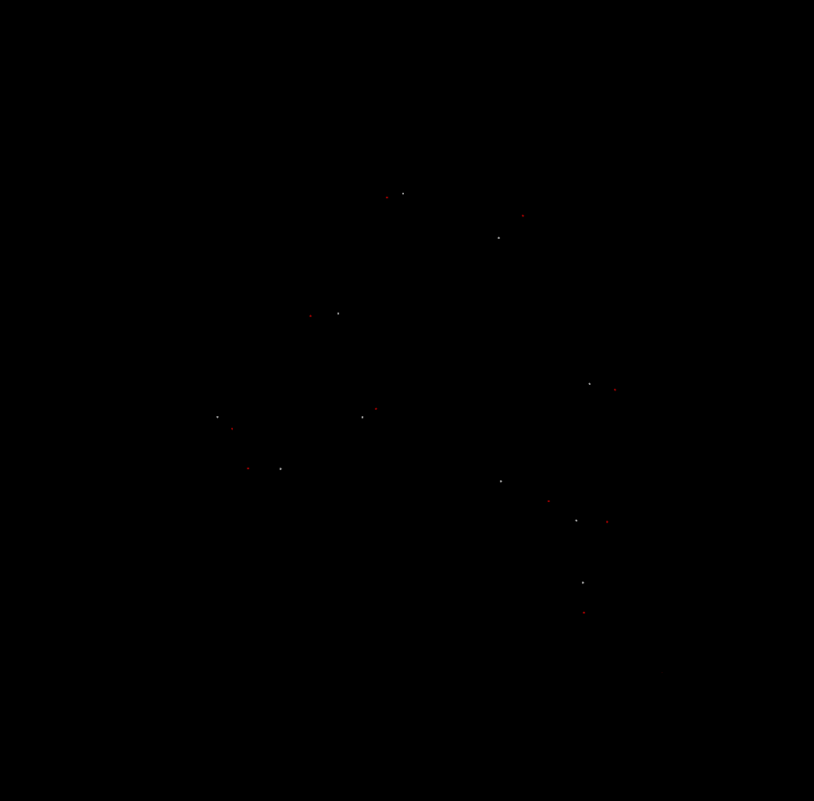
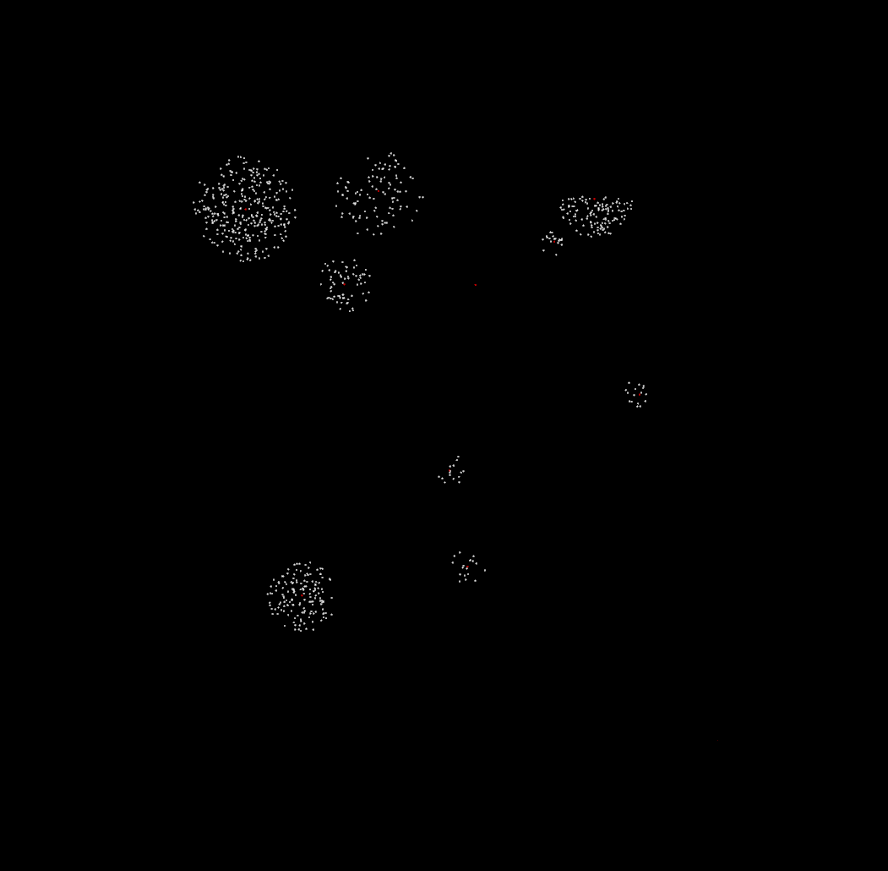
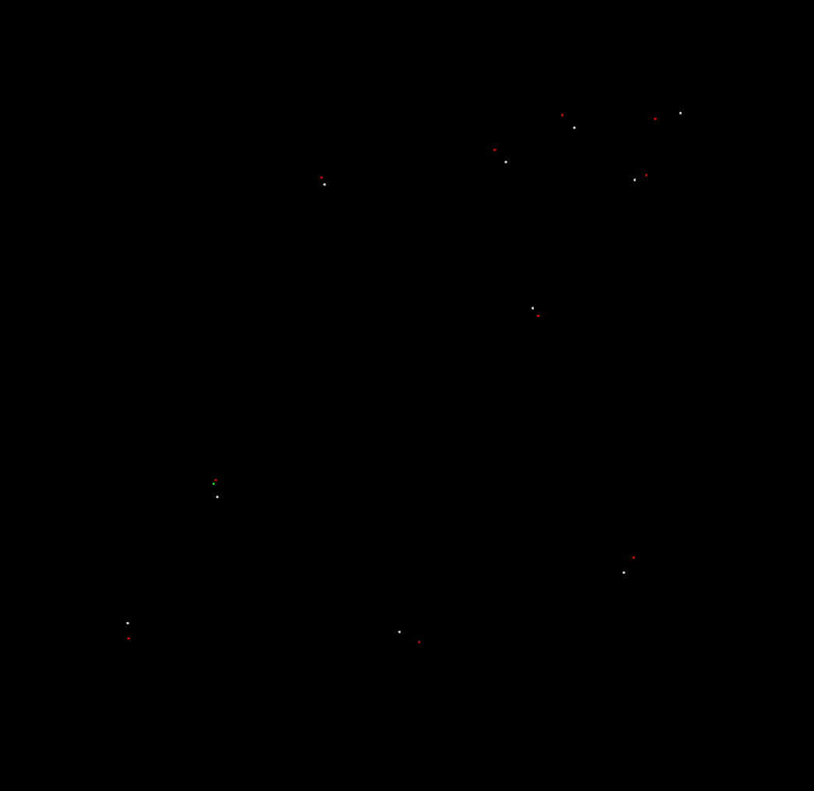

.. _gpu_octree_search:

====================================================
Using GPU Octree search functions
====================================================

The GPU Octree sub-module provides  parallelized search operations using a CUDA Octree implementation. In this tutorial, we will learn how to utilize octrees to perform search queries on unorganized point clouds. In order to utilize GPU Octree functions, you must first build PCL with GPU support enabled, by following :ref:`gpu_install`.

When to use the GPU Octree module
=================================

The primary aim of the GPU octree module is to allow parallelized search functionality. This allows users to achieve a significant performance gain by utilizing the GPU octree implementation over the CPU implementation when a large number of queries must be carried out on a point cloud.

This module primarily provides implementations for the following three search methods.

- Radius search
- K Nearest Neighbors Search
- Approximate Nearest Neighbor Search

In contrast to the their CPU counterparts, all of these functions accept a vector of queries rather than a single query. Apart from this, there are some minor differences between the CPU and GPU implementations, and these will be highlighted throughout this tutorial.

.. note::

    The above functions may give erroneous results in PCL versions < 1.12 due to warp synchronization errors. These errors have been fixed from PCL 1.12 upwards.

.. note::

    The API of the above three functions have been modified from PCL 1.12 onwards to return squared distances from query point to result points. The following tutorial is based on the modified API. You can reference the API of the GPU octree search methods `here <https://pointclouds.org/documentation/classpcl_1_1gpu_1_1_octree.html>`_.

The following table shows a sample comparison between the performance of the CPU and GPU implementations.

.. list-table:: Title
   :widths: 25 25 50 25
   :header-rows: 1

   * - Method
     - Time (points = 100 000, queries = 1000)
     - Time (points = 1 000 000, queries = 1000)
     - Time (points = 1 000 000, queries = 10 000)
   * - GPU Radius Search
     - 3661 us
     - 11344 us
     - 41206 us
   * - CPU based Radius Search (from GPU module)
     - 37419 us
     - 123103 us
     - 601452 us
   * - CPU based Radius Search (from octree module)
     - 168071 us
     - 524477 us
     - 2064714 us
   * - GPU Approximate Nearest Search
     - 39.4 us
     - 89.3 us
     - 515 us
   * - CPU based Approximate Nearest Search (from GPU module)
     - 2956 us
     - 32036 us
     - 118819 us
   * - CPU based Approximate Nearest Search (from octree module)
     - 3168 us
     - 9320 us
     - 53260 us
   * - GPU K Nearest Neighbour Search (k=1)
     - 11093 us
     - 105937 us
     - 295371 us
   * - CPU based K Nearest Neighbour Search (from octree module) (k=1)
     - 20744 us
     - 58194 us
     - 282274 us

The code
========
First, create a file, let’s say, gpu_octree_search.cpp and place the following code inside it:

.. literalinclude:: sources/gpu_octree/gpu_octree.cpp
    :language: cpp
    :linenos:

The Explanation
===============

Initially, we define and instantiate a PointCloud structure and fill it with uniformly distributed points using `pcl::common::CloudGenerator`. We also create some queries.

.. literalinclude:: sources/gpu_octree/gpu_octree.cpp
    :language: cpp
    :lines: 95-105

Building an octree
------------------

Next we create an octree instance and build the octree. In order to do this, we must first create an instance of `pcl::gpu::Octree::PointCloud` using the points in our point cloud. In order to do this, we must first upload those points to the GPU. Here "upload" refers to copying data from host memory to GPU memory (Conversely, "download" refers to copying data from GPU memory to host memory). We will also upload our queries for later use.  For this, we must create a `pcl::gpu::Octree::Queries` object and upload query points to this object.

Note that unlike in the CPU octree implementation, the user cannot set the resolution of the octree. Instead, the depth of the octree will be automatically determined depending on the point distribution of the cloud (However, the maximum depth is capped at 10).

.. literalinclude:: sources/gpu_octree/gpu_octree.cpp
    :language: cpp
    :lines: 107-118

After building the octree, we can move on to the different search queries.

K Nearest Neighbors search
---------------------------

.. note::

    The K nearest neighbor algorithm is designed to identify a given (k) number of nearest neighbors to a query point. However, the GPU KNN search algorithm is currently restricted to k=1 only. This restriction will be lifted in a future release.

.. note::

    The GPU K nearest neighbor algorithm differs from it's CPU counterpart in implementation. Specifically, the CPU algorithm will only find approximate nearest neighbors, where the user can set the upper bound of the error allowed. In contrast, the GPU algorithm finds the absolute nearest neighbor. For K = 1, if an approximation will suffice, users should utilize the more efficient approximate nearest search method instead.

In order to perform K nearest search, we must prepare output buffers on the device to store the results of the search queries. Specifically, we need two separate buffers to store the resulting nearest neighbor indices and the corresponding squared distances between the search point and nearest neighbors. Note that these buffers will be automatically resized to `k * number of queries` size, in order to hold all the results.

Now, we can perform the K nearest neighbors search on GPU. After performing the search we must download the results from GPU memory into host memory using two new vectors for indices and square distances.

.. literalinclude:: sources/gpu_octree/gpu_octree.cpp
    :language: cpp
    :lines: 21-40

Radius Search
-------------

Radius search returns neighbors within a given radius to the query point. The user must specify a maximum limit of points to return per query. There are implementations radius search available which either return / do not return the corresponding squared distances to the query point. Note that the methods which do not return squared distances are more efficient than those that do. In usage, this works very similar to the K nearest neighbor search.

Neighbors are returned as a `pcl::gpu::NeighborIndices` object, which contains all result indices packed into a one dimensional vector called `data`, as well as an additional vector called `sizes` which contains the number of results found for each individual query. These sizes can can be used to split the resulting indices as well as square distances by query.

Radius search can be conducted with a single radius for all queries or, an individual radius may be specified for each query, by passing a `pcl::gpu::Octree::Radiuses` object of the same size as the queries object to the radius search method. In this tutorial we will specify an individual radius for each of our ten queries.

.. literalinclude:: sources/gpu_octree/gpu_octree.cpp
    :language: cpp
    :lines: 42-70

Approximate Nearest Search
--------------------------

As the name suggests, approximate nearest search differs from K nearest search by the fact that it's traversal mechanism is 'approximate'. Specifically, during traversal, it will attempt to identify the most likely leaf to hold the nearest neighbor using the 'distance from query point to voxel center' heuristic. Thus there is no guarantee that this method will find the absolute nearest neighbor, and in fact there is also no guarantee of an upper-bound of the error in the result.

Please note that the approximate nearest neighbor method may be deprecated in the future due to its similarity with the KNN search method.

.. literalinclude:: sources/gpu_octree/gpu_octree.cpp
    :language: cpp
    :lines: 73-90

Compiling and running the program
=================================

Add the following lines to your CMakeLists.txt file

.. literalinclude:: sources/gpu_octree/CMakeLists.txt
    :language: cpp
    :linenos:

After you have made the executable, you can run it with::

  $ ./gpu_octree_search

You will see something similar to::

    K nearest neighbor search at (60.1689 14.2143 637.145)
        60.1326 76.0427 656.145 (squared distance 4183.76)
    K nearest neighbor search at (40.0743 226.868 413.113)
        101.64 229.722 412.533 (squared distance 3798.78)
    K nearest neighbor search at (848.911 401.591 948.099)
        885.188 428.836 963.89 (squared distance 2307.68)
    K nearest neighbor search at (664.014 665.193 931.986)
        598.551 670.003 913.46 (squared distance 4651.77)
    K nearest neighbor search at (190.451 292.746 52.4367)
        271.148 325.169 103.944 (squared distance 10216.2)
    K nearest neighbor search at (177.745 884.624 808.172)
        232.255 834.861 807.517 (squared distance 5448.18)
    K nearest neighbor search at (499.687 453.289 332.382)
        526.696 436.645 351.765 (squared distance 1382.18)
    K nearest neighbor search at (719.296 350.568 51.4605)
        662.233 349.678 51.3719 (squared distance 3256.99)
    K nearest neighbor search at (485.176 935.997 886.432)
        448.141 954.199 953.149 (squared distance 6154.03)
    K nearest neighbor search at (23.8829 490.819 417.75)
        71.6224 502.673 441.761 (squared distance 2996.11)

    Radius search at (60.1689 14.2143 637.145) within radius 127.564. Found 4 results.
        99.8589 2.16376 580.404 (squared distance 4939.98)
        60.1326 76.0427 656.145 (squared distance 4183.76)
        33.6821 65.0861 702.179 (squared distance 7518.98)
        38.5616 46.545 729.416 (squared distance 10026.1)
    Radius search at (40.0743 226.868 413.113) within radius 107.615. Found 4 results.
        25.1653 141.428 427.687 (squared distance 7734.68)
        101.64 229.722 412.533 (squared distance 3798.78)
        71.5842 209.567 472.495 (squared distance 4818.4)
        38.3041 275.701 329.71 (squared distance 9343.84)
    Radius search at (848.911 401.591 948.099) within radius 84.368. Found 6 results.
        866.93 340.154 985.74 (squared distance 5516.04)
        903.377 374.813 921.018 (squared distance 4417.11)
        879.285 450.109 946.145 (squared distance 3280.36)
        885.188 428.836 963.89 (squared distance 2307.68)
        855.091 473.825 966.515 (squared distance 5595.04)
        901.872 405.492 969.244 (squared distance 3267.24)
    Radius search at (664.014 665.193 931.986) within radius 52.006. Found 0 results.
    Radius search at (190.451 292.746 52.4367) within radius 115.442. Found 2 results.
        101.342 226.479 70.465 (squared distance 12656.8)
        271.148 325.169 103.944 (squared distance 10216.2)
    Radius search at (177.745 884.624 808.172) within radius 128.678. Found 7 results.
        207.165 790.244 750.149 (squared distance 13139.8)
        161.808 914.758 696.504 (squared distance 13631.9)
        191.437 932.108 706.057 (squared distance 12869.8)
        212.654 799.968 808.837 (squared distance 8385.74)
        232.255 834.861 807.517 (squared distance 5448.18)
        200.599 796.068 864.544 (squared distance 11542.3)
        177.46 960.219 779.123 (squared distance 6558.54)
    Radius search at (499.687 453.289 332.382) within radius 132.692. Found 8 results.
        471.827 468.143 249.759 (squared distance 7823.37)
        476.559 475.349 264.615 (squared distance 5613.88)
        512.019 478.489 258.021 (squared distance 6316.54)
        478.06 405.253 370.323 (squared distance 4214.79)
        448.171 433.947 429.251 (squared distance 12411.8)
        526.696 436.645 351.765 (squared distance 1382.18)
        493.678 566.386 337.188 (squared distance 12850.2)
        571.876 538.687 274.034 (squared distance 15908.6)
    Radius search at (719.296 350.568 51.4605) within radius 81.2447. Found 3 results.
        704.921 282.976 45.871 (squared distance 4806.6)
        662.233 349.678 51.3719 (squared distance 3256.99)
        780.983 333.923 48.8876 (squared distance 4088.97)
    Radius search at (485.176 935.997 886.432) within radius 7.11413. Found 0 results.
    Radius search at (23.8829 490.819 417.75) within radius 117.868. Found 3 results.
        30.7867 442.83 328.752 (squared distance 10271.3)
        54.8184 454.243 373.548 (squared distance 4248.56)
        71.6224 502.673 441.761 (squared distance 2996.11)

    Approximate nearest neighbor search at (60.1689 14.2143 637.145)
        60.1326 76.0427 656.145 (squared distance 4183.76)
    Approximate nearest neighbor search at (40.0743 226.868 413.113)
        101.64 229.722 412.533 (squared distance 3798.78)
    Approximate nearest neighbor search at (848.911 401.591 948.099)
        885.188 428.836 963.89 (squared distance 2307.68)
    Approximate nearest neighbor search at (664.014 665.193 931.986)
        598.551 670.003 913.46 (squared distance 4651.77)
    Approximate nearest neighbor search at (190.451 292.746 52.4367)
        207.182 265.569 165.369 (squared distance 13772.3)
    Approximate nearest neighbor search at (177.745 884.624 808.172)
        232.255 834.861 807.517 (squared distance 5448.18)
    Approximate nearest neighbor search at (499.687 453.289 332.382)
        478.06 405.253 370.323 (squared distance 4214.79)
    Approximate nearest neighbor search at (719.296 350.568 51.4605)
        662.233 349.678 51.3719 (squared distance 3256.99)
    Approximate nearest neighbor search at (485.176 935.997 886.432)
        448.141 954.199 953.149 (squared distance 6154.03)
    Approximate nearest neighbor search at (23.8829 490.819 417.75)
        71.6224 502.673 441.761 (squared distance 2996.11)

The following visualizations demonstrate the above three search methods in action. Note that some parameters are different from above, to highlight the functionality of the search methods. The query points are shown in red, while the results are shown in white.
The first image depicts the initial cloud populated with random data.

Next, we can observe the results of K nearest search.

Radius search results are shown below.

The final image depicts results of approximate nearest search. The results shown in green are the actual nearest neighbors for points where the approximate nearest point diverges from the actual nearest point.

