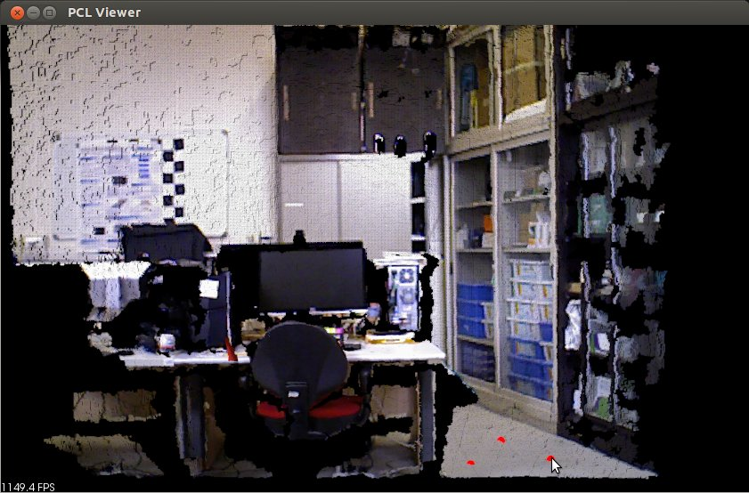
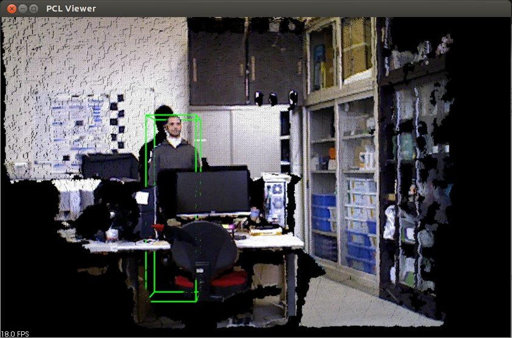
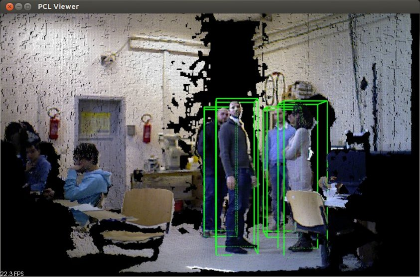
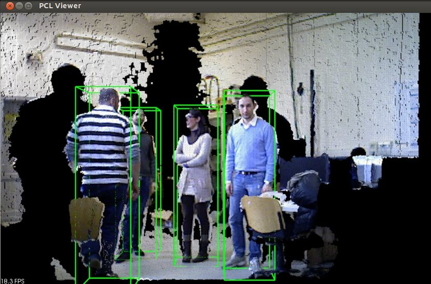
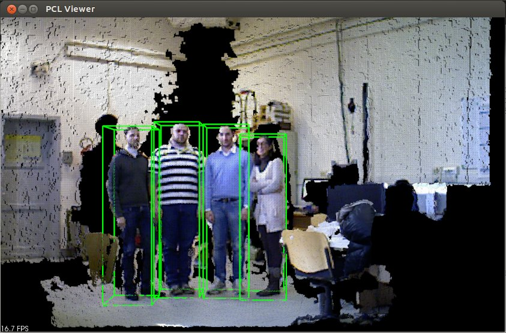

.. _ground_based_rgbd_people_detection:

Detecting people on a ground plane with RGB-D data
---------------------------------------------------------
This tutorial aims at explaining how to detect people from RGB-D data with the pcl_people module.
With the proposed method, people standing/walking on a planar ground plane can be detected in real time with standard CPU computation.
This implementation corresponds to the people detection algorithm for RGB-D data presented in 

- *M. Munaro, F. Basso and E. Menegatti*. "Tracking people within groups with RGB-D data". In Proceedings of the International Conference on Intelligent Robots and Systems (IROS) 2012, Vilamoura (Portugal), 2012.

The code
--------

You can download the source code for this tutorial from :download:`here <./sources/ground_based_rgbd_people_detection/src/main_ground_based_people_detection.cpp>`, 
while the file containing the needed SVM parameters can be found :download:`here <./sources/ground_based_rgbd_people_detection/data/trainedLinearSVMForPeopleDetectionWithHOG.yaml>`.
We implemented a people detection demo from a live RGB-D stream obtained with an OpenNI-compatible sensor (Microsoft Kinect, Asus Xtion, etc.).

Here it is the code:

.. literalinclude:: sources/ground_based_rgbd_people_detection/src/main_ground_based_people_detection.cpp
   :language: cpp
   :lines: 48-242

The explanation
---------------

Now, let's break down the code piece by piece. 

The first lines allow to print a help text showing the command line parameters that can be set when launching the executable.
No parameter is needed by default, but you can optionally set the path to the file containing the trained SVM 
for people detection (``--svm``) and the minimum HOG confidence allowed (``--conf``). Moreover, the minimum (``min_h``) and 
maximum (``max_h``) height of people can be set. If no parameter is set, the default values are used.

.. literalinclude:: sources/ground_based_rgbd_people_detection/src/main_ground_based_people_detection.cpp
   :language: cpp
   :lines: 66-77
   
Here, the callback used for grabbing pointclouds with OpenNI is defined.
   
.. literalinclude:: sources/ground_based_rgbd_people_detection/src/main_ground_based_people_detection.cpp
   :language: cpp
   :lines: 79-86

The people detection algorithm used makes the assumption that people stand/walk on a planar ground plane. 
Thus, it requires to know the equation of the ground plane in order to perform people detection.
In this tutorial, the ground plane is manually initialized by the user by selecting three floor points 
from the first acquired pointcloud. 
In the following lines, the callback function used for ground plane initialization is shown, together with 
the structure used to pass arguments to this callback.

.. literalinclude:: sources/ground_based_rgbd_people_detection/src/main_ground_based_people_detection.cpp
   :language: cpp
   :lines: 88-109     

Main:
*****

The main program starts by initializing the main parameters and reading the command line options.

.. literalinclude:: sources/ground_based_rgbd_people_detection/src/main_ground_based_people_detection.cpp
   :language: cpp
   :lines: 111-129
 
Ground initialization:   
**********************

Then, the :pcl:`pcl::Grabber <pcl::Grabber>` object is initialized in order to acquire RGB-D pointclouds and the program waits for
the first frame. 
When the first pointcloud is acquired, it is displayed in the visualizer and the user is requested to select
three floor points by pressing ``shift+click`` as reported in the figure below.
After this, ``Q`` must be pressed in order to close the visualizer and let the program continue.

.. literalinclude:: sources/ground_based_rgbd_people_detection/src/main_ground_based_people_detection.cpp
   :language: cpp
   :lines: 131-164
   

.. note:: 
	When selecting the floor points, try to click on non collinear points that are distant from each other, in order to improve 
	plane estimation.

Given the three points, the ground plane is estimated with a Sample Consensus approach and the plane coefficients are 
written to the command window.

.. literalinclude:: sources/ground_based_rgbd_people_detection/src/main_ground_based_people_detection.cpp
   :language: cpp
   :lines: 166-174
        
In the following lines, we can see the initialization of the SVM classifier by loading the pre-trained parameters
from file.
Moreover, a :pcl:`GroundBasedPeopleDetectionApp <pcl::people::GroundBasedPeopleDetectionApp>` object is declared and the main 
parameters are set. In this example, we can see how to set the voxel size used for downsampling the pointcloud,
the rgb camera intrinsic parameters, the :pcl:`PersonClassifier <pcl::people::PersonClassifier>` object and the height limits.
Other parameters could be set, such as the sensor orientation. If the sensor is vertically placed, the method 
setSensorPortraitOrientation should be used to enable the vertical mode in :pcl:`GroundBasedPeopleDetectionApp <pcl::people::GroundBasedPeopleDetectionApp>`.
 
.. literalinclude:: sources/ground_based_rgbd_people_detection/src/main_ground_based_people_detection.cpp
   :language: cpp
   :lines: 180-190 

Main loop:
**********   
In the main loop, new frames are acquired and processed until the application is terminated by the user.
The ``people_detector`` object receives as input the current cloud and the estimated ground coefficients and 
computes people clusters properties, which are stored in :pcl:`PersonCluster <pcl::people::PersonCluster>` objects.
The ground plane coefficients are re-estimated at every frame by using the previous frame estimate as initial condition.
This procedure allows to adapt to small changes which can occurr to the ground plane equation if the camera is slowly moving.
   
.. literalinclude:: sources/ground_based_rgbd_people_detection/src/main_ground_based_people_detection.cpp
   :language: cpp
   :lines: 196-209
 
The last part of the code is devoted to visualization. In particular, a green 3D bounding box is drawn for every
person with HOG confidence above the ``min_confidence`` threshold. The width of the bounding box is fixed, while 
the height is determined as the distance between the top point of the person cluster and the ground plane.
The average framerate is also shown every 30 frames, to evaluate the runtime performance of the application.
Please note that this framerate includes the time necessary for grabbing the point clouds and for visualization.
   
.. literalinclude:: sources/ground_based_rgbd_people_detection/src/main_ground_based_people_detection.cpp
   :language: cpp
   :lines: 211-237  

Compiling and running the program
---------------------------------

Create a `CMakeLists.txt` file and add the following lines into it:

.. literalinclude:: sources/ground_based_rgbd_people_detection/CMakeLists.txt
   :language: cmake
   :linenos:

After you have made the executable, you can run it. Simply do:
  $ ./ground_based_rgbd_people_detector
  
The following images show some people detection results on a Kinect RGB-D stream.
The minimum and maximum height for people were set respectively to 1.3 and 2.3 meters, while the
minimum HOG confidence was set to -1.5.

