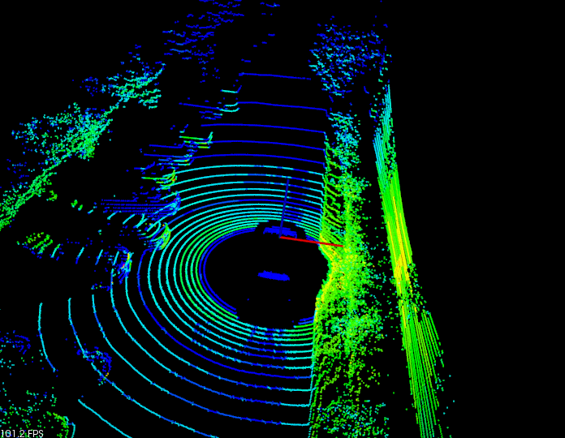

.. _hdl_grabber:

The Velodyne High Definition LiDAR (HDL) Grabber
------------------------------------------------

The Velodyne HDL is a network-based 3D LiDAR system that produces
360 degree point clouds containing over 700,000 points every second.

The HDL Grabber provided in PCL mimicks other Grabbers, making it *almost*
plug-and-play.  Because the HDL devices are network based, however, there
are a few gotchas on some platforms.

The HDL Grabber supports the original HDL-64e as well as the HDL-32e.
More information on those sensors can be found at `Velodyne's Web Site <http://www.velodynelidar.com/>`_

Basic Network Setup
-------------------

The Velodyne HDL uses network packets to provide range and intensity
data for each of the lasers in the device.  The HDL-64e consists of
64 lasers, while the HDL-32e consists of 32.

The HDL-64e and HDL-32e, by default, produce UDP network packets
on the 192.168.3 subnet.  Starting with the HDL-32e (Firmware Version 2),
the user can customize this network subnet.  

The HDL can be connected either directly into your computer, or into a
network switch (to include a network switch with a built-in Wireless Access Point).
Regardless, one of your computer's Network Interface Cards (NIC) [whether hard-wired
RJ-45 connection or wireless] needs to be configured to be on this 192.168.3 subnet.
Consult your operating system documentation on how to perform this.

In addition to the NIC settings, you may need to alter your operating system's firewall rules.  The
HDL produces packets on port 2368 (by default).  The HDL-32e with Firmware Version 2
can be set to use a different port.  Consult your firewall documentation to open
this port in your firewall.

Lastly, modern Linux kernels have advanced network attack guards that go beyond basic firewall
rules.  The HDL-32e produces UDP packets that may be filtered by the OS using one of these
attack guards.  You will need to disable the *rp_filter* guard for the appropriate NIC.
For more information on how to disable this filter, please see the section below entitled
`Disabling Reverse Path Filter`_

PCAP Files
----------

`Wireshark <http://www.wireshark.org/>`_ is a popular Network Packet Analyzer Program which
is available for most platforms, including Linux, MacOS and Windows.  This tool uses a defacto
standard network packet capture file format called `PCAP <http://en.wikipedia.org/wiki/Pcap>`_.
Many publically available Velodyne HDL packet captures use this PCAP file format as a means of
recording and playback.  These PCAP files can be used with the HDL Grabber if PCL is compiled with
PCAP support.

Velodyne provides sample PCAP files on their `website <http://midas3.kitware.com/midas/community/29>`_

Compiling the HDL Grabber with PCAP support
-------------------------------------------

On Linux, this involves installing libpcap-dev (Ubuntu) or libpcap-devel (Fedora).  CMake should
find the pcap libraries, and automatically configure PCL to use them.

On Windows, this involves installing both the `WinPCAP installer <http://www.winpcap.org/install/default.htm>`_
and the `WinPCAP developer's pack <http://www.winpcap.org/devel.htm>`_.  You will also need to set an
environment variable **PCAPDIR** to the directory where you unzipped the developer's pack.  Once that is
done, you should be able to run CMake again, and it should locate the appropriate files.

Note - You do not need to compile the HDL Grabber with support for PCAP.  It is **only** required if
you will be replaying PCAP files through the grabber.

Sample Program
--------------

In *visualization*, there is a very short piece of code which contains all that
is required to set up a *pcl::PointCloud<XYZ>*, *pcl::PointCloud<XYZI> or *pcl::PointCloud<XYZRGB>*
cloud callback.

Here is a screenshot of the PCL HDL Viewer in action, which uses the HDL Grabber.

So let's look at the code. The following represents a simplified version of *visualization/tools/hdl_viewer_simple.cpp*

.. code-block:: cpp
   :linenos:
   
   #include <pcl/point_cloud.h>
   #include <pcl/point_types.h>
   #include <pcl/io/hdl_grabber.h>
   #include <pcl/visualization/point_cloud_color_handlers.h>
   #include <pcl/visualization/cloud_viewer.h>
   #include <pcl/console/parse.h>

   using namespace std;
   using namespace pcl::console;
   using namespace pcl::visualization;
   
   class SimpleHDLViewer
   {
     public:
       typedef pcl::PointCloud<pcl::PointXYZI> Cloud;
       typedef typename Cloud::ConstPtr CloudConstPtr;

       SimpleHDLViewer (Grabber& grabber,
           pcl::visualization::PointCloudColorHandler<pcl::PointXYZI> &handler) :
           cloud_viewer_ (new pcl::visualization::PCLVisualizer ("PCL HDL Cloud")),
           grabber_ (grabber),
           handler_ (handler)
       {
       }

       void cloud_callback (const CloudConstPtr& cloud)
       {
         boost::mutex::scoped_lock lock (cloud_mutex_);
         cloud_ = cloud;
       }
   
       void run ()
       {
         cloud_viewer_->addCoordinateSystem (3.0);
         cloud_viewer_->setBackgroundColor (0, 0, 0);
         cloud_viewer_->initCameraParameters ();
         cloud_viewer_->setCameraPosition (0.0, 0.0, 30.0, 0.0, 1.0, 0.0, 0);
         cloud_viewer_->setCameraClipDistances (0.0, 50.0);

         boost::function<void (const CloudConstPtr&)> cloud_cb = boost::bind (
             &SimpleHDLViewer::cloud_callback, this, _1);
         boost::signals2::connection cloud_connection = grabber_.registerCallback (
             cloud_cb);

         grabber_.start ();

         while (!cloud_viewer_->wasStopped ())
         {
           CloudConstPtr cloud;

           // See if we can get a cloud
           if (cloud_mutex_.try_lock ())
           {
             cloud_.swap (cloud);
             cloud_mutex_.unlock ();
           }

           if (cloud)
           {
             handler_.setInputCloud (cloud);
             if (!cloud_viewer_->updatePointCloud (cloud, handler_, "HDL"))
               cloud_viewer_->addPointCloud (cloud, handler_, "HDL");

             cloud_viewer_->spinOnce ();
           }

           if (!grabber_.isRunning ())
             cloud_viewer_->spin ();

           boost::this_thread::sleep (boost::posix_time::microseconds (100));
         }

         grabber_.stop ();

         cloud_connection.disconnect ();
       }

       boost::shared_ptr<pcl::visualization::PCLVisualizer> cloud_viewer_;

       pcl::Grabber& grabber_;
       boost::mutex cloud_mutex_;

       CloudConstPtr cloud_;
       pcl::visualization::PointCloudColorHandler<pcl::PointXYZI> &handler_;
   };
   
   int main (int argc, char ** argv)
   {
     std::string hdlCalibration, pcapFile;

     parse_argument (argc, argv, "-calibrationFile", hdlCalibration);
     parse_argument (argc, argv, "-pcapFile", pcapFile);

     pcl::HDLGrabber grabber (hdlCalibration, pcapFile);

     pcl::visualization::PointCloudColorHandlerGenericField<pcl::PointXYZI> color_handler ("intensity");

     SimpleHDLViewer<PointXYZI> v (grabber, color_handler);
     v.run ();
     return (0);
   }

Additional Details
------------------

The *HDL Grabber* offers more than one datatype, which is the reason we made
the *Grabber* interface so generic, leading to the relatively complicated
*boost::bind* line. In fact, we can register the following callback types as of
this writing:

* `void (const boost::shared_ptr<const pcl::PointCloud<pcl::PointXYZRGB> >&)`

Compiling and running the program
---------------------------------

Add the following lines to your CMakeLists.txt file:

.. literalinclude:: sources/openni_grabber/CMakeLists.txt
   :language: cmake
   :linenos:

_`Disabling Reverse Path Filter`
--------------------------------

First off, let's understand what the **Reverse Path Filter** is all about.  A TCP or UDP packet
contains, amongst other information, a **DESTINATION IP ADDRESS** and a **SOURCE IP ADDRESS**.
The Destination IP Address represents where the packet will go.  In the case of a UDP packet, this
is usually the broadcast network IP Address (eg, 255.255.255.255 for a global broadcast, or
x.y.z.255 for a Class C Network [where x.y.z are the first three octets of a Class C network, such as
192.168.1]).

The Source IP Address, on the otherhand, indicates where the packet originated from.  Packets
can be hand-crafted for spoofing-type attacks (eg, pretending to come from somewhere they really
didn't). The Reverse Path Filter attempts to detect these instances.  The default rule that it uses is
that if a packet is received on Network Interface *A*, then if there is no **route** to the **Source IP Address**
on Network Interface *A*, then it will be dropped by the kernel.

So, what does this mean for the HDL-32e?  Well, by default, the Source IP Address is 192.168.X.Y, where
**X** and **Y** are the last 4 digits of the device's serial number.  Remember, the default *Destination* IP
address for the HDL-32e is the 192.168.3 network.

If you have a single Network Interface, you will have a default route (that is a route to all other networks)
going out that single Network Interface.  To receive the HDL packets, that Network Interface will need to be
on the 192.168.3 subnet.  And all will be good because there is a route from your single Network Interface to
the **packet's Source IP Address**, through your single Network Interface.

Ahh, but what happens when you have *two* Network Interfaces, for example, on to the **internet**, and one
dedicated to the HDL?  In that case, your primary NIC will have a default route to all other networks, but
the one that is dedicated to the HDL won't.  By default, it won't have a default route, and in fact,
it will only have a route to the 192.168.3 subnet.

That means that when the HDL packet is received by the Linux Kernel, it will determine that there is no route
from the secondary NIC back to the HDL packet Source IP Address, and drop the packet altogether.

The maddening thing about this is that if you were to run tcpdump or wireshark (two network packet sniffer programs),
you would see that the HDL packets were arriving at the NIC card!  The reason for this is that programs like
tcpdump and wireshark use something called *promiscuous mode* that allows them to receive all packets **BEFORE**
the Linux Kernel does.

So, there are a couple of solutions to this problem.  First, you could use a single NIC, and your computer will
be dedicated to the HDL.  You won't have to do anything except change network IP addresses when you want to
connect to an alternate network.  For those that desire a second NIC, there are several options.  First, you
can set up a route back to the source network that traverses the second NIC.  Note, the Linux Kernel does not
actually try to connect back to the source network, it just ensures that there is a path to it.  This option
works well in practice.  The other option is to modify the RP Filter setting.  There are two possible modes -
turn it off completely, or relax the rules to see if there is a route back to that network via *any*
NIC on the computer.

Here are the options again for a multi-NIC system, with corresponding Linux Commands.

1. Add a route back to the HDL

First off, let's look at the interface settings for our two NICS::

   $ ifconfig

returns the following details (some items removed for brevity)::

   em1: flags=4163<UP,BROADCAST,RUNNING,MULTICAST>  mtu 1500
        inet 192.168.128.108  netmask 255.255.255.0  broadcast 192.168.128.255
   
   eth0: flags=4163<UP,BROADCAST,RUNNING,MULTICAST>  mtu 1500
        inet 192.168.3.1  netmask 255.255.255.0  broadcast 192.168.3.255

Next, let's look at our routing table (again, some items removed for brevity)::

   $ route -n
   
   Kernel IP routing table
   Destination     Gateway         Genmask         Flags Metric Ref    Use Iface
   0.0.0.0         192.168.128.1   0.0.0.0         UG    0      0        0 em1
   192.168.3.0     0.0.0.0         255.255.255.0   U     0      0        0 eth0
   192.168.128.0   0.0.0.0         255.255.255.0   U     0      0        0 em1
   
To add a route to the HDL, assume that the HDL Source IP is 192.168.12.84.  You would use the
following command::

   $ sudo route add -net 192.168.12.0/24 eth0

To verify that the route has been added, type the following::

   $ route -n
   
   Kernel IP routing table
   Destination     Gateway         Genmask         Flags Metric Ref    Use Iface
   0.0.0.0         192.168.128.1   0.0.0.0         UG    0      0        0 em1
   192.168.3.0     0.0.0.0         255.255.255.0   U     0      0        0 eth0
   192.168.12.0    0.0.0.0         255.255.255.0   U     0      0        0 eth0
   192.168.128.0   0.0.0.0         255.255.255.0   U     0      0        0 em1
 

Now, there is a route back to the source IP address of the HDL on the same interface
that the packet came from!

However, what if, for some reason (like you already use the 192.168.12 subnet on your computer or
network, and setting the route won't work).  That's what option #2 and #3 are for.

2. Relaxing the Reverse Path Filter

TODO

3.  Disabling the Reverse Path Filter

TODO

Troubleshooting
---------------

Conclusion
----------
