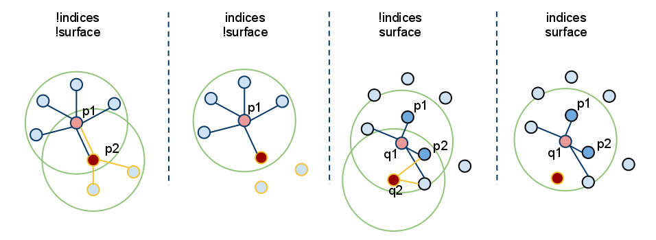

.. _how_3d_features_work:

How 3D Features work in PCL
---------------------------

This document presents an introduction to the 3D feature estimation
methodologies in PCL, and serves as a guide for users or developers that are
interested in the internals of the `pcl::Feature` class.

Theoretical primer
------------------

From [RusuDissertation]_:

  *In their native representation,* **points** *as defined in the concept of 3D mapping systems are simply represented using their Cartesian coordinates x, y, z, with respect to a given origin. Assuming that the origin of the coordinate system does not change over time, there could be two points p1 and p2 , acquired at t1 and t2 , having the same coordinates. Comparing these points however is an ill-posed problem, because even though they are equal with respect to some distance measure (e.g. Euclidean metric), they could be sampled on completely different surfaces, and thus represent totally different information when taken together with the other surrounding points in their vicinity. That is because there are no guarantees that the world has not changed between t1 and t2. Some acquisition devices might provide extra information for a sampled point, such as an intensity or surface remission value, or even a color, however that does not solve the problem completely and the comparison remains ambiguous.*

  *Applications which need to compare points for various reasons require better characteristics and metrics to be able to distinguish between geometric surfaces. The concept of a 3D point as a singular entity with Cartesian coordinates therefore disappears, and a new concept, that of* **local descriptor** *takes its place. The literature is abundant of different naming schemes
  describing the same conceptualization, such as* **shape descriptors** *or* **geometric features** *but for the remaining of this document they will be referred to as* **point feature representations.**

  *...*

  *By including the surrounding neighbors, the underlying sampled surface geometry can be inferred and captured in the feature formulation, which contributes to solving the ambiguity comparison problem. Ideally, the resultant features would be very similar (with respect to some metric) for points residing on the same or similar surfaces, and different for points found on different surfaces, as shown in the figure below. A* **good** *point feature representation distinguishes itself from a* **bad** *one, by being able to capture the same local surface characteristics in the presence of:*

   * **rigid transformations** - *that is, 3D rotations and 3D translations in the data should not influence the resultant feature vector F estimation;*

   * **varying sampling density** - *in principle, a local surface patch sampled more or less densely should have the same feature vector signature;*

   * **noise** - *the point feature representation must retain the same or very similar values in its feature vector in the presence of mild noise in the data.*

   .. image:: images/good_features.jpg
      :align: center

In general, PCL features use approximate methods to compute the nearest neighbors of a query point, using fast kd-tree queries. There are two types of queries that we're interested in:

* determine the **k** (user given parameter) neighbors of a query point (also known as *k-search*);

* determine **all the neighbors** of a query point within a sphere of radius **r** (also known as *radius-search*).

.. note::

   For a discussion on what the right **k** or **r** values should be, please see [RusuDissertation]_.

Terminology
-----------

For the reminder of this article, we will make certain abbreviations and
introduce certain notations, to simplify the in-text explanations. Please see
the table below for a reference on each of the terms used.

+-------------+------------------------------------------------+
| term        | explanation                                    |
+=============+================================================+
| Foo         | a class named `Foo`                            |
+-------------+------------------------------------------------+
| FooPtr      | a boost shared pointer to a class `Foo`,       |
|             |                                                | 
|             | e.g., `boost::shared_ptr<Foo>`                 |
+-------------+------------------------------------------------+
| FooConstPtr | a const boost shared pointer to a class `Foo`, |
|             |                                                |
|             | e.g., `const boost::shared_ptr<const Foo>`     |
+-------------+------------------------------------------------+

How to pass the input
---------------------

As almost all classes in PCL that inherit from the base `pcl::PCLBase` class,
the `pcl::Feature` class accepts input data in two different ways:

 1. an entire point cloud dataset, given via **setInputCloud (PointCloudConstPtr &)** - **mandatory**

    Any feature estimation class with attempt to estimate a feature at **every** point in the given input cloud.

 2. a subset of a point cloud dataset, given via **setInputCloud (PointCloudConstPtr &)** and **setIndices (IndicesConstPtr &)** - **optional**

    Any feature estimation class will attempt to estimate a feature at every point in the given input cloud that has an index in the given indices list. *By default, if no set of indices is given, all points in the cloud will be considered.**

In addition, the set of point neighbors to be used, can be specified through an additional call, **setSearchSurface (PointCloudConstPtr &)**. This call is optional, and when the search surface is not given, the input point cloud dataset is used instead by default.

Because **setInputCloud()** is always required, there are up to four combinations that we can create using *<setInputCloud(), setIndices(), setSearchSurface()>*. Say we have two point clouds, P={p_1, p_2, ...p_n} and Q={q_1, q_2, ..., q_n}. The image below presents all four cases:

* **setIndices() = false, setSearchSurface() = false** - this is without a doubt the most used case in PCL, where the user is just feeding in a single PointCloud dataset and expects a certain feature estimated at *all the points in the cloud*.
  
  Since we do not expect to maintain different implementation copies based on whether a set of indices and/or the search surface is given, whenever **indices = false**, PCL creates a set of internal indices (as a `std::vector<int>`) that basically point to the entire dataset (indices=1..N, where N is the number of points in the cloud). 

  In the figure above, this corresponds to the leftmost case. First, we estimate the nearest neighbors of p_1, then the nearest neighbors of p_2, and so on, until we exhaust all the points in P. 
  
* **setIndices() = true, setSearchSurface() = false** - as previously mentioned, the feature estimation method will only compute features for those points which have an index in the given indices vector;

  In the figure above, this corresponds to the second case. Here, we assume that p_2's index is not part of the indices vector given, so no neighbors or features will be estimated at p2.

* **setIndices() = false, setSearchSurface() = true** - as in the first case, features will be estimated for all points given as input, but, the underlying neighboring surface given in **setSearchSurface()** will be used to obtain nearest neighbors for the input points, rather than the input cloud itself;

  In the figure above, this corresponds to the third case. If Q={q_1, q_2} is another cloud given as input, different than P, and P is the search surface for Q, then the neighbors of q_1 and q_2 will be computed from P.

* **setIndices() = true, setSearchSurface() = true** - this is probably the rarest case, where both indices and a search surface is given. In this case, features will be estimated for only a subset from the <input, indices> pair, using the search surface information given in **setSearchSurface()**.

  Finally, un the figure above, this corresponds to the last (rightmost) case. Here, we assume that q_2's index is not part of the indices vector given for Q, so no neighbors or features will be estimated at q2.

The most useful example when **setSearchSurface()** should be used, is when we have a very dense input dataset, but we do not want to estimate features at all the points in it, but rather at some keypoints discovered using the methods in `pcl_keypoints`, or at a downsampled version of the cloud (e.g., obtained using a `pcl::VoxelGrid<T>` filter). In this case, we pass the downsampled/keypoints input via **setInputCloud()**, and the original data as **setSearchSurface()**.

An example for normal estimation
--------------------------------

Once determined, the neighboring points of a query point can be used to estimate a local feature representation that captures the geometry of the underlying sampled surface around the query point. An important problem in describing the geometry of the surface is to first infer its orientation in a coordinate system, that is, estimate its normal. Surface normals are important properties of a surface and are heavily used in many areas such as computer graphics applications to apply the correct light sources that generate shadings and other visual effects (See [RusuDissertation]_ for more information).

The following code snippet will estimate a set of surface normals for all the points in the input dataset.

.. code-block:: cpp
   :linenos:

   #include <pcl/point_types.h>
   #include <pcl/features/normal_3d.h>

   {
     pcl::PointCloud<pcl::PointXYZ>::Ptr cloud (new pcl::PointCloud<pcl::PointXYZ>);

     ... read, pass in or create a point cloud ...

     // Create the normal estimation class, and pass the input dataset to it
     pcl::NormalEstimation<pcl::PointXYZ, pcl::Normal> ne;
     ne.setInputCloud (cloud);

     // Create an empty kdtree representation, and pass it to the normal estimation object. 
     // Its content will be filled inside the object, based on the given input dataset (as no other search surface is given).
     pcl::search::KdTree<pcl::PointXYZ>::Ptr tree (new pcl::search::KdTree<pcl::PointXYZ> ());
     ne.setSearchMethod (tree);

     // Output datasets
     pcl::PointCloud<pcl::Normal>::Ptr cloud_normals (new pcl::PointCloud<pcl::Normal>);

     // Use all neighbors in a sphere of radius 3cm
     ne.setRadiusSearch (0.03);

     // Compute the features
     ne.compute (*cloud_normals);

     // cloud_normals->points.size () should have the same size as the input cloud->points.size ()
   }

The following code snippet will estimate a set of surface normals for a subset of the points in the input dataset.

.. code-block:: cpp
   :linenos:

   #include <pcl/point_types.h>
   #include <pcl/features/normal_3d.h>

   {
     pcl::PointCloud<pcl::PointXYZ>::Ptr cloud (new pcl::PointCloud<pcl::PointXYZ>);

     ... read, pass in or create a point cloud ...

     // Create a set of indices to be used. For simplicity, we're going to be using the first 10% of the points in cloud
     std::vector<int> indices (floor (cloud->points.size () / 10));
     for (size_t i = 0; indices.size (); ++i) indices[i] = i;

     // Create the normal estimation class, and pass the input dataset to it
     pcl::NormalEstimation<pcl::PointXYZ, pcl::Normal> ne;
     ne.setInputCloud (cloud);

     // Pass the indices
     boost::shared_ptr<std::vector<int> > indicesptr (new std::vector<int> (indices));
     ne.setIndices (indicesptr);

     // Create an empty kdtree representation, and pass it to the normal estimation object. 
     // Its content will be filled inside the object, based on the given input dataset (as no other search surface is given).
     pcl::search::KdTree<pcl::PointXYZ>::Ptr tree (new pcl::search::KdTree<pcl::PointXYZ> ());
     ne.setSearchMethod (tree);

     // Output datasets
     pcl::PointCloud<pcl::Normal>::Ptr cloud_normals (new pcl::PointCloud<pcl::Normal>);

     // Use all neighbors in a sphere of radius 3cm
     ne.setRadiusSearch (0.03);

     // Compute the features
     ne.compute (*cloud_normals);

     // cloud_normals->points.size () should have the same size as the input indicesptr->size ()
   }

Finally, the following code snippet will estimate a set of surface normals for all the points in the input dataset, but will estimate their nearest neighbors using another dataset. As previously mentioned, a good usecase for this is when the input is a downsampled version of the surface.

.. code-block:: cpp
   :linenos:

   #include <pcl/point_types.h>
   #include <pcl/features/normal_3d.h>

   {
     pcl::PointCloud<pcl::PointXYZ>::Ptr cloud (new pcl::PointCloud<pcl::PointXYZ>);
     pcl::PointCloud<pcl::PointXYZ>::Ptr cloud_downsampled (new pcl::PointCloud<pcl::PointXYZ>);

     ... read, pass in or create a point cloud ...

     ... create a downsampled version of it ...

     // Create the normal estimation class, and pass the input dataset to it
     pcl::NormalEstimation<pcl::PointXYZ, pcl::Normal> ne;
     ne.setInputCloud (cloud_downsampled);

     // Pass the original data (before downsampling) as the search surface
     ne.setSearchSurface (cloud);

     // Create an empty kdtree representation, and pass it to the normal estimation object. 
     // Its content will be filled inside the object, based on the given surface dataset.
     pcl::search::KdTree<pcl::PointXYZ>::Ptr tree (new pcl::search::KdTree<pcl::PointXYZ> ());
     ne.setSearchMethod (tree);

     // Output datasets
     pcl::PointCloud<pcl::Normal>::Ptr cloud_normals (new pcl::PointCloud<pcl::Normal>);

     // Use all neighbors in a sphere of radius 3cm
     ne.setRadiusSearch (0.03);

     // Compute the features
     ne.compute (*cloud_normals);

     // cloud_normals->points.size () should have the same size as the input cloud_downsampled->points.size ()
   }

.. [RusuDissertation] http://files.rbrusu.com/publications/RusuPhDThesis.pdf
.. note::
    @PhDThesis{RusuDoctoralDissertation,
    author = {Radu Bogdan Rusu}, 
    title  = {Semantic 3D Object Maps for Everyday Manipulation in Human Living Environments},
    school = {Computer Science department, Technische Universitaet Muenchen, Germany},
    year   = {2009},
    month  = {October}
    }
