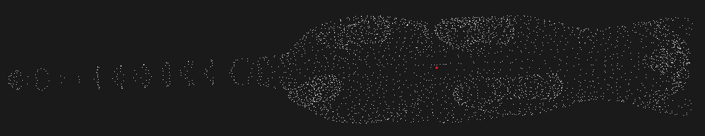
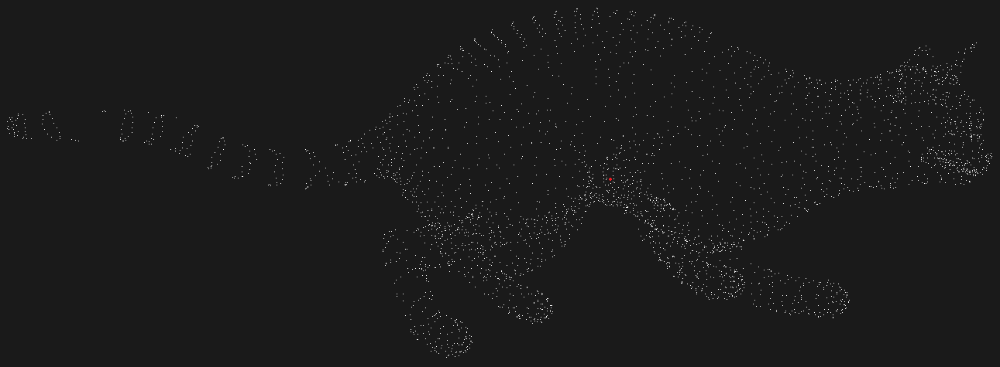
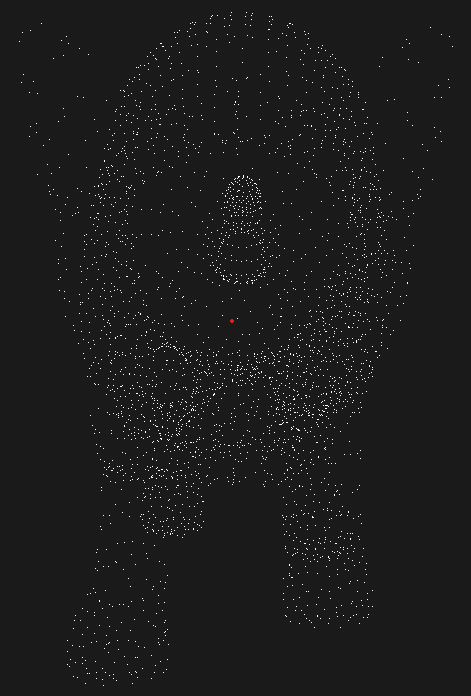
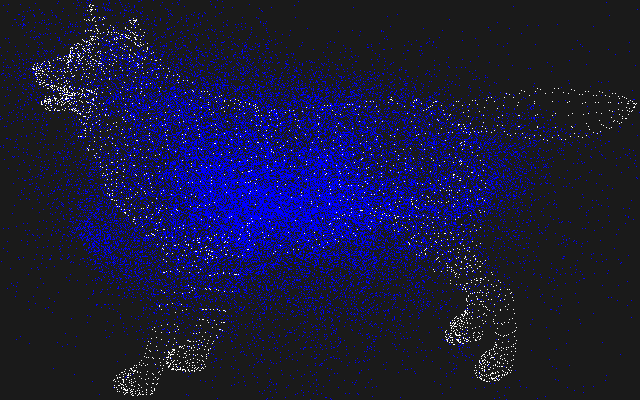

.. _implicit_shape_model:

Implicit Shape Model
--------------------

In this tutorial we will learn how to use the implicit shape model algorithm implemented in the ``pcl::ism::ImplicitShapeModel`` class.
This algorithm was described in the article `"Hough Transforms and 3D SURF for robust three dimensional classification" <http://homes.esat.kuleuven.be/~rtimofte/publications/Knopp-ECCV-2010.pdf>`_ by Jan Knopp, Mukta Prasad, Geert Willems, Radu Timofte, and Luc Van Gool.
This algorithm is a combination of generalized Hough transform and the Bag of Features approach and its purpose is as follows. Having some training set - point clouds of different objects of the known class - the algorithm computes a certain model which will be later used to predict an object center in the given cloud that wasn't a part of the training set.

Theoretical Primer
------------------

The algorithm consists of two steps, the first one is training, and the second is recognition of the objects in the clouds that weren't in the training set. Let's take a look at how the training is done. It consists of six steps:
  #. First of all the keypoint detection is made. In the given implementation it's just a simplification of the training clouds. At this step all the point clouds are simplified by the means of the voxel grid approach; remaining points are declared as keypoints.
  #. For every keypoint features are estimated. In the example below the FPFH estimation is used.
  #. All features are clustered with the help of k-means algorithm to construct a dictionary of visual (or geometric) words. Obtained clusters represent visual words. Every feature in the cluster is the instance of this visual word.
  #. For every single instance the direction to center is computed - a direction from the keypoint (from which the feature was obtained) to the center of mass of the given cloud.
  #. For each visual word the statistical weight is calculated by the formula:

     .. centered::
        :math:`W_{st}(c_i,v_j)=\frac{1}{n_{vw}(c_i)} \frac{1}{n_{vot}(v_j)} \frac{\frac{n_{vot}(c_i,v_j)}{n_{ftr}(c_i)}}{\sum_{c_k\in C}\frac{n_{vot}(c_k,v_j)}{n_{ftr}(c_k)}}`

     The statistical weight :math:`W_{st}(c_i,v_j)` weights all the votes cast by visual word :math:`v_j` for class :math:`c_i`. Here :math:`n_{vot}(v_j)` is the total number of votes from visual word :math:`v_j`, :math:`n_{vot}(c_i,v_j)` is the number of votes for class :math:`c_i` from :math:`v_j`, :math:`n_{vw}(c_i)` is the number of visual words that vote for class :math:`c_i`, :math:`n_{ftr}(c_i)` is the number of features from which :math:`c_i` was learned. :math:`C` is the set of all classes.
  #. For every keypoint (point for which feature was estimated) the learned weight is calculated by the formula:

     .. centered::
        :math:`W_{lrn}(\lambda_{ij})=f(\{e^{-\frac{{d_a(\lambda_{ij})}^2}{\sigma^2}} \mid a \in A\})`

     Authors of the article define :math:`\lambda_{ij}` as the vote cast by a particular instance of visual word :math:`v_j` on a particular training shape of class :math:`c_i`; that is, :math:`\lambda_{ij}` records the distance of the particular instance of visual word :math:`v_j` to the center of the training shape on which it was found. Here :math:`A` is the set of all features associated with word :math:`v_j` on a shape of class :math:`c_i`. The recommend value for :math:`\sigma` is 10% of the shape size. Function :math:`f` is simply a median. :math:`d_a(\lambda_{ij})` is the Euclidean distance between voted and actual center.

After the training process is done and the trained model (weights, directions etc.) is obtained, the process of object search (or recognition) takes place. It consists of next four steps:
  #. Keypoint detection.
  #. Feature estimation for every keypoint of the cloud.
  #. For each feature the search for the nearest visual word (that is a cluster) in the dictionary is made.
  #. For every feature

     * For every instance(which casts a vote for the class of interest) of every visual word from the trained model

       * Add vote with the corresponding direction and vote power computed by the formula

         .. centered::
            :math:`W(\lambda_{ij})=W_{st}(v_j,c_i) * W_{lrn}(\lambda_{ij})`

  #. Previous step gives us a set of directions to the expected center and the power for each vote. In order to get single point that corresponds to center these votes need to be analysed. For this purpose algorithm uses the non maxima suppression approach. User just needs to pass the radius of the object of interest and the rest will be done by the ``ISMVoteList::findStrongestPeaks ()`` method.

For more comprehensive information please refer to the article
`"Hough Transforms and 3D SURF for robust three dimensional classification" <http://homes.esat.kuleuven.be/~rtimofte/publications/Knopp-ECCV-2010.pdf>`_.

The code
--------

First of all you will need the set of point clouds for this tutorial - training set and set of clouds for recognition.
Below is the list of clouds that are well suited for this tutorial (they were borrowed from the Ohio dataset).

Clouds for training:
  * `Cat <https://raw.github.com/PointCloudLibrary/data/master/tutorials/ism_train_cat.pcd>`_
  * `Horse <https://raw.github.com/PointCloudLibrary/data/master/tutorials/ism_train_horse.pcd>`_
  * `Lioness <https://raw.github.com/PointCloudLibrary/data/master/tutorials/ism_train_lioness.pcd>`_
  * `Michael <https://raw.github.com/PointCloudLibrary/data/master/tutorials/ism_train_michael.pcd>`_
  * `Wolf <https://raw.github.com/PointCloudLibrary/data/master/tutorials/ism_train_wolf.pcd>`_

Clouds for testing:
  * `Cat <https://raw.github.com/PointCloudLibrary/data/master/tutorials/ism_test_cat.pcd>`_
  * `Horse <https://raw.github.com/PointCloudLibrary/data/master/tutorials/ism_test_horse.pcd>`_
  * `Lioness <https://raw.github.com/PointCloudLibrary/data/master/tutorials/ism_test_lioness.pcd>`_
  * `Michael <https://raw.github.com/PointCloudLibrary/data/master/tutorials/ism_test_michael.pcd>`_
  * `Wolf <https://raw.github.com/PointCloudLibrary/data/master/tutorials/ism_test_wolf.pcd>`_

Next what you need to do is to create a file ``implicit_shape_model.cpp`` in any editor you prefer and copy the following code inside of it:

.. literalinclude:: sources/implicit_shape_model/implicit_shape_model.cpp
   :language: cpp
   :linenos:

The explanation
---------------

Now let's study out what is the purpose of this code. The first lines of interest are these:

.. literalinclude:: sources/implicit_shape_model/implicit_shape_model.cpp
   :language: cpp
   :lines: 26-41

These lines simply load the clouds that will be used for training. Algorithm requires normals so this is the place where they are computed.
After the loop is passed all clouds will be inserted  to the training_clouds vector. training_normals and training_classes will store normals and class index for the corresponding object.

.. literalinclude:: sources/implicit_shape_model/implicit_shape_model.cpp
   :language: cpp
   :lines: 43-46

Here the instance of feature estimator is created, in our case it is the FPFH. It must be fully set up before it will be passed to the ISM algorithm. So this is the place where we define all feature estimation settings.

.. literalinclude:: sources/implicit_shape_model/implicit_shape_model.cpp
   :language: cpp
   :lines: 48-48

This line simply creates an instance of the ``pcl::ism::ImplicitShapeModelEstimation``. It is a template class that has three parameters:

  * FeatureSize - size of the features (histograms) to compute
  * PointT - type of points to work with
  * NormalT - type of normals to use

.. literalinclude:: sources/implicit_shape_model/implicit_shape_model.cpp
   :language: cpp
   :lines: 49-53

Here the instance is provided with the training data and feature estimator. The last line provides sampling size value used for cloud simplification as mentioned before.

.. literalinclude:: sources/implicit_shape_model/implicit_shape_model.cpp
   :language: cpp
   :lines: 55-57

These lines simply launch the training process.

.. literalinclude:: sources/implicit_shape_model/implicit_shape_model.cpp
   :language: cpp
   :lines: 59-60

Here the trained model that was obtained during the training process is saved to file for possible reuse.

The remaining part of the code may be moved with a few changes to another .cpp file and be presented as a separate program that is responsible for classification.

.. literalinclude:: sources/implicit_shape_model/implicit_shape_model.cpp
   :language: cpp
   :lines: 62-62

This line loads trained model from file. It is not necessary, because we already have the trained model. It is given to show how you can load the precomputed model.

.. literalinclude:: sources/implicit_shape_model/implicit_shape_model.cpp
   :language: cpp
   :lines: 64-71

The classification process needs the cloud and its normals as well as the training process. So these lines simply load the cloud and compute normals.

.. literalinclude:: sources/implicit_shape_model/implicit_shape_model.cpp
   :language: cpp
   :lines: 73-77

This line launches the classification process. It tells the algorithm to look for the objects of type ``testing_class`` in the given cloud ``testing_cloud``. Notice that the algorithm will use any trained model that you will pass. After the classification is done, the list of votes for center will be returned. ``pcl::ism::ISMVoteList`` is the separate class, which purpose is to help you to analyze the votes.

.. literalinclude:: sources/implicit_shape_model/implicit_shape_model.cpp
   :language: cpp
   :lines: 79-82

These lines are responsible for finding strongest peaks among the votes. This search is based on the non-maximum suppression idea, that's why the non-maximum radius is equal to the object radius that is taken from the trained model.

The rest of the code is simple enough. It is responsible for visualizing the cloud and computed strongest peaks which represent the estimated centers of the object of type ``testing_class``.

Compiling and running the program
---------------------------------

Add the following lines to your CMakeLists.txt file:

.. literalinclude:: sources/implicit_shape_model/CMakeLists.txt
   :language: cmake
   :linenos:

Note that here we tell the compiler that we want a release version of the binaries, because the process of training is too slow.
After you have made the executable, you can run it. Simply do::

  $ ./implicit_shape_model
        ism_train_cat.pcd      0
        ism_train_horse.pcd    1
        ism_train_lioness.pcd  2
        ism_train_michael.pcd  3
        ism_train_wolf.pcd     4
        ism_test_cat.pcd       0

Here you must pass the training clouds and the class of the object that it contains. The last two parameters are the cloud for testing and the class of interest that you are looking for in the testing cloud.

After the segmentation the cloud viewer window will be opened and you will see something similar to those images:

Here the red point represents the predicted center of the object that corresponds to the class of interest.
If you will try to visualize the votes you will see something similar to this image where blue points are votes:

