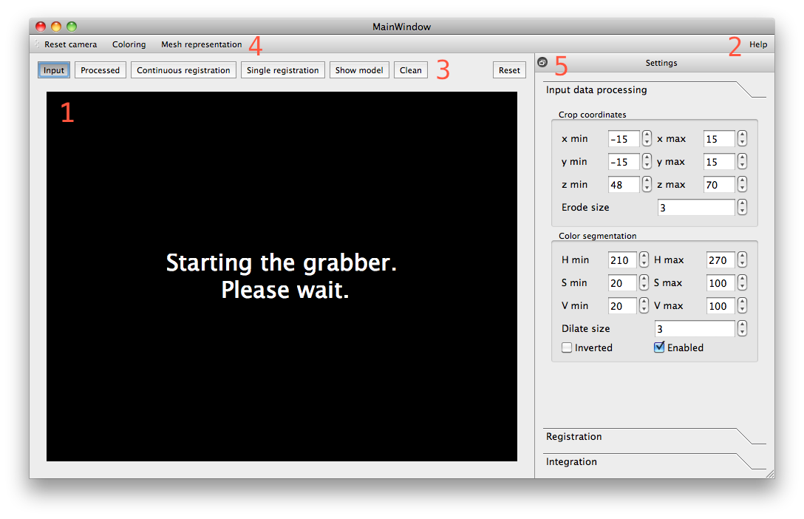
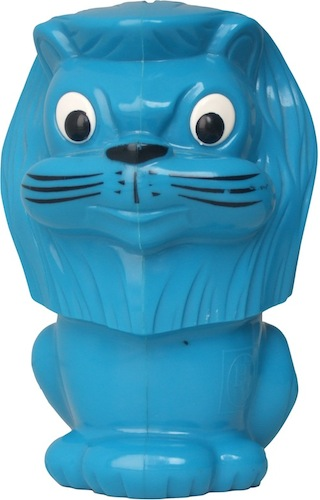
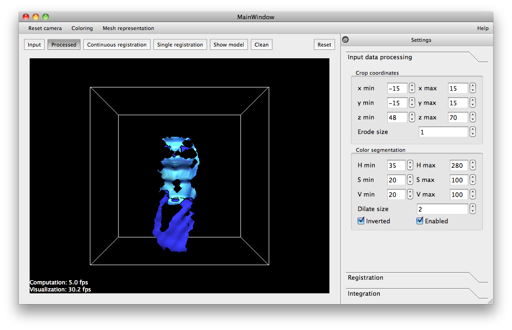
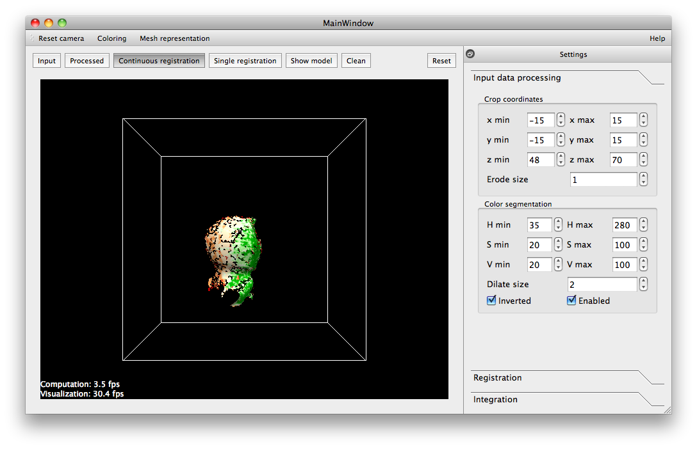
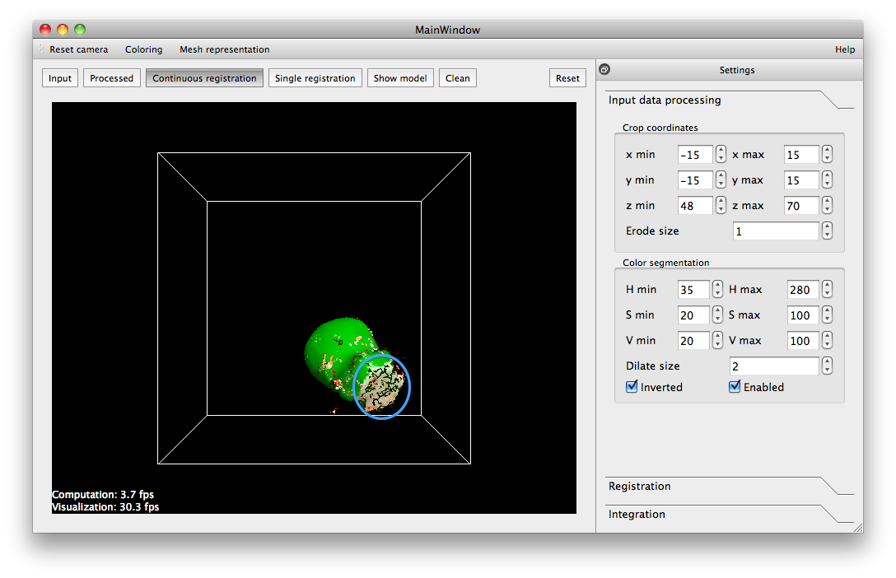
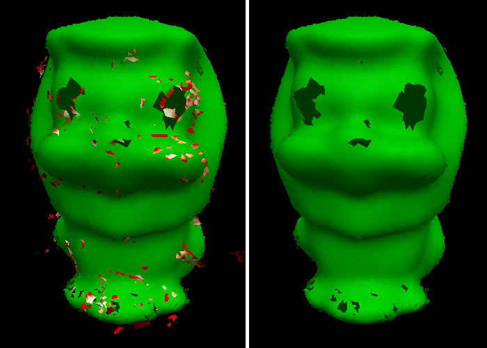
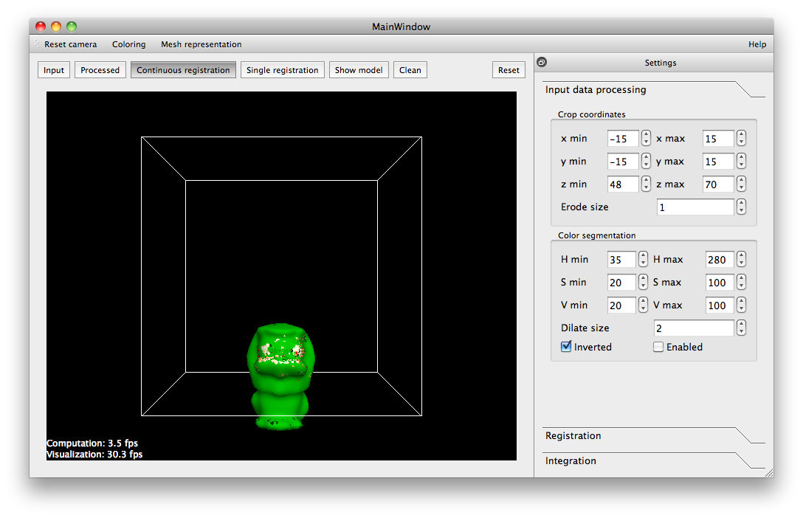
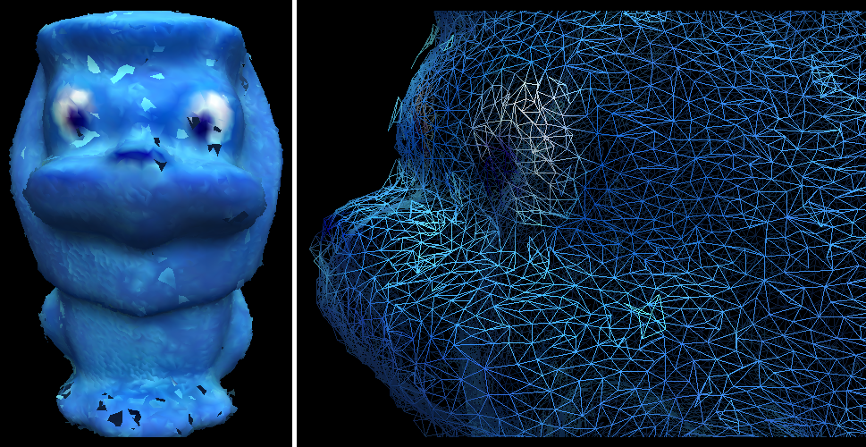

.. _in_hand_scanner:

---------------------------------
In-hand scanner for small objects
---------------------------------

Introduction
------------

The purpose of the in-hand scanner application is to obtain a 3D model from a small object. The user is turning the object around in front of the sensor while the geometry is reconstructed gradually. The rest of this tutorial assumes the usage of the Kinect sensor because the parameters of the application are set up for the device.

Prerequisites
-------------

- The object should be small with a size of about 10 to 20 cm. This results in about 10000 points in each frame after the object is segmented. The application is still usable with bigger objects but becomes very slow.
- The object must be rigid because the used registration algorithm can't align deformable objects.
- The object must have prominent geometric features because the texture is not considered during registration. For example, a symmetric bottle can't be reconstructed.
- The incoming point cloud from the sensor must be organized. This property is needed for the normals estimation, mesh reconstruction and merging.
- The color of the object must be different from the color of the user's hands. Alternatively it is possible to wear gloves with a different color than the object.
- No abrupt movements of the object while scanning.

How it works
------------

The application generates an initial surface mesh and gradually integrates new points into a common model. The scanning pipeline consists of several components:

- Grabber: Communicates with the device and gives notice when new data is available.

- Input data processing:

  - Computes normals for the following processing stages.

  - Creates a *foreground* mask which stores 'true' if the input point is within a specified volume of interest (cropping volume). This mask is eroded a few pixels in order to remove border points.

  - The foreground points are segmented into *hand* and *object* regions by applying a threshold to the color in the HSV color space. The hands region is dilated a few pixels in order to reduce the risk of accidentally including hand points into the object cloud.

  - Only the object points are forwarded to the registration.

- Registration: Aligns the processed data cloud to the common model mesh using the Iterative Closest Point (ICP) algorithm. The components are:

  - Fitness: Mean squared Euclidean distance of the correspondences after rejection.

  - Pre-selection: Discards model points that are facing away from the sensor.

  - Correspondence estimation: Nearest neighbor search using a kd-tree.

  - Correspondence rejection:

    - Discards correspondences with a squared Euclidean distance higher than a threshold. The threshold is initialized with infinity (no rejection in the first iteration) and set to the fitness of the last iteration multiplied by an user defined factor.

    - Discards correspondences where the angle between their normals is higher than an user defined threshold.

  - Transformation estimation: Minimization of the point to plane distance with the data cloud as source and model mesh as target.

  - Convergence criteria:

    - Epsilon: Convergence is detected when the *change* of the fitness between the current and previous iteration becomes smaller than an user defined epsilon value.

  - Failure criteria:

    - Maximum number of iterations exceeded.

    - Fitness is bigger than an user defined threshold (evaluated at the state of convergence).

    - Overlap between the model mesh and data cloud is smaller than an user defined threshold (evaluated at the state of convergence).

- Integration: Reconstructs an initial model mesh (unorganized) and merges the registered data clouds (organized) with the model.

  - Merging is done by searching for the nearest neighbors from the data cloud to the model mesh and averaging out corresponding points if the angle between their normals is smaller than a given threshold. If the squared Euclidean distance is higher than a given squared distance threshold the data points are added to the mesh as new vertices. The organized nature of the data cloud is used to connect the faces.

  - The outlier rejection is based on the assumption that outliers can't be observed from several *distinct* directions. Therefore each vertex stores a *visibility confidence* which is the number of unique directions from which it has been recorded. The vertices get a certain amount of time (maximum age) until they have to reach a minimum visibility confidence and else are removed from the mesh again. The vertices store an age which is initialized by zero and increased in each iteration. If the vertex had a correspondence in the current merging step the age is reset to zero. This setup makes sure that vertices that are currently being merged are always kept in the mesh regardless of their visibility confidence. Once the object has been turned around certain vertices can't be seen anymore. The age increases until they reach the maximum age when it is decided if they are kept in the mesh or removed.

The application
---------------

The following image shows the general layout of the application.

The main canvas (1) is used for visualization of the data and for showing general information. The viewpoint can be changed with the mouse:

- Left button: Rotate
- Middle button: Pan
- Right button & mouse wheel: Move towards to or away from the pivot of the virtual camera.

The various states of the application can be triggered by keyboard shortcuts which are listed in the help (2) or shown in tooltips when moving the mouse over the buttons. Please click into the main canvas to make sure that key press events are processed (the canvas looses focus when parameters are changed in the settings).

The buttons (3) above the main canvas change the current state of the application and allow triggering certain processing steps:

- 'Input': Shows the input cloud from the device.
- 'Processed': Shows the cloud after it went through input data processing. The cropping volume is shown as a wireframe box. The points that are removed during color segmentation are drawn blue.
- 'Continuous registration': Registers and integrates new data to the first acquired scan continuously until it is stopped manually.
- 'Single registration': Registers and integrates one new frame to the common model and returns to showing the processed input data.
- 'Show model': Shows the scanned model without further distractions.
- 'Clean': Removes all vertices that have a low visibility confidence.
- 'Reset': Deletes the scanned model.

The buttons (4) set how the current data is drawn.

- 'Reset camera': Resets the camera to the viewpoint of the device.

- 'Coloring': Toggles between several coloring modes:

  - Original color of the data.
  - One color for all points.
  - Colormap according to the visibility confidence (red = low, green = high).

- 'Mesh representation': Toggles the visualization type of the mesh:

  - Points
  - Wireframe
  - Surface

The settings of the application are shown in the toolbox on the right (5). The values have been tuned for scanning small objects with the Kinect so most of them don't have to be changed. The values that have to be adjusted before scanning are the ones in the 'Input data processing' tab as it is explained in the next section.

The scanned model can be saved from the menu bar (not shown).

How to use it
-------------

In the following section I will go through the steps to scan in a model of the 'lion' object which is about 15 cm high.

Once the application has connected to the device it shows the incoming data. The first step is to set up the thresholds for the object segmentation:

- Press '2' to show the processed data.
- Go to the 'Input Data Processing' settings and adjust the values for the cropping volume and the color segmentation as shown in the next image.
- The color mask can be inverted if needed.
- Keep the 'erode size' as small as possible. Make the 'dilate size' just big enough to remove most of the points on the hands.

Now start with the continuous registration (press '3'). This automatically changes the coloring to a colormap according to the input confidence. The goal is to turn the object around until the whole surface becomes green. For this each point has to be recorded from as many *different* directions as possible. In the following image the object has been turned about the vertical axis. The newest points in the front have not been recorded by enough directions yet (red, orange, white) while the points on the right side have been scanned in sufficiently (green).

Avoid occluding the object by the hands and try to turn the object in such a way that as many geometric features of the shape are shown as possible. For example the lion object has one flat surface at the bottom (blue circle). It is not good to point this side directly towards to the sensor because the almost planar side has very few geometric features resulting in a bad alignment. Therefore it is best to include other sides while scanning as shown in the image. This procedure also helps reducing the error accumulation (loop closure problem).

After all sides have been scanned the registration can be stopped by pressing '5' which shows the current model. Any remaining outliers can be removed by pressing '6' (clean) as shown in the next image.

The eyes of the lion could not be scanned in because they were filtered out by the color segmentation. To circumvent this problem it is possible to resume the scanning procedure with the color segmentation disabled. Now one has to be very careful to keep the hands out of the cropping volume. This way it is possible to scan in additional parts as shown in the next image.

The following image shows the final model where the eyes have been scanned in as well. However this resulted integrating a few more isolated surface patches into the mesh (light blue). There are still small holes in the mesh which in theory could be closed by the application but this would take a long time.

The parameters in the 'Registration' and 'Integration' settings have not been covered so far. The registration parameters are described in the application's help and there is usually no need to make big adjustments. You might want to tweak some of the integration settings:

- Increasing the 'maximum squared distance' results in an increased mesh size for newly integrated points.
- Increasing the 'maximum age' keeps vertices with a low input confidence longer in the mesh (delays the check for the visibility confidence).
- Decreasing the 'minimum directions' (visibility confidence) increases the chance that points are kept in the mesh but this results a bigger noise and more accepted outliers as well.

Future work
-----------

- Improvement of the speed of the registration. It currently spends a great amount of time during the correspondence estimation (kd-tree). I tried to use different methods but the faster ones are not as accurate as needed.

- There is currently no loop detection or loop closure implemented. The error accumulation is reduced by integrating new points into a common model but it is still possible that the borders don't match when the object has been fully turned around.

- The application tries to reconstruct the final mesh directly while scanning. The current meshing algorithm creates a preliminary surface mesh quickly. However filling all small holes takes a long time. Therefore running a hole filling algorithm every few frames would help speeding up the process. An alternative would be to run a manually triggered surface reconstruction algorithm once the general geometry of the object has been recorded.
