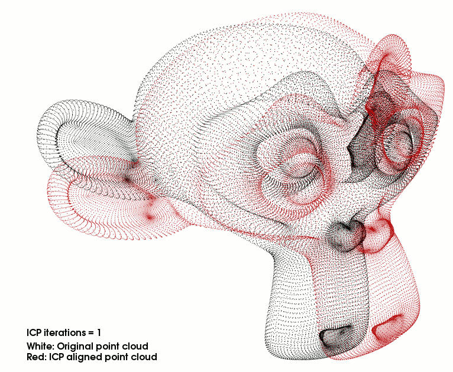

.. _interactive_icp:

===================================
Interactive Iterative Closest Point
===================================

This tutorial will teach you how to write an interactive ICP viewer. The program will 
load a point cloud and apply a rigid transformation on it. After that the ICP algorithm will
align the transformed point cloud with the original. Each time the user presses "space"
an ICP iteration is done and the viewer is refreshed.

.. contents::

Creating a mesh with Blender
============================
You can easily create a sample point cloud with Blender.
Install and open Blender then delete the cube in the scene by pressing "Del" key :

.. image:: images/interactive_icp/del_cube.png
  :height: 285

Add a monkey mesh in the scene :

.. image:: images/interactive_icp/add_monkey.png
  :height: 328

Subdivide the original mesh to make it more dense :

.. image:: images/interactive_icp/add_sub.png
  :height: 500

Configure the subdivision to 2 or 3 for example : dont forget to apply the modifier

.. image:: images/interactive_icp/sub2.png
  :height: 203

Export the mesh into a PLY file :

.. image:: images/interactive_icp/export.png
  :height: 481

The code
========

First, create a file, let's say, ``interactive_icp.cpp`` in your favorite
editor, and place the following code inside it:

.. literalinclude:: sources/interactive_icp/interactive_icp.cpp
   :language: cpp
   :linenos:

The explanations
================

Now, let's break down the code piece by piece.

.. literalinclude:: sources/interactive_icp/interactive_icp.cpp
   :language: cpp
   :lines: 1-8

We include all the headers we will make use of.
**#include <pcl/registration/ia_ransac.h>** allows us to use **pcl::transformPointCloud** function.
**#include <pcl/console/parse.h>>** allows us to use parse the arguments given to the program.

.. literalinclude:: sources/interactive_icp/interactive_icp.cpp
   :language: cpp
   :lines: 9-12

Two typedefs to simplify declarations and code reading.
The bool will help us know when the user asks for the next iteration of ICP

.. literalinclude:: sources/interactive_icp/interactive_icp.cpp
   :language: cpp
   :lines: 14-24

This functions takes the reference of a 4x4 matrix and prints the rigid transformation in an human 
readable way.

.. literalinclude:: sources/interactive_icp/interactive_icp.cpp
   :language: cpp
   :lines: 25-32

This function is the callback for the viewer. This function will be called whenever a key is pressed
when the viewer window is on top. If "space" is hit; set the bool to true.

.. literalinclude:: sources/interactive_icp/interactive_icp.cpp
   :language: cpp
   :lines: 38-41

The 3 point clouds we will use to store the data.

.. literalinclude:: sources/interactive_icp/interactive_icp.cpp
   :language: cpp
   :lines: 42-71

We check the arguments of the program, set the number of initial ICP iterations
and try to load the PLY file.

.. literalinclude:: sources/interactive_icp/interactive_icp.cpp
   :language: cpp
   :lines: 72-91

We transform the original point cloud using a rigid matrix transformation.
See the related tutorial in PCL documentation for more information.
**cloud_in** contains the original point cloud.
**cloud_tr** and **cloud_icp** contains the translated/rotated point cloud.
**cloud_tr** is a backup we will use for display (green point cloud).

.. literalinclude:: sources/interactive_icp/interactive_icp.cpp
   :language: cpp
   :lines: 93-101

This is the creation of the ICP object. We set the parameters of the ICP algorithm.
**setMaximumIterations(iterations)** sets the number of initial iterations to do (1
is the default value). We then transform the point cloud into **cloud_icp**.
After the first alignment we set ICP max iterations to 1 for all the next times this
ICP object will be used (when the user presses "space").

.. literalinclude:: sources/interactive_icp/interactive_icp.cpp
   :language: cpp
   :lines: 103-115

Check if the ICP algorithm converged; otherwise exit the program.
In case of success we store the transformation matrix in a 4x4 matrix and
then print the rigid matrix transformation. The reason why we store this
matrix is explained later.

.. literalinclude:: sources/interactive_icp/interactive_icp.cpp
   :language: cpp
   :lines: 117-127

For the visualization we create two viewports in the visualizer vertically
separated. **bckgr_gray_level** and **txt_gray_lvl** are variables to easily
switch from white background & black text/point cloud to black background & 
white text/point cloud.

.. literalinclude:: sources/interactive_icp/interactive_icp.cpp
   :language: cpp
   :lines: 129-141

We add the original point cloud in the 2 viewports and display it the same color
as **txt_gray_lvl**. We add the point cloud we transformed using the matrix in the left
viewport in green and the point cloud aligned with ICP in red (right viewport).

.. literalinclude:: sources/interactive_icp/interactive_icp.cpp
   :language: cpp
   :lines: 143-150

We add descriptions for the point clouds in each viewport so the user knows what is what.
The string stream ss is needed to transform the integer **iterations** into a string.

.. literalinclude:: sources/interactive_icp/interactive_icp.cpp
   :language: cpp
   :lines: 152-161

We set the two viewports background color according to **bckgr_gray_level**.
To get the camera parameters I simply pressed "C" in the viewer. Then I copied the 
parameters into this function to save the camera position / orientation / focal point.
The function **registerKeyboardCallback** allows us to call a function whenever the
users pressed a keyboard key when viewer windows is on top.

.. literalinclude:: sources/interactive_icp/interactive_icp.cpp
   :language: cpp
   :lines: 163-166

This is the normal behaviour if no key is pressed. The viewer waits to exit.

.. literalinclude:: sources/interactive_icp/interactive_icp.cpp
   :language: cpp
   :lines: 169-172

If the user press any key of the keyboard, the function **keyboardEventOccurred** is called;
this function checks if the key is "space" or not. If yes the global bool **next_iteration**
is set to true, allowing the viewer loop to enter the next part of the code: the ICP object
is called to align the meshes. Remember we already configured this object input/output clouds
and we set max iterations to 1 in lines 90-93.

.. literalinclude:: sources/interactive_icp/interactive_icp.cpp
   :language: cpp
   :lines: 167-194

As before we check if ICP as converged, if not we exit the program.
**printf("\033[11A");** is a little trick to go up 11 lines in the terminal to write
over the last matrix displayed. In short it allows to replace text instead of writing
new lines; making the ouptut more readable.
We increment **iterations** to update the text value in the visualizer.

Now we want to display the rigid transformation from the original transformed point cloud to
the current alignment made by ICP. The function **getFinalTransformation()** returns the rigid
matrix transformation done during the iterations (here: 1 iteration). This means that if you have already
done 10 iterations this function returns the matrix to transform the point cloud from the iteration 10 to 11.

This is not what we want. If we multiply the last matrix with the new one the result is the transformation matrix from
the start to the current iteration. This is basically how it works ::

  matrix[ICP 0->1]*matrix[ICP 1->2]*matrix[ICP 2->3] = matrix[ICP 0->3]

While this is mathematically true, you will easilly notice that this is not true in this program due to roundings.
This is why I introduced the initial ICP iteration parameters. Try to launch the program with 20 initial iterations
and save the matrix in a text file. Launch the same program with 1 initial iteration and press space till you go to 20
iterations. You will a notice a slight difference. The matrix with 20 initial iterations is much more accurate than the
one multiplied 19 times.

.. literalinclude:: sources/interactive_icp/interactive_icp.cpp
   :language: cpp
   :lines: 195-199

We set the bool to false and the rest is the ending of the program.

Compiling and running the program
=================================

Add the following lines to your CMakeLists.txt file:

.. literalinclude:: sources/interactive_icp/CMakeLists.txt
   :language: cmake
   :linenos:

After you have made the executable, you can run it. Simply do::

  $ ./interactive_icp monkey.ply 1

Remember that the matrix displayed is not very accurate if you do a lot of iterations 
by pressing "space".

You will see something similar to this::

  $ ./interactive_icp ../monkey.ply 5
  [pcl::PLYReader] ../monkey.ply:12: property 'list uint8 uint32 vertex_indices' of element 'face' is not handled
  
  Loaded file ../monkey.ply (125952 points) in 578 ms
  
  Applying this rigid transformation to: cloud_in -> cloud_icp
  Rotation matrix :
      |  0.924 -0.383  0.000 | 
  R = |  0.383  0.924  0.000 | 
      |  0.000  0.000  1.000 | 
  Translation vector :
  t = <  0.000,  0.000,  0.400 >
  
  Applied 1 ICP iteration(s) in 2109 ms
  
  ICP has converged, score is 0.0182442
  
  ICP transformation 1 : cloud_icp -> cloud_in
  Rotation matrix :
      |  0.998  0.066 -0.003 | 
  R = | -0.066  0.997  0.033 | 
      |  0.005 -0.033  0.999 | 
  Translation vector :
  t = <  0.022, -0.017, -0.097 >

If ICP did a perfect job the two matrices should have exactly the same values and
the matrix found by ICP should have inverted signs outside the diagonal. For example ::

      |  0.924 -0.383  0.000 | 
  R = |  0.383  0.924  0.000 | 
      |  0.000  0.000  1.000 | 
  Translation vector :
  t = <  0.000,  0.000,  0.400 >

      |  0.924  0.383  0.000 | 
  R = | -0.383  0.924  0.000 | 
      |  0.000  0.000  1.000 | 
  Translation vector :
  t = <  0.000,  0.000, -0.400 >

.. DANGER::
   If you iterate several times manually using "space"; the results will become more and more erroned because
   of the matrix multiplication (see line 181 of the original code)
   If you seek precision, provide an initial number of iterations to the program

.. image:: images/interactive_icp/icp-1.png
  :height: 605

After 25 iterations the models fits perfectly the original cloud. Remember that this is an easy job for ICP because
you are asking to align two identical point clouds !

