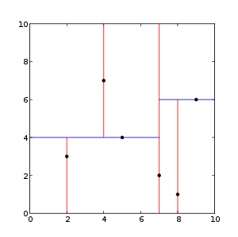
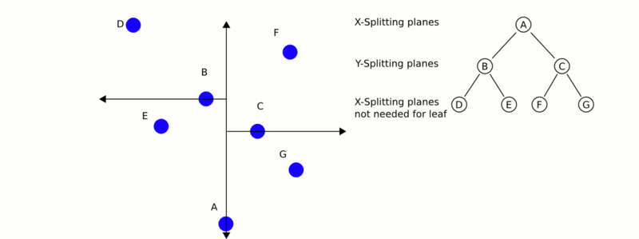

.. _kdtree_search:

How to use a KdTree to search
-----------------------------

In this tutorial we will go over how to use a KdTree for finding the K nearest neighbors of a specific point or location, and then we will also go over how to find all neighbors within some radius specified by the user (in this case random).

Theoretical primer
------------------

A k-d tree, or k-dimensional tree, is a data structure used in computer science for organizing some number of points in a space with k dimensions.  It is a binary search tree with other constraints imposed on it. K-d trees are very useful for range and nearest neighbor searches.  For our purposes we will generally only be dealing with point clouds in three dimensions, so all of our k-d trees will be three-dimensional.  Each level of a k-d tree splits all children along a specific dimension, using a hyperplane that is perpendicular to the corresponding axis.  At the root of the tree all children will be split based on the first dimension (i.e. if the first dimension coordinate is less than the root it will be in the left-sub tree and if it is greater than the root it will obviously be in the right sub-tree).  Each level down in the tree divides on the next dimension, returning to the first dimension once all others have been exhausted.  The most efficient way to build a k-d tree is to use a partition method like the one Quick Sort uses to place the median point at the root and everything with a smaller one-dimensional value to the left and larger to the right.  You then repeat this procedure on both the left and right sub-trees until the last trees that you are to partition are only composed of one element.

From [Wikipedia]_:

  	This is an example of a 2-dimensional k-d tree

	This is a demonstration of how the Nearest-Neighbor search works.

The code
--------

Create a file, let's say, ``kdtree_search.cpp`` in your favorite editor and place the following inside:

.. literalinclude:: sources/kdtree_search/kdtree_search.cpp
   :language: cpp
   :linenos:

The explanation
---------------

The following code first seeds rand() with the system time and then creates and fills a PointCloud with random data.

.. literalinclude:: sources/kdtree_search/kdtree_search.cpp
   :language: cpp
   :lines: 11-25

This next bit of code creates our kdtree object and sets our randomly created cloud as the input.  Then we create a "searchPoint" which is assigned random coordinates.

.. literalinclude:: sources/kdtree_search/kdtree_search.cpp
   :language: cpp
   :lines: 27-35

Now we create an integer (and set it equal to 10) and two vectors for storing our K nearest neighbors from the search.

.. literalinclude:: sources/kdtree_search/kdtree_search.cpp
   :language: cpp
   :lines: 37-47

Assuming that our KdTree returns more than 0 closest neighbors it then prints out the locations of all 10 closest neighbors to our random "searchPoint" which have been stored in our previously created vectors.

.. literalinclude:: sources/kdtree_search/kdtree_search.cpp
   :language: cpp
   :lines: 49-56

Now our code demonstrates finding all neighbors to our given "searchPoint" within some (randomly generated) radius.  It again creates 2 vectors for storing information about our neighbors.

.. literalinclude:: sources/kdtree_search/kdtree_search.cpp
   :language: cpp
   :lines: 58-63

Again, like before if our KdTree returns more than 0 neighbors within the specified radius it prints out the coordinates of these points which have been stored in our vectors.

.. literalinclude:: sources/kdtree_search/kdtree_search.cpp
   :language: cpp
   :lines: 71-78

Compiling and running the program
---------------------------------

Add the following lines to your CMakeLists.txt file:

.. literalinclude:: sources/kdtree_search/CMakeLists.txt
   :language: cmake
   :linenos:

After you have made the executable, you can run it. Simply do::

  $ ./kdtree_search

Once you have run it you should see something similar to this::

  K nearest neighbor search at (455.807 417.256 406.502) with K=10
    494.728 371.875 351.687 (squared distance: 6578.99)
    506.066 420.079 478.278 (squared distance: 7685.67)
    368.546 427.623 416.388 (squared distance: 7819.75)
    474.832 383.041 323.293 (squared distance: 8456.34)
    470.992 334.084 468.459 (squared distance: 10986.9)
    560.884 417.637 364.518 (squared distance: 12803.8)
    466.703 475.716 306.269 (squared distance: 13582.9)
    456.907 336.035 304.529 (squared distance: 16996.7)
    452.288 387.943 279.481 (squared distance: 17005.9)
    476.642 410.422 268.057 (squared distance: 19647.9)
  Neighbors within radius search at (455.807 417.256 406.502) with radius=225.932
    494.728 371.875 351.687 (squared distance: 6578.99)
    506.066 420.079 478.278 (squared distance: 7685.67)
    368.546 427.623 416.388 (squared distance: 7819.75)
    474.832 383.041 323.293 (squared distance: 8456.34)
    470.992 334.084 468.459 (squared distance: 10986.9)
    560.884 417.637 364.518 (squared distance: 12803.8)
    466.703 475.716 306.269 (squared distance: 13582.9)
    456.907 336.035 304.529 (squared distance: 16996.7)
    452.288 387.943 279.481 (squared distance: 17005.9)
    476.642 410.422 268.057 (squared distance: 19647.9)
    499.429 541.532 351.35 (squared distance: 20389)
    574.418 452.961 334.7 (squared distance: 20498.9)
    336.785 391.057 488.71 (squared distance: 21611)
    319.765 406.187 350.955 (squared distance: 21715.6)
    528.89 289.583 378.979 (squared distance: 22399.1)
    504.509 459.609 541.732 (squared distance: 22452.8)
    539.854 349.333 300.395 (squared distance: 22936.3)
    548.51 458.035 292.812 (squared distance: 23182.1)
    546.284 426.67 535.989 (squared distance: 25041.6)
    577.058 390.276 508.597 (squared distance: 25853.1)
    543.16 458.727 276.859 (squared distance: 26157.5)
    613.997 387.397 443.207 (squared distance: 27262.7)
    608.235 467.363 327.264 (squared distance: 32023.6)
    506.842 591.736 391.923 (squared distance: 33260.3)
    529.842 475.715 241.532 (squared distance: 36113.7)
    485.822 322.623 244.347 (squared distance: 36150.5)
    362.036 318.014 269.201 (squared distance: 37493.6)
    493.806 600.083 462.742 (squared distance: 38032.3)
    392.315 368.085 585.37 (squared distance: 38442.9)
    303.826 428.659 533.642 (squared distance: 39392.8)
    616.492 424.551 289.524 (squared distance: 39556.8)
    320.563 333.216 278.242 (squared distance: 41804.5)
    646.599 502.256 424.46 (squared distance: 43948.8)
    556.202 325.013 568.252 (squared distance: 44751)
    291.27 497.352 515.938 (squared distance: 45463.9)
    286.483 322.401 495.377 (squared distance: 45567.2)
    367.288 550.421 550.551 (squared distance: 46318.6)
    595.122 582.77 394.894 (squared distance: 46938.1)
    256.784 499.401 379.931 (squared distance: 47064.1)
    430.782 230.854 293.829 (squared distance: 48067.2)
    261.051 486.593 329.854 (squared distance: 48612.7)
    602.061 327.892 545.269 (squared distance: 48632.4)
    347.074 610.994 395.622 (squared distance: 49475.6)
    482.876 284.894 583.888 (squared distance: 49718.6)
    356.962 247.285 514.959 (squared distance: 50423.7)
    282.065 509.488 516.216 (squared distance: 50730.4)

.. [Wikipedia] http://en.wikipedia.org/wiki/K-d_tree
