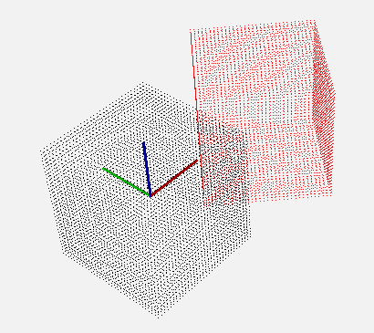

.. _matrix_transform:

Using a matrix to transform a point cloud
-----------------------------------------

In this tutorial we will learn how to transform a point cloud using a 4x4 matrix.
We will apply a rotation and a translation to a loaded point cloud and display the
result.

This program is able to load one PCD or PLY file; apply a matrix transformation on it
and display the original and transformed point cloud. 

The code
--------

First, create a file, let's say, ``matrix_transform.cpp`` in your favorite
editor, and place the following code inside it:

.. literalinclude:: sources/matrix_transform/matrix_transform.cpp
   :language: cpp
   :linenos:

The explanation
---------------

Now, let's break down the code piece by piece.

.. literalinclude:: sources/matrix_transform/matrix_transform.cpp
   :language: cpp
   :lines: 1-8

We include all the headers we will make use of.
**#include <pcl/common/transforms.h>** allows us to use **pcl::transformPointCloud** function.

.. literalinclude:: sources/matrix_transform/matrix_transform.cpp
   :language: cpp
   :lines: 10-17

This function display the help in case the user didn't provide expected arguments.

.. literalinclude:: sources/matrix_transform/matrix_transform.cpp
   :language: cpp
   :lines: 24-28

We parse the arguments on the command line, either using **-h** or **--help** will 
display the help. This terminates the program

.. literalinclude:: sources/matrix_transform/matrix_transform.cpp
   :language: cpp
   :lines: 30-45

We look for .ply or .pcd filenames in the arguments. If not found; terminate the program.
The bool **file_is_pcd** will help us choose between loading PCD or PLY file.

.. literalinclude:: sources/matrix_transform/matrix_transform.cpp
   :language: cpp
   :lines: 47-62

We now load the PCD/PLY file and check if the file was loaded successfully. Otherwise terminate
the program.

.. literalinclude:: sources/matrix_transform/matrix_transform.cpp
   :language: cpp
   :lines: 64-75

This is a first approach to create a transformation. This will help you understand how transformation matrices work.
We initialize a 4x4 matrix to identity;  ::

          |  1  0  0  0  |
      i = |  0  1  0  0  |
          |  0  0  1  0  |
          |  0  0  0  1  |

.. note::

  The identity matrix is the equivalent of "1" when multiplying numbers; it changes nothing.
  It is a square matrix with ones on the main diagonal and zeros elsewhere.

This means no transformation (no rotation and no translation). We do not use the 
last row of the matrix.

The first 3 rows and columns (top left) components are the rotation
matrix. The first 3 rows of the last column is the translation.

.. literalinclude:: sources/matrix_transform/matrix_transform.cpp
   :language: cpp
   :lines: 77-90

Here we defined a 45° (PI/4) rotation around the Z axis and a translation on the X axis.
This is the transformation we just defined ::

          |  cos(θ) -sin(θ)  0.0 |
      R = |  sin(θ)  cos(θ)  0.0 |
          |  0.0     0.0     1.0 |

      t = < 2.5, 0.0, 0.0 >

.. literalinclude:: sources/matrix_transform/matrix_transform.cpp
   :language: cpp
   :lines: 92-105

This second approach is easier to understand and is less error prone. 
Be careful if you want to apply several rotations; rotations are not commutative ! This means than in most cases:
rotA * rotB != rotB * rotA.

.. literalinclude:: sources/matrix_transform/matrix_transform.cpp
   :language: cpp
   :lines: 107-110

Now we apply this matrix on the point cloud **source_cloud** and we save the result in the
newly created **transformed_cloud**.

.. literalinclude:: sources/matrix_transform/matrix_transform.cpp
   :language: cpp
   :lines: 112-135

We then visualize the result using the **PCLVisualizer**. The original point cloud will be
displayed white and the transformed one in red. The coordoniates axis will be displayed.
We also set the background color of the visualizer and the point display size.

Compiling and running the program
---------------------------------

Add the following lines to your CMakeLists.txt file:

.. literalinclude:: sources/matrix_transform/CMakeLists.txt
   :language: cmake
   :linenos:

After you have made the executable, run it passing a path to a PCD or PLY file.
To reproduce the results shown below, you can download the `cube.ply
<https://raw.github.com/PointCloudLibrary/pcl/master/test/cube.ply>`_ file::

  $ ./matrix_transform cube.ply

You will see something similar to this::

  ./matrix_transform cube.ply 
  [pcl::PLYReader] /home/victor/cube.ply:12: property 'list uint8 uint32 vertex_indices' of element 'face' is not handled
  Method #1: using a Matrix4f
   0.707107 -0.707107         0       2.5
   0.707107  0.707107         0         0
          0         0         1         0
          0         0         0         1
  
  Method #2: using an Affine3f
   0.707107 -0.707107         0       2.5
   0.707107  0.707107         0         0
          0         0         1         0
          0         0         0         1
  
  Point cloud colors :	white	= original point cloud
                         red	= transformed point cloud

More about transformations
--------------------------

| So now you successfully transformed a point cloud using a transformation matrix.
| What if you want to transform a single point ? A vector ?

| A point is defined in 3D space with its three coordinates; x,y,z (in a cartesian coordinate system).
| How can you multiply a vector (with 3 coordinates) with a 4x4 matrix ? You simply can't ! If you don't know why please refer to `matrix multiplications on wikipedia <https://en.wikipedia.org/wiki/Matrix_multiplication>`_.

We need a vector with 4 components. What do you put in the last component ? It depends on what you want to do:

* If you want to transform a point: put 1 at the end of the vector so that the translation is taken in account.
* If you want to transform the direction of a vector: put 0 at the end of the vector to ignore the translation.

Here's a quick example, we want to transform the following vector: ::

  [10, 5, 0, 3, 0, -1]

| Where the first 3 components defines the origin coordinates and the last 3 components the direction.
| This vector starts at point 10, 5, 0 and ends at 13, 5, -1.

This is what you need to do to transform the vector: ::

  [10, 5, 0,  1] * 4x4_transformation_matrix
  [3,  0, -1, 0] * 4x4_transformation_matrix

