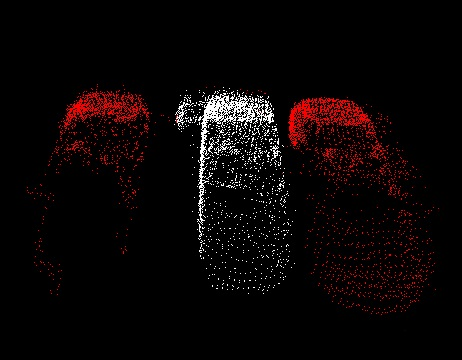

.. _min_cut_segmentation:

Min-Cut Based Segmentation
---------------------------

In this tutorial we will learn how to use the min-cut based segmentation algorithm implemented in the ``pcl::MinCutSegmentation`` class.
This algorithm makes a binary segmentation of the given input cloud. Having objects center and its radius the algorithm divides the cloud on two sets:
foreground and background points (points that belong to the object and those that do not belong).

Theoretical Primer
---------------------------

The idea of this algorithm is as follows:

 #. For the given point cloud algorithm constructs the graph that contains every single point of the cloud as a set of vertices and two more vertices
    called source and sink. Every vertex of the graph that corresponds to the point is connected with source and sink with the edges.
    In addition to these, every vertex (except source and sink) has edges that connect the corresponding point with its nearest neighbours.
 #. Algorithm assigns weights for every edge. There are three different types of weight. Let's examine them:

     * First of all it assigns weight to the edges between clouds points. This weight is called smooth cost and is calculated by the formula:

       .. centered::
          :math:`smoothCost=e^{-(\frac{dist}{ \sigma })^2}`

       Here :math:`dist` is the distance between points. The farther away the points are, the more is probability that the edge will be cut.

     * Next step the algorithm sets data cost. It consists of foreground and background penalties.
       The first one is the weight for those edges that connect clouds points with the source vertex and has the constant user-defined value.
       The second one is assigned to the edges that connect points with the sink vertex and is calculated by the formula:

       .. centered::
          :math:`backgroundPenalty=(\frac{distanceToCenter}{radius})`

       Here :math:`distanceToCenter` is the distance to the expected center of the object in the horizontal plane:

       .. centered::
          :math:`distanceToCenter=\sqrt{(x-centerX)^2+(y-centerY)^2}`

       Radius that occurs in the formula is the input parameter for this algorithm and can be roughly considered as the range from objects center
       outside of which there are no points that belong to foreground (objects horizontal radius).

 #. After all the preparations the search of the minimum cut is made. Based on an analysis of this cut, cloud is divided on forground and
    background points.

For more comprehensive information please refer to the article
`"Min-Cut Based Segmentation of Point Clouds" <http://gfx.cs.princeton.edu/pubs/Golovinskiy_2009_MBS/index.php>`_.

The code
--------

First of all you will need the point cloud for this tutorial.
`This <https://raw.github.com/PointCloudLibrary/data/master/tutorials/min_cut_segmentation_tutorial.pcd>`_ is a good one for the purposes of the algorithm.
Next what you need to do is to create a file ``min_cut_segmentation.cpp`` in any editor you prefer and copy the following code inside of it:

.. literalinclude:: sources/min_cut_segmentation/min_cut_segmentation.cpp
   :language: cpp
   :linenos:

The explanation
---------------

Now let's study out what is the purpose of this code. First few lines will be omitted, because they are obvious.

.. literalinclude:: sources/min_cut_segmentation/min_cut_segmentation.cpp
   :language: cpp
   :lines: 11-16

These lines are simply loading the cloud from the .pcd file.

.. literalinclude:: sources/min_cut_segmentation/min_cut_segmentation.cpp
   :language: cpp
   :lines: 18-23

This few lines are not necessary. Their only purpose is to show that ``pcl::MinCutSegmentation`` class can work with indices.

.. literalinclude:: sources/min_cut_segmentation/min_cut_segmentation.cpp
   :language: cpp
   :lines: 25-25

Here is the line where the instantiation of the ``pcl::MinCutSegmentation`` class takes place.
It is the tamplate class that has only one parameter - PointT - which says what type of points will be used.

.. literalinclude:: sources/min_cut_segmentation/min_cut_segmentation.cpp
   :language: cpp
   :lines: 26-27

These lines provide the algorithm with the cloud that must be segmented and the indices.

.. literalinclude:: sources/min_cut_segmentation/min_cut_segmentation.cpp
   :language: cpp
   :lines: 29-35

As mentioned before, algorithm requires point that is known to be the objects center. These lines provide it.

.. literalinclude:: sources/min_cut_segmentation/min_cut_segmentation.cpp
   :language: cpp
   :lines: 37-38

These lines set :math:`\sigma` and objects radius required for smooth cost calculation.

.. literalinclude:: sources/min_cut_segmentation/min_cut_segmentation.cpp
   :language: cpp
   :lines: 39-39

This line tells how much neighbours to find when constructing the graph. The more neighbours is set, the more number of edges it will contain.

.. literalinclude:: sources/min_cut_segmentation/min_cut_segmentation.cpp
   :language: cpp
   :lines: 40-40

Here is the line where foreground penalty is set.

.. literalinclude:: sources/min_cut_segmentation/min_cut_segmentation.cpp
   :language: cpp
   :lines: 42-43

These lines are responsible for launching the algorithm. After the segmentation clusters will contain the result.

.. literalinclude:: sources/min_cut_segmentation/min_cut_segmentation.cpp
   :language: cpp
   :lines: 45-45

You can easily access the flow value that was computed during the graph cut. This is exactly what happening here.

.. literalinclude:: sources/min_cut_segmentation/min_cut_segmentation.cpp
   :language: cpp
   :lines: 47-52

These lines simply create the instance of ``CloudViewer`` class for result visualization.

Compiling and running the program
---------------------------------

Add the following lines to your CMakeLists.txt file:

.. literalinclude:: sources/min_cut_segmentation/CMakeLists.txt
   :language: cmake
   :linenos:

After you have made the executable, you can run it. Simply do::

  $ ./min_cut_segmentation

After the segmentation the cloud viewer window will be opened and you will see something similar to those images:

