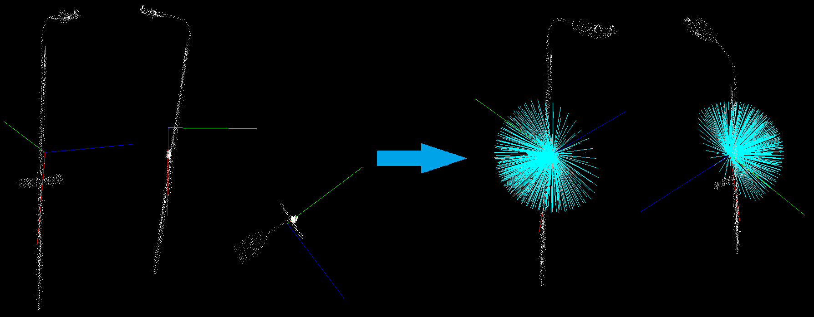
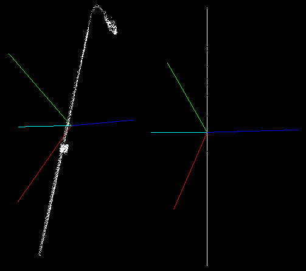

.. _moment_of_inertia:

Moment of inertia and eccentricity based descriptors
---------------------------

In this tutorial we will learn how to use the `pcl::MomentOfInertiaEstimation` class in order to obtain descriptors based on
eccentricity and moment of inertia. This class also allows to extract axis aligned and oriented bounding boxes of the cloud.
But keep in mind that extracted OBB is not the minimal possible bounding box.

Theoretical Primer
---------------------------

The idea of the feature extraction method is as follows.
First of all the covariance matrix of the point cloud is calculated and its eigen values and vectors are extracted.
You can consider that the resultant eigen vectors are normalized and always form the right-handed coordinate system
(major eigen vector represents X-axis and the minor vector represents Z-axis). On the next step the iteration process takes place.
On each iteration major eigen vector is rotated. Rotation order is always the same and is performed around the other
eigen vectors, this provides the invariance to rotation of the point cloud. Henceforth, we will refer to this rotated major vector as current axis.

For every current axis moment of inertia is calculated. Moreover, current axis is also used for eccentricity calculation.
For this reason current vector is treated as normal vector of the plane and the input cloud is projected onto it.
After that eccentricity is calculated for the obtained projection.

Implemented class also provides methods for getting AABB and OBB. Oriented bounding box is computed as AABB along eigen vectors.

The code
--------

First of all you will need the point cloud for this tutorial.
`This <http://svn.pointclouds.org/data/tutorials/min_cut_segmentation_tutorial.pcd>`_ is the one presented on the screenshots.
Next what you need to do is to create a file ``moment_of_inertia.cpp`` in any editor you prefer and copy the following code inside of it:

.. literalinclude:: sources/moment_of_inertia/moment_of_inertia.cpp
   :language: cpp
   :linenos:

The explanation
---------------

Now let's study out what is the purpose of this code. First few lines will be omitted, as they are obvious.

.. literalinclude:: sources/moment_of_inertia/moment_of_inertia.cpp
   :language: cpp
   :lines: 13-15

These lines are simply loading the cloud from the .pcd file.

.. literalinclude:: sources/moment_of_inertia/moment_of_inertia.cpp
   :language: cpp
   :lines: 17-19

Here is the line where the instantiation of the ``pcl::MomentOfInertiaEstimation`` class takes place.
Immediately after that we set the input cloud and start the computational process, that easy.

.. literalinclude:: sources/moment_of_inertia/moment_of_inertia.cpp
   :language: cpp
   :lines: 21-31

This is were we declare all necessary variables needed to store descriptors and bounding boxes.

.. literalinclude:: sources/moment_of_inertia/moment_of_inertia.cpp
   :language: cpp
   :lines: 33-39

These lines show how to access computed descriptors and other features.

.. literalinclude:: sources/moment_of_inertia/moment_of_inertia.cpp
   :language: cpp
   :lines: 41-46

These lines simply create the instance of ``PCLVisualizer`` class for result visualization.
Here we also add the cloud and the AABB for visualization.

.. literalinclude:: sources/moment_of_inertia/moment_of_inertia.cpp
   :language: cpp
   :lines: 48-50

Visualization of the OBB is little more complex. So here we create a quaternion from the rotational matrix, set OBBs position
and pass it to the visualizer.

.. literalinclude:: sources/moment_of_inertia/moment_of_inertia.cpp
   :language: cpp
   :lines: 52-58

This lines are responsible for eigen vectors visualization.

.. literalinclude:: sources/moment_of_inertia/moment_of_inertia.cpp
   :language: cpp
   :lines: 60-98

This huge amount of code shows how to work with the oriented bounding box. Note that you need to rotate each of the vertices of the OBB.
This code does the same thing as ``PCLVisualizer::addCube ()`` method. Its only purpose is to show how to work with OBB
if you don't have such usable method as ``PCLVisualizer::addCube ()``.

Few lines that left simply launch the visualization process.

Compiling and running the program
---------------------------------

Add the following lines to your CMakeLists.txt file:

.. literalinclude:: sources/moment_of_inertia/CMakeLists.txt
   :language: cmake
   :linenos:

After you have made the executable, you can run it. Simply do::

  $ ./moment_of_inertia lamppost.pcd

You should see something similar to this image. Here AABB is yellow, OBB is red. You can also see the eigen vectors.

.. image:: images/moment_of_inertia.png
   :height: 360px
