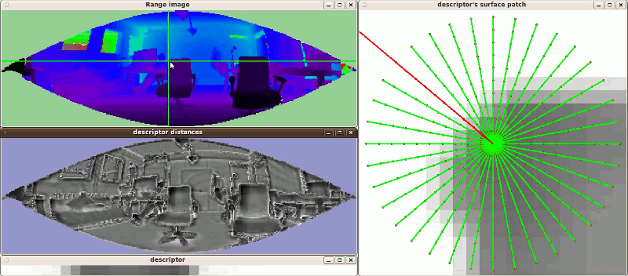

.. _narf_descriptor_visualization:

Visualization of the NARF descriptor and descriptor distances
-------------------------------------------------------------

This tutorial is about the visualization of how the NARF descriptor is
calculated and to test how the descriptor distances between certain points in a
range image behave. Compared to the other tuturials, this one is not really
about the code, but about trying the program and looking at the visualization.
Of course, nothing keeps you from having a look at it anyway.

The code
--------

First, create a file called, let's say, ``narf_descriptor_visualization.cpp`` in your favorite
editor, and place the following code inside it:

.. literalinclude:: sources/narf_descriptor_visualization/narf_descriptor_visualization.cpp
   :language: cpp
   :linenos:

Compiling and running the program
---------------------------------

Add the following lines to your CMakeLists.txt file:

.. literalinclude:: sources/narf_descriptor_visualization/CMakeLists.txt
   :language: cmake
   :linenos:

You can now try it with a point cloud file from your hard drive::

  $ ./narf_descriptor_visualization <point_cloud.pcd>

It will take a few second, during which you will see the status in the
terminal. During this time, a NARF feature is extracted in every point of the
range image created from the given point cloud. When it is done, a widget
showing the range image pops up. Now click on a point in the range image. If it
is a valid image point, three additional widgets will pop up. One visualizing
the actual descriptor as a row of gray values, one showing a local range image
patch of the area on which you clicked, overlaid with a star shaped pattern.
Each beam corresponds to one of the cells in the descriptor. The one facing
upwards to the first cell and then going clockwise. The basic intuition is,
that the more the surface changes under the beam, the higher (brighter) the
value of the corresponding descriptor cell. There is also one or more red
beams, which mark the extracted dominant orientations of the image patch,
which, together with the normal, is used to create a unique orientation for the
feature coordinate frame. The last image visualizes the descriptor distances to
every other point in the scene. The darker the value, the more similar the
point is to the clicked image point.

The result should look similar to this:

Also have a look at::

  $ ./narf_descriptor_visualization -h

for a list of parameters. 

