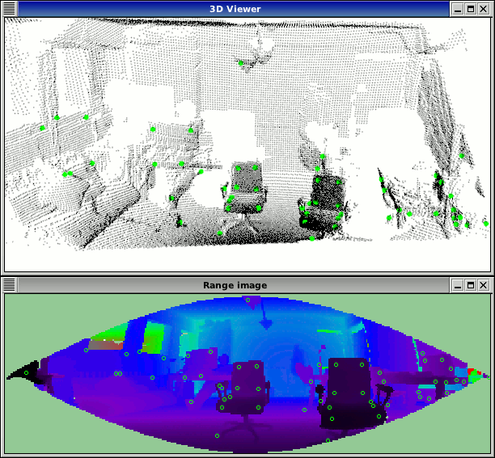

.. _narf_feature_extraction:

How to extract NARF Features from a range image
-----------------------------------------------

This tutorial demonstrates how to extract NARF descriptors at NARF keypoint
positions from a range image. The executable enables us to load a point cloud
from disc (or create it if not given), extract interest points on it and then
calculate the descriptors at these positions. It then visualizes these
positions, both in an image and a 3D viewer.

The code
--------

First, create a file called, let's say, ``narf_feature_extraction.cpp`` in your favorite
editor, and place the following code inside it:

.. literalinclude:: sources/narf_feature_extraction/narf_feature_extraction.cpp
   :language: cpp
   :linenos:

Explanation
-----------

In the beginning we do command line parsing, read a point cloud from disc (or
create it if not provided), create a range image and extract NARF keypoints
from it. All of these steps are already covered in the previous tutorial NARF
keypoint extraction.

The interesting part begins here:

.. code-block:: cpp

  ...
  std::vector<int> keypoint_indices2;
  keypoint_indices2.resize(keypoint_indices.size());
  for (unsigned int i=0; i<keypoint_indices.size(); ++i) // This step is necessary to get the right vector type
    keypoint_indices2[i]=keypoint_indices[i];
  ...

Here we copy the indices to the vector used as input for the feature.

.. code-block:: cpp

  ...
  pcl::NarfDescriptor narf_descriptor(&range_image, &keypoint_indices2);
  narf_descriptor.getParameters().support_size = support_size;
  narf_descriptor.getParameters().rotation_invariant = rotation_invariant;
  pcl::PointCloud<pcl::Narf36> narf_descriptors;
  narf_descriptor.compute(narf_descriptors);
  std::cout << "Extracted "<<narf_descriptors.size()<<" descriptors for "<<keypoint_indices.size()<< " keypoints.\n";
  ...

This code does the actual calculation of the descriptors. It first creates the
NarfDescriptor object and gives it the input data (the keypoint indices and the
range image). Then two important parameters are set. The support size, which
determines the size of the area from which the descriptor is calculated, and if
the rotational invariant (rotation around the normal) version of the NARF
descriptor should be used. The we create the output pointcloud and do the
actual computation. At last, we output the number of keypoints and the number
of extracted descriptors. This numbers can differ. For one, it might happen
that the calculation of the descriptor fails, because there are not enough
points in the range image (resolution too low). Or there might be multiple
descriptors in the same place, but for different dominant rotations.

The resulting PointCloud contains the type Narf36 (see
common/include/pcl/point_types.h) and store the descriptor as a 36 elements
float and x,y,z,roll,pitch,yaw to describe the local coordinate frame at which
the feature was extracted. The descriptors can now be compared, e.g., with the
Manhattan distance (sum of absolute differences).

The remaining code just visualizes the keypoint positions in a range image
widget and also in a 3D viewer.

Compiling and running the program
---------------------------------

Add the following lines to your CMakeLists.txt file:

.. literalinclude:: sources/narf_feature_extraction/CMakeLists.txt
   :language: cmake
   :linenos:

After you have made the executable, you can run it. Simply do::

  $ ./narf_feature_extraction -m

This will use an autogenerated point cloud of a rectangle floating in space.
The key points are detected in the corners. The parameter -m is necessary,
since the area around the rectangle is unseen and therefore the system can not
detect it as a border. The option -m changes the unseen area to maximum range
readings, thereby enabling the system to use these borders.

You can also try it with a point cloud file from your hard drive::

  $ ./narf_feature_extraction <point_cloud.pcd>

The output should look similar to this:

