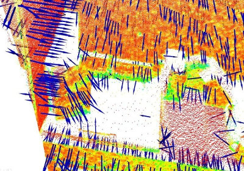
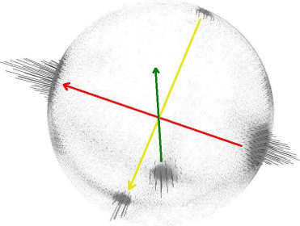
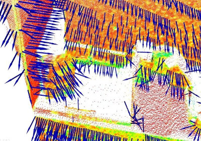
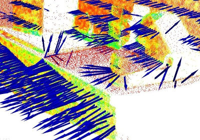
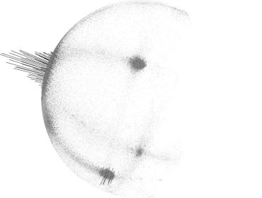
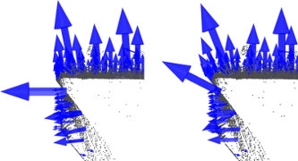
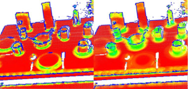

.. _normal_estimation:

Estimating Surface Normals in a PointCloud
------------------------------------------

Surface normals are important properties of a geometric surface, and are
heavily used in many areas such as computer graphics applications, to apply the
correct light sources that generate shadings and other visual effects.

Given a geometric surface, it's usually trivial to infer the direction of the
normal at a certain point on the surface as the vector perpendicular to the
surface at that point. However, since the point cloud datasets that we acquire
represent a set of point samples on the real surface, there are two
possibilities:

 * obtain the underlying surface from the acquired point cloud dataset, using
   surface meshing techniques, and then compute the surface normals from the
   mesh;

 * use approximations to infer the surface normals from the point cloud dataset
   directly.

This tutorial will address the latter, that is, given a point cloud dataset,
directly compute the surface normals at each point in the cloud.

.. raw:: html

  <iframe width="425" height="349" src="https://www.youtube.com/embed/x1FSssJrfik" frameborder="0" allowfullscreen></iframe>

Theoretical primer
------------------

Though many different normal estimation methods exist, the one that we will
concentrate on this tutorial is one of the simplest, and is formulated as
follows. The problem of determining the normal to a point on the surface is
approximated by the problem of estimating the normal of a plane tangent to the
surface, which in turn becomes a least-square plane fitting estimation problem.

.. note::

   For more information, including the mathematical equations of the least-squares problem, see [RusuDissertation]_.

The solution for estimating the surface normal is therefore reduced to an
analysis of the eigenvectors and eigenvalues (or PCA -- Principal Component
Analysis) of a covariance matrix created from the nearest neighbors of the
query point. More specifically, for each point :math:`\boldsymbol{p}_i`, we
assemble the covariance matrix :math:`\mathcal{C}` as follows:

.. math::

 \mathcal{C} = \frac{1}{k}\sum_{i=1}^{k}{\cdot (\boldsymbol{p}_i-\overline{\boldsymbol{p}})\cdot(\boldsymbol{p}_i-\overline{\boldsymbol{p}})^{T}}, ~\mathcal{C} \cdot \vec{{\mathsf v}_j} = \lambda_j \cdot \vec{{\mathsf v}_j},~ j \in \{0, 1, 2\}

Where :math:`k` is the number of point neighbors considered *in the
neighborhood of* :math:`\boldsymbol{p}_i`, :math:`\overline{\boldsymbol{p}}`
represents the 3D centroid of the nearest neighbors, :math:`\lambda_j` is the
:math:`j`-th eigenvalue of the covariance matrix, and :math:`\vec{{\mathsf v}_j}` 
the :math:`j`-th eigenvector.

To estimate a covariance matrix from a set of points in PCL, you can use:

.. code-block:: cpp
  :linenos:

    // Placeholder for the 3x3 covariance matrix at each surface patch
    Eigen::Matrix3f covariance_matrix;
    // 16-bytes aligned placeholder for the XYZ centroid of a surface patch
    Eigen::Vector4f xyz_centroid;

    // Estimate the XYZ centroid
    compute3DCentroid (cloud, xyz_centroid);

    // Compute the 3x3 covariance matrix
    computeCovarianceMatrix (cloud, xyz_centroid, covariance_matrix);

In general, because there is no mathematical way to solve for the sign of the
normal, its orientation computed via Principal Component Analysis (PCA) as
shown above is ambiguous, and not consistently oriented over an entire point
cloud dataset. The figure below presents these effects on two sections of a
larger dataset representing a part of a kitchen environment. The right part of
the figure presents the Extended Gaussian Image (EGI), also known as the normal
sphere, which describes the orientation of all normals from the point cloud.
Since the datasets are 2.5D and have thus been acquired from a single
viewpoint, normals should be present only on half of the sphere in the EGI.
However, due to the orientation inconsistency, they are spread across the
entire sphere.

.. image:: images/normal_estimation/unflipped_scene1.jpg
  :height: 200

The solution to this problem is trivial if the viewpoint :math:`{\mathsf v}_p`
is in fact known. To orient all normals :math:`\vec{\boldsymbol{n}}_i`
consistently towards the viewpoint, they need to satisfy the equation:

.. math::

 \vec{\boldsymbol{n}}_i \cdot ({\mathsf v}_p - \boldsymbol{p}_i) > 0

The figure below presents the results after all normals in the datasets from
the above figure have been consistently oriented towards the viewpoint.

To re-orient a given point normal manually in PCL, you can use:

.. code-block:: cpp

  flipNormalTowardsViewpoint (const PointT &point, float vp_x, float vp_y, float vp_z, Eigen::Vector4f &normal);

.. note::

  If the dataset has multiple acquisition viewpoints, then the above normal re-orientation method does not hold, and more complex algorithms need to be implemented. Please see [RusuDissertation]_ for more information.

Selecting the right scale
-------------------------

As previously explained, a surface normal at a point needs to be estimated from
the surrounding point neighborhood support of the point (also called
**k-neighborhood**).

The specifics of the nearest-neighbor estimation problem raise the question of
the *right scale factor*: given a sampled point cloud dataset, what are the
correct **k** (given via **pcl::Feature::setKSearch**) or **r** (given via
**pcl::Feature::setRadiusSearch**) values that should be used in determining
the set of nearest neighbors of a point? 

This issue is of extreme importance and constitutes a limiting factor in the
automatic estimation (i.e., without user given thresholds) of a point feature
representation. To better illustrate this issue, the figure below presents the
effects of selecting a smaller scale (i.e., small **r** or **k**) versus a
larger scale (i.e., large **r** or **k**). The left part of the figures depicts
a reasonable well-chosen scale factor, with estimated surface normals
approximately perpendicular for the two planar surfaces and small edges
visible all across the table. If the scale factor however is too big (right
part), and thus the set of neighbors is larger covering points from adjacent
surfaces, the estimated point feature representations get distorted, with
rotated surface normals at the edges of the two planar surfaces, and smeared
edges and suppressed fine details.

Without going into too many details, it suffices to assume that for now, the
scale for the determination of a point’s neighborhood has to be selected based
on the level of detail required by the application. Simply put, if the
curvature at the edge between the handle of a mug and the cylindrical part is
important, the scale factor needs to be small enough to capture those details,
and large otherwise.

Estimating the normals
----------------------

Though an example of normal estimation has already been given in
:ref:`features_tutorial`, we will revise one of them here for the purpose of
better explaining what goes on behind the scenes.

The following code snippet will estimate a set of surface normals for all the
points in the input dataset.

.. code-block:: cpp
   :linenos:

   #include <pcl/point_types.h>
   #include <pcl/features/normal_3d.h>

   {
     pcl::PointCloud<pcl::PointXYZ>::Ptr cloud (new pcl::PointCloud<pcl::PointXYZ>);

     ... read, pass in or create a point cloud ...

     // Create the normal estimation class, and pass the input dataset to it
     pcl::NormalEstimation<pcl::PointXYZ, pcl::Normal> ne;
     ne.setInputCloud (cloud);

     // Create an empty kdtree representation, and pass it to the normal estimation object. 
     // Its content will be filled inside the object, based on the given input dataset (as no other search surface is given).
     pcl::search::KdTree<pcl::PointXYZ>::Ptr tree (new pcl::search::KdTree<pcl::PointXYZ> ());
     ne.setSearchMethod (tree);

     // Output datasets
     pcl::PointCloud<pcl::Normal>::Ptr cloud_normals (new pcl::PointCloud<pcl::Normal>);

     // Use all neighbors in a sphere of radius 3cm
     ne.setRadiusSearch (0.03);

     // Compute the features
     ne.compute (*cloud_normals);

     // cloud_normals->size () should have the same size as the input cloud->size ()*
   }

The actual **compute** call from the **NormalEstimation** class does nothing internally but::

 for each point p in cloud P

   1. get the nearest neighbors of p

   2. compute the surface normal n of p

   3. check if n is consistently oriented towards the viewpoint and flip otherwise

The viewpoint is by default (0,0,0) and can be changed with:

.. code-block:: cpp

   setViewPoint (float vpx, float vpy, float vpz);

To compute a single point normal, use:

.. code-block:: cpp

   computePointNormal (const pcl::PointCloud<PointInT> &cloud, const std::vector<int> &indices, Eigen::Vector4f &plane_parameters, float &curvature);

Where *cloud* is the input point cloud that contains the points, *indices*
represents the set of k-nearest neighbors from *cloud*, and plane_parameters
and curvature represent the output of the normal estimation, with
*plane_parameters* holding the normal (nx, ny, nz) on the first 3 coordinates,
and the fourth coordinate is D = nc . p_plane (centroid here) + p. The output surface curvature is estimated as a relationship between the eigenvalues of the covariance matrix (as presented above), as:

.. math::

   \sigma = \frac{\lambda_0}{\lambda_0 + \lambda_1 + \lambda_2}

For a detailed description of this property, see M. Pauly, M. Gross and L. P. Kobbelt, "Efficient simplification of point-sampled surfaces".

Speeding Normal Estimation with OpenMP
--------------------------------------

For the speed-savvy users, PCL provides an additional implementation of surface
normal estimation which uses multi-core/multi-threaded paradigms using OpenMP
to speed the computation. The name of the class is
**pcl::NormalEstimationOMP**, and its API is 100% compatible to the
single-threaded **pcl::NormalEstimation**, which makes it suitable as a drop-in
replacement. On a system with 8 cores, you should get anything between 6-8
times faster computation times.

.. note::

   If your dataset is organized (e.g., acquired using a TOF camera, stereo camera, etc -- that is, it has a width and a height), for even faster results see the :ref:`normal_estimation_using_integral_images`.
