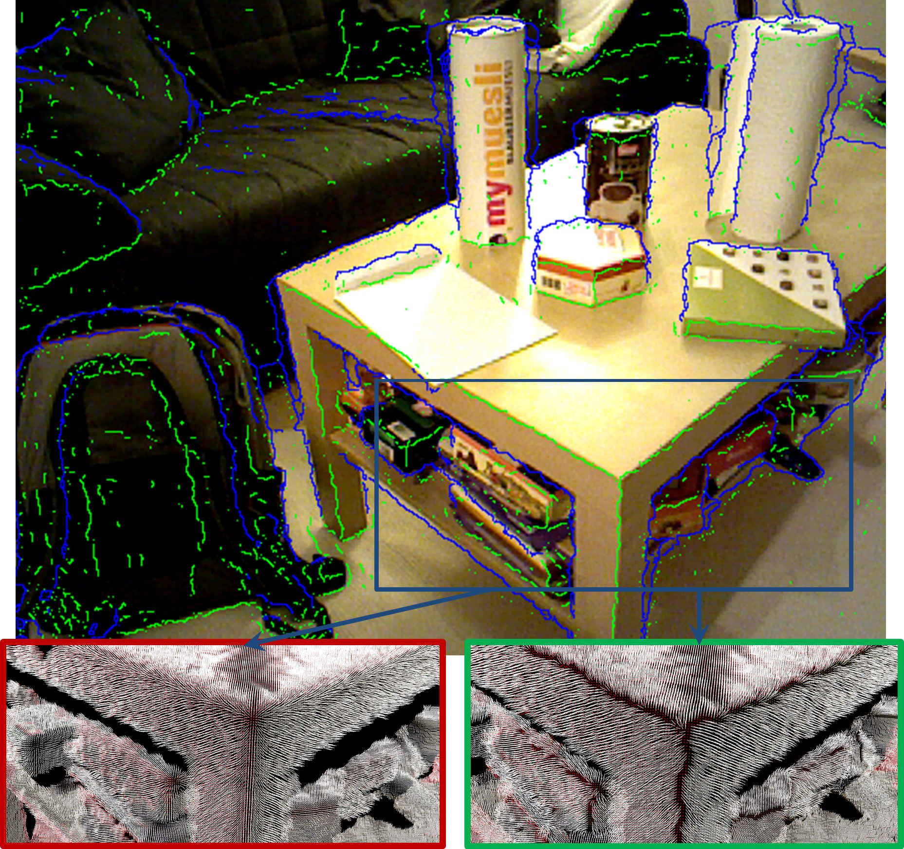

.. _normal_estimation_fast_edge_aware:

Fast Edge-Aware Normal Estimation
---------------------------------

This tutorial explains how to use the fast and accurate 3d normal estimation algorithm **pcl::FastEdgeAwareNormalEstimation** for organized point clouds that pays 
attention to 3d discontinuities both in depth and on surfaces. The method directly produces correct normals that do not bend around surface edges. If you just like 
to compute the 3d edges, have a look at the :ref:`organized_edge_detection` tutorial.

.. note::
    If your are using this method for normal computation in academic work, please cite:
    
    Richard Bormann, Joshua Hampp, Martin Haegele, Markus Vincze. Fast and Accurate Normal Estimation by Efficient 3d Edge Detection.
    In Proceedings of the IEEE/RSJ International Conference on Intelligent Robots and Systems, Sept 28 - Oct 03, 2015, Congress Center Hamburg, Hamburg, Germany.

Theoretical primer
------------------

The method builds upon an efficient edge detection algorithm for depth edges (jump edges) and surface discontinuities (i.e. the border between
two surfaces). That algorithm uses specialized integral images on local slope for discovering surface edges. The already computed data structures
for edge detection are then re-used to compute average 3d surface slope vectors along x and y direction around a query point. The cross product of both
slope vectors yields the surface normal. Due to the use and re-use of efficient data structures and algorithms this normal computation method is very fast
and accurate while computing correct normal directions close to non-differentiable surface edges (i.e. no "round-edge" effect at surface borders). For example,
using this algorithm normals of two touching surfaces of a cube will receive correct perpendicular surface normals even close to the edge while other normal
estimation methods rather tend to amalgamate the different normal directions of the two surfaces into one average direction.

The code
--------

First, create a file, let's say, ``normal_estimation_fast_edge_aware.cpp`` in your favorite editor, and place the following inside it:

.. code-block:: cpp
   :linenos:

    #include <iostream>
    #include <pcl/common/time.h>
    #include <pcl/visualization/cloud_viewer.h>
    #include <pcl/io/pcd_io.h>
    #include <pcl/point_cloud.h>
    #include <pcl/point_types.h>
    #include <pcl/features/normal_3d_fast_edge_aware.h>

    int
    main (int argc,
          char** argv)
    {
      // 1. open pcd file
      if (argc < 2)
      {
        PCL_ERROR("Error: No pcd file specified via: pcl_example_normal_estimation_fast_edge_aware <xyzrgb-pcd-filename>.\n");
        return -1;
      }
      std::string filename = argv[1];
      std::cout << "Reading " << filename << std::endl;
      pcl::PointCloud<pcl::PointXYZRGB>::Ptr cloud (new pcl::PointCloud<pcl::PointXYZRGB>);
      if (pcl::io::loadPCDFile<pcl::PointXYZRGB> (filename, *cloud) != 0)  // load the file
      {
        PCL_ERROR("Couldn't read file.\n");
        return -1;
      }
      std::cout << "points: " << cloud->points.size () << std::endl;

      // 2. set up parameters for 3d edge detection
      pcl::EdgeDetectionConfig cfg (pcl::EdgeDetectionConfig::GAUSSIAN, 3, 0.01f, 40., true, 5, 30, 15);
      // ALTERNATIVELY, all these properties can be set individually as follows
      cfg.noise_reduction_mode_ = pcl::EdgeDetectionConfig::GAUSSIAN;
      cfg.noise_reduction_kernel_size_ = 3;
      cfg.depth_step_factor_ = 0.01f;
      cfg.min_detectable_edge_angle_ = 40.;
      cfg.use_adaptive_scan_line_ = true;
      cfg.min_scan_line_width_ = 5;
      cfg.max_scan_line_width_ = 30;
      cfg.scan_line_width_at_2m_ = 15;
      cfg.updateScanLineModel();  // do not forget to run this command after updating the scan line model parameters

      // 3a. compute normals in an efficient and edge-aware fashion
      pcl::StopWatch timer;
      pcl::PointCloud<pcl::Normal>::Ptr normals_edge_aware = pcl::PointCloud<pcl::Normal>::Ptr (new pcl::PointCloud<pcl::Normal>);
      pcl::FastEdgeAwareNormalEstimation<pcl::PointXYZRGB, pcl::Normal> fast_edge_aware_normal_estimation;
      fast_edge_aware_normal_estimation.setEdgeDetectionConfig (cfg);
      fast_edge_aware_normal_estimation.setInputCloud (cloud);
      fast_edge_aware_normal_estimation.compute (*normals_edge_aware);
      std::cout << "Edge detection and normal estimation completed after " << timer.getTime () << "ms." << std::endl;

      // 3b. ALTERNATIVELY, you may compute 3d surface and depth edges and estimate normals at the same time with these commands (see also organized_edge_detection.cpp)
      pcl::PointCloud<pcl::Label> edge_labels;
      std::vector<pcl::PointIndices> label_indices;
      pcl::OrganizedEdgeFromPoints<pcl::PointXYZRGB, pcl::Normal, pcl::Label> edge_detection;
      edge_detection.setEdgeDetectionConfig (cfg);
      edge_detection.setInputCloud (cloud);
      edge_detection.setReturnLabelIndices (false);  // if we do not need the label indices vector filled, computations are slightly faster
      edge_detection.setUseFastDepthDiscontinuityMode (true);  // use a specific fast implementation for estimating depth edges, otherwise we can use the standard method of OrganizedEdgeBase
      edge_detection.compute (edge_labels, label_indices, normals_edge_aware);

      // 4. save pcd with computed normals
      pcl::PointCloud<pcl::PointXYZRGBNormal> result;
      pcl::concatenateFields (*cloud, *normals_edge_aware, result);
      std::string pcd_filename = filename + "_normals.pcd";
      pcl::io::savePCDFileBinaryCompressed (pcd_filename, result);
      std::cout << "Saved pcd file with normals to: " << pcd_filename << std::endl;

      // 5. visualize normals
      pcl::visualization::PCLVisualizer viewer("PCL Viewer");
      viewer.setBackgroundColor (0.0, 0.0, 0.5);
      viewer.addPointCloudNormals<pcl::PointXYZRGB,pcl::Normal>(cloud, normals_edge_aware);
      while (!viewer.wasStopped ())
      {
        viewer.spinOnce ();
      }

      return 0;
    }

The explanation
---------------

Now, let's break down the code piece by piece. In the first part we load a point cloud from a file:

.. code-block:: cpp

      // 1. open pcd file
      if (argc < 2)
      {
        PCL_ERROR("Error: No pcd file specified via: pcl_example_normal_estimation_fast_edge_aware <xyzrgb-pcd-filename>.\n");
        return -1;
      }
      std::string filename = argv[1];
      std::cout << "Reading " << filename << std::endl;
      pcl::PointCloud<pcl::PointXYZRGB>::Ptr cloud (new pcl::PointCloud<pcl::PointXYZRGB>);
      if (pcl::io::loadPCDFile<pcl::PointXYZRGB> (filename, *cloud) != 0)  // load the file
      {
        PCL_ERROR("Couldn't read file.\n");
        return -1;
      }
      std::cout << "points: " << cloud->points.size () << std::endl;

In the second part we provide two ways of setting the parameters for 3d edge detection and edge aware normal estimation. The exemplary parameter values should be fine 
for a Asus Xtion Pro Live device but may need to be adapted to other cameras.

.. code-block:: cpp

      // 2. set up parameters for 3d edge detection
      pcl::EdgeDetectionConfig cfg (pcl::EdgeDetectionConfig::GAUSSIAN, 3, 0.01f, 40., true, 5, 30, 15);
      // ALTERNATIVELY, all these properties can be set individually as follows
      cfg.noise_reduction_mode_ = pcl::EdgeDetectionConfig::GAUSSIAN;
      cfg.noise_reduction_kernel_size_ = 3;
      cfg.depth_step_factor_ = 0.01f;
      cfg.min_detectable_edge_angle_ = 40.;
      cfg.use_adaptive_scan_line_ = true;
      cfg.min_scan_line_width_ = 5;
      cfg.max_scan_line_width_ = 30;
      cfg.scan_line_width_at_2m_ = 15;
      cfg.updateScanLineModel();  // do not forget to run this command after updating the scan line model parameters

Then we compute the normals using the **pcl::FastEdgeAwareNormalEstimation** method.

.. code-block:: cpp

      // 3a. compute normals in an efficient and edge-aware fashion
      pcl::StopWatch timer;
      pcl::PointCloud<pcl::Normal>::Ptr normals_edge_aware = pcl::PointCloud<pcl::Normal>::Ptr (new pcl::PointCloud<pcl::Normal>);
      pcl::FastEdgeAwareNormalEstimation<pcl::PointXYZRGB, pcl::Normal> fast_edge_aware_normal_estimation;
      fast_edge_aware_normal_estimation.setEdgeDetectionConfig (cfg);
      fast_edge_aware_normal_estimation.setInputCloud (cloud);
      fast_edge_aware_normal_estimation.compute (*normals_edge_aware);
      std::cout << "Edge detection and normal estimation completed after " << timer.getTime () << "ms." << std::endl;

Alternatively, the normals may also be computed alongside with the 3d surface and depth edges using the **pcl::OrganizedEdgeFromPoints** method. 
(see also :ref:`organized_edge_detection`).
.. code-block:: cpp

      // 3b. ALTERNATIVELY, you may compute 3d surface and depth edges and estimate normals at the same time with these commands (see also example_organized_edge_detection.cpp)
      pcl::PointCloud<pcl::Label> edge_labels;
      std::vector<pcl::PointIndices> label_indices;
      pcl::OrganizedEdgeFromPoints<pcl::PointXYZRGB, pcl::Normal, pcl::Label> edge_detection;
      edge_detection.setEdgeDetectionConfig (cfg);
      edge_detection.setInputCloud (cloud);
      edge_detection.setReturnLabelIndices (false);  // if we do not need the label indices vector filled, computations are slightly faster
      edge_detection.setUseFastDepthDiscontinuityMode (true);  // use a specific fast implementation for estimating depth edges, otherwise we can use the standard method of OrganizedEdgeBase
      edge_detection.compute (edge_labels, label_indices, normals_edge_aware);

In the last part we save and visualize the point cloud and the corresponding normals:

.. code-block:: cpp

      // 4. save pcd with computed normals
      pcl::PointCloud<pcl::PointXYZRGBNormal> result;
      pcl::concatenateFields (*cloud, *normals_edge_aware, result);
      std::string pcd_filename = filename + "_normals.pcd";
      pcl::io::savePCDFileBinaryCompressed (pcd_filename, result);
      std::cout << "Saved pcd file with normals to: " << pcd_filename << std::endl;

      // 5. visualize normals
      pcl::visualization::PCLVisualizer viewer("PCL Viewer");
      viewer.setBackgroundColor (0.0, 0.0, 0.5);
      viewer.addPointCloudNormals<pcl::PointXYZRGB,pcl::Normal>(cloud, normals_edge_aware);
      while (!viewer.wasStopped ())
      {
        viewer.spinOnce ();
      }
