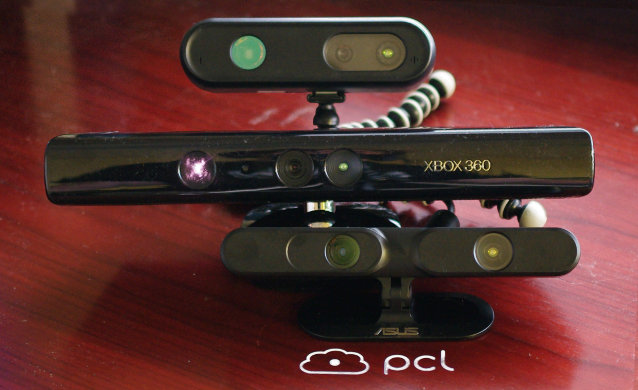
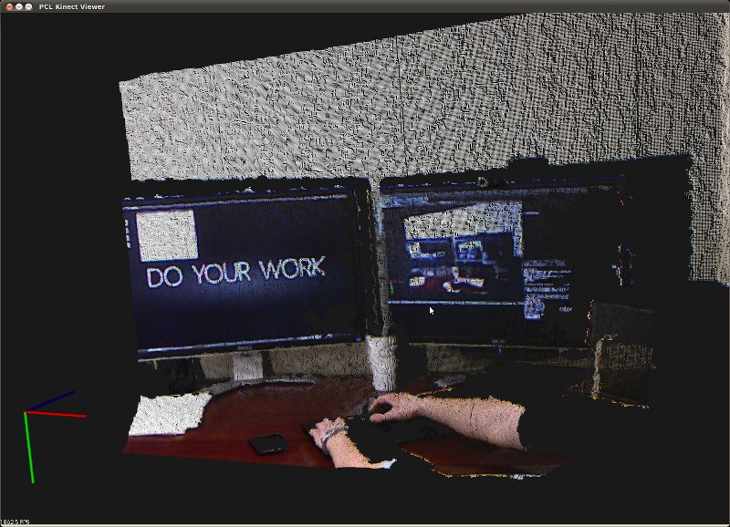

.. _openni_grabber:

The OpenNI Grabber Framework in PCL
-----------------------------------

As of PCL 1.0, we offer a new generic grabber interface to provide a smooth and
convenient access to different devices and their drivers, file formats and
other sources of data. 

The first driver that we incorporated is the new OpenNI Grabber, which makes it
a breeze to request data streams from OpenNI compatible cameras. This tutorial
presents how to set up and use the grabber, and since it's so simple, we can
keep it short :).

The cameras that we have tested so far are the `Primesense Reference Design <http://www.primesense.com/>`_, `Microsoft Kinect <http://www.xbox.com/kinect/>`_ and `Asus Xtion Pro <http://event.asus.com/wavi/product/WAVI_Pro.aspx>`_ cameras:

Simple Example
--------------

In *visualization*, there is a very short piece of code which contains all that
is required to set up a *pcl::PointCloud<XYZ>* or *pcl::PointCloud<XYZRGB>*
cloud callback.

Here is a screenshot and a video of the PCL OpenNI Viewer in action, which uses
the OpenNI Grabber.

.. raw:: html
  
  <iframe title="PCL OpenNI Viewer example" width="480" height="390" src="https://www.youtube.com/embed/x3SaWQkPsPI?rel=0" frameborder="0" allowfullscreen></iframe>

So let's look at the code. From *visualization/tools/openni_viewer_simple.cpp*

.. code-block:: cpp
   :linenos:

    #include <pcl/io/openni_grabber.h>
    #include <pcl/visualization/cloud_viewer.h>
    
    class SimpleOpenNIViewer
    {
      public:
        SimpleOpenNIViewer () : viewer ("PCL OpenNI Viewer") {}

        void cloud_cb_ (const pcl::PointCloud<pcl::PointXYZ>::ConstPtr &cloud)
        {   
          if (!viewer.wasStopped())
            viewer.showCloud (cloud);
        }   

        void run ()
        {   
          pcl::Grabber* interface = new pcl::OpenNIGrabber();

          std::function<void (const pcl::PointCloud<pcl::PointXYZ>::ConstPtr&)> f =
            [this] (const pcl::PointCloud<pcl::PointXYZ>::ConstPtr& cloud) { cloud_cb_ (cloud); };

          interface->registerCallback (f);
              
          interface->start (); 
              
          while (!viewer.wasStopped())
          {   
            boost::this_thread::sleep (boost::posix_time::seconds (1));
          }   

          interface->stop (); 
        }   

        pcl::visualization::CloudViewer viewer;
    };

    int main ()
    {
      SimpleOpenNIViewer v;
      v.run (); 
      return 0;
    }

As you can see, the *run ()* function of *SimpleOpenNIViewer* first creates a
new *OpenNIGrabber* interface. The next line might seem a bit intimidating at
first, but it's not that bad. We create a lambda object which invokes *cloud_cb_*,
we capture a copy of *this* to get an pointer to our *SimpleOpenNIViewer*, so
that *cloud_cb_* can be invoked.

The lambda then gets casted to a *std::function* object which is templated on
the callback function type, in this case *void (const
pcl::PointCloud<pcl::PointXYZ>::ConstPtr&)*. The resulting function object can
the be registered with the *OpenNIGrabber* and subsequently started.  Note that
the *stop ()* method does not necessarily need to be called, as the destructor
takes care of that.

Additional Details
------------------

The *OpenNIGrabber* offers more than one datatype, which is the reason we made
the *Grabber* interface so generic, leading to the relatively complicated
lambda line. In fact, we can register the following callback types as of
this writing:

* `void (const pcl::PointCloud<pcl::PointXYZRGB>::ConstPtr&)`

* `void (const pcl::PointCloud<pcl::PointXYZ>::ConstPtr&)`

* `void (const openni_wrapper::Image::Ptr&)`

  This provides just the RGB image from the built-in camera.

* `void (const openni_wrapper::DepthImage::Ptr&)`

  This provides the depth image, without any color or intensity information

* `void (const openni_wrapper::Image::Ptr&, const openni_wrapper::DepthImage::Ptr&, float constant)`
    
  When a callback of this type is registered, the grabber sends both RGB
  image and depth image and the constant (*1 / focal length*), which you need
  if you want to do your own disparity conversion. 

.. note::
  All callback types that need a depth _and_ image stream have a
  synchronization mechanism enabled which ensures consistent depth and image
  data. This introduces a small lag, since the synchronizer needs to wait at
  least for one more set of images before sending the first ones. 

Starting and stopping streams
-----------------------------

The *registerCallback* call returns a *boost::signals2::connection* object,
which we ignore in the above example. However, if you want to interrupt or
cancel one or more of the registered data streams, you can call disconnect the
callback without stopping the whole grabber:

.. code-block:: cpp

   boost::signals2::connection = interface (registerCallback (f));

   // ...

   if (c.connected ())
     c.disconnect ();

Benchmark
---------

The following code snippet will attempt to subscribe to both the *depth* and
*color* streams, and is provided as a way to benchmark your system. If your
computer is too slow, and you might not be able to get ~29Hz+, please contact
us. We might be able to optimize the code even further.

.. literalinclude:: sources/openni_grabber/openni_grabber.cpp
   :language: cpp
   :linenos:

Compiling and running the program
---------------------------------

Add the following lines to your CMakeLists.txt file:

.. literalinclude:: sources/openni_grabber/CMakeLists.txt
   :language: cmake
   :linenos:

Troubleshooting
---------------

Q: I get an error that there's no device connected:

.. note::

  [OpenNIGrabber] No devices connected.
  terminate called after throwing an instance of 'pcl::PCLIOException'
  what():  pcl::OpenNIGrabber::OpenNIGrabber(const std::string&) in openni_grabber.cpp @ 69: Device could not be initialized or no devices found.
  [1]    8709 abort      openni_viewer

A: most probably this is a problem with the XnSensorServer. Do you have the
ps-engine package installed? Is there a old process of XnSensorServer hanging
around, try kill it.

Q: I get an error about a closed network connection:

.. note::

  terminate called after throwing an instance of 'pcl::PCLIOException'
  what():  No matching device found. openni_wrapper::OpenNIDevice::OpenNIDevice(xn::Context&, const xn::NodeInfo&, const xn::NodeInfo&, const xn::NodeInfo&, const xn::NodeInfo&) @ /home/andreas/pcl/pcl/trunk/io/src/openni_camera/openni_device.cpp @ 96 : creating depth generator failed. Reason: The network connection has been closed!

A: This error can occur with newer Linux kernels that include the *gspca_kinect* kernel module. The module claims the usb interface of the kinect and prevents OpenNI from doing so.
You can either remove the kernel module (*rmmod gspca_kinect*) or blacklist it (by executing *echo "blacklist gspca_kinect" > /etc/modprobe.d/blacklist-psengine.conf* as root). 
The OpenNI Ubuntu packages provided by PCL already include this fix, but you might need it in other distributions.

Conclusion
----------

The Grabber interface is very powerful and general and makes it a breeze to
connect to OpenNI compatible cameras in your code. We are in the process of
writing a FileGrabber which can be used using the same interface, and can e.g.
load all Point Cloud files from a directory and provide them to the callback at
a certain rate. The only change required is
the allocation of the Grabber Object (*pcl::Grabber *g = new ...;*).

If you have a sensor which you would like to have available within PCL, just
let us know at *pcl-developers@pointclouds.org*, and we will figure something
out.
