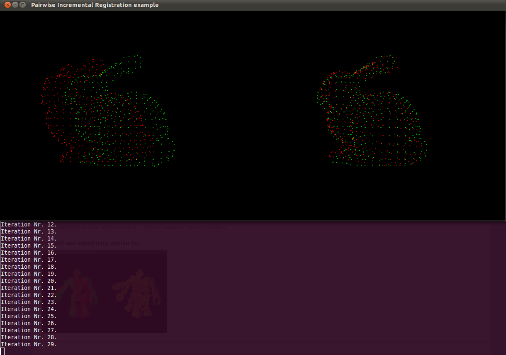

.. _pairwise_incremental_registration:

How to incrementaly register pairs of clouds
--------------------------------------------

This document demonstrates using the Iterative Closest Point algorithm in order
to incrementally register a series of point clouds two by two.

The idea is to find the best transformation for each point-pair and save the registered pair to disk.

Your data set should consist of clouds that have roughly pre-aligned in a common frame (e.g. in a robot's odometry or map frame).

The code
--------

.. literalinclude:: sources/pairwise_incremental_registration/pairwise-incremental-registration.cpp
   :language: cpp
   :linenos:

The explanation
---------------

| Let's breakdown this code piece by piece.
| We will first make a quick run through the declarations. Then, we will study the registering functions.
	
Declarations
************
	
These are the header files that contain the definitions for all of the classes which we will use.

.. literalinclude:: sources/pairwise_incremental_registration/pairwise-incremental-registration.cpp
   :language: cpp
   :lines: 41-57

Creates global variables for visualization purpose

.. literalinclude:: sources/pairwise_incremental_registration/pairwise-incremental-registration.cpp
   :language: cpp
   :lines: 68-72

Declare a convenient structure that allow us to handle clouds as couple [points - filename]

.. literalinclude:: sources/pairwise_incremental_registration/pairwise-incremental-registration.cpp
   :language: cpp
   :lines: 75-81

Define a new point representation (see :ref:`adding_custom_ptype` for more on the subject)

.. literalinclude:: sources/pairwise_incremental_registration/pairwise-incremental-registration.cpp
   :language: cpp
   :lines: 92-112

Registering functions
*********************

Let's see how are our functions organized.
   

The main function checks the user input, loads the data in a vector and starts the pair-registration process..

.. literalinclude:: sources/pairwise_incremental_registration/pairwise-incremental-registration.cpp
   :language: cpp
   :lines: 317-357

| Loading data is pretty straightforward. We iterate other the program's arguments. 
| For each argument, we check if it links to a pcd file. If so, we create a PCD object that is added to the vector of clouds.

.. literalinclude:: sources/pairwise_incremental_registration/pairwise-incremental-registration.cpp
   :language: cpp
   :lines: 165-192

We now arrive to the actual pair registration.

.. literalinclude:: sources/pairwise_incremental_registration/pairwise-incremental-registration.cpp
   :language: cpp
   :lines: 201-201

| First, we optionally down sample our clouds. This is useful in the case of large datasets. Curvature are then computed (for visualization purpose).
| We then create the ICP object, set its parameters and link it to the two clouds we wish to align. Remember to adapt these to your own datasets.

   .. literalinclude:: sources/pairwise_incremental_registration/pairwise-incremental-registration.cpp
      :language: cpp
      :lines: 250-260

| As this is a tutorial, we wish to display the intermediate of the registration process.
| To this end, the ICP is limited to 2 registration iterations:

   .. literalinclude:: sources/pairwise_incremental_registration/pairwise-incremental-registration.cpp
      :language: cpp
      :lines: 268
        
And is manualy iterated (30 times in our case):

   .. code-block:: cpp
   
				for (int i = 0; i < 30; ++i)
				{
					[...]
					points_with_normals_src = reg_result;
					// Estimate
					reg.setInputCloud (points_with_normals_src);
					reg.align (*reg_result); 
					[...]
				}

During each iteration, we keep track of and accumulate the transformations returned by the ICP:

   .. code-block:: cpp
   
		 Eigen::Matrix4f Ti = Eigen::Matrix4f::Identity (), prev;
		 [...]
		 for (int i = 0; i < 30; ++i)
		 {
			[...]
			Ti = reg.getFinalTransformation () * Ti;
			[...]
		 }

| If the difference between the transform found at iteration N and the one found at iteration N-1 is smaller than the transform threshold passed to ICP,
| we refine the matching process by choosing closer correspondences between the source and the target:

   .. code-block:: cpp
   
		for (int i = 0; i < 30; ++i)
		{
			[...]
			if (fabs ((reg.getLastIncrementalTransformation () - prev).sum ()) < reg.getTransformationEpsilon ())
      reg.setMaxCorrespondenceDistance (reg.getMaxCorrespondenceDistance () - 0.001);
    
			prev = reg.getLastIncrementalTransformation ();
			[...]
		}

| Once the best transformation has been found, we apply it to the source cloud. 
| The transformed source is then added to the target and returned to be written to disk in the main function.

   .. code-block:: cpp
   
		// Apply transformation to source and concatenate with target
		pcl::transformPointCloud (*cloud_src, *output, Ti);
		[...]
		*output += *cloud_tgt;

Compiling and running the program
---------------------------------

Create a file named pairwise-incremental-registration.cpp and paste the full code in it.

Create CMakeLists.txt file and add the following line in it:

.. literalinclude:: sources/pairwise_incremental_registration/CMakeLists.txt
   :language: cmake
   :linenos:
   
Note that the line 

.. code-block:: cmake

	add_definitions(-Wno-deprecated -DEIGEN_DONT_VECTORIZE -DEIGEN_DISABLE_UNALIGNED_ARRAY_ASSERT)

is usefull only on 32-bit systems, that would (sometimes) trigger the following Eigen exception::

	Eigen::internal::plain_array<T, Size, MatrixOrArrayOptions, 16>::plain_array() [with T = float, int Size = 16, int MatrixOrArrayOptions = 0]: Assertion `(reinterpret_cast<size_t>(array) & 0xf) == 0 && "this assertion is explained here: " "http://eigen.tuxfamily.org/dox-devel/TopicUnalignedArrayAssert.html" " **** READ THIS WEB PAGE !!! ****"' failed.``

Copy the files bun0.pcd and bun4.pcd in your working folder. These files can be found in pcl's trunk *test* folder.

  

After you have made the executable (cmake ., make), you can run it. Simply do::

  $ ./registration bun0.pcd bun4.pcd

You will see something similar to:

