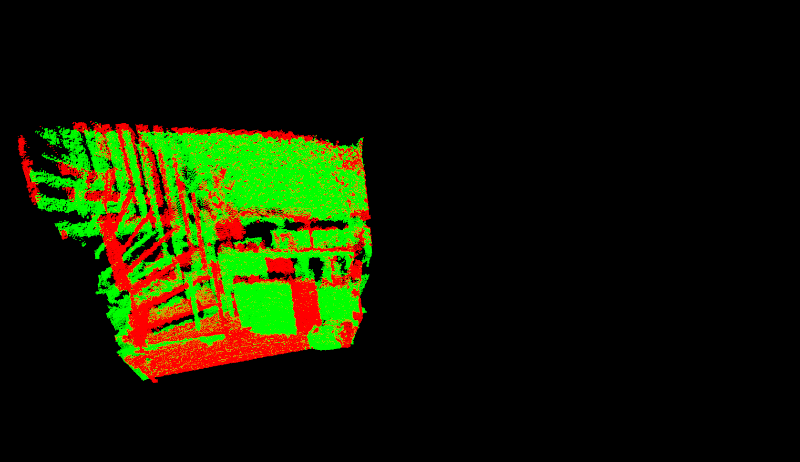
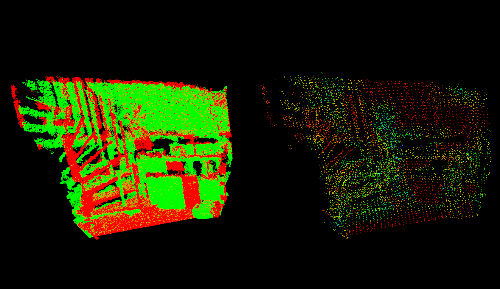
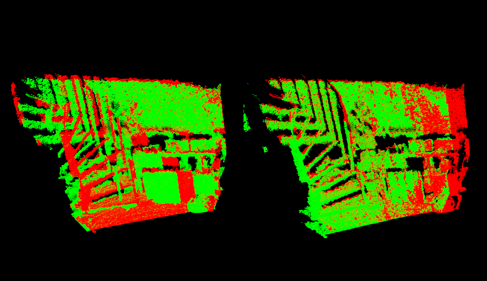
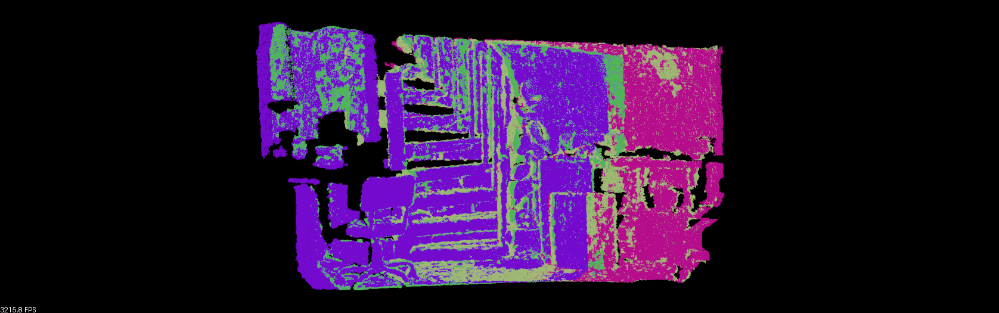
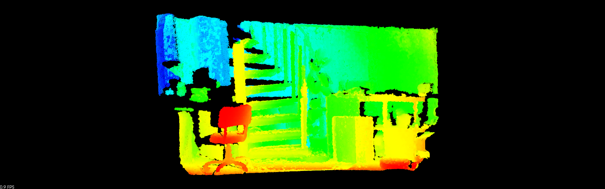

.. _pairwise_incremental_registration:

How to incrementally register pairs of clouds
---------------------------------------------

This document demonstrates using the Iterative Closest Point algorithm in order
to incrementally register a series of point clouds two by two.

| The idea is to transform all the clouds in the first cloud's frame.
| This is done by finding the best transform between each consecutive cloud, and accumulating these transforms over the whole set of clouds.

| Your data set should consist of clouds that have been roughly pre-aligned in a common frame (e.g. in a robot's odometry or map frame) and overlap with one another.
| We provide a set of clouds at `github.com/PointCloudLibrary/data/tree/master/tutorials/pairwise/ <https://github.com/PointCloudLibrary/data/tree/master/tutorials/pairwise>`_.

The code
--------

.. literalinclude:: sources/pairwise_incremental_registration/pairwise_incremental_registration.cpp
   :language: cpp
   :linenos:

The explanation
---------------

| Let's breakdown this code piece by piece.
| We will first make a quick run through the declarations. Then, we will study the registering functions.
	
Declarations
************
	
These are the header files that contain the definitions for all of the classes which we will use.

.. literalinclude:: sources/pairwise_incremental_registration/pairwise_incremental_registration.cpp
   :language: cpp
   :lines: 41-57

Creates global variables for visualization purpose

.. literalinclude:: sources/pairwise_incremental_registration/pairwise_incremental_registration.cpp
   :language: cpp
   :lines: 68-72

Declare a convenient structure that allow us to handle clouds as couple [points - filename]

.. literalinclude:: sources/pairwise_incremental_registration/pairwise_incremental_registration.cpp
   :language: cpp
   :lines: 75-81

Define a new point representation (see :ref:`adding_custom_ptype` for more on the subject)

.. literalinclude:: sources/pairwise_incremental_registration/pairwise_incremental_registration.cpp
   :language: cpp
   :lines: 92-112

Registering functions
*********************

Let's see how are our functions organized.
   

| The main function checks the user input, loads the data in a vector and starts the pair-registration process..
| After a transform is found for a pair, the pair is transformed into the first cloud's frame, and the global transformation is updated.

.. literalinclude:: sources/pairwise_incremental_registration/pairwise_incremental_registration.cpp
   :language: cpp
   :lines: 326-374

| Loading data is pretty straightforward. We iterate other the program's arguments. 
| For each argument, we check if it links to a pcd file. If so, we create a PCD object that is added to the vector of clouds.

.. literalinclude:: sources/pairwise_incremental_registration/pairwise_incremental_registration.cpp
   :language: cpp
   :lines: 165-192

We now arrive to the actual pair registration.

.. literalinclude:: sources/pairwise_incremental_registration/pairwise_incremental_registration.cpp
   :language: cpp
   :lines: 202-202

| First, we optionally down sample our clouds. This is useful in the case of large datasets. Curvature are then computed (for visualization purpose).
| We then create the ICP object, set its parameters and link it to the two clouds we wish to align. Remember to adapt these to your own datasets.

   .. code-block:: cpp

        // Align
        pcl::IterativeClosestPointNonLinear<PointNormalT, PointNormalT> reg;
        reg.setTransformationEpsilon (1e-6);
        // Set the maximum distance between two correspondences (src<->tgt) to 10cm
        // Note: adjust this based on the size of your datasets
        reg.setMaxCorrespondenceDistance (0.1);  
        // Set the point representation
        reg.setPointRepresentation (boost::make_shared<const MyPointRepresentation> (point_representation));

        reg.setInputCloud (points_with_normals_src);
        reg.setInputTarget (points_with_normals_tgt);

| As this is a tutorial, we wish to display the intermediate of the registration process.
| To this end, the ICP is limited to 2 registration iterations:

   .. code-block:: cpp
   
        reg.setMaximumIterations (2);
        
And is manually iterated (30 times in our case):

   .. code-block:: cpp
   
				for (int i = 0; i < 30; ++i)
				{
					[...]
					points_with_normals_src = reg_result;
					// Estimate
					reg.setInputCloud (points_with_normals_src);
					reg.align (*reg_result); 
					[...]
				}

During each iteration, we keep track of and accumulate the transformations returned by the ICP:

   .. code-block:: cpp
   
		 Eigen::Matrix4f Ti = Eigen::Matrix4f::Identity (), prev, targetToSource;
		 [...]
		 for (int i = 0; i < 30; ++i)
		 {
			[...]
			Ti = reg.getFinalTransformation () * Ti;
			[...]
		 }

| If the difference between the transform found at iteration N and the one found at iteration N-1 is smaller than the transform threshold passed to ICP,
| we refine the matching process by choosing closer correspondences between the source and the target:

   .. code-block:: cpp
   
		for (int i = 0; i < 30; ++i)
		{
		 [...]
		 if (std::abs ((reg.getLastIncrementalTransformation () - prev).sum ()) < reg.getTransformationEpsilon ())
		   reg.setMaxCorrespondenceDistance (reg.getMaxCorrespondenceDistance () - 0.001);
     
		 prev = reg.getLastIncrementalTransformation ();
		 [...]
		}

| Once the best transformation has been found, we invert it (to get the transformation from target to source) and apply it to the target cloud. 
| The transformed target is then added to the source and returned to the main function with the transformation.

   .. code-block:: cpp
   
			//
			// Get the transformation from target to source
			targetToSource = Ti.inverse();

			//
			// Transform target back in source frame
			pcl::transformPointCloud (*cloud_tgt, *output, targetToSource);
			[...]
			*output += *cloud_tgt;
			final_transform = targetToSource;

Compiling and running the program
---------------------------------

Create a file named pairwise_incremental_registration.cpp and paste the full code in it.

Create CMakeLists.txt file and add the following line in it:

.. literalinclude:: sources/pairwise_incremental_registration/CMakeLists.txt
   :language: cmake
   :linenos:
   

Copy the files from `github.com/PointCloudLibrary/data/tree/master/tutorials/pairwise
<https://raw.github.com/PointCloudLibrary/data/master/tutorials/pairwise/>`_ in your working folder.
  

After you have made the executable (cmake ., make), you can run it. Simply do::

  $ ./pairwise_incremental_registration capture000[1-5].pcd

You will see something similar to:

  

  

  
  
Visualize the final results by running::

  $ pcl_viewer 1.pcd 2.pcd 3.pcd 4.pcd
  

  

NOTE: if you only see a black screen in your viewer, try adjusting the camera position with your mouse. This may happen with the sample PCD files of this tutorial.

