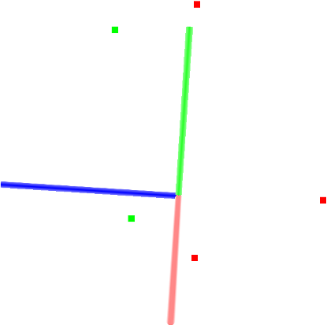

.. _passthrough:

Filtering a PointCloud using a PassThrough filter
--------------------------------------------------

In this tutorial we will learn how to perform a simple filtering along a
specified dimension -- that is, cut off values that are either inside or
outside a given user range.

The code
--------

First, create a file, let's say, ``passthrough.cpp`` in your favorite
editor, and place the following inside it:

.. literalinclude:: sources/passthrough/passthrough.cpp
   :language: cpp
   :linenos:

The explanation
---------------

Now, let's break down the code piece by piece.

In the following lines, we define the Point Clouds structures, fill in the
input cloud, and display its content to screen.

.. literalinclude:: sources/passthrough/passthrough.cpp
   :language: cpp
   :lines: 11-27

Then, we create the PassThrough filter object, and set its parameters. The
filter field name is set to the z coordinate, and the accepted interval values
are set to (0.0;1.0).

.. literalinclude:: sources/passthrough/passthrough.cpp
   :language: cpp
   :lines: 30-35

   
Finally we show the content of the filtered cloud.

.. literalinclude:: sources/passthrough/passthrough.cpp
   :language: cpp
   :lines: 37-41

   
Compiling and running the program
---------------------------------

Add the following lines to your CMakeLists.txt file:

.. literalinclude:: sources/passthrough/CMakeLists.txt
   :language: cmake
   :linenos:

After you have made the executable, you can run it. Simply do::

  $ ./passthrough

You will see something similar to::

  Cloud before filtering: 
      0.352222 -0.151883 -0.106395
      -0.397406 -0.473106 0.292602
      -0.731898 0.667105 0.441304
      -0.734766 0.854581 -0.0361733
      -0.4607 -0.277468 -0.916762
  Cloud after filtering: 
      -0.397406 -0.473106 0.292602
      -0.731898 0.667105 0.441304

A graphical display of the filtering process is shown below. 

Note that the coordinate axis are represented as red (x), green (y), and blue
(z). The five points are represented with green as the points remaining after
filtering and red as the points that have been removed by the filter.

As an exercise, try uncommenting this line

.. literalinclude:: sources/passthrough/passthrough.cpp
   :language: cpp
   :lines: 34

and run the program again.

