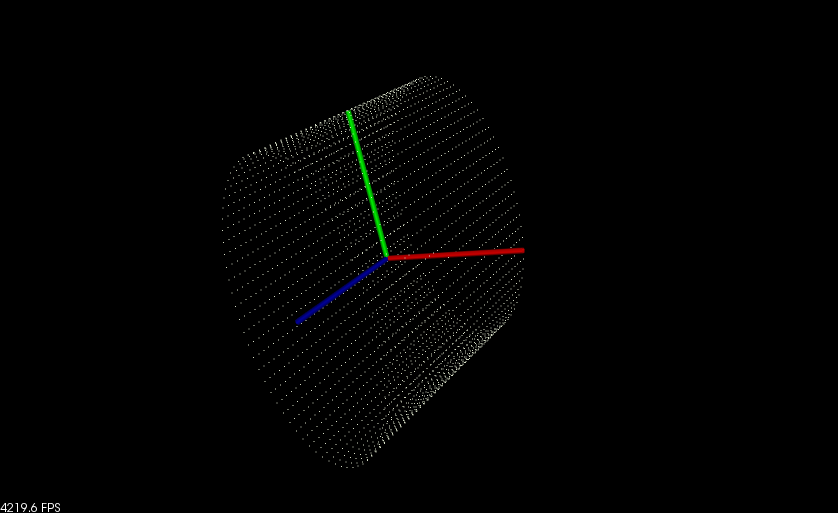
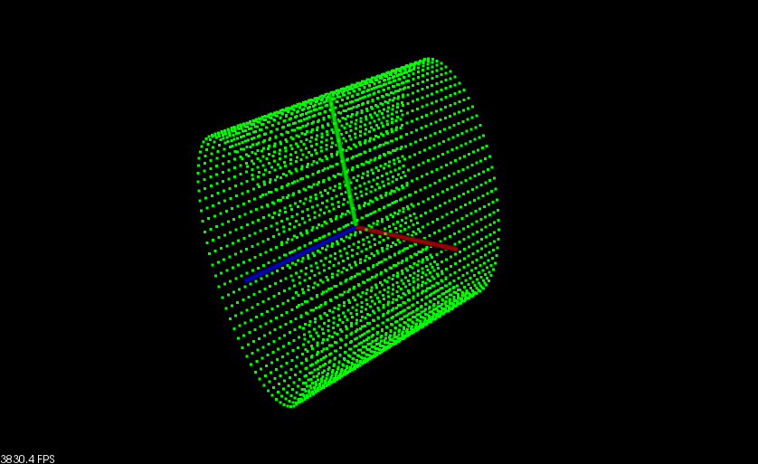
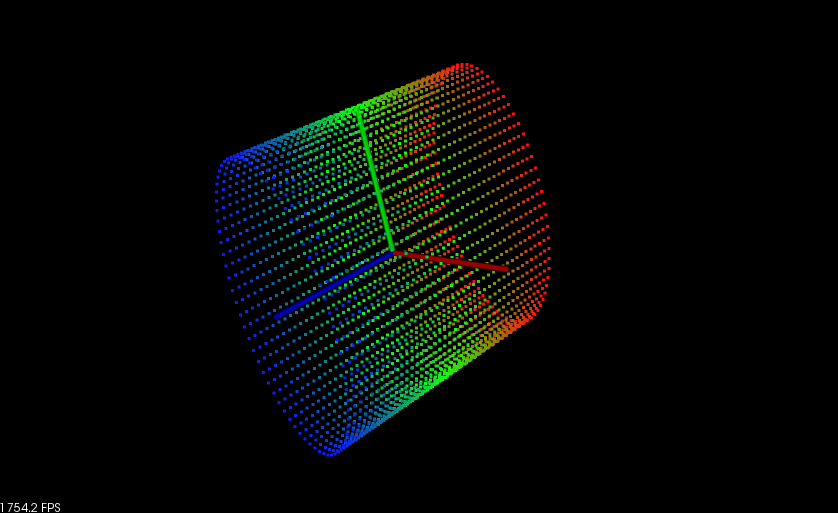
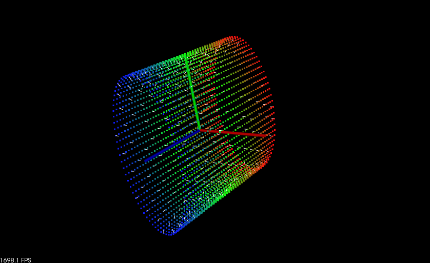
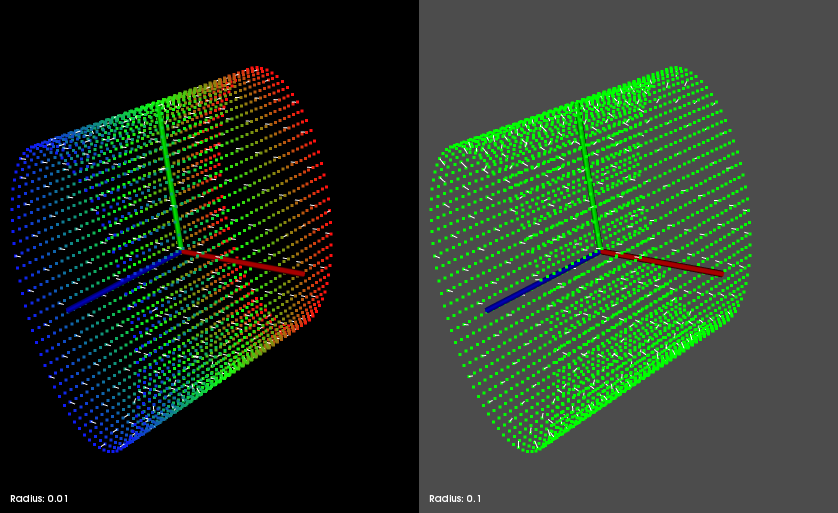

.. _pcl_visualizer:

PCLVisualizer
=============

PCLVisualizer is PCL's full-featured visualisation class. While more
complex to use than the CloudViewer, it is also more powerful, offering
features such as displaying normals, drawing shapes and multiple
viewports.

This tutorial will use several code samples to illustrate some of the
features of PCLVisualizer, beginning with displaying a single point
cloud.

Visualising a single cloud
==========================

This code sample uses PCLVisualizer to display a single PointXYZ cloud.
It also illustrates changing the background colour and displaying the
axes.

.. literalinclude:: sources/pcl_visualizer/pcl_visualizer_simple.cpp
    :language: cpp
    :linenos:

Explanation
-----------

Most of the sample code is boilerplate to set up the point cloud that
will be displayed. Let's take a look at the relevant part, line-by-line.

.. code-block:: cpp

    ...
    PCLVisualizer viewer ("3D Viewer");
    ...

This creates the viewer object, giving it a nice name to display in the
title bar.

.. code-block:: cpp

    ...
    viewer.setBackgroundColor (0, 0, 0);
    ...

The background colour of the viewer can be set to any RGB colour you
like. In this case, we are setting it to black.

.. code-block:: cpp

    ...
    viewer.addPointCloud (point_cloud_ptr, "sample cloud");
    ...

This is the most important line. We add the point cloud to the viewer,
giving it an ID string that can be used to identify the cloud in other
methods. Multiple point clouds can be added with multiple calls to
``addPointCloud()``, supplying a new ID each time. If you want to update
a point cloud that is already displayed, you must first call
``removePointCloud()`` and provide the ID of the cloud that is to be
updated. (Note: versions 1.1 and up of PCL provide a new API method,
``updatePointCloud()``, that allows a cloud to be updated without
manually calling ``removePointCloud()`` first.)

This is the most basic of ``addPointCloud()``'s many
variations. Others are used to handle different point types, display
normals, and so on. We will illustrate some others during this tutorial,
or you can see the `PCLVisualizer documentation`_ for more details.

.. _`PCLVisualizer documentation`:
   http://docs.pointclouds.org/1.0.0/classpcl_1_1visualization_1_1_p_c_l_visualizer.html

.. code-block:: cpp

    ...
    viewer.setPointCloudRenderingProperties (PCL_VISUALIZER_POINT_SIZE, 1, "sample cloud");
    ...

This next line changes the size of the rendered points. You can control
the way any point cloud is rendered in the viewer using this method.

.. code-block:: cpp

    ...
    viewer.addCoordinateSystem (1.0);
    ...

Viewing complex point clouds can often be disorientating. To keep
yourself aligned in the world, axes can be displayed. These will appear
as three cylinders along the X (red), Y (green) and Z (blue) axes. The
size of the cylinders can be controlled using the ``scale`` parameter.
In this case, we have set it to 1.0 (which also happens to be the
default if no value is given). An alternative version of this method can
be used to place the axes at any point in the world.

.. code-block:: cpp

    ...
    viewer.initCameraParameters ();
    ...

This final call sets up some handy camera parameters to make things look
nice.

Compiling and running the program
---------------------------------

Create a `CMakeLists.txt` file with the following contents:

.. literalinclude:: sources/pcl_visualizer/CMakeLists.txt.simple
   :language: cmake
   :linenos:

After you have made the executable, you can run it like so::

  $ ./pcl_visualizer_simple

To exit the viewer application, press ``q``. Press ``r`` to centre and
zoom the viewer so that the entire cloud is visible. Use the mouse to
rotate the viewpoint by clicking and dragging. You can use the scroll
wheel, or right-click and drag up and down, to zoom in and out.
Middle-clicking and dragging will move the camera.

Adding some colour
==================

Often, a point cloud will not use the simple PointXYZ type. One common
point type is PointXYZRGB, which also contains colour data. Aside from
that, you may wish to colour specific point clouds to make them
distinguishable in the viewer. PCLVizualizer provides facilities for
displaying point clouds with the colour data stored within them, or for
assigning colours to point clouds. This code sample illustrates these
features.

RGB point clouds
----------------

Many devices, such as the Microsoft Kinect, produce point clouds with
RGB data. PCLVisualizer can display the cloud using this data to colour
each point.

.. literalinclude:: sources/pcl_visualizer/pcl_visualizer_color_rgb.cpp
    :language: cpp
    :linenos:

Explanation
-----------

Not much of the code in this sample has changed from the earlier sample.

.. code-block:: cpp

    ...
    typedef PointXYZRGB PointType;
    ...

First, notice that the point type has changed from the simple example.
We now use a point type that also provides room for RGB data. This is
important; without the RGB fields in the point (the point type does not
necessarily have to be ``PointXYZRGB``, as long as it has the three
colour fields), PCLVisualizer would not know what colours to use.

.. code-block:: cpp

    ...
    PointCloudColorHandlerRGB<PointType> rgb(point_cloud_ptr);
    ...

Next, after setting the viewer's background colour, we create a colour
handler object. PCLVisualizer uses objects like this to display custom
data. In this case, the object will get the RGB colour fields from each
point for the viewer to use when drawing them. Many other handlers exist
for a wide range of purposes. We will see another of the colour handlers
in the next code sample, but handlers also exist for such purposes as
drawing any other field as the colour and drawing geometry from point
clouds. See the documentation_ for details.

.. _documentation:
   http://docs.pointclouds.org/1.0.0/group__visualization.html

.. code-block:: cpp

    ...
    viewer.addPointCloud<PointType> (point_cloud_ptr, rgb, "sample cloud");
    ...

Finally, when we add the point cloud, we specify the colour handler when
we add the point cloud to the viewer. Note also that we must now specify
the point type as a template argument to the ``addPointCloud<>()``
method. The version we used in the first code sample is the only version
of this method that does not require a template parameter, because it
can only handle ``PointXYZ`` data. All other versions require the point
type.

Custom colours
--------------

The second code sample demonstrates giving a point cloud a single colour.
We can use this technique to give specific point clouds their own
colours, allowing us to distinguish individual point clouds. In this
sample, we have set the point cloud's colour to green. (We have also
increased the size of the points to make the colour more visible.)

.. literalinclude:: sources/pcl_visualizer/pcl_visualizer_color_custom.cpp
    :language: cpp
    :linenos:

Explanation
-----------

Again, not much of the code in this sample has changed from the earlier
sample.

.. code-block:: cpp

    ...
    typedef PointXYZ PointType;
    ...

The point type in use this time is back to PointXYZ again. When setting
a custom colour handler for a point cloud, it doesn't matter what the
underlying data type is. None of the point fields are used for the
colour with the custom colour handler.

.. code-block:: cpp

    ...
    PointCloudColorHandlerCustom<PointType> single_color(point_cloud_ptr, 0, 255, 0);
    ...

We create a custom colour handler and assign it a nice, bright shade of
green.

.. code-block:: cpp

    ...
    viewer.addPointCloud<PointType> (point_cloud_ptr, single_color, "sample cloud");
    ...

As with the previous example, we pass the colour handler in when we call
``addPointCloud<>()``.

Compiling and running the programs
----------------------------------

Create a `CMakeLists.txt` file with the following contents:

.. literalinclude:: sources/pcl_visualizer/CMakeLists.txt.color
   :language: cmake
   :linenos:

After you have made the executables, you can run them like so::

  $ ./pcl_visualizer_color_custom

  $ ./pcl_visualizer_color_rgb

Normals and other information
=============================

Displaying normals is an important step in understanding a point cloud.
The PCLVisualizer class has the ability to draw normals, as well as
other interesting point cloud information, such as principal curvatures
and geometries.

The code sample below shows how to display the normals of a point
cloud. The code for calculating the normals will not be explained in
this tutorial. See the normals calculation tutorial for details.

Explanation
-----------

The relevant line of code is placed after the line to draw the point
cloud.

.. code-block:: cpp

    ...
    viewer.addPointCloudNormals<PointType, Normal> (point_cloud_ptr, cloud_normals, 10, 0.05, "normals");
    ...

Once you have your normals, one extra line is all it takes to display
them in the viewer. The parameters to this method set the number of
normals to display (here, every tenth normal is displayed) and the
length of the line to draw for each normal (0.05, in this case).

Compiling and running the program
---------------------------------

Create a `CMakeLists.txt` file with the following contents:

.. literalinclude:: sources/pcl_visualizer/CMakeLists.txt.normals
   :language: cmake
   :linenos:

After you have made the executable, you can run it like so::

  $ ./pcl_visualizer_normals

Drawing Shapes
==============

PCLVisualizer allows you to draw various primitive shapes in the view.
This is often used to visualise the results of point cloud processing
algorithms, for example, visualising which clusters of points have been
recognised as landmarks by drawing transparent spheres around them.

The sample code below illustrates some of the methods used to add shapes
to a viewer. It adds four shapes:

- A line from the first point in the cloud to the last point in the
  cloud.
- A plane at the origin.
- A sphere centred on the first point in the cloud.
- A cone along the Y-axis.

Explanation
-----------

The relevant parts of the code sample for drawing shapes begin after the
point cloud is added to the viewer.

.. code-block:: cpp

    ...
    viewer.addLine<PointType>(point_cloud.points[0], point_cloud.points[point_cloud.size() - 1], "line");
    ...

This line (of code) adds a line (in space) from the first point in the
cloud to the last point. This method is useful, for example, for showing
correspondences between point clouds. In this case, the line is using
the default colour, but you can also specify the colour of the line.
Drawing shapes at points from a point cloud is very common, and various
shapes are available.

.. code-block:: cpp

    ...
    viewer.addSphere(point_cloud.points[0], 0.2, 0.5, 0.5, 0.0, "sphere");
    ...

This next line adds a sphere centred on the first point in the cloud
with a radius of 0.2. It also gives the sphere a colour.

.. code-block:: cpp

    ...
    pcl::ModelCoefficients coeffs;
    coeffs.values.push_back(0.0);
    coeffs.values.push_back(0.0);
    coeffs.values.push_back(1.0);
    coeffs.values.push_back(0.0);
    viewer.addPlane(coeffs, "plane");
    ...

Next, we add a plane to the drawing. In this case, we are specifying the
plane using the standard plane equation (ax + by + cz + d = 0). Our
plane will be centered at the origin and oriented along the Z-axis. Many
of the shape drawing functions take coefficients in this way.

.. code-block:: cpp

    ...
    coeffs.values.clear();
    coeffs.values.push_back(0.3);
    coeffs.values.push_back(0.3);
    coeffs.values.push_back(0.0);
    coeffs.values.push_back(0.0);
    coeffs.values.push_back(1.0);
    coeffs.values.push_back(0.0);
    coeffs.values.push_back(5.0);
    viewer.addCone(coeffs, "cone");
    ...

Finally, we add a cone. We are again using model coefficients to specify
the cone's parameters.

Compiling and running the program
---------------------------------

Create a `CMakeLists.txt` file with the following contents:

.. literalinclude:: sources/pcl_visualizer/CMakeLists.txt.shapes
   :language: cmake
   :linenos:

After you have made the executable, you can run it like so::

  $ ./pcl_visualizer_shapes

.. image:: images/pcl_visualizer_shapes.png
  :width: 838

Multiple viewports
==================

You will often want to compare multiple point clouds side-by-side. While
you could draw them in the same view port, this can get confusing.
PCLVisualizer allows you to draw multiple point clouds in separate
viewports, making comparison easy.

This code sample uses viewports to demonstrate comparing the normals
calculated for a point cloud. Two sets of normals are calculated for the
same cloud but using a different search radius. The first time, the
search radius is 0.05. The second time, it is 0.1. The normals for the
0.05 radius search are displayed in the viewport with the black
background. The normals for the 0.1 radius search are displayed in the
viewport with the grey background.

Comparing the two sets of normals side-by-side makes it immediately
obvious what the effects of the different algorithm parameter are. In
this way, you can experiment with the parameters for algorithms to find
good settings, quickly viewing the results.

Explanation
-----------

.. code-block:: cpp

    ...
    PCLVisualizer viewer ("3D Viewer");
    viewer.initCameraParameters ();
    ...

This is our standard code for creating a viewer.

.. code-block:: cpp

    ...
    int v1(0);
    viewer.createViewPort(0.0, 0.0, 0.5, 1.0, v1);
    viewer.setBackgroundColor (0, 0, 0, v1);
    viewer.addText("Radius: 0.01", 10, 10, "v1 text", v1);
    PointCloudColorHandlerRGBField<PointType> rgb(point_cloud_ptr);
    viewer.addPointCloud<PointType> (point_cloud_ptr, rgb, "sample cloud1", v1);
    ...

The next step is to create a new viewport. The four parameters are the
minimum and maximum ranges of the viewport on the X- and Y-axes, between
0 and 1. We are creating a viewport that will fill the left half of the
window. We must store the view port ID number that is passed back in the
fifth parameter and use it in all other calls where we only want to
affect that viewport.

We also set the background colour of this viewport, give it a lable
based on what we are using the viewport to distinguish, and add our
point cloud to it, using an RGB colour handler.

.. code-block:: cpp

    ...
    int v2(0);
    viewer.createViewPort(0.5, 0.0, 1.0, 1.0, v2);
    viewer.setBackgroundColor (0.3, 0.3, 0.3, v2);
    viewer.addText("Radius: 0.1", 10, 10, "v2 text", v2);
    PointCloudColorHandlerCustom<PointType> single_color(point_cloud_ptr, 0, 255, 0);
    viewer.addPointCloud<PointType> (point_cloud_ptr, single_color, "sample cloud2", v2);
    ...

Then we do the same thing again for the second viewport, making it take
up the right half of the window. We make this viewport a shade of grey
so it is easily distinguishable in the demonstration program. We add the
same point cloud, but this time we give it a custom colour handler.

.. code-block:: cpp

    ...
    viewer.setPointCloudRenderingProperties (PCL_VISUALIZER_POINT_SIZE, 3, "sample cloud1");
    viewer.setPointCloudRenderingProperties (PCL_VISUALIZER_POINT_SIZE, 3, "sample cloud2");
    viewer.addCoordinateSystem (1.0);
    ...

These two lines set some properties globally for all viewports. Most of
the PCLVisualizer methods accept an optional viewport ID parameter. When
it is specified, they affect only that viewport. When it is not, as in
this case, they affect all viewports.

.. code-block:: cpp

    ...
    viewer.addPointCloudNormals<PointType, Normal> (point_cloud_ptr, cloud_normals1, 10, 0.05, "normals1", v1);
    viewer.addPointCloudNormals<PointType, Normal> (point_cloud_ptr, cloud_normals2, 10, 0.05, "normals2", v2);
    ...

Finally, we add the normals, one to each viewport.

Compiling and running the program
---------------------------------

Create a `CMakeLists.txt` file with the following contents:

.. literalinclude:: sources/pcl_visualizer/CMakeLists.txt.viewports
   :language: cmake
   :linenos:

After you have made the executable, you can run it like so::

  $ ./pcl_visualizer_viewports

