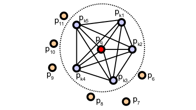
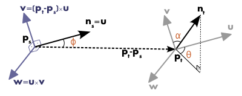
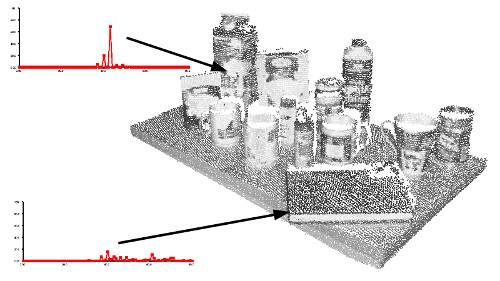

.. _pfh_estimation:

Point Feature Histograms (PFH) descriptors
------------------------------------------

As point feature representations go, surface normals and curvature estimates
are somewhat basic in their representations of the geometry around a specific
point. Though extremely fast and easy to compute, they cannot capture too much
detail, as they approximate the geometry of a point's k-neighborhood with only
a few values. As a direct consequence, most scenes will contain many points
with the same or very similar feature values, thus reducing their informative
characteristics.

This tutorial introduces a family of 3D feature descriptors coined PFH (Point
Feature Histograms) for simplicity, presents their theoretical advantages and
discusses implementation details from PCL's perspective. As a prerequisite,
please go ahead and read the :ref:`normal_estimation` tutorial first, as PFH
signatures rely on both xyz 3D data as well as surface normals.

Theoretical primer
------------------

The goal of the PFH formulation is to encode a point's k-neighborhood
geometrical properties by generalizing the mean curvature around the point
using a multi-dimensional histogram of values. This highly dimensional
hyperspace provides an informative signature for the feature representation, is
invariant to the 6D pose of the underlying surface, and copes very well with
different sampling densities or noise levels present in the neighborhood.

A Point Feature Histogram representation is based on the relationships between
the points in the k-neighborhood and their estimated surface normals. Simply
put, it attempts to capture as best as possible the sampled surface variations
by taking into account all the interactions between the directions of the
estimated normals. **The resultant hyperspace is thus dependent on the quality of
the surface normal estimations at each point.**

The figure below presents an influence region diagram of the PFH computation
for a query point (:math:`p_q`), marked with red and placed in the middle of a
circle (sphere in 3D) with radius **r**, and all its **k** neighbors (points
with distances smaller than the radius **r**) are fully interconnected in a
mesh. The final PFH descriptor is computed as a histogram of relationships
between all pairs of points in the neighborhood, and thus has a computational
complexity of :math:`O(k^2)`.

To compute the relative difference between two points :math:`p_i` and
:math:`p_j` and their associated normals :math:`n_i` and :math:`n_j`, we
define a fixed coordinate frame at one of the points (see the figure below).

.. math::

   {\mathsf u} =& \boldsymbol{n}_s \\
   {\mathsf v} =&  {\mathsf u} \times \frac{(\boldsymbol{p}_t-\boldsymbol{p}_s)}{{\|\boldsymbol{p}_t-\boldsymbol{p}_s\|}_{2}} \\
   {\mathsf w} =& {\mathsf u} \times {\mathsf v}

Using the above **uvw** frame, the difference between the two normals
:math:`n_s` and :math:`n_t` can be expressed as a set of angular features as
follows:

.. math::

   \alpha &= {\mathsf v} \cdot \boldsymbol{n}_t \\
   \phi   &= {\mathsf u} \cdot \frac{(\boldsymbol{p}_t - \boldsymbol{p}_s)}{d}\\
   \theta &= \arctan ({\mathsf w} \cdot \boldsymbol{n}_t, {\mathsf u} \cdot \boldsymbol{n}_t) \\

where **d** is the Euclidean distance between the two points
:math:`\boldsymbol{p}_s` and :math:`\boldsymbol{p}_t`,
:math:`d={\|\boldsymbol{p}_t-\boldsymbol{p}_s\|}_2`.  The quadruplet
:math:`\langle\alpha, \phi, \theta, d\rangle` is computed for each pair of two
points in k-neighborhood, therefore reducing the 12 values (xyz and normal
information) of the two points and their normals to 4. 

To estimate a PFH quadruplet for a pair of points, use:

.. code-block:: cpp

   computePairFeatures (const Eigen::Vector4f &p1, const Eigen::Vector4f &n1,
                        const Eigen::Vector4f &p2, const Eigen::Vector4f &n2,
                        float &f1, float &f2, float &f3, float &f4);

See the API documentation for additional details.

To create the final PFH representation for the query point, the set of all
quadruplets is binned into a histogram. The binning process divides each
feature’s value range into **b** subdivisions, and counts the number of
occurrences in each subinterval. Since three out of the four features presented
above are measures of the angles between normals, their values can easily be
normalized to the same interval on the trigonometric circle. A binning example
is to divide each feature interval into the same number of equal parts, and
therefore create a histogram with :math:`b^4` bins in a fully correlated space.
In this space, a histogram bin increment corresponds to a point having certain
values for all its 4 features. The figure below presents examples of Point
Feature Histograms representations for different points in a cloud.

In some cases, the fourth feature, **d**, does not present an extreme
significance for 2.5D datasets, usually acquired in robotics, as the distance
between neighboring points increases from the viewpoint. Therefore, omitting
**d** for scans where the local point density influences this feature dimension
has proved to be beneficial. 

.. note::
  
  For more information and mathematical derivations, including an analysis of PFH signatures for different surface geometries please see [RusuDissertation]_.

Estimating PFH features
-----------------------

Point Feature Histograms are implemented in PCL as part of the `pcl_features
<http://docs.pointclouds.org/trunk/a02944.html>`_ library. 

The default PFH implementation uses 5 binning subdivisions (e.g., each of the
four feature values will use this many bins from its value interval), and does
not include the distances (as explained above -- although the
**computePairFeatures** method can be called by the user to obtain the
distances too, if desired) which results in a 125-byte array (:math:`5^3`) of
float values. These are stored in a **pcl::PFHSignature125** point type.

The following code snippet will estimate a set of PFH features for all the
points in the input dataset.

.. code-block:: cpp
   :linenos:

   #include <pcl/point_types.h>
   #include <pcl/features/pfh.h>

   {
     pcl::PointCloud<pcl::PointXYZ>::Ptr cloud (new pcl::PointCloud<pcl::PointXYZ>);
     pcl::PointCloud<pcl::Normal>::Ptr normals (new pcl::PointCloud<pcl::Normal> ());
     
     ... read, pass in or create a point cloud with normals ...
     ... (note: you can create a single PointCloud<PointNormal> if you want) ...

     // Create the PFH estimation class, and pass the input dataset+normals to it
     pcl::PFHEstimation<pcl::PointXYZ, pcl::Normal, pcl::PFHSignature125> pfh;
     pfh.setInputCloud (cloud);
     pfh.setInputNormals (normals);
     // alternatively, if cloud is of tpe PointNormal, do pfh.setInputNormals (cloud);

     // Create an empty kdtree representation, and pass it to the PFH estimation object. 
     // Its content will be filled inside the object, based on the given input dataset (as no other search surface is given).
     pcl::search::KdTree<pcl::PointXYZ>::Ptr tree (new pcl::search::KdTree<pcl::PointXYZ> ());
     //pcl::KdTreeFLANN<pcl::PointXYZ>::Ptr tree (new pcl::KdTreeFLANN<pcl::PointXYZ> ()); -- older call for PCL 1.5-
     pfh.setSearchMethod (tree);

     // Output datasets
     pcl::PointCloud<pcl::PFHSignature125>::Ptr pfhs (new pcl::PointCloud<pcl::PFHSignature125> ());

     // Use all neighbors in a sphere of radius 5cm
     // IMPORTANT: the radius used here has to be larger than the radius used to estimate the surface normals!!!
     pfh.setRadiusSearch (0.05);

     // Compute the features
     pfh.compute (*pfhs);

     // pfhs->size () should have the same size as the input cloud->size ()*
   }

The actual **compute** call from the **PFHEstimation** class does nothing internally but::

 for each point p in cloud P

   1. get the nearest neighbors of p

   2. for each pair of neighbors, compute the three angular values

   3. bin all the results in an output histogram

To compute a single PFH representation from a k-neighborhood, use:

.. code-block:: cpp

   computePointPFHSignature (const pcl::PointCloud<PointInT> &cloud, 
                             const pcl::PointCloud<PointNT> &normals,
                             const std::vector<int> &indices, 
                             int nr_split, 
                             Eigen::VectorXf &pfh_histogram);

Where *cloud* is the input point cloud that contains the points, *normals* is
the input point cloud that contains the normals (could be equal to cloud if
*PointInT=PointNT=PointNormal*), *indices* represents the set of k-nearest
neighbors from *cloud*, *nr_split* is the number of subdivisions to use for the
binning process for each feature interval, and *pfh_histogram* is the output
resultant histogram as an array of float values.

.. note::
  
  For efficiency reasons, the **compute** method in **PFHEstimation** does not check if the normals contain NaN or infinite values.
  Passing such values to **compute()** will result in undefined output.
  It is advisable to check the normals, at least during the design of the processing chain or when setting the parameters.
  This can be done by inserting the following code before the call to **compute()**:

  .. code-block:: cpp

     for (int i = 0; i < normals->size(); i++)
     {
       if (!pcl::isFinite<pcl::Normal>((*normals)[i]))
       {
         PCL_WARN("normals[%d] is not finite\n", i);
       }
     }

  In production code, preprocessing steps and parameters should be set so that normals are finite or raise an error.

