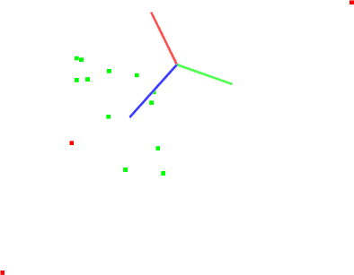

.. _planar_segmentation:

Plane model segmentation
-------------------------

In this tutorial we will learn how to do a simple plane segmentation of a set of
points, that is to find all the points within a point cloud that support a plane
model. This tutorial supports the :ref:`extract_indices` tutorial, presented in
the **filtering** section.

.. raw:: html

   <iframe title="Planar model segmentation" width="480" height="390" src="https://www.youtube.com/embed/ZTK7NR1Xx4c?rel=0" frameborder="0" allowfullscreen></iframe>

The code
--------

First, create a file, let's say, ``planar_segmentation.cpp`` in your favorite
editor, and place the following inside it:

.. literalinclude:: sources/planar_segmentation/planar_segmentation.cpp
   :language: cpp
   :linenos:

The explanation
---------------

Now, let's break down the code piece by piece.

Lines:

.. literalinclude:: sources/planar_segmentation/planar_segmentation.cpp
   :language: cpp
   :lines: 5-7

.. important::

  Please visit https://pointclouds.org/documentation/group__sample__consensus.html
  for more information on various other implemented Sample Consensus models and
  robust estimators.

Lines:

.. literalinclude:: sources/planar_segmentation/planar_segmentation.cpp
   :language: cpp
   :lines: 14-36

create the point cloud structure, fill in the respective values, and display
the content on screen. Note that for the purpose of this tutorial, we manually
added a few outliers in the data, by setting their z values different from 0.

Then, lines:

.. literalinclude:: sources/planar_segmentation/planar_segmentation.cpp
   :language: cpp
   :lines: 38-50

   
create the :pcl:`SACSegmentation <pcl::SACSegmentation>` object and set the model and method type.  
This is also where we specify the "distance threshold", which determines how close a point must be to the model in order to be considered an inlier. 
In this tutorial, we will use the RANSAC method (pcl::SAC_RANSAC) as the robust estimator of choice. 
Our decision is motivated by RANSAC's simplicity (other robust estimators use it as
a base and add additional, more complicated concepts). For more information
about RANSAC, check its `Wikipedia page
<http://en.wikipedia.org/wiki/RANSAC>`_.

Finally:

.. literalinclude:: sources/planar_segmentation/planar_segmentation.cpp
   :language: cpp
   :lines: 58-61

are used to show the contents of the inlier set, together with the estimated
plane parameters (in :math:`ax + by + cz + d = 0` form).

Compiling and running the program
---------------------------------

Add the following lines to your CMakeLists.txt file:

.. literalinclude:: sources/planar_segmentation/CMakeLists.txt
   :language: cmake
   :linenos:

   
After you have made the executable, you can run it. Simply do::

  $ ./planar_segmentation

You will see something similar to::

  Point cloud data: 15 points
      0.352222 -0.151883 2
      -0.106395 -0.397406 1
      -0.473106 0.292602 1
      -0.731898 0.667105 -2
      0.441304 -0.734766 1
      0.854581 -0.0361733 1
      -0.4607 -0.277468 4
      -0.916762 0.183749 1
      0.968809 0.512055 1
      -0.998983 -0.463871 1
      0.691785 0.716053 1
      0.525135 -0.523004 1
      0.439387 0.56706 1
      0.905417 -0.579787 1
      0.898706 -0.504929 1
  [pcl::SACSegmentation::initSAC] Setting the maximum number of iterations to 50
  Model coefficients: 0 0 1 -1
  Model inliers: 12
  1    -0.106395 -0.397406 1
  2    -0.473106 0.292602 1
  4    0.441304 -0.734766 1
  5    0.854581 -0.0361733 1
  7    -0.916762 0.183749 1
  8    0.968809 0.512055 1
  9    -0.998983 -0.463871 1
  10    0.691785 0.716053 1
  11    0.525135 -0.523004 1
  12    0.439387 0.56706 1
  13    0.905417 -0.579787 1
  14    0.898706 -0.504929 1

A graphical display of the segmentation process is shown below.

Note that the coordinate axes are represented as red (x), green (y), and blue
(z). The points are represented with red as the outliers, and green as the
inliers of the plane model found.

