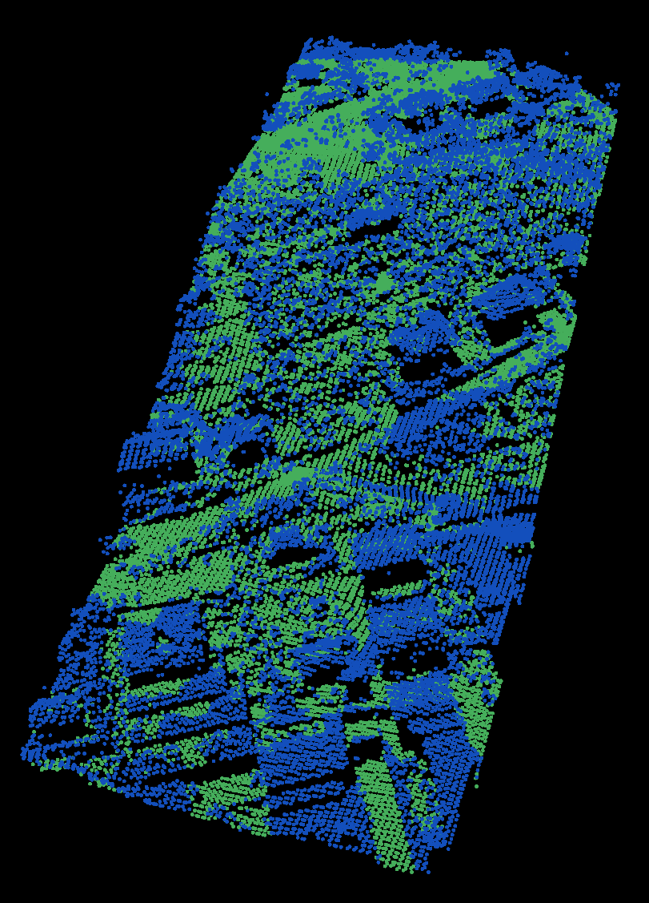

.. _progressive_morphological_filtering:

Identifying ground returns using ProgressiveMorphologicalFilter segmentation
----------------------------------------------------------------------------

Implements the Progressive Morphological Filter for segmentation of ground
points. 

Background
----------

A complete description of the algorithm can be found in the article `"A
Progressive Morphological Filter for Removing Nonground Measurements from
Airborne LIDAR Data" <http://users.cis.fiu.edu/~chens/PDF/TGRS.pdf>`_ by K.
Zhang, S.  Chen, D. Whitman, M. Shyu, J. Yan, and C. Zhang.

The code
--------

First, download the dataset `samp11-utm.pcd
<https://raw.github.com/PointCloudLibrary/data/master/terrain/samp11-utm.pcd>`_
and save it somewhere to disk.

Then, create a file, let's say, ``bare_earth.cpp`` in your favorite editor, and
place the following inside it:

.. literalinclude:: sources/bare_earth/bare_earth.cpp
   :language: cpp
   :linenos:

The explanation
---------------

Now, let's break down the code piece by piece.

The following lines of code will read the point cloud data from disk.

.. literalinclude:: sources/bare_earth/bare_earth.cpp
   :language: cpp
   :lines: 14-17

   
Then, a *pcl::ProgressiveMorphologicalFilter* filter is created. The output
(the indices of ground returns) is computed and stored in *ground*.

.. literalinclude:: sources/bare_earth/bare_earth.cpp
   :language: cpp
   :lines: 22-29

   
To extract the ground points, the ground indices are passed into a
*pcl::ExtractIndices* filter.

.. literalinclude:: sources/bare_earth/bare_earth.cpp
   :language: cpp
   :lines: 31-35

The ground returns are written to disk for later inspection. 

.. literalinclude:: sources/bare_earth/bare_earth.cpp
   :language: cpp
   :lines: 40-41

   
Then, the filter is called with the same parameters, but with the output
negated, to obtain the non-ground (object) returns.

.. literalinclude:: sources/bare_earth/bare_earth.cpp
   :language: cpp
   :lines: 43-45

   
And the data is written back to disk.

.. literalinclude:: sources/bare_earth/bare_earth.cpp
   :language: cpp
   :lines: 50
   

Compiling and running the program
---------------------------------

Add the following lines to your CMakeLists.txt file:

.. literalinclude:: sources/bare_earth/CMakeLists.txt
   :language: cmake
   :linenos:
   
After you have made the executable, you can run it. Simply do::

  $ ./bare_earth

You will see something similar to::

  Cloud before filtering: 
  points[]: 38010
  width: 38010
  height: 1
  is_dense: 1
  sensor origin (xyz): [0, 0, 0] / orientation (xyzw): [0, 0, 0, 1]

  Ground cloud after filtering: 
  points[]: 18667
  width: 18667
  height: 1
  is_dense: 1
  sensor origin (xyz): [0, 0, 0] / orientation (xyzw): [0, 0, 0, 1]

  Object cloud after filtering: 
  points[]: 19343
  width: 19343
  height: 1
  is_dense: 1
  sensor origin (xyz): [0, 0, 0] / orientation (xyzw): [0, 0, 0, 1]

You can also look at your outputs samp11-utm_inliers.pcd and
samp11-utm_outliers.pcd::

  $ ./pcl_viewer samp11-utm_ground.pcd samp11-utm_object.pcd

You are now able to see both the ground and object returns in one viewer. You
should see something similar to this:

