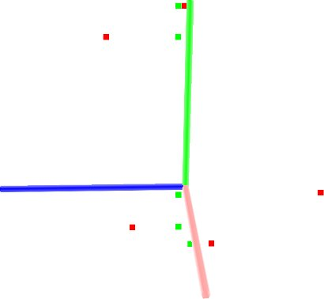

.. _project_inliers:

Projecting points using a parametric model
------------------------------------------

In this tutorial we will learn how to project points onto a parametric model
(e.g., plane, sphere, etc). The parametric model is given through a set of
coefficients -- in the case of a plane, through its equation: ax + by + cz + d
= 0.

The code
--------

First, create a file, let's say, ``project_inliers.cpp`` in your favorite
editor, and place the following inside it:

.. code-block:: cpp
   :linenos:

    #include <iostream>
    #include "pcl/io/pcd_io.h"
    #include "pcl/point_types.h"
    #include "pcl/ModelCoefficients.h"
    #include "pcl/filters/project_inliers.h"

    int
      main (int argc, char** argv)
    {
      pcl::PointCloud<pcl::PointXYZ>::Ptr cloud (new pcl::PointCloud<pcl::PointXYZ>);
      pcl::PointCloud<pcl::PointXYZ>::Ptr cloud_projected (new pcl::PointCloud<pcl::PointXYZ>);

      // Fill in the cloud data
      cloud->width  = 5;
      cloud->height = 1;
      cloud->points.resize (cloud->width * cloud->height);

      for (size_t i = 0; i < cloud->points.size (); ++i)
      {
        cloud->points[i].x = 1024 * rand () / (RAND_MAX + 1.0);
        cloud->points[i].y = 1024 * rand () / (RAND_MAX + 1.0);
        cloud->points[i].z = 1024 * rand () / (RAND_MAX + 1.0);
      }

      std::cerr << "Cloud before projection: " << std::endl;
      for (size_t i = 0; i < cloud->points.size (); ++i)
        std::cerr << "    " << cloud->points[i].x << " " 
                            << cloud->points[i].y << " " 
                            << cloud->points[i].z << std::endl;

      // Create a set of planar coefficients with X=Y=0,Z=1
      pcl::ModelCoefficients::Ptr coefficients (new pcl::ModelCoefficients ());
      coefficients->values.resize (4);
      coefficients->values[0] = coefficients->values[1] = 0;
      coefficients->values[2] = 1.0;
      coefficients->values[3] = 0;

      // Create the filtering object
      pcl::ProjectInliers<pcl::PointXYZ> proj;
      proj.setModelType (pcl::SACMODEL_PLANE);
      proj.setInputCloud (cloud);
      proj.setModelCoefficients (coefficients);
      proj.filter (*cloud_projected);

      std::cerr << "Cloud after projection: " << std::endl;
      for (size_t i = 0; i < cloud_projected->points.size (); ++i)
        std::cerr << "    " << cloud_projected->points[i].x << " " 
                            << cloud_projected->points[i].y << " " 
                            << cloud_projected->points[i].z << std::endl;

      return (0);
    }

The explanation
---------------

Now, let's break down the code piece by piece.

We first import the ModelCoefficients structure then the ProjectInliers filter.

.. code-block:: cpp

    #include "pcl/ModelCoefficients.h"
    #include "pcl/filters/project_inliers.h"

We then create the point cloud structure, fill in the respective values, and
display the content on screen.

.. code-block:: cpp

      cloud->width  = 5;
      cloud->height = 1;
      cloud->points.resize (cloud->width * cloud->height);

      for (size_t i = 0; i < cloud->points.size (); ++i)
      {
        cloud->points[i].x = 1024 * rand () / (RAND_MAX + 1.0);
        cloud->points[i].y = 1024 * rand () / (RAND_MAX + 1.0);
        cloud->points[i].z = 1024 * rand () / (RAND_MAX + 1.0);
      }

      std::cerr << "Cloud before projection: " << std::endl;
      for (size_t i = 0; i < cloud->points.size (); ++i)
        std::cerr << "    " << cloud->points[i].x << " " 
                            << cloud->points[i].y << " " 
                            << cloud->points[i].z << std::endl;

We fill in the ModelCoefficients values. In this case, we use a planar model,
with ax+by+cz+d=0, where a=b=d=0, and c=1, or said differently, the X-Y plane.

.. code-block:: cpp

      pcl::ModelCoefficients::Ptr coefficients (new pcl::ModelCoefficients ());
      coefficients->values.resize (4);
      coefficients->values[0] = coefficients->values[1] = 0;
      coefficients->values[2] = 1.0;
      coefficients->values[3] = 0;

We create the ProjectInliers object and use the ModelCoefficients defined above
as the model to project onto. 

.. code-block:: cpp

      pcl::ProjectInliers<pcl::PointXYZ> proj;
      proj.setModelType (pcl::SACMODEL_PLANE);
      proj.setInputCloud (cloud);
      proj.setModelCoefficients (coefficients);
      proj.filter (*cloud_projected);

Finally we show the content of the projected cloud.

.. code-block:: cpp

      std::cerr << "Cloud after projection: " << std::endl;
      for (size_t i = 0; i < cloud_projected->points.size (); ++i)
        std::cerr << "    " << cloud_projected->points[i].x << " " 
                            << cloud_projected->points[i].y << " " 
                            << cloud_projected->points[i].z << std::endl;

Compiling and running the program
---------------------------------

Add the following lines to your CMakeLists.txt file:

.. code-block:: cmake
   
   add_executable (project_inliers project_inliers.cpp)
   target_link_libraries (project_inliers pcl_io pcl_filters)

After you have made the executable, you can run it. Simply do::

  $ ./project_inliers

You will see something similar to::

  Cloud before projection: 
      0.352222 -0.151883 -0.106395
      -0.397406 -0.473106 0.292602
      -0.731898 0.667105 0.441304
      -0.734766 0.854581 -0.0361733
      -0.4607 -0.277468 -0.916762
  Cloud after projection: 
      0.352222 -0.151883 0
      -0.397406 -0.473106 0
      -0.731898 0.667105 0
      -0.734766 0.854581 0
      -0.4607 -0.277468 0

A graphical display of the projection process is shown below.

Note that the coordinate axis are represented as red (x), green (y), and blue
(z). The five points are represented with red as the points before projection
and green as the points after projection. Note that their z now lies on the X-Y
plane.
