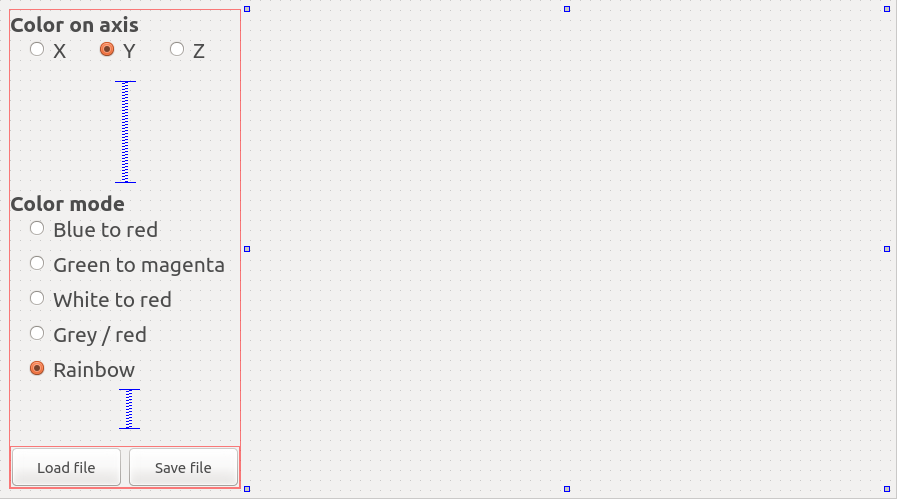
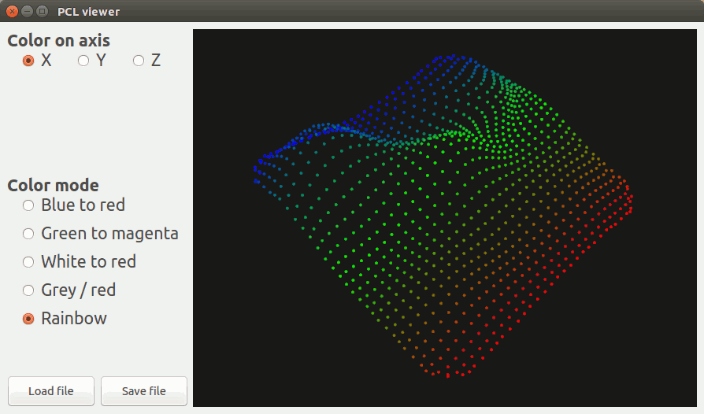

.. _qt_colorize_cloud:

==================================================
Create a PCL visualizer in Qt to colorize clouds
==================================================

Please read and do the `PCL + Qt tutorial <http://www.pointclouds.org/documentation/tutorials/qt_visualizer.php>`_ first; 
only the coloring part is explained in details here.

In this tutorial we will learn how to color clouds by computing a `Look Up Table (LUT) <https://en.wikipedia.org/wiki/Lookup_table>`_,
compared to the first tutorial this tutorial shows you how to connect multiple slots to one function. It also showcases how to load and save
files within the Qt interface.

| The tutorial was tested on Linux Ubuntu 12.04 and 14.04. It also seems to be working fine on Windows 8.1 x64.
| Feel free to push modifications into the git repo to make this code/tutorial compatible with your platform !

.. contents::

The project
===========

As for the other tutorial, we use `cmake <https://en.wikipedia.org/wiki/CMake>`_ instead of `qmake <http://qt-project.org/doc/qt-4.8/qmake-manual.html>`_.
This is how I organized the project: the build folder contains all built files and the src folder holds all sources files ::

  .
  ├── build
  └── src
      ├── CMakeLists.txt
      ├── main.cpp
      ├── pclviewer.cpp
      ├── pclviewer.h
      ├── pclviewer.ui
      └── pcl_visualizer.pro

If you want to change this layout you will have to do minor modifications in the code, especially line 2 of ``pclviewer.cpp``
Create the folder tree and download the sources files from `github <https://github.com/PointCloudLibrary/pcl/tree/master/doc/tutorials/content/sources/qt_colorize_cloud>`_.

.. note::
   File paths should not contain any special character or the compilation might fail with a ``moc: Cannot open options file specified with @`` error message.

User interface (UI)
===================

The UI looks like this:

The vertical spacers are here to make sure everything moves fine when you re-size the window; the QVTK widget size has been set to a minimum size of
640 x 480 pixel, the layout makes sure that the QVTK widget expands when you re-size the application window.

The code
========

Now, let's break down the code piece by piece.

pclviewer.h
-----------

.. literalinclude:: sources/qt_colorize_cloud/pclviewer.h
   :language: cpp
   :lines: 42-57

These are the public slots triggered by the buttons in the UI.

.. literalinclude:: sources/qt_colorize_cloud/pclviewer.h
   :language: cpp
   :lines: 59-86

These are the protected members of our class;
  * ``viewer_`` is the visualizer object
  * ``cloud_`` holds the point cloud displayed
  * ``filtering_axis_`` stores on which axis we want to filter the point cloud. We need this variable because we only have one slot for 3 axes.
  * ``color_mode_`` stores the color mode for the colorization, we need this variable for the same reason we need ``filtering_axis_``
  * ``colorCloudDistances ()`` is the member function that actually colorize the point cloud.

pclviewer.cpp
-------------

.. literalinclude:: sources/qt_colorize_cloud/pclviewer.cpp
   :language: cpp
   :lines: 4-8

We initialize the members of our class to default values (note that theses values should match with the UI buttons ticked)

.. literalinclude:: sources/qt_colorize_cloud/pclviewer.cpp
   :language: cpp
   :lines: 9-24

Here we initialize the UI, window title and generate a random point cloud (500 points), note we don't care about the color for now.

.. literalinclude:: sources/qt_colorize_cloud/pclviewer.cpp
   :language: cpp
   :lines: 26-31

Here we set up the QVTK window.

.. literalinclude:: sources/qt_colorize_cloud/pclviewer.cpp
   :language: cpp
   :lines: 33-46

At this point we connect SLOTS and their functions to ensure that each UI elements has an use.

.. literalinclude:: sources/qt_colorize_cloud/pclviewer.cpp
   :language: cpp
   :lines: 48-52

We call the coloring function, add the point cloud and refresh the QVTK viewer.

.. literalinclude:: sources/qt_colorize_cloud/pclviewer.cpp
   :language: cpp
   :lines: 60-98

This functions deals with opening files, it supports both ``pcd`` and ``ply`` files.
The LUT computing will only work if the point cloud is dense (only finite values) so we remove NaN values from the point cloud if needed.

.. literalinclude:: sources/qt_colorize_cloud/pclviewer.cpp
   :language: cpp
   :lines: 100-127

| This functions deals with saving the displayed file, it supports both ``pcd`` and ``ply`` files.
| As said before, if the user doesn't append an extension to the file name, ``ply`` will be automatically added.

.. literalinclude:: sources/qt_colorize_cloud/pclviewer.cpp
   :language: cpp
   :lines: 129-152

This function is called whenever one of the three radio buttons X,Y,Z are clicked, it determines which radio button is clicked and changes
the ``filtering_axis_`` member accordingly.

.. literalinclude:: sources/qt_colorize_cloud/pclviewer.cpp
   :language: cpp
   :lines: 154-187

This function is called whenever one of the radio buttons in the color list is clicked, the ``color_mode_`` member is modified accordingly.
We also call the coloring function and update the cloud / QVTK widget.

.. literalinclude:: sources/qt_colorize_cloud/pclviewer.cpp
   :language: cpp
   :lines: 189-209

| This is the core function of the application. We are going to color the cloud following a color scheme.
The point cloud is going to be colored following one direction, we first need to know where it starts and where it ends 
(the minimum & maximum point values along the chosen axis). We first set the initial minimal value to the first point value 
(this is safe because we removed NaN points from the point clouds). The switch case allows us to deal with the 3 different axes.

.. literalinclude:: sources/qt_colorize_cloud/pclviewer.cpp
   :language: cpp
   :lines: 211-238

We then loop through the whole cloud to find the minimum and maximum values.

.. literalinclude:: sources/qt_colorize_cloud/pclviewer.cpp
   :language: cpp
   :lines: 239-244

Here we compute the scaling, RGB values are coded from 0 to 255 (as integers), we need to scale our distances so that the 
minimum distance equals 0 (in RGB scale) and the maximum distance 255 (in RGB scale).
The ``if`` condition is here in case of a perfectly flat point cloud and avoids exceptions thrown by boost.

.. literalinclude:: sources/qt_colorize_cloud/pclviewer.cpp
   :language: cpp
   :lines: 246-260

We have computed how much we need to scale the distances to fit the RGB scale, we first need to round the ``double`` values to the closest ``integer``
because colors are coded as integers.

.. literalinclude:: sources/qt_colorize_cloud/pclviewer.cpp
   :language: cpp
   :lines: 262-270

This is where we apply the color level we have computed to the point cloud R,G,B values.
You can do whatever you want here, the simplest option is to apply the 3 channels (R,G,B) to the ``value`` computed, this means that the 
minimum distance will translate into dark (black = 0,0,0) points and maximal distances into white (255,255,255) points.

.. literalinclude:: sources/qt_colorize_cloud/pclviewer.cpp
   :language: cpp
   :lines: 271-305

These are examples of coloring schemes, if you are wondering how it works, simply plot the computed values into a spreadsheet software.

Compiling and running
=====================

There are two options here :
  * You have configured the Qt project (see `Qt visualizer tutorial <http://www.pointclouds.org/documentation/tutorials/qt_visualizer.php#qt-configuration>`_) and you can compile/run just by clicking on the bottom left "Play" button.
  * You didn't configure the Qt project; just go to the build folder an run ``cmake ../src && make -j2 && ./pcl_visualizer``

Note that if you don't specify a extension when saving the file, the file will be saved as a binary PLY file.

