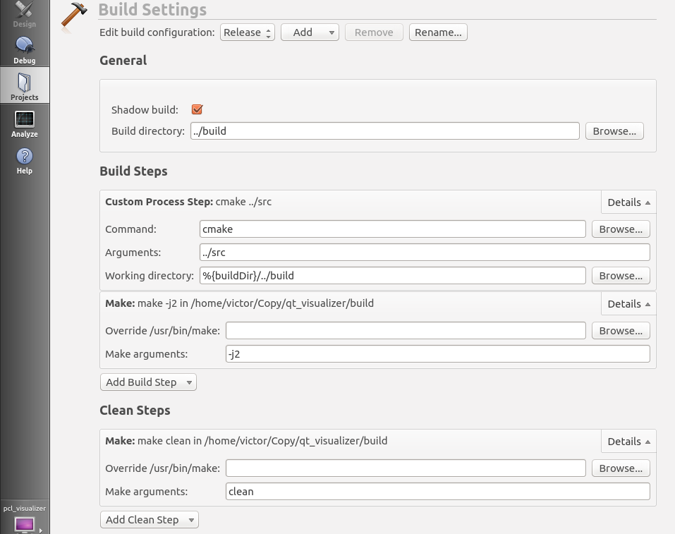
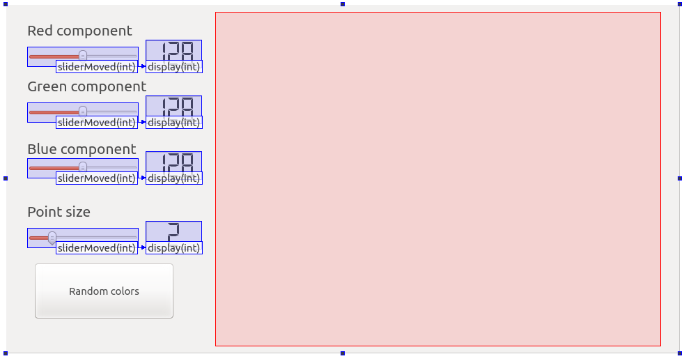
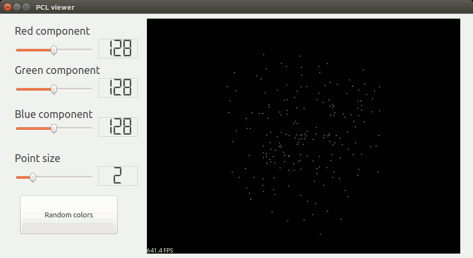

.. _qt_visualizer:

========================================
Create a PCL visualizer in Qt with cmake
========================================

In this tutorial we will learn how to create a PCL + Qt project, we will use Cmake rather than Qmake.The program we are going to 
write is a simple PCL visualizer which allow to change a randomly generated point cloud color.

| The tutorial was tested on Linux Ubuntu 12.04 and 14.04. It also seems to be working fine on Windows 8.1 x64.
| Feel free to push modifications into the git repo to make this code/tutorial compatible with your platform !

.. contents::

The project
===========

For this project Qt is of course mandatory, make sure it is installed and PCL deals with it.
`qmake <http://qt-project.org/doc/qt-4.8/qmake-manual.html>`_ is a tool that helps simplify the build process for development project across different platforms,
we will use `cmake <https://en.wikipedia.org/wiki/CMake>`_ instead because most projects in PCL uses cmake and it is simpler in my opinion.

This is how I organized the project: the build folder contains all built files and the src folder holds all sources files ::

  .
  ├── build
  └── src
      ├── CMakeLists.txt
      ├── main.cpp
      ├── pclviewer.cpp
      ├── pclviewer.h
      ├── pclviewer.ui
      ├── pcl_visualizer.pro
      └── pcl_visualizer.pro.user

If you want to change this layout you will have to do minor modifications in the code, especially line 2 of ``pclviewer.cpp``
Create the folder tree and download the sources files from `github <https://github.com/PointCloudLibrary/pcl/tree/master/doc/tutorials/content/sources/qt_visualizer>`_.

.. note::
   File paths should not contain any special caracter or the compilation might fail with a ``moc: Cannot open options file specified with @`` error message.

Qt configuration
================

First we will take a look at how Qt is configured to build this project. Simply open ``pcl_visualizer.pro`` with Qt (or double click on the file)
 and go to the **Projects** tab

In this example note that I deleted the **Debug** configuration and only kept the **Release** config.
Use relative paths like this is better than absolute paths; this project should work wherever it has been put.

We specify in the general section that we want to build in the folder ``../build`` (this is a relative path from the ``.pro`` file).

The first step of the building is to call ``cmake`` (from the ``build`` folder) with argument ``../src``; this is gonna create all files in the
``build`` folder without modifying anything in the ``src`` foler; thus keeping it clean.

Then we just have to compile our program; the argument ``-j2`` allow to specify how many thread of your CPU you want to use for compilation. The more thread you use
the faster the compilation will be (especially on big projects); but if you take all threads from the CPU your OS will likely be unresponsive during 
the compilation process.
See `compiler optimizations <http://www.pointclouds.org/documentation/advanced/compiler_optimizations.php#compiler-optimizations>`_ for more information.

If you don't want to use Qt Creator but Eclipse instead; see `using PCL with Eclipse <http://www.pointclouds.org/documentation/tutorials/using_pcl_with_eclipse.php#using-pcl-with-eclipse>`_.

User interface (UI)
===================

The point of using Qt for your projects is that you can easily build cross-platform UIs. The UI is held in the ``.ui`` file
You can open it with a text editor or with Qt Creator, in this example the UI is very simple and it consists of :

  * `QMainWindow <http://qt-project.org/doc/qt-4.8/qmainwindow.html>`_, QWidget: the window (frame) of your application
  * qvtkWidget: The VTK widget which holds the PCLVisualizer
  * `QLabel <http://qt-project.org/doc/qt-4.8/qlabel.html>`_: Display text on the user interface
  * `QSlider <http://qt-project.org/doc/qt-4.8/qslider.html>`_: A slider to choose a value (here; an integer value)
  * `QLCDNumber <http://qt-project.org/doc/qt-4.8/qlcdnumber.html>`_: A digital display, 8 segment styled

If you click on Edit `Signals/Slots <http://qt-project.org/doc/qt-4.8/signalsandslots.html>`_ at the top of the Qt window you will see the relationships 
between some of the UI objects. In our example the sliderMoved(int) signal is connected to the display(int) slot; this means that everytime we move the slider 
the digital display is updated accordingly to the slider value.

The code
========

Now, let's break down the code piece by piece.

main.cpp
--------

.. literalinclude:: sources/qt_visualizer/main.cpp
   :language: cpp

| Here we include the headers for the class PCLViewer and the headers for QApplication and QMainWindow.
| Then the main functions consists of instanciating a QApplication `a` which manages the GUI application's control flow and main settings.
| A ``PCLViewer`` object called `w` is instanciated and it's method ``show()`` is called.
| Finally we return the state of our program exit through the QApplication `a`.

pclviewer.h
-----------

.. literalinclude:: sources/qt_visualizer/pclviewer.h
   :language: cpp
   :lines: 1-18

This file is the header for the class PCLViewer; we include ``QMainWindow`` because this class contains UI elements, we include the PCL headers we will 
be using and the VTK header for the ``qvtkWidget``. We also define typedefs of the point types and point clouds, this improves readabily.

.. literalinclude:: sources/qt_visualizer/pclviewer.h
   :language: cpp
   :lines: 20-23

We declare the namespace ``Ui`` and the class PCLViewer inside it.

.. literalinclude:: sources/qt_visualizer/pclviewer.h
   :language: cpp
   :lines: 25-27

This is the definition of the PCLViewer class; the macro ``Q_OBJECT`` tells the compiler that this object contains UI elements;
this imply that this file will be processed through `the Meta-Object Compiler (moc) <http://qt-project.org/doc/qt-4.8/moc.html>`_.

.. literalinclude:: sources/qt_visualizer/pclviewer.h
   :language: cpp
   :lines: 29-31

The constructor and destructor of the PCLViewer class.

.. literalinclude:: sources/qt_visualizer/pclviewer.h
   :language: cpp
   :lines: 33-50

These are the public slots; these functions will be linked with UI elements actions.

.. literalinclude:: sources/qt_visualizer/pclviewer.h
   :language: cpp
   :lines: 52-58

| A boost shared pointer to a PCLVisualier and a pointer to a point cloud are defined here.
| The integers ``red``, ``green``, ``blue`` will help us store the value of the sliders.

pclviewer.cpp
-------------

.. literalinclude:: sources/qt_visualizer/pclviewer.cpp
   :language: cpp
   :lines: 1-14

We include the class header and the header for the UI object; note that this file is generated by the moc and it's path depend on 
where you call cmake !

After that is the constructor implementation; we setup the ui and the window title name.
| Then we initialize the cloud pointer member of the class at a newly allocated point cloud pointer.
| The cloud is resized to be able to hold 200 points.

.. literalinclude:: sources/qt_visualizer/pclviewer.cpp
   :language: cpp
   :lines: 16-31

| ``red`` ``green`` and ``blue`` protected members are initialized to their default values.
| The cloud is filled with random points (in a cube) and accordingly to ``red`` ``green`` and ``blue`` colors.

.. literalinclude:: sources/qt_visualizer/pclviewer.cpp
   :language: cpp
   :lines: 33-37

| Here we create a PCL Visualizer name ``viewer`` and we also specify that we don't want an interactor to be created.
| We don't want an interactor to be created because our ``qvtkWidget`` is already an interactor and it's the one we want to use.
| So the next step is to configure our newly created PCL Visualiser interactor to use the ``qvtkWidget``.

The ``update()`` method of the ``qvtkWidget`` should be called each time you modify the PCL visualizer; if you don't call it you don't know if the 
visualizer will be updated before the user try to pan/spin/zoom.

.. literalinclude:: sources/qt_visualizer/pclviewer.cpp
   :language: cpp
   :lines: 39-51

Here we connect slots and signals, this links UI actions to functions. Here is a summary of what we have linked :
  * ``pushButton_random``:  
                       | if button is pressed call ``randomButtonPressed ()``
  * ``horizontalSlider_R``: 
                       | if slider value is changed call ``redSliderValueChanged(int)`` with the new value as argument
                       | if slider is released call ``RGBsliderReleased()``
  * ``horizontalSlider_G``: 
                       | if slider value is changed call ``redSliderValueChanged(int)`` with the new value as argument
                       | if slider is released call ``RGBsliderReleased()``
  * ``horizontalSlider_B``: 
                       | if slider value is changed call ``redSliderValueChanged(int)`` with the new value as argument
                       | if slider is released call ``RGBsliderReleased()``

.. literalinclude:: sources/qt_visualizer/pclviewer.cpp
   :language: cpp
   :lines: 53-57

| This is the last part of our constructor; we add the point cloud to the visualizer, call the method ``pSliderValueChanged`` to change the point size to 2.

We finaly reset the camera within the PCL Visualizer not avoid the user having to zoom out and update the qvtkwidget to be 
sure the modifications will be displayed.

.. literalinclude:: sources/qt_visualizer/pclviewer.cpp
   :language: cpp
   :lines: 59-74

| This is the public slot function member called when the push button "Random" is pressed.
| The ``for`` loop iterates through the point cloud and changes point cloud color to a random number (between 0 and 255).
| The point cloud is then updated and so the ``qtvtkwidget`` is.

.. literalinclude:: sources/qt_visualizer/pclviewer.cpp
   :language: cpp
   :lines: 76-88

| This is the public slot function member called whenever the red, green or blue slider is released
| The ``for`` loop iterates through the point cloud and changes point cloud color to ``red``, ``green`` and ``blue`` member values.
| The point cloud is then updated and so the ``qtvtkwidget`` is.

.. literalinclude:: sources/qt_visualizer/pclviewer.cpp
   :language: cpp
   :lines: 97-116

| These are the public slot function member called whenever the red, green or blue slider value is changed
| These functions just changes the member value accordingly to the slider value.
| Here the point cloud is not updated; so until you release the slider you won't see any change in the visualizer.

.. literalinclude:: sources/qt_visualizer/pclviewer.cpp
   :language: cpp
   :lines: 118-121

The destructor.

Compiling and running
=====================

There are two options here :
  * You have configured the Qt project and you can compile/run just by clicking on the bottom left "Play" button.
  * You didn't configure the Qt project; just go to the build folder an run ``cmake ../src && make -j2 && ./pcl_visualizer``

| Notice that when changing the slider color, the cloud is not updated until you release the slider (``sliderReleased ()`` slot).

If you wanted to update the point cloud when the slider value is changed you could just call the ``RGBsliderReleased ()`` function inside the
``*sliderValueChanged (int)`` functions. The connect between  ``sliderReleased ()`` / ``RGBsliderReleased ()`` would become useless then.

| When using the slider for the point size; the size of the point is updated without having to release the slider.

More on Qt and PCL
==================

If you want to know more about Qt and PCL go take a look at `PCL apps <https://github.com/PointCloudLibrary/pcl/tree/master/apps>`_ like 
`PCD video player <https://github.com/PointCloudLibrary/pcl/tree/master/apps/src/pcd_video_player>`_ 
or `manual registration <https://github.com/PointCloudLibrary/pcl/tree/master/apps/src/manual_registration>`_.

Re-use the :download:`CMakeLists.txt <./sources/qt_visualizer/CMakeLists.txt>` from this tutorial if you want to compile the application outside of PCL.
