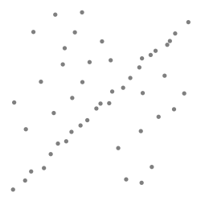
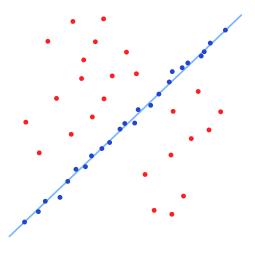
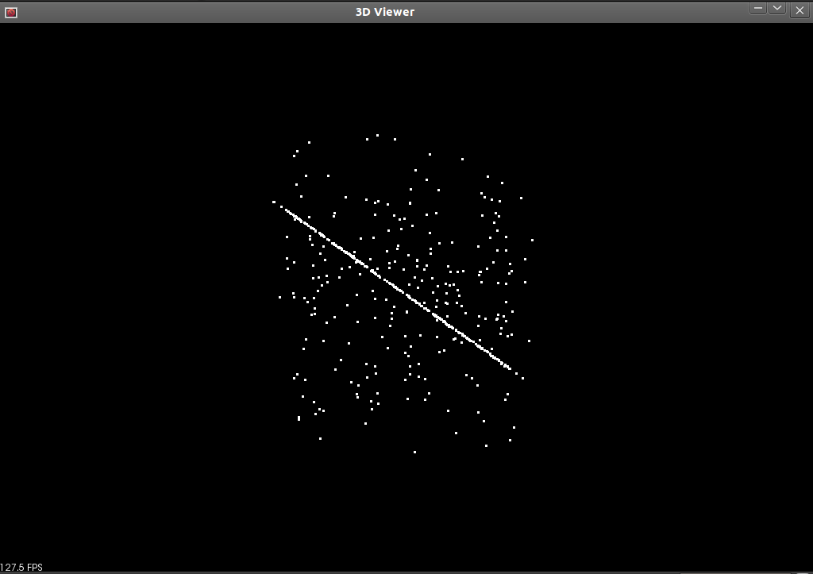
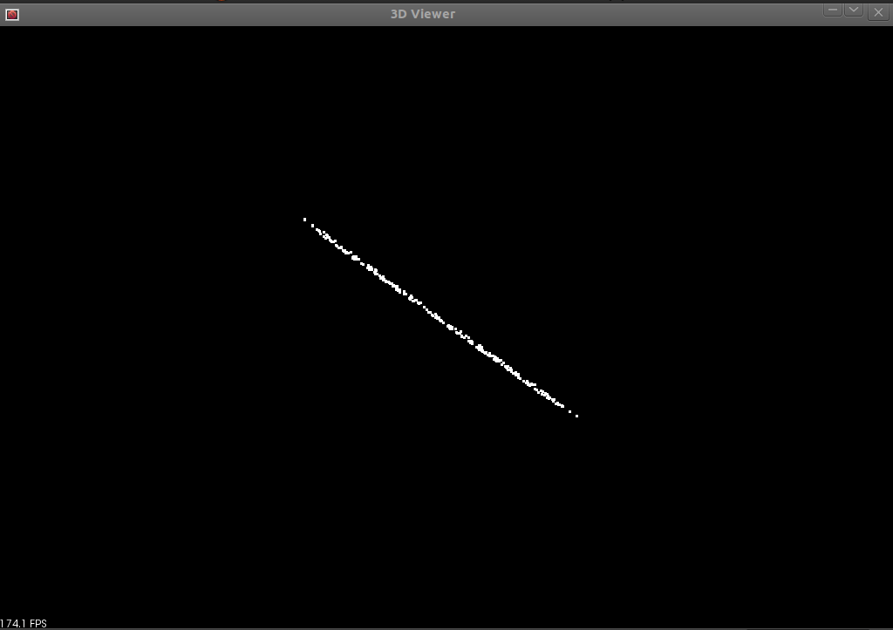
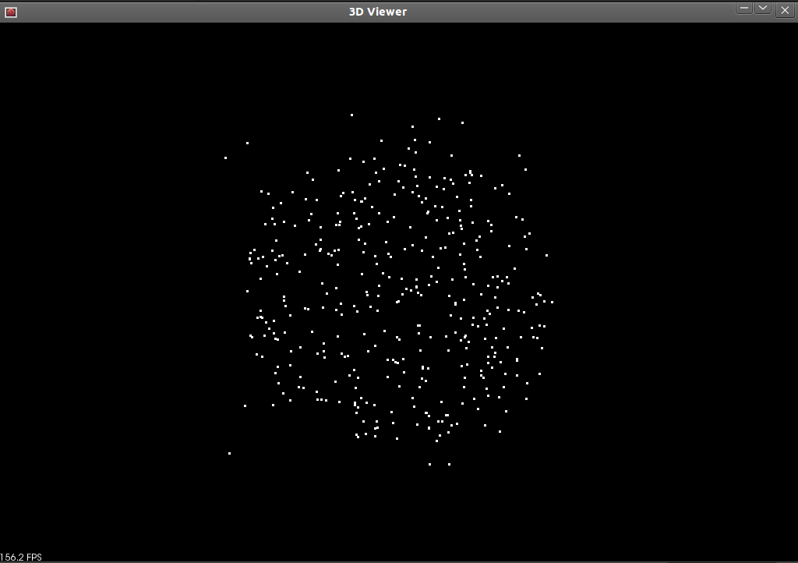
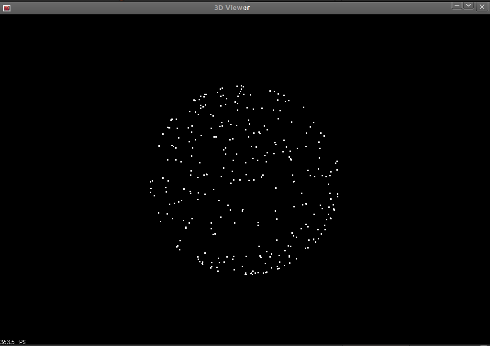

.. _random_sample_consensus:

How to use Random Sample Consensus model
----------------------------------------

In this tutorial we learn how to use a RandomSampleConsensus with a plane model to obtain the cloud fitting to this model.

Theoretical Primer
------------------

The abbreviation of "RANdom SAmple Consensus" is RANSAC, and it is an iterative method that is used to estimate parameters of a meathematical model from a set of data containing outliers.  This algorithm was published by Fischler and Bolles in 1981.  The RANSAC algorithm assumes that all of the data we are looking at is comprised of both inliers and outliers.  Inliers can be explained by a model with a particular set of parameter values, while outliers do not fit that model in any circumstance.  Another necessary assumption is that a procedure which can optimally estimate the parameters of the chosen model from the data is available.

From [Wikipedia]_:

  *The input to the RANSAC algorithm is a set of observed data values, a parameterized model which can explain or be fitted to the observations, and some confidence parameters.*

  *RANSAC achieves its goal by iteratively selecting a random subset of the original data. These data are hypothetical inliers and this hypothesis is then tested as follows:*

    1. *A model is fitted to the hypothetical inliers, i.e. all free parameters of the model are reconstructed from the inliers.*
    2. *All other data are then tested against the fitted model and, if a point fits well to the estimated model, also considered as a hypothetical inlier.*
    #. *The estimated model is reasonably good if sufficiently many points have been classified as hypothetical inliers.*
    #. *The model is reestimated from all hypothetical inliers, because it has only been estimated from the initial set of hypothetical inliers.*
    #. *Finally, the model is evaluated by estimating the error of the inliers relative to the model.*

  *This procedure is repeated a fixed number of times, each time producing either a model which is rejected because too few points are classified as inliers or a refined model together with a corresponding error measure. In the latter case, we keep the refined model if its error is lower than the last saved model.*

  *...*

  *An advantage of RANSAC is its ability to do robust estimation of the model parameters, i.e., it can estimate the parameters with a high degree of accuracy even when a significant number of outliers are present in the data set. A disadvantage of RANSAC is that there is no upper bound on the time it takes to compute these parameters. When the number of iterations computed is limited the solution obtained may not be optimal, and it may not even be one that fits the data in a good way. In this way RANSAC offers a trade-off; by computing a greater number of iterations the probability of a reasonable model being produced is increased. Another disadvantage of RANSAC is that it requires the setting of problem-specific thresholds.*

  *RANSAC can only estimate one model for a particular data set. As for any one-model approach when two (or more) models exist, RANSAC may fail to find either one.*

The pictures to the left and right (From [Wikipedia]_) show a simple application of the RANSAC algorithm on a 2-dimensional set of data. The image on our left is a visual representation of a data set containg both inliers and outliers.  The image on our right shows all of the outliers in red, and shows inliers in blue.  The blue line is the result of the work done by RANSAC.  In this case the model that we are trying to fit to the data is a line, and it looks like it's a fairly good fit to our data.

The code
--------

Create a file, let's say, ``random_sample_consensus.cpp`` in your favorite editor and place the following inside:

.. literalinclude:: sources/random_sample_consensus/random_sample_consensus.cpp
   :language: cpp
   :linenos:

The explanation
---------------

The following source code initializes two PointClouds and fills one of them with points.  The majority of these points are placed in the cloud according to a model, but a fraction (1/5) of them are given arbitrary locations.

.. literalinclude:: sources/random_sample_consensus/random_sample_consensus.cpp
   :language: cpp
   :lines: 30-63

Next we create a vector of ints that can store the locations of our inlier points from our PointCloud and now we can build our RandomSampleConsensus object using either a plane or a sphere model from our input cloud.

.. literalinclude:: sources/random_sample_consensus/random_sample_consensus.cpp
   :language: cpp
   :lines: 65-85

This last bit of code copies all of the points that fit our model to another cloud and then display either that or our original cloud in the viewer.

.. literalinclude:: sources/random_sample_consensus/random_sample_consensus.cpp
   :language: cpp
   :lines: 87-96

There is some extra code that relates to the display of the PointClouds in the 3D Viewer, but I'm not going to explain that here.

Compiling and running the program
---------------------------------

Add the following lines to your CMakeLists.txt file:

.. literalinclude:: sources/random_sample_consensus/CMakeLists.txt
   :language: cmake
   :linenos:

After you have built the executable, you can run it. Simply do::

  $ ./random_sample_consensus

to have a viewer window display that shows you the original PointCloud (with outliers) we have created.

Hit 'r' on your keyboard to scale and center the viewer.  You can then click and drag to rotate the view.  You can tell there is very little organization to this PointCloud and that it contains many outliers.  Pressing 'q' on your keyboard will close the viewer and end the program.  Now if you run the program with the following argument::

  $ ./random_sample_consensus -f

the program will display only the indices of the original PointCloud which satisfy the paticular model we have chosen (in this case plane) as found by RandomSampleConsens in the viewer.

Again hit 'r' to scale and center the view and then click and drag with the mouse to rotate around the cloud.  You can see there are no longer any points that do not lie with in the plane model in this PointCloud. Hit 'q' to exit the viewer and program.

There is also an example using a sphere in this program.  If you run it with::

  $ ./random_sample_consensus -s

It will generate and display a sphereical cloud and some outliers as well.

Then when you run the program with::

  $ ./random_sample_consensus -sf

It will show you the result of applying RandomSampleConsensus to this data set with a spherical model.

.. [Wikipedia] http://en.wikipedia.org/wiki/RANSAC
